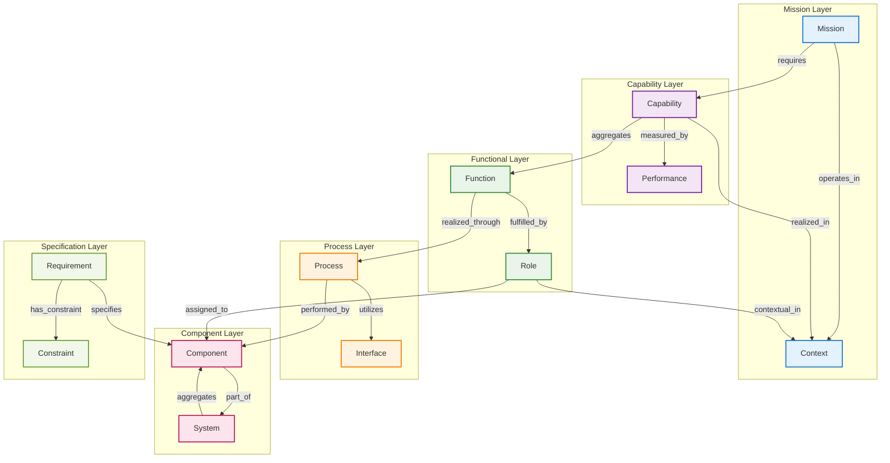

# White Paper: Ontology-Grounded Capability Modeling and Probabilistic Specification Alignment

**Authors:** [User's Name], with AI-assisted drafting based on 30+ years of multidisciplinary engineering experience  
**Date:** August 04, 2025  
**Document Type:** Technical White Paper  
**Series:** Systems Engineering Ontology Foundation Papers (Supplemental Paper)  
**Status:** Draft for Review

---

## Executive Summary

Modern systems engineering faces a critical challenge: aligning specifications across diverse domains while maintaining semantic coherence and enabling probabilistic reasoning about system capabilities. Traditional approaches suffer from semantic mismatches, inconsistent terminology, and ad-hoc capability definitions that impede systematic analysis and decision-making.

This paper presents an ontology-grounded framework for capability modeling that bridges semantic gaps through a lightweight, extensible baseline ontology rooted in Barry Smith's Basic Formal Ontology (BFO). The framework employs probabilistic extraction methods to iteratively converge on stable ontological representations from heterogeneous specifications, enabling precise capability aggregation, performance measurement, and traceability from requirements to mission realization.

Drawing from 30+ years of engineering experience and recent advances in LLM-assisted ontology extraction, this approach transforms capability modeling from subjective interpretation to systematic, mathematically grounded analysis suitable for complex system-of-systems reasoning.

---

## 1. Introduction

### 1.1 The Specification Alignment Challenge

Contemporary systems engineering operates in an environment of increasing complexity where multiple stakeholders across different domains must align their understanding of system capabilities. Specifications written in natural language suffer from:

- **Semantic Ambiguity**: The same term means different things to different stakeholders
- **Domain Silos**: Each discipline maintains its own vocabulary and conceptual frameworks  
- **Capability Fragmentation**: No systematic way to aggregate component functions into system capabilities
- **Traceability Gaps**: Difficulty connecting high-level mission requirements to low-level component specifications

### 1.2 The Ontological Solution

Ontologies provide a structured approach to bridging semantic mismatches by establishing:

- **Shared Vocabulary**: Common definitions that transcend domain boundaries
- **Formal Relationships**: Mathematically precise connections between concepts
- **Extensible Framework**: Ability to incorporate new domains without breaking existing models
- **Machine Reasoning**: Automated inference and consistency checking capabilities

### 1.3 Need for Lightweight, Extensible Baselines

Previous ontological approaches in systems engineering have suffered from over-complexity and domain specificity. This work advocates for a **lightweight baseline ontology** that:

- Captures essential SE concepts without unnecessary elaboration
- Provides extension points for domain-specific specialization
- Enables probabilistic reasoning about uncertain or incomplete specifications
- Supports iterative refinement through automated extraction processes

---

## 2. Core Ontology Structure

### 2.1 Foundational Entities

Building on our established SE ontology series, the capability modeling framework defines the following core entities:

**Primary Entities:**
- **Requirement**: A specification continuant defining what must be achieved
- **Component**: A material continuant that realizes functionality
- **Function**: A realizable disposition that can be triggered or activated
- **Process**: An occurrent that realizes functions through time-bound activities
- **Interface**: A relational boundary enabling component interaction
- **System**: A non-summative whole with mutual specific dependence (MSD) among components

**Capability-Focused Extensions:**
- **Capability**: An aggregate of coordinated functions enabling mission-level achievements
- **Role**: The purpose-specific relationship between a component and its context
- **Context**: The situational framework within which roles and capabilities are realized
- **Mission**: A high-level objective requiring coordinated capability employment
- **Performance**: A measurable quality indicating capability realization effectiveness

### 2.2 Core Relationships

The ontological structure is defined through precise relationships that enable systematic reasoning:



### 2.3 Mathematical Formalization

**Capability Definition:**
```
Capability(c) ↔ ∃f₁, f₂, ..., fₙ (Aggregates(c, f₁) ∧ Aggregates(c, f₂) ∧ ... ∧ Aggregates(c, fₙ) ∧ 
                Coordinated(f₁, f₂, ..., fₙ) ∧ ∀fᵢ ∃p (RealizedThrough(fᵢ, p)))
```

**Role-Context Relationship:**
```
Role(r) ↔ ∃c, comp, ctx (Component(comp) ∧ Context(ctx) ∧ AssignedTo(r, comp) ∧ ContextualIn(r, ctx))
```

**Performance Measurement:**
```
Performance(p, c, t) = Σᵢ w(fᵢ) × Realization(fᵢ, t) where Σw(fᵢ) = 1
```

---

## 3. The Role of Context and Role

### 3.1 Context as Ontological Entity

**Context** transcends mere environmental data to become a fundamental ontological entity that shapes how capabilities are realized. Context includes:

- **Operational Environment**: Physical, cyber, and electromagnetic conditions
- **Mission Parameters**: Objectives, constraints, and success criteria
- **Resource Availability**: Personnel, equipment, and information assets
- **Temporal Factors**: Mission timeline, phase-dependent requirements
- **Stakeholder Expectations**: Performance thresholds and acceptable risks

**Mathematical Representation:**
```
Context(ctx) = ⟨Environment(E), Parameters(P), Resources(R), Time(T), Stakeholders(S)⟩
```

### 3.2 Role as Purpose-Specific Relationship

**Role** bridges the gap between generic component capabilities and context-specific purpose by defining:

- **Purpose Assignment**: What the component is expected to accomplish
- **Authority Boundaries**: What the component is authorized to do
- **Resource Allocation**: What resources the component can access
- **Performance Expectations**: How success will be measured
- **Interaction Protocols**: How the component relates to other system elements

**Example Role Instantiation:**
```
Role: "Reconnaissance Sensor"
├── AssignedTo: Optical_Camera_Component
├── ContextualIn: Maritime_Surveillance_Mission
├── Purpose: "Detect and classify surface vessels"
├── Authority: "Autonomous detection within 50km radius"
├── Resources: "High-resolution imagery processing capability"
└── Performance: "95% detection probability for targets >10m"
```

### 3.3 Context-Enabled Reasoning

Context enables precise reasoning about capability realization by providing the interpretive framework for:

- **Function Prioritization**: Which functions are most critical in this context
- **Resource Optimization**: How to allocate limited resources effectively
- **Risk Assessment**: What failure modes are most likely and consequential
- **Adaptation Strategies**: How to modify behavior as context changes

---

## 4. Probabilistic Ontology Extraction Framework

### 4.1 Iterative Extraction Process

The framework employs a probabilistic approach to extract and refine ontological knowledge from heterogeneous specifications:

**Phase 1: Initial Extraction**
- LLM-based natural language processing of specification documents
- Pattern recognition for capability-related terminology
- Confidence scoring for extracted entities and relationships
- Uncertainty quantification for ambiguous or incomplete information

**Phase 2: Ontology Clustering**
- Semantic similarity analysis to group related concepts
- Conflict detection between different source interpretations
- Consensus building through ensemble methods
- Stability assessment across multiple extraction runs

**Phase 3: Convergence Detection**
- Monitoring for stable ontological structures across iterations
- Identification of persistent ambiguities requiring human intervention
- Validation against domain expert knowledge
- Formal consistency checking using ontology reasoners

### 4.2 Mathematical Framework

**Extraction Confidence:**
```
Confidence(entity, source) = P(correct_extraction | evidence) × P(completeness | context)
```

**Convergence Metric:**
```
Convergence(iteration_n) = 1 - Σᵢ |Structure(i, n) - Structure(i, n-1)| / |Total_Structure|
```

**Stability Assessment:**
```
Stability(entity) = min(Confidence(entity, t₁), Confidence(entity, t₂), ..., Confidence(entity, tₙ))
```

### 4.3 Lightweight Baseline Anchoring

The baseline ontology serves as an **anchoring framework** that:

- Provides consistent interpretation of common SE concepts
- Prevents semantic drift during iterative extraction
- Enables incremental specialization without structural disruption
- Supports cross-domain capability comparison and integration

**Anchoring Process:**
1. Map extracted entities to baseline ontology classes
2. Identify extension points for domain-specific concepts
3. Maintain consistency through formal constraint checking
4. Propagate updates to dependent ontological structures

---

## 5. Capability as Function Aggregation

### 5.1 Non-Atomic Capability Nature

Drawing from Barry Smith's BFO insights, capabilities are **not atomic entities** but emergent properties arising from coordinated function aggregation. This fundamental insight enables:

- **Compositional Analysis**: Understanding how component functions combine to create system capabilities
- **Scalability**: Building complex capabilities from simpler functional primitives
- **Modularity**: Reusing functional components across different capability contexts
- **Traceability**: Connecting high-level capabilities to low-level implementation details

### 5.2 Function Coordination Mechanisms

**Temporal Coordination:**
```
TemporalCoordination(f₁, f₂) ↔ ∃t₁, t₂ (ActiveDuring(f₁, t₁) ∧ ActiveDuring(f₂, t₂) ∧ 
                                        Synchronized(t₁, t₂))
```

**Resource Coordination:**
```
ResourceCoordination(f₁, f₂) ↔ ∃r (RequiredBy(f₁, r) ∧ RequiredBy(f₂, r) ∧ 
                                   SharedAccess(f₁, f₂, r))
```

**Information Coordination:**
```
InformationCoordination(f₁, f₂) ↔ ∃d (Produces(f₁, d) ∧ Consumes(f₂, d) ∧ 
                                      Compatible(d, f₁, f₂))
```

### 5.3 BFO-Grounded Realization Model

Following BFO principles:

- **Functions** are realizable dispositions inherent in components
- **Processes** are occurrents that realize functions when triggered
- **Capabilities** emerge from coordinated process execution
- **Roles** provide the contextual framework for capability realization

**Realization Chain:**
```
Component hasDisposition Function →
Function realizedBy Process →
Process contributesTo Capability →
Capability enablesMission
```

### 5.4 Aggregation Patterns

**Hierarchical Aggregation:**
```
SubCapability₁ + SubCapability₂ + ... + SubCapabilityₙ = HigherLevelCapability
```

**Networked Aggregation:**
```
Capability = f(Function₁ × Function₂ × ... × Functionₙ, CoordinationPattern)
```

**Emergent Aggregation:**
```
Capability ≠ Σ Functions but rather Capability = Emergence(Functions, Context, Coordination)
```

---

## 6. Performance Measurement and Realization

### 6.1 Distinguishing Function, Capability, and Performance

**Function**: The inherent disposition or ability of a component
- Example: "Detect electromagnetic signatures"
- Measurement: Binary (can/cannot perform)
- Context: Independent of specific operational scenarios

**Capability**: The coordinated employment of multiple functions to achieve objectives
- Example: "Maritime surveillance capability"
- Measurement: Graduated effectiveness score
- Context: Dependent on operational environment and mission parameters

**Performance**: The measurable realization of capability in specific contexts
- Example: "95% detection rate for vessels >10m in Sea State 3"
- Measurement: Quantitative metrics with confidence intervals
- Context: Specific to particular operational conditions

### 6.2 Performance Scoring Framework

**Capability Realization Score:**
```
CR(capability, context, time) = Σᵢ w(fᵢ, context) × Effectiveness(fᵢ, context, time)
```

Where:
- **w(fᵢ, context)**: Context-dependent weighting of function fᵢ
- **Effectiveness(fᵢ, context, time)**: Measured effectiveness of function fᵢ in given context at time t

**Confidence Mapping:**
```
Confidence(capability) = min(Reliability(component₁), Reliability(component₂), ..., Reliability(componentₙ)) × 
                        CoordinationEffectiveness(functions)
```

### 6.3 Dynamic Performance Assessment

Performance assessment must account for:

**Temporal Dynamics:**
- Performance degradation over time
- Learning and adaptation effects
- Maintenance and upgrade impacts

**Environmental Sensitivity:**
- Context-dependent performance variations
- Threshold effects and performance cliffs
- Graceful degradation under stress

**Uncertainty Quantification:**
- Confidence intervals for performance estimates
- Sensitivity analysis for critical parameters
- Risk assessment for performance shortfalls

---

## 7. Traceability and Use Cases

### 7.1 End-to-End Traceability

The ontological framework enables systematic traceability across multiple levels:

**Vertical Traceability:**
```
Mission Objective → Required Capabilities → Supporting Functions → 
Implementing Processes → Performing Components → Source Requirements
```

**Horizontal Traceability:**
```
Capability A ← shares functions → Capability B ← resource conflicts → Capability C
```

**Temporal Traceability:**
```
Capability(t₀) → Performance History → Degradation Patterns → 
Predicted Performance(t₁) → Maintenance Requirements
```

### 7.2 Mission Planning Support

**Capability Gap Analysis:**
- Identify required capabilities for mission success
- Assess current capability portfolio against requirements
- Prioritize capability development investments
- Evaluate alternative system architectures

**Resource Optimization:**
- Minimize resource conflicts between competing capabilities
- Maximize mission effectiveness given resource constraints
- Plan capability employment sequences
- Assess risk of capability shortfalls

### 7.3 Requirements Validation

**Consistency Checking:**
- Verify that specified requirements can be satisfied by available capabilities
- Identify conflicting or contradictory requirements
- Assess feasibility of performance targets
- Validate completeness of requirement sets

**Impact Analysis:**
- Predict effects of requirement changes on system capabilities
- Assess cascading impacts of component modifications
- Evaluate trade-offs between competing objectives
- Support design decision-making with quantitative analysis

### 7.4 System-of-Systems Integration

**Capability Composition:**
- Combine capabilities from multiple systems to achieve complex objectives
- Manage interdependencies between system capabilities
- Coordinate shared resources and information flows
- Assess emergent properties of integrated systems

**Interoperability Assessment:**
- Evaluate compatibility between different system capabilities
- Identify interface requirements for capability integration
- Assess degradation of capability performance in integrated environments
- Plan for graceful degradation when component systems fail

---

## 8. Implementation Considerations

### 8.1 Technology Integration

**LLM-Assisted Extraction:**
- Natural language processing of specification documents
- Semantic similarity analysis for concept clustering
- Automated consistency checking and conflict detection
- Iterative refinement based on expert feedback

**Ontology Management:**
- Version control for ontological structures
- Formal reasoning and consistency checking
- Visualization tools for complex capability relationships
- Integration with existing systems engineering tools

**Data Integration:**
- Connection to operational performance databases
- Real-time capability assessment and monitoring
- Historical performance analysis and trend detection
- Predictive modeling for capability planning

### 8.2 Scalability and Modularity

**Modular Design Principles:**
- Loosely coupled ontological modules for different domains
- Standardized interfaces for capability integration
- Hierarchical abstraction levels for different stakeholder needs
- Extensible framework for new capability types

**Scalability Considerations:**
- Efficient algorithms for large-scale capability analysis
- Distributed processing for complex system-of-systems scenarios
- Caching and indexing for rapid query response
- Progressive loading for interactive capability exploration

### 8.3 Validation and Verification

**Formal Verification:**
- Mathematical proof of ontological consistency
- Validation of capability aggregation rules
- Verification of performance measurement accuracy
- Consistency checking across integrated systems

**Empirical Validation:**
- Comparison with expert assessments of capability relationships
- Validation against historical performance data
- Cross-validation using multiple extraction methods
- Sensitivity analysis for critical modeling parameters

---

## 9. Case Study: Maritime Surveillance System

### 9.1 Scenario Description

Consider a maritime surveillance system composed of:
- **Sensor Components**: Radar, optical cameras, AIS receivers
- **Processing Components**: Signal processing, target classification, track correlation
- **Communication Components**: Data links, command interfaces, reporting systems

**Mission Context**: Detect and track civilian and military vessels in a 200nm² area with 95% probability of detection for targets >10m.

### 9.2 Ontological Modeling

**Capability Decomposition:**
```
Maritime_Surveillance_Capability
├── Detection_Function (Radar_Component, Camera_Component)
├── Classification_Function (Processing_Component, Database_Component)
├── Tracking_Function (Processing_Component, Memory_Component)
├── Communication_Function (Datalink_Component, Interface_Component)
└── Coordination_Function (Control_Component, Display_Component)
```

**Role Assignments:**
```
Radar_Component → Role: "Primary_Detector"
  ├── Context: Maritime_Environment
  ├── Authority: "Autonomous scanning within assigned sector"
  └── Performance: "90% detection probability for RCS >1m²"

Camera_Component → Role: "Visual_Classifier" 
  ├── Context: Daylight_Operations
  ├── Authority: "Target verification and identification"
  └── Performance: "85% classification accuracy for targets at <10km"
```

### 9.3 Performance Assessment

**Aggregated Capability Performance:**
```
Maritime_Surveillance_Performance = 
  0.4 × Detection_Effectiveness +
  0.3 × Classification_Effectiveness +
  0.2 × Tracking_Effectiveness +
  0.1 × Communication_Effectiveness
```

**Context Sensitivity:**
```
Performance(Sea_State_3) = 0.92
Performance(Sea_State_5) = 0.67
Performance(Night_Operations) = 0.75
Performance(Electronic_Warfare) = 0.45
```

### 9.4 Traceability Analysis

**Requirement to Component:**
```
"95% detection probability" → Detection_Function → Radar_Component → 
"Radar shall have sensitivity of -110dBm"
```

**Capability Gap:**
```
Required: 95% detection probability
Current: 90% in optimal conditions, 67% in rough seas
Gap: Need weather-resistant sensor upgrade or complementary sensor
```

---

## 10. Conclusion

### 10.1 Key Contributions

This ontology-grounded framework for capability modeling provides:

**Semantic Precision**: Clear, mathematically grounded definitions that eliminate ambiguity in capability discussions

**Probabilistic Reasoning**: Systematic handling of uncertainty and incomplete information through formal probabilistic methods

**Scalable Architecture**: Lightweight baseline ontology that supports extension without structural disruption

**Automated Extraction**: LLM-assisted processes that reduce manual effort while maintaining semantic consistency

**Traceability Support**: End-to-end connection from mission objectives to component specifications

### 10.2 Scalability and Adaptability

The framework's modular design enables:

- **Horizontal Scaling**: Addition of new domains and capability types without modification of core structures
- **Vertical Scaling**: Progressive detail refinement from high-level capabilities to detailed component specifications  
- **Temporal Scaling**: Evolution of capability models as technology and requirements change
- **Organizational Scaling**: Multi-stakeholder collaboration with consistent semantic foundations

### 10.3 Critical Importance for System-of-Systems

In an era of increasing system integration and complexity, this approach addresses fundamental challenges:

**Interoperability**: Common semantic foundation enables capability integration across organizational and technical boundaries

**Composability**: Systematic aggregation rules support predictable combination of capabilities from different systems

**Emergent Behavior**: Formal modeling of coordination mechanisms enables reasoning about emergent system-of-systems capabilities

**Risk Management**: Uncertainty quantification and sensitivity analysis support risk-informed decision making

### 10.4 Future Directions

**Near-term Applications**:
- Integration with existing systems engineering tools and methodologies
- Validation through real-world capability assessment exercises
- Extension to specific domains (defense, aerospace, automotive, etc.)

**Long-term Research**:
- Machine learning approaches for automated ontology refinement
- Dynamic capability modeling for adaptive systems
- Integration with digital twin and simulation environments
- Formal verification methods for capability-based system design

---

## References

1. Smith, B. (2015). *Basic Formal Ontology: A Tutorial*. National Center for Ontological Research.

2. Foundational SE Ontology White Paper (Paper 1 of established series).

3. First-Order SE Ontology White Paper (Paper 2 of established series).

4. Probabilistic SE Ontology White Paper (Paper 3 of established series).

5. Ontology-Driven Requirements Analysis System (ODRAS) Specification.

6. User's 30+ years multidisciplinary engineering experience (1977–present).

7. Industrial Ontologies Foundry. *BFO Extensions for Engineering Applications*.

8. ISO/IEC 15288:2015. *Systems and software engineering — System life cycle processes*.

---

## Appendices

### Appendix A: Formal Ontology Definitions

```owl
Class: Capability
  SubClassOf: Realizable
  EquivalentTo: Function and aggregates some Function

Class: Role  
  SubClassOf: Relational
  EquivalentTo: realizes some Function and assigned_to some Component

Class: Context
  SubClassOf: Continuant
  EquivalentTo: Environment and Parameters and Resources and Time and Stakeholders

ObjectProperty: aggregates
  Domain: Capability
  Range: Function
  Characteristics: Transitive

ObjectProperty: assigned_to
  Domain: Role
  Range: Component
  Characteristics: Functional

ObjectProperty: contextual_in
  Domain: Role
  Range: Context
  Characteristics: Functional
```

### Appendix B: Performance Measurement Equations

```
Capability Effectiveness = Σᵢ w(fᵢ) × Function_Performance(fᵢ)

Function_Performance(f) = ∫ Reliability(t) × Availability(t) × Performance_Quality(t) dt

Context_Sensitivity(c, ctx) = Performance(c, ctx) / Performance(c, nominal_context)

Coordination_Effectiveness = 1 - Σⱼ Conflict_Penalty(fⱼ, fₖ) / Total_Function_Pairs
```

### Appendix C: Extraction Algorithm Pseudocode

```python
def extract_capability_ontology(specifications, baseline_ontology):
    extracted_entities = []
    confidence_scores = {}
    
    for iteration in range(max_iterations):
        # Phase 1: Extract entities and relationships
        current_extraction = llm_extract(specifications, baseline_ontology)
        
        # Phase 2: Cluster and resolve conflicts
        clustered_entities = cluster_by_similarity(current_extraction)
        resolved_conflicts = resolve_conflicts(clustered_entities, baseline_ontology)
        
        # Phase 3: Assess convergence
        convergence_score = assess_convergence(resolved_conflicts, extracted_entities)
        
        if convergence_score > convergence_threshold:
            break
            
        extracted_entities = resolved_conflicts
    
    return validate_consistency(extracted_entities, baseline_ontology)
```

---

*This white paper establishes the theoretical and practical foundation for ontology-grounded capability modeling, enabling systematic reasoning about complex system capabilities while maintaining the precision and rigor essential for modern systems engineering.*