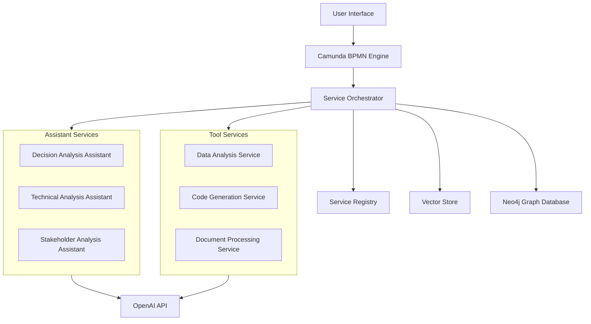
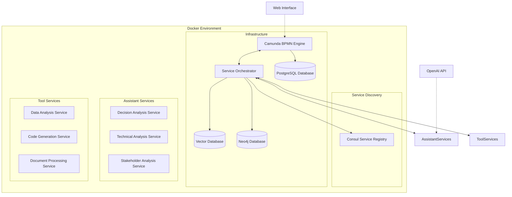

# Service-Oriented Architecture for DADM Demonstrator

## Overview

The Decision Analysis Data Model (DADM) demonstrator will transition to a service-oriented architecture, where specialized services handle specific tasks in the decision-making workflow. This approach enhances modularity, scalability, and the ability to integrate diverse AI capabilities into the system.

## Architecture Diagram



## Architecture Components

* **Workflow Engine:** Camunda
* **Service Orchestrator:** Manages service discovery and routing
* **Assistant Services:** Containerized OpenAI assistant implementations for specialized tasks
* **Tool Services:** Data analysis, coding, and other specialized capabilities
* **Logging & Storage:** Vector Store & Neo4j Graph Database

## Planned Service-Oriented Architecture

### Service Task Identification

Each service task in Camunda BPMN will include metadata to identify which service should process it:

```xml
<bpmn:serviceTask id="Activity_1" name="Frame Decision">
  <bpmn:extensionElements>
    <camunda:properties>
      <camunda:property name="service.type" value="assistant" />
      <camunda:property name="service.name" value="decision-analysis" />
      <camunda:property name="service.version" value="1.0" />
    </camunda:properties>
  </bpmn:extensionElements>
</bpmn:serviceTask>
```

The `service.type`, `service.name`, and `service.version` properties will enable the system to dynamically route tasks to the appropriate service container.

### Service Registry and Discovery

* Service registry configuration in `config/service_registry.py` maps service types and implementations to their endpoints
* Service discovery based on properties defined in the BPMN model
* The `ServiceOrchestrator` class handles routing tasks to the appropriate service endpoint

### New Implementation Details

#### Service Orchestrator

The `ServiceOrchestrator` class has been implemented in `src/service_orchestrator.py`. Key functionalities include:

* Parsing Camunda BPMN XML to extract service properties
* Routing tasks to appropriate services based on extracted properties
* Handling service responses and errors

```python
def route_task(self, task, variables=None):
    """
    Route a task to the appropriate service based on its properties
    
    Args:
        task: Camunda external task object
        variables: Task variables
        
    Returns:
        dict: Result from the service
    """
    # Extract service properties from task
    properties = self.extract_service_properties(task)
    
    # Get service endpoint from registry
    service_type = properties.get("service.type")
    service_name = properties.get("service.name")
    
    # Route to appropriate service...
```

#### OpenAI Service

We have created a dedicated microservice for OpenAI Assistant integration in `services/openai_service/service.py`:

* RESTful API with Flask
* Containerized with Docker
* Compatible with the Service Orchestrator contract

```python
@app.route('/process_task', methods=['POST'])
def process_task():
    """Process a task using the OpenAI assistant"""
    global assistant_manager
    
    if not assistant_manager:
        return jsonify({"status": "error", "message": "Assistant not initialized"}), 400
    
    try:
        data = request.json or {}
        
        # Extract required parameters
        task_name = data.get('task_name')
        if not task_name:
            return jsonify({"status": "error", "message": "task_name is required"}), 400
            
        # Process the task...
```

#### Assistant Services

1. **Decision Analysis Assistant**
   * Currently implemented as `openai_assistant.py`
   * Will be containerized as a standalone service
   * Specializes in structured decision analysis workflows

2. **Technical Analysis Assistant**
   * Specialized for technical data evaluation and comparison
   * Enhanced with domain-specific knowledge for engineering applications

3. **Stakeholder Analysis Assistant**
   * Focused on evaluating stakeholder needs, concerns, and preferences
   * Specialized in multi-stakeholder decision contexts

#### Tool Services

1. **Data Analysis Service**
   * Provides statistical analysis capabilities
   * Generates visualizations and reports
   * Integrates with assistants to enhance decision analysis

2. **Code Generation Service**
   * Creates and executes code for custom analyses
   * Supports multiple programming languages (Python, R, etc.)
   * Enables custom model creation for complex decisions

3. **Document Processing Service**
   * Extracts structured information from documents
   * Summarizes lengthy documents for incorporation into decision analysis
   * Maintains document version control and change tracking

### Implementation Roadmap

1. **Phase 1: Container Migration**
   * Move the existing OpenAI assistant integration into a Docker container
   * Create service discovery mechanism
   * Implement service routing based on BPMN service task properties

2. **Phase 2: Service Expansion**
   * Develop additional specialized assistant services
   * Implement tool services for enhanced capabilities
   * Create service management interface

3. **Phase 3: Advanced Features**
   * Implement service scaling for high-demand scenarios
   * Add advanced service orchestration with fallback options
   * Develop comprehensive monitoring and logging infrastructure

## Container Deployment Architecture



## Service Communication

Services will communicate using a REST API pattern with standardized request/response formats:

```json
// Request
{
  "task_id": "activity_1_instance_123",
  "process_instance_id": "process_instance_456",
  "input_variables": {
    "decision_context": "...",
    "previous_results": { ... }
  },
  "service_properties": {
    "type": "assistant",
    "name": "decision-analysis",
    "version": "1.0"
  }
}

// Response
{
  "task_id": "activity_1_instance_123",
  "output_variables": {
    "analysis": { ... },
    "recommendation": "...",
    "next_steps": [ ... ]
  },
  "metadata": {
    "service_id": "decision-analysis-1",
    "processing_time": 3.45,
    "assistant_id": "asst_abc123",
    "thread_id": "thread_xyz789"
  }
}
```

## Configuration Management

Service configuration will be managed through:

1. Environment variables for container-specific settings
2. Configuration files for service-specific behavior
3. Dynamic configuration via API for runtime adjustments

## Security Considerations

1. Service authentication using API keys or JWT tokens
2. Role-based access control for service management
3. Secure storage of sensitive configuration (e.g., OpenAI API keys)
4. Encrypted service-to-service communication

## Benefits of Service-Oriented Approach

1. **Modularity**: Services can be developed, updated, and replaced independently
2. **Scalability**: High-demand services can be scaled horizontally
3. **Specialization**: Services can be optimized for specific tasks
4. **Technology Flexibility**: Different services can use different technologies and languages
5. **Resilience**: System can continue functioning even if some services fail
