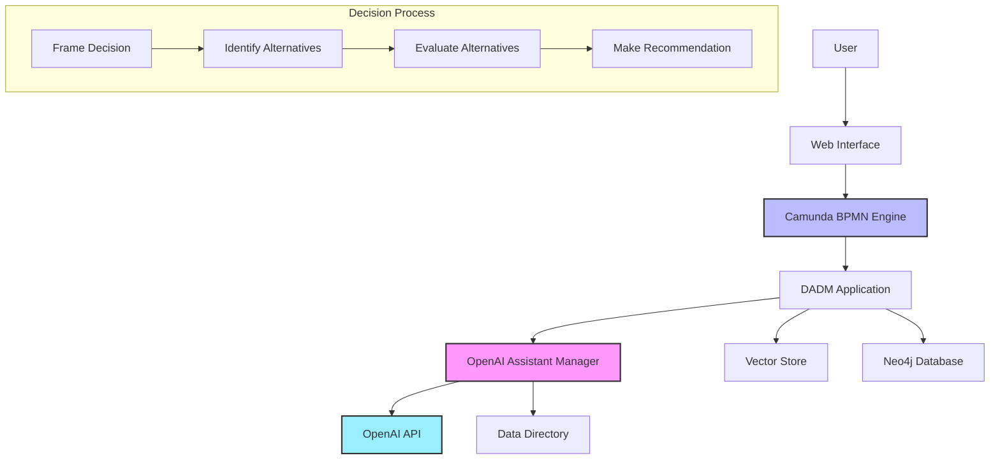

## Software Specification for DADM Demonstrator

### System Architecture Diagram



### Overview

The Decision Analysis Data Model (DADM) demonstrator leverages Camunda as a workflow management tool, utilizing its built-in API to drive and monitor workflow execution. An OpenAI assistant supports decision analysis dynamically, logging the interactions comprehensively for post-execution querying and review.

### Architecture Components

* **Workflow Engine:** Camunda
* **Assistant:** OpenAI Assistant API
* **Logging & Storage:** Vector Store & Neo4j Graph Database

### Future Architecture (Service-Oriented)

See [Service Architecture](service_architecture.md) for detailed plans on transitioning to a service-oriented architecture. Key highlights include:

* Moving to containerized services for assistants and specialized tools
* Service identification via metadata in BPMN service tasks
* Orchestration layer for service discovery and routing
* Specialized assistants for different aspects of decision analysis

### Functional Requirements

#### FR-01 Workflow Monitoring and Execution

* Continuously monitor Camunda workflow events (Pub/Sub pattern).
* Trigger event handlers when an activity enters the execution state.

#### FR-02 Activity Handling

* Extract inputs for each workflow activity from Camunda.
* Submit these inputs to the OpenAI assistant.
* Receive and parse assistant responses.

#### FR-03 Assistant Interaction

* Utilize a single OpenAI assistant instance throughout the workflow.
* Maintain a single OpenAI thread across the entire workflow execution, building context iteratively.

#### FR-04 Comprehensive Logging

* Record all assistant interactions, including:

  * Inputs provided
  * Assistant responses
  * Assumptions identified
  * Thoughts or intermediate considerations (if available)
* Log metadata includes thread\_id, assistant\_id, activity\_id, and data\_item identifiers.

### Data Model

* **Activities:** Defined per the "DADM Process Activities.json" provided.
* **Data Items:** Defined per the "DADM Data Types.json" provided.

### Workflow Interaction Logic (Pseudocode)

```python
def monitor_camunda():
    while True:
        event = camunda_api.get_next_event()
        if event.type == 'activity_start':
            handle_activity(event.activity_id)

def handle_activity(activity_id):
    inputs = camunda_api.get_activity_inputs(activity_id)
    response = openai_assistant.ask(inputs)

    log_interaction(activity_id, inputs, response)

def log_interaction(activity_id, inputs, response):
    vector_store.save(activity_id, inputs, response)
    neo4j_graph.create_entry(activity_id, inputs, response)
```

### Worker Execution Model

The DADM demonstrator implements a specialized external task worker that processes Camunda workflow tasks with the following characteristics:

* **Enhanced Topic Discovery:** The worker automatically discovers topics from both active external tasks and process definition XML, extracting topic names directly from BPMN files.

* **BPMN Process Flexibility:** The system is designed to work with various Camunda BPMN diagrams without requiring hard-coding changes. New BPMN diagrams with different task structures and topics can be deployed and processed without modifying the application code.

* **Continuous Monitoring:** Rather than exiting when no tasks are available, the application continuously monitors for new tasks to become active, allowing for unattended workflow execution.

* **Task Completion Tracking:** The system tracks which topics have been processed and signals completion when all discovered topics have been handled, with support for dynamically discovered topics.

* **Visual Process Flow:** A configurable delay between task processing provides visual feedback on the workflow execution, making it easier to observe the process flow.

* **Process Definition Introspection:** The system can parse XML from process definitions to identify potential task topics before they become active.

* **Periodic Topic Monitoring:** A background thread continuously checks for new topics that may become available during execution.

* **Time-Bounded Execution:** A timeout mechanism ensures the worker will exit after a predetermined period (default 10 minutes) even if not all tasks have been processed.

* **Clear Input/Output Display:** All task inputs and outputs are clearly displayed in the console for easy review.

* **Monolithic Design:** All functionality is consolidated into a single application file to reduce complexity and improve maintainability for the demonstration application.

```python
# Updated worker pseudocode based on current implementation
def execute_workflow():
    # Discover both active and potential topics from Camunda
    active_topics, potential_topics = discover_topics_from_camunda()
    processed_topics = set()
    
    # Decide which topics to use
    if active_topics:
        discovered_topics = active_topics
    elif potential_topics:
        discovered_topics = potential_topics
    else:
        # Wait for tasks to appear
        discovered_topics = monitor_for_tasks()
    
    # Subscribe to all discovered topics
    worker = create_camunda_worker(discovered_topics)
    
    # Start topic monitor in background thread
    start_topic_monitor(worker)
    
    # Process each task as it becomes available
    while not execution_completed and not timeout_reached():
        if task := get_next_task():
            # Visual delay for better process observation
            if not first_task:
                add_visual_delay()
                  # Display inputs
            display_task_inputs(task)
            
            # Process task with OpenAI Assistant
            output_variables = process_task_with_assistant(task)
            
            # Display outputs with detailed feedback
            display_task_outputs(output_variables)
            
            # Complete task in Camunda
            complete_task(task, output_variables)
            
            # Mark as processed and update activity time
            processed_topics.add(task.get_topic_name())
            update_last_activity_time()
            
            # Check for completion
            if all_topics_processed() and idle_for_period():
                signal_completion()
    
    # Provide execution summary
    print_execution_summary()
    
    # Signal all monitoring threads to stop
    stop_monitoring_threads()
    
    # Force exit to ensure all threads are terminated
    system_exit(0)
```

### Command-Line Interface

The DADM Demonstrator provides a flexible command-line interface with the following options:

```
usage: app.py [-h] [--start-process START_PROCESS] [--variables VARIABLES] [--monitor-only] [--timeout TIMEOUT]

DADM Demonstrator for Decision Analysis with Camunda and OpenAI

options:
  -h, --help            show this help message and exit
  --start-process START_PROCESS, -s START_PROCESS
                        Name of the process to start on Camunda server
  --variables VARIABLES, -v VARIABLES
                        JSON string of variables to pass to the process
  --monitor-only, -m    Only monitor for tasks without starting a process
  --timeout TIMEOUT, -t TIMEOUT
                        Maximum time to wait for task completion in seconds (default: 600)
```

#### Example Usage

```bash
# Just monitor for tasks
python app.py

# Start a specific process by name and monitor
python app.py --start-process "DADM_Demo_Process"

# Start a process with initial variables
python app.py -s "DADM_Demo_Process" -v '{"variable1":"value1", "variable2":"value2"}'

# Monitor only mode (won't exit if start fails)
python app.py -m

# Set custom timeout (5 minutes)
python app.py -t 300
```

### Technical Assumptions

* The Camunda REST API will be used to manage and monitor workflow states.
* Python SDKs or custom scripts interface with OpenAI and Neo4j.
* Vector storage is implemented using existing solutions such as Qdrant, Pinecone, or FAISS.

### Example Workflow Step: "Evaluate Alternatives"

* **Inputs:** Knowledge, Plan, Course of Action
* **Outputs:** Evaluation results
* **Owner:** Perform Data-Driven Decision Analysis

### Integration Points

* Camunda Modeler workflow files are exported and deployed to the Camunda server.
* OpenAI assistant managed through API keys and threads.
* Vector Store and Neo4j Graph databases are accessed via RESTful API or client libraries.
* Docker-compose Camunda server and associated docker files.

### Implementation Notes

* Keep the API interactions simple and robust.
* Ensure proper error handling and recovery mechanisms.
* Document all external dependencies clearly.

### Deliverables

* Source code of the monitoring and interaction script.
* Camunda BPMN workflow definition files.
* Database schema definitions for Neo4j and the vector store.
* Documentation detailing the integration and operation processes.