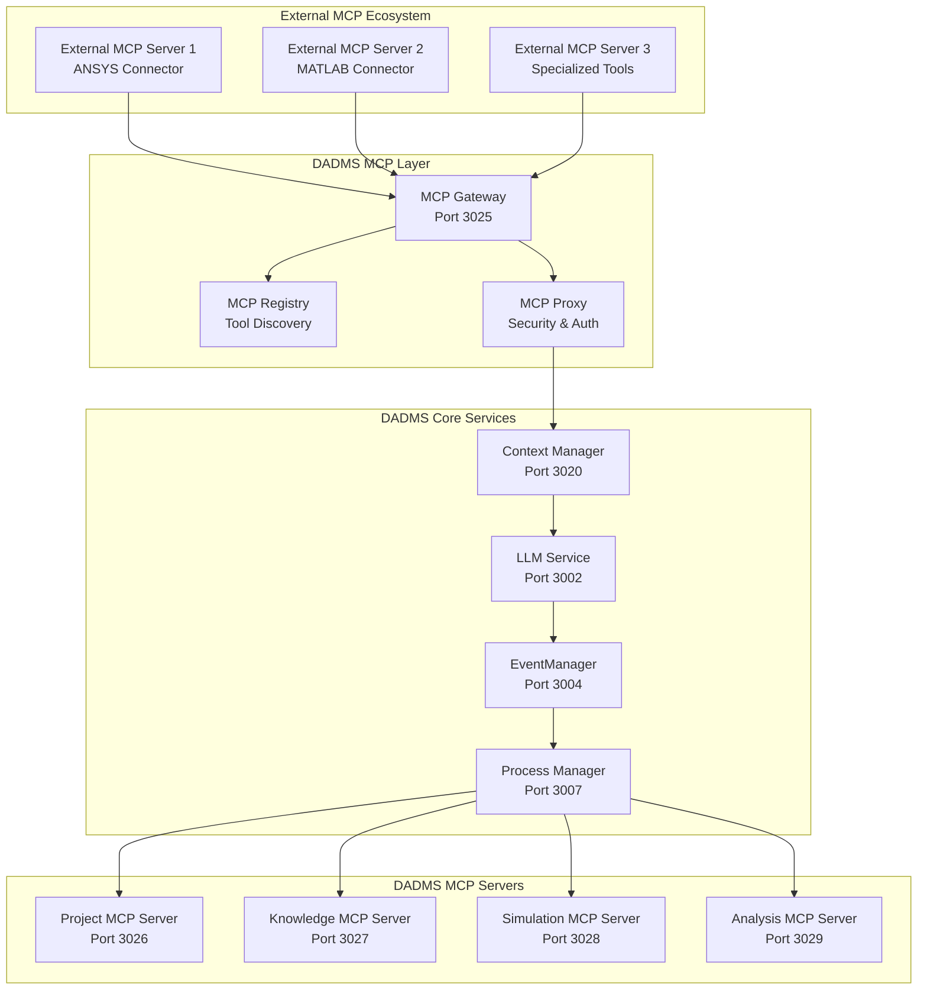

# MCP Integration with DADMS: Comprehensive Specification

## Executive Summary

This specification outlines the integration of Model Context Protocol (MCP) with DADMS 2.0, transforming our decision intelligence platform into a standardized, interoperable ecosystem. MCP acts as the "USB-C for AI" - providing a universal interface for AI agents to access external tools, data sources, and services.

## Research Findings

### What is Model Context Protocol (MCP)?

MCP is an open standard introduced by Anthropic in 2024 that standardizes how AI applications connect to external data sources and tools. It solves the M×N integration problem where M AI models need to connect to N tools, requiring M×N custom integrations.

**Key Characteristics:**
- **Client-Server Architecture**: JSON-RPC 2.0 over various transports (stdio, HTTP, WebSockets)
- **Dynamic Tool Discovery**: AI agents can discover and use tools at runtime
- **Three Core Primitives**: Tools (executable functions), Resources (structured data), Prompts (reusable templates)
- **Security Model**: Host-mediated access control with user consent
- **Universal Connectivity**: "USB-C port for AI applications"

### Current DADMS Integration Patterns

Our analysis reveals DADMS already has sophisticated integration capabilities:

1. **LLM Service (Port 3002)**: Multi-provider LLM access with tool calling
2. **Context Manager Service (Port 3020)**: AI context management with personas, teams, tools & prompts
3. **EventManager (Port 3004)**: Central nervous system for event-driven intelligence
4. **API Gateway Architecture**: Standardized external tool integration
5. **BPMN-First Orchestration**: Workflow-driven service coordination

## DADMS MCP Ownership Strategy

### Development Philosophy

**DADMS owns and controls all production MCP servers.** We do not rely on external MCP servers for production deployment. This ensures:

#### Security & Control
- Full control over authentication, authorization, and audit logging
- No external dependencies that could compromise security
- Custom compliance features for enterprise requirements
- Complete data sovereignty and privacy control

#### Integration & Customization  
- Deep integration with DADMS services and databases
- Custom features specific to DADMS workflows and decision intelligence
- Consistent error handling, monitoring, and observability
- Optimized performance for DADMS use cases

#### Reliability & Maintenance
- No risk of external servers going offline or changing APIs
- Version control and deployment as part of DADMS infrastructure
- Professional support and maintenance guaranteed
- Consistent update and security patching process

### Development Workflow

Our approach follows a **"Prototype → Fork → Own → Deploy"** strategy:

```
Research Phase          Prototype Phase         Production Phase
─────────────────      ─────────────────      ─────────────────
│ Study existing    │  │ Test with        │  │ DADMS-owned    │
│ MCP servers       │→ │ external servers │→ │ implementation │
│ Best practices    │  │ Validate concept │  │ Full integration│
│ Code patterns     │  │ Prove value      │  │ Production ready│
└─────────────────────  └─────────────────    └─────────────────
```

1. **Research**: Study existing MCP server implementations for best practices
2. **Prototype**: Test functionality with external servers to validate approach  
3. **Fork & Customize**: Copy code to DADMS repository, add our authentication and features
4. **Own & Deploy**: Deploy as part of DADMS infrastructure with full integration

### DADMS MCP Server Structure

```
dadms/
├── services/
│   ├── mcp-gateway/                # Port 3025 - Central MCP coordination
│   ├── project-mcp-server/         # Port 3026 - Project Service MCP interface
│   ├── knowledge-mcp-server/       # Port 3027 - Knowledge Service MCP interface  
│   ├── simulation-mcp-server/      # Port 3028 - Simulation Manager interface
│   ├── analysis-mcp-server/        # Port 3029 - Analysis Manager interface
│   ├── scilab-mcp-server/          # Port 3030 - Scientific computing
│   └── python-mcp-server/          # Port 3031 - Data analysis & ML
├── core/
│   ├── auth.js                     # DADMS authentication integration
│   ├── logger.js                   # DADMS logging and audit trails
│   ├── security-sandbox.js         # Secure execution environments
│   └── service-registry.js         # DADMS service discovery
└── shared/
    ├── mcp-base-server.js          # Common MCP server functionality
    └── dadms-mcp-types.ts          # TypeScript definitions
```

### Example: DADMS-Owned vs External Server

**External Dependency (What We Avoid):**
```json
{
  "mcpServers": {
    "python": {
      "command": "npx",
      "args": ["@some-external-org/python-mcp-server"]  // ❌ External dependency
    }
  }
}
```

**DADMS-Owned (Our Approach):**
```json
{
  "mcpServers": {
    "dadms-python": {
      "command": "node",
      "args": ["./services/python-mcp-server/dadms-python-mcp-server.js"],  // ✅ Our code
      "env": {
        "DADMS_API_KEY": "${DADMS_API_KEY}",
        "DADMS_AUTH_URL": "http://localhost:3000/api/auth"
      }
    }
  }
}
```

## Strategic Benefits of MCP Integration

### 1. **Eliminates Integration Complexity**
- **Before**: Each external tool (ANSYS, MATLAB, Custom Tools) requires custom API integration
- **After**: All tools connect through standardized MCP protocol

### 2. **Enhanced AI Agent Capabilities**
- Dynamic tool discovery enables autonomous agent behavior
- Real-time context switching and adaptation
- Multi-step workflow execution with persistent context

### 3. **Ecosystem Interoperability**
- DADMS services become reusable MCP servers for other AI platforms
- External MCP-compatible tools work seamlessly with DADMS
- Future-proof integration architecture

### 4. **Alignment with DADMS Architecture**
Perfect synergy with existing DADMS components:
- **Context Manager** ↔ MCP context management
- **EventManager** ↔ MCP event streaming
- **Tool Calling** ↔ MCP tool execution
- **BPMN Orchestration** ↔ MCP workflow coordination

## Technical Architecture

### MCP Integration Layer



### Component Specifications

#### 1. MCP Gateway Service (Port 3025)

**Purpose**: Central entry point for all MCP communications

**Responsibilities**:
- Protocol translation between external MCP clients and DADMS
- Load balancing across multiple MCP servers
- Connection pooling and management
- Health monitoring of MCP endpoints

**API Endpoints**:
```typescript
interface MCPGatewayAPI {
  // MCP Protocol Endpoints
  POST /mcp/v1/initialize     // Initialize MCP session
  POST /mcp/v1/discover       // Discover available tools
  POST /mcp/v1/execute        // Execute tool actions
  GET  /mcp/v1/resources      // List available resources
  
  // Management Endpoints
  GET  /admin/servers         // List registered MCP servers
  POST /admin/register        // Register new MCP server
  GET  /admin/health          // Health check all servers
}
```

#### 2. MCP Registry Service

**Purpose**: Dynamic tool and resource discovery

**Features**:
- Real-time registration of available MCP servers
- Tool capability indexing and search
- Version management and compatibility checking
- Performance metrics and routing optimization

**Data Model**:
```typescript
interface MCPServerRegistration {
  id: string;
  name: string;
  description: string;
  version: string;
  capabilities: MCPCapability[];
  endpoint: string;
  transport: 'stdio' | 'http' | 'websocket';
  health_status: 'healthy' | 'degraded' | 'offline';
  registered_at: Date;
  last_heartbeat: Date;
}

interface MCPCapability {
  type: 'tool' | 'resource' | 'prompt';
  name: string;
  description: string;
  parameters: MCPParameter[];
  security_level: 'public' | 'authenticated' | 'privileged';
}
```

#### 3. DADMS MCP Servers

Each major DADMS service will expose an MCP server interface:

##### Project MCP Server (Port 3026)
```typescript
// Available Tools
const ProjectMCPTools = {
  'create-project': {
    description: 'Create a new DADMS project',
    parameters: {
      name: { type: 'string', required: true },
      description: { type: 'string', required: false },
      template_id: { type: 'string', required: false }
    }
  },
  'get-project-status': {
    description: 'Get current project status and metrics',
    parameters: {
      project_id: { type: 'string', required: true }
    }
  },
  'list-project-resources': {
    description: 'List all resources in a project',
    parameters: {
      project_id: { type: 'string', required: true },
      resource_type: { type: 'enum', values: ['documents', 'models', 'simulations'] }
    }
  }
};
```

##### Knowledge MCP Server (Port 3027)
```typescript
const KnowledgeMCPTools = {
  'upload-document': {
    description: 'Upload and process document for RAG',
    parameters: {
      project_id: { type: 'string', required: true },
      file_content: { type: 'binary', required: true },
      metadata: { type: 'object', required: false }
    }
  },
  'semantic-search': {
    description: 'Perform semantic search across knowledge base',
    parameters: {
      query: { type: 'string', required: true },
      project_id: { type: 'string', required: true },
      limit: { type: 'number', default: 10 }
    }
  },
  'extract-concepts': {
    description: 'Extract key concepts from documents',
    parameters: {
      document_id: { type: 'string', required: true },
      extraction_type: { type: 'enum', values: ['entities', 'relationships', 'themes'] }
    }
  }
};
```

##### Simulation MCP Server (Port 3028)
```typescript
const SimulationMCPTools = {
  'run-simulation': {
    description: 'Execute simulation with specified parameters',
    parameters: {
      model_id: { type: 'string', required: true },
      parameters: { type: 'object', required: true },
      compute_resources: { type: 'object', required: false }
    }
  },
  'get-simulation-results': {
    description: 'Retrieve simulation results and metrics',
    parameters: {
      simulation_id: { type: 'string', required: true },
      format: { type: 'enum', values: ['json', 'csv', 'visualization'] }
    }
  },
  'compare-simulations': {
    description: 'Compare results from multiple simulations',
    parameters: {
      simulation_ids: { type: 'array', items: { type: 'string' }, required: true },
      comparison_metrics: { type: 'array', items: { type: 'string' } }
    }
  }
};
```

## Integration Overlaps with Current DADMS Work

### 1. Context Manager Service Enhancement

**Current State**: Context Manager (Port 3020) handles personas, teams, tools & prompts
**MCP Integration**: Extend to become the primary MCP context orchestrator

```typescript
// Enhanced Context Manager with MCP
interface EnhancedContextManager {
  // Existing functionality
  personas: PersonaManager;
  teams: TeamManager;
  tools: ToolManager;
  prompts: PromptManager;
  
  // New MCP functionality
  mcp_client: MCPClient;
  mcp_registry: MCPRegistry;
  
  // Enhanced methods
  async discoverMCPTools(): Promise<MCPTool[]>;
  async executeMCPWorkflow(workflow: MCPWorkflow): Promise<MCPResult>;
  async adaptContextFromMCP(context: MCPContext): Promise<DADMSContext>;
}
```

### 2. LLM Service Tool Calling Evolution

**Current State**: Multi-provider LLM with basic tool calling
**MCP Integration**: Dynamic tool discovery and execution

```typescript
// Enhanced LLM Service
class EnhancedLLMService {
  private mcpClient: MCPClient;
  
  async generateWithMCPTools(prompt: string, available_tools?: MCPTool[]): Promise<LLMResponse> {
    // Auto-discover relevant tools if not specified
    const tools = available_tools || await this.discoverRelevantMCPTools(prompt);
    
    // Execute LLM with dynamic tool calling
    const response = await this.llm.generate({
      prompt,
      tools: this.convertMCPToolsToLLMFormat(tools),
      tool_execution_handler: this.executeMCPTool.bind(this)
    });
    
    return response;
  }
  
  private async executeMCPTool(tool_call: ToolCall): Promise<ToolResult> {
    return await this.mcpClient.execute(tool_call.name, tool_call.parameters);
  }
}
```

### 3. EventManager MCP Event Streaming

**Current State**: Central event bus for DADMS services
**MCP Integration**: Bi-directional event streaming with external MCP ecosystem

```typescript
// MCP Event Integration
interface MCPEventManager extends EventManager {
  // Subscribe to external MCP events
  subscribeMCPEvents(server_id: string, event_types: string[]): Promise<void>;
  
  // Publish DADMS events to MCP ecosystem
  publishToMCPServers(event: DADMSEvent, target_servers?: string[]): Promise<void>;
  
  // Event transformation
  transformMCPEventToDADMS(mcp_event: MCPEvent): DADMSEvent;
  transformDADMSEventToMCP(dadms_event: DADMSEvent): MCPEvent;
}
```

## Implementation Roadmap

### Phase 1: Foundation (Weeks 1-2)
- [ ] Research and prototype MCP client library
- [ ] Design MCP Gateway service architecture
- [ ] Implement basic MCP Registry for tool discovery
- [ ] Create proof-of-concept MCP server for Project Service

### Phase 2: Core Integration (Weeks 3-4)
- [ ] Implement MCP Gateway Service (Port 3025)
- [ ] Build MCP servers for core DADMS services
- [ ] Enhance Context Manager with MCP capabilities
- [ ] Integrate MCP tool calling with LLM Service

### Phase 3: Advanced Features (Weeks 5-6)
- [ ] EventManager MCP event streaming
- [ ] Security and authentication framework
- [ ] Performance optimization and caching
- [ ] External tool integration (ANSYS, MATLAB via MCP)

### Phase 4: Production Ready (Weeks 7-8)
- [ ] Comprehensive testing and validation
- [ ] Documentation and developer guides
- [ ] Monitoring and observability
- [ ] Community MCP server development

## Security and Governance

### MCP Security Framework

```typescript
interface MCPSecurityManager {
  // Authentication
  authenticateMCPClient(client_id: string, credentials: MCPCredentials): Promise<MCPSession>;
  
  // Authorization  
  authorizeToolExecution(session: MCPSession, tool: string, params: object): Promise<boolean>;
  
  // Audit
  logMCPAction(session: MCPSession, action: MCPAction, result: MCPResult): Promise<void>;
  
  // Rate limiting
  checkRateLimit(session: MCPSession, tool: string): Promise<boolean>;
}
```

### Access Control Levels
1. **Public**: No authentication required (basic tool discovery)
2. **Authenticated**: Valid DADMS user session
3. **Privileged**: Administrative or elevated permissions
4. **System**: Internal DADMS service communication

## Performance Considerations

### Caching Strategy
- **Tool Metadata**: Cache MCP server capabilities and schemas
- **Execution Results**: Cache expensive computation results with TTL
- **Connection Pooling**: Maintain persistent connections to frequently used MCP servers

### Scalability Patterns
- **Horizontal Scaling**: Load balance across multiple MCP Gateway instances
- **Circuit Breakers**: Prevent cascade failures from external MCP servers
- **Async Processing**: Non-blocking MCP tool execution with event-driven results

## Development Guidelines

### MCP Server Implementation

```typescript
// Standard DADMS MCP Server Template
class DADMSMCPServer {
  constructor(private service: DADMSService) {}
  
  async initialize(): Promise<MCPServerInfo> {
    return {
      name: this.service.name,
      version: this.service.version,
      tools: await this.discoverTools(),
      resources: await this.discoverResources(),
      prompts: await this.discoverPrompts()
    };
  }
  
  async handleToolCall(tool: string, params: object): Promise<MCPResult> {
    // Validate parameters
    await this.validateParams(tool, params);
    
    // Execute tool
    const result = await this.service.executeFunction(tool, params);
    
    // Transform to MCP format
    return this.transformToMCPResult(result);
  }
  
  async handleResourceRequest(uri: string): Promise<MCPResource> {
    return await this.service.getResource(uri);
  }
}
```

### Error Handling

```typescript
interface MCPErrorHandler {
  handleConnectionError(server_id: string, error: Error): Promise<void>;
  handleToolExecutionError(tool: string, error: Error): Promise<MCPResult>;
  handleTimeoutError(operation: string, timeout: number): Promise<void>;
}
```

## Community and Ecosystem

### Contributing to MCP Ecosystem

**DADMS MCP Servers for Community**:
1. **Decision Analytics MCP Server**: Expose decision intelligence capabilities
2. **Simulation Orchestration MCP Server**: Enable complex simulation workflows
3. **Knowledge Mining MCP Server**: Advanced RAG and concept extraction

**Integration with Existing MCP Servers**:
- **Database Connectors**: PostgreSQL, Neo4j, Qdrant MCP servers
- **External Tools**: ANSYS, MATLAB, specialized engineering tools
- **Cloud Services**: AWS, Azure, GCP service integration

## Success Metrics

### Technical Metrics
- **Integration Time**: Reduce external tool integration from weeks to hours
- **Tool Discovery**: Enable dynamic discovery of 100+ external tools
- **Performance**: <100ms latency for tool discovery, <5s for execution
- **Reliability**: 99.9% uptime for MCP Gateway service

### Business Metrics
- **Developer Productivity**: 10x faster integration development
- **Ecosystem Growth**: 50+ external MCP servers integrated
- **User Adoption**: 90% of DADMS workflows use MCP-enabled tools
- **Community Engagement**: 20+ community-contributed MCP servers

## Conclusion

MCP integration represents a transformative opportunity for DADMS to become a leading platform in the AI decision intelligence ecosystem. By standardizing our tool integration approach, we enable:

1. **Rapid Integration**: External tools connect in hours, not weeks
2. **Dynamic AI Agents**: Autonomous discovery and execution of capabilities
3. **Ecosystem Leadership**: DADMS services become reusable across the AI community
4. **Future-Proof Architecture**: Standards-based approach ensures long-term viability

This specification provides the foundation for implementing MCP as a core architectural component of DADMS 2.0, positioning us at the forefront of the AI tooling revolution.

## Next Steps

1. **Review and Approval**: Stakeholder review of this specification
2. **Technical Prototyping**: Build proof-of-concept MCP integrations
3. **Architecture Design**: Detailed technical design documents
4. **Implementation Planning**: Sprint planning and resource allocation
5. **Community Engagement**: Connect with MCP ecosystem and contributors

The future of AI is connected, and MCP is the universal connector. DADMS with MCP integration will be the platform where AI agents seamlessly orchestrate complex decision-making workflows across any tool or data source.