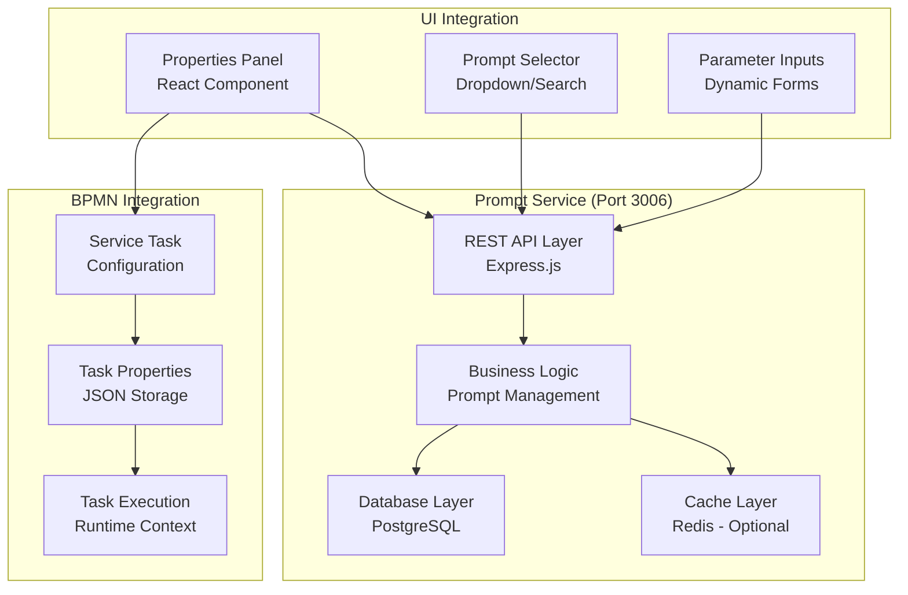

# DADM Development Work Plan
## July 11, 2025 - Prompt Service Architecture & Integration

## 🎯 **Daily Objective**
**Primary Goal**: Design, implement, and validate a functional prompt service that can be called from service endpoints and integrated into the BPMN service task properties panel.

**Success Criteria**: 
- Service endpoint can retrieve and deliver prompts
- Properties panel can display and configure prompt selection
- Basic integration works end-to-end (no full functionality required)

---

## 📋 **Work Sessions Breakdown**

### **Session 1: Requirements Analysis & Architecture Review (9:00 - 10:30 AM)**
**Duration**: 1.5 hours  
**Objective**: Understand current state and define clear requirements

#### Tasks:
1. **Review Existing Prompt Service Documentation** (30 min)
   - Analyze `docs/summaries/7_8_2025/prompt_service_management.md`
   - Review current `services/prompt-service/` implementation
   - Identify gaps between documentation and reality

2. **Systems Engineering Analysis** (45 min)
   - **Stakeholder Analysis**: Who uses prompts? (Workflow designers, AI agents, end users)
   - **Use Case Definition**: Primary scenarios for prompt usage
   - **Functional Requirements**: What must the service do?
   - **Non-Functional Requirements**: Performance, security, scalability
   - **Interface Requirements**: API design, data formats

3. **Architecture Assessment** (15 min)
   - Current microservices integration points
   - Database schema validation
   - API endpoint review

**Deliverables**:
- Requirements specification document
- Architecture gap analysis
- Interface definition

---

### **Session 2: Service Design & API Specification (10:45 AM - 12:15 PM)**
**Duration**: 1.5 hours  
**Objective**: Design the prompt service architecture and API contracts

#### Tasks:
1. **API Design** (45 min)
   - Define REST endpoints for prompt operations
   - Specify request/response schemas
   - Design error handling patterns
   - Plan authentication/authorization

2. **Database Schema Design** (30 min)
   - Review and refine existing prompt tables
   - Design for PostgreSQL compatibility [[memory:2878055]]
   - Plan for version control and metadata

3. **Integration Points Design** (15 min)
   - Service task properties panel integration
   - BPMN workflow context passing
   - Error handling and fallbacks

**Deliverables**:
- OpenAPI specification
- Database migration scripts
- Integration architecture diagram

---

### **Session 3: Core Service Implementation (1:00 - 3:00 PM)**
**Duration**: 2 hours  
**Objective**: Implement the core prompt service functionality

#### Tasks:
1. **Service Foundation** (45 min)
   - Set up Express.js service structure
   - Configure PostgreSQL connection
   - Implement basic CRUD operations
   - Add logging and error handling

2. **API Endpoint Implementation** (60 min)
   - `GET /prompts` - List available prompts
   - `GET /prompts/:id` - Get specific prompt
   - `POST /prompts/:id/render` - Render prompt with parameters
   - Basic validation and error responses

3. **Database Integration** (15 min)
   - Implement database queries
   - Test with sample data
   - Verify connection with existing PostgreSQL setup

**Deliverables**:
- Working prompt service with basic endpoints
- Database integration
- API testing scripts

---

### **Session 4: Properties Panel Integration (3:15 - 4:45 PM)**
**Duration**: 1.5 hours  
**Objective**: Integrate prompt selection into BPMN service task properties panel

#### Tasks:
1. **UI Component Development** (60 min)
   - Create prompt selector component
   - Add parameter input fields
   - Implement preview functionality
   - Style for consistency with existing UI

2. **Service Task Integration** (20 min)
   - Modify service task properties panel
   - Add prompt configuration section
   - Connect to prompt service API

3. **Data Flow Implementation** (10 min)
   - Save prompt selection to task properties
   - Load selected prompts on panel open
   - Handle service connection errors gracefully

**Deliverables**:
- Prompt selector UI component
- Integrated properties panel
- End-to-end data flow

---

### **Session 5: Testing & Validation (5:00 - 6:00 PM)**
**Duration**: 1 hour  
**Objective**: Test the complete integration and validate functionality

#### Tasks:
1. **Unit Testing** (20 min)
   - Test prompt service endpoints
   - Validate database operations
   - Test error handling

2. **Integration Testing** (25 min)
   - Test UI to service communication
   - Verify prompt selection and configuration
   - Test with sample prompts and parameters

3. **User Acceptance Testing** (15 min)
   - Create a service task
   - Select and configure a prompt
   - Verify the configuration is saved and loaded
   - Document any issues or limitations

**Deliverables**:
- Test results and validation report
- Issue log and resolution plan
- Demo-ready functionality

---

## 🔧 **Technical Specifications**

### **Prompt Service Architecture**



### **Core API Endpoints**

```typescript
// GET /api/prompts
interface PromptsListResponse {
  prompts: {
    id: string;
    name: string;
    description: string;
    category: string;
    version: string;
    parameters: ParameterDefinition[];
  }[];
}

// GET /api/prompts/:id
interface PromptDetailResponse {
  id: string;
  name: string;
  description: string;
  template: string;
  parameters: ParameterDefinition[];
  metadata: PromptMetadata;
}

// POST /api/prompts/:id/render
interface RenderPromptRequest {
  parameters: Record<string, any>;
  context?: Record<string, any>;
}

interface RenderPromptResponse {
  rendered_prompt: string;
  parameter_validation: ValidationResult[];
  metadata: {
    render_time_ms: number;
    template_version: string;
  };
}
```

### **Database Schema (Minimal)**

```sql
-- Core prompts table for MVP
CREATE TABLE prompts (
    id UUID PRIMARY KEY DEFAULT gen_random_uuid(),
    name VARCHAR(255) NOT NULL,
    description TEXT,
    category VARCHAR(100) NOT NULL DEFAULT 'general',
    template TEXT NOT NULL,
    parameters JSONB NOT NULL DEFAULT '{}',
    metadata JSONB NOT NULL DEFAULT '{}',
    version VARCHAR(20) NOT NULL DEFAULT '1.0',
    status VARCHAR(50) NOT NULL DEFAULT 'active',
    created_at TIMESTAMP DEFAULT CURRENT_TIMESTAMP,
    updated_at TIMESTAMP DEFAULT CURRENT_TIMESTAMP
);

-- Sample data for testing
INSERT INTO prompts (name, description, category, template, parameters) VALUES
('Text Analysis', 'Analyze text for sentiment and key themes', 'analysis', 
 'Analyze the following text for sentiment and key themes: {{text}}. Provide your analysis in JSON format with fields: sentiment, confidence, themes, and summary.',
 '{"text": {"type": "string", "required": true, "description": "Text to analyze"}}'),
('Data Summary', 'Summarize structured data', 'data',
 'Summarize the following data: {{data}}. Focus on {{focus_areas}} and provide insights about {{metrics}}.',
 '{"data": {"type": "object", "required": true}, "focus_areas": {"type": "array", "required": false, "default": ["trends", "outliers"]}, "metrics": {"type": "array", "required": false, "default": ["mean", "median", "range"]}}');
```

---

## 📊 **Success Metrics**

### **Functional Metrics**
- [ ] Prompt service responds to API calls within 200ms
- [ ] Properties panel loads available prompts
- [ ] User can select and configure a prompt
- [ ] Prompt configuration is saved with service task
- [ ] Parameter validation works correctly

### **Integration Metrics**
- [ ] UI communicates successfully with prompt service
- [ ] Service task properties include prompt configuration
- [ ] Error states are handled gracefully
- [ ] Configuration persists across UI sessions

### **Quality Metrics**
- [ ] Code follows existing project patterns
- [ ] API documentation is complete
- [ ] Error messages are user-friendly
- [ ] UI is consistent with existing design

---

## 🚧 **Scope Limitations & Stopping Points**

### **In Scope for Today**
- Basic prompt CRUD operations
- Simple template rendering with parameter substitution
- Properties panel integration for prompt selection
- Basic parameter input UI
- Configuration persistence

### **Out of Scope for Today**
- Advanced template engines (Handlebars, Mustache)
- Prompt testing and validation frameworks
- User authentication and authorization
- Prompt versioning and approval workflows
- Performance optimization and caching
- AI service integration for actual prompt execution

### **Stopping Point Definition**
**Primary Stopping Point**: When a user can:
1. Open a service task properties panel
2. See a list of available prompts
3. Select a prompt from the list
4. Configure basic parameters
5. Save the configuration
6. Reload the task and see the saved configuration

**Secondary Stopping Point** (if time permits):
- Basic prompt rendering endpoint works
- Parameter validation provides helpful error messages
- UI handles service connection errors gracefully

---

## 🔄 **Risk Mitigation**

### **Technical Risks**
- **Database Connection Issues**: Use existing PostgreSQL setup, test connection early
- **UI Integration Complexity**: Start with simple dropdown, enhance later
- **API Design Conflicts**: Review existing service patterns first

### **Time Management Risks**
- **Scope Creep**: Stick to defined stopping points
- **Perfect Solution Trap**: Aim for working prototype, not production-ready
- **Integration Complexity**: Focus on basic functionality first

### **Mitigation Strategies**
- Test database connection in Session 1
- Create UI mockups before implementing
- Use existing service patterns and components
- Document decisions and trade-offs for future sessions

---

## 📝 **Documentation Deliverables**

1. **Requirements Specification** - Functional and non-functional requirements
2. **API Documentation** - OpenAPI spec with examples
3. **Integration Guide** - How to use prompts in service tasks
4. **Testing Report** - What works, what doesn't, next steps
5. **Architecture Decision Record** - Key design decisions and rationale

---

## 🎯 **Next Session Preparation**

### **If Today is Successful**
- Plan prompt execution integration with AI services
- Design advanced parameter validation
- Plan prompt testing and quality assurance features

### **If Today is Partial**
- Prioritize remaining core functionality
- Plan technical debt resolution
- Identify blockers and solutions

---

**Expected Outcome**: By end of day, we should have a working prompt service that integrates with the BPMN service task properties panel, allowing users to select and configure prompts for their workflows. This establishes the foundation for the full prompt management system while delivering immediate value to workflow designers.

