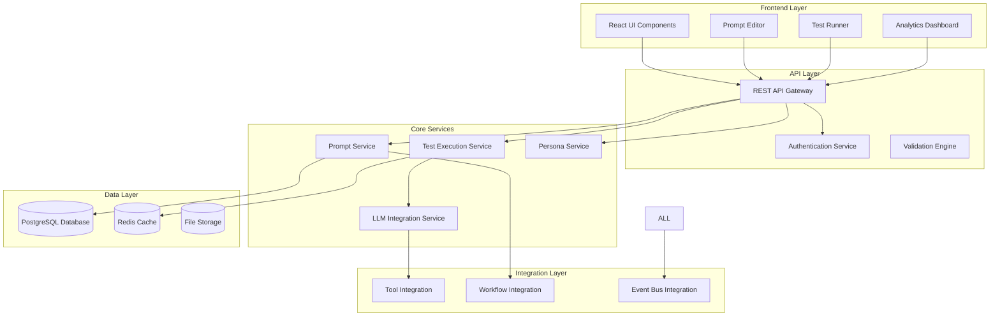

# DADM Prompt Service Specification v1.0

## Overview

The DADM Prompt Service is a specialized tool for creating, testing, validating, and managing AI prompts within the DADM workflow ecosystem. This service provides a complete prompt lifecycle management system that enables teams to build, validate, and deploy prompts for use in workflow automation, decision processes, and AI-assisted operations.

## Design Philosophy

### Core Principles

1. **Simplicity First**: Start with essential functionality and grow capabilities organically
2. **User-Centric Design**: Tools should solve real problems efficiently
3. **Quality Through Testing**: Every prompt should be validated before deployment
4. **Collaborative Development**: Support team-based prompt development workflows
5. **Integration Ready**: Design for seamless integration with workflow tools

### Non-Goals

- **Not a Prompt Engineering Platform**: This is a practical tool for prompt management, not a complex engineering platform
- **Not a General AI Platform**: Focused specifically on prompt management within DADM ecosystem
- **Not a Training System**: Does not include AI model training or fine-tuning capabilities

## Functional Specifications

### 1. Core Prompt Management

#### 1.1 Prompt Creation and Editing
**Requirements:**
- Create prompts with name, description, and parameterized text
- Support for variable substitution using `{{variable}}` syntax
- Prompt type classification: Simple, Tool-Aware, Workflow-Aware
- Rich text editing with syntax highlighting for variables
- Template-based creation with pre-built patterns

**Implementation Notes:**
- Use React-based editor with Material-UI components
- Store prompts in PostgreSQL with full versioning
- Validate variable syntax during editing
- Provide real-time preview of prompt with sample data

#### 1.2 Prompt Organization
**Requirements:**
- **Tagging System**: Associate multiple tags with each prompt for discovery
- **Search and Filter**: Find prompts by name, tags, type, or content
- **Categories**: Organize prompts by domain (BPMN, Analysis, Decision, etc.)
- **Favorites**: Mark frequently used prompts for quick access
- **Recent Items**: Track recently used prompts for easy re-access

**Implementation Notes:**
- Tag-based search with autocomplete functionality
- Full-text search across prompt content and metadata
- Filter UI with multiple selection criteria
- User-specific favorites and recent items tracking

#### 1.3 Version Management
**Requirements:**
- Automatic versioning on prompt changes
- Version history with diff visualization
- Rollback capability to previous versions
- Version tagging for release management
- Branch/merge functionality for collaborative development

**Implementation Notes:**
- Database schema supporting version trees
- Git-like branching model for collaborative editing
- Visual diff display for version comparison
- Audit trail for all version changes

### 2. Testing and Validation

#### 2.1 Test Case Management
**Requirements:**
- Create test cases with input data and expected outputs
- Support for multiple test cases per prompt
- Enable/disable individual test cases
- Test case templates for common scenarios
- Batch test execution across multiple cases

**Implementation Notes:**
- Test cases stored as structured JSON data
- Configurable test execution parameters
- Test case inheritance from templates
- Parallel test execution for performance

#### 2.2 LLM Integration and Testing
**Requirements:**
- **Multi-Provider Support**: OpenAI, Ollama, and extensible to other providers
- **Real-time Testing**: Execute prompts against LLMs with immediate results
- **Configuration Management**: Temperature, max tokens, model selection
- **Response Analysis**: Compare actual vs expected outputs
- **Performance Metrics**: Execution time, token usage, cost tracking

**Implementation Notes:**
- Provider abstraction layer for easy extension
- Async test execution with progress indicators
- Response caching for repeated tests
- Detailed metrics collection and storage

#### 2.3 Validation Framework
**Requirements:**
- **Automated Validation**: Rule-based output validation
- **Similarity Scoring**: Semantic similarity between expected and actual outputs
- **Human Review**: Manual validation workflow for subjective assessments
- **Validation Rules**: Custom validation logic for specific use cases
- **Pass/Fail Criteria**: Configurable thresholds for test success

**Implementation Notes:**
- Pluggable validation engine architecture
- Integration with similarity scoring algorithms
- UI for manual review workflows
- Rule engine for custom validation logic

### 3. Advanced Features

#### 3.1 Persona and Context Management
**Requirements:**
- **Persona Definition**: Create personas with specific context and behavior patterns
- **Team Personas**: Shared personas for team-based prompt development
- **Context Injection**: Automatic context insertion based on persona
- **Persona Templates**: Pre-built personas for common use cases
- **Dynamic Context**: Context that adapts based on workflow state

**Implementation Notes:**
- Persona storage with rich metadata
- Context template system with variable substitution
- Team-based persona sharing and permissions
- Integration with workflow context providers

#### 3.2 Tool Integration
**Requirements:**
- **Tool Association**: Link prompts with specific tools and services
- **Auto-injection**: Automatic injection of tool results into prompts
- **Tool Dependencies**: Declare tool requirements for prompt execution
- **Service Discovery**: Integration with DADM service registry
- **Result Processing**: Handle tool outputs and format for prompt consumption

**Implementation Notes:**
- Service registry integration for tool discovery
- Plugin architecture for tool-specific integrations
- Result transformation pipelines
- Dependency resolution for tool chains

#### 3.3 Uncertainty Analysis and Iterative Refinement
**Requirements:**
- **Convergence Analysis**: Track prompt performance over multiple iterations
- **Uncertainty Metrics**: Measure consistency and reliability of prompt outputs
- **Iterative Testing**: Support for refinement cycles with metrics tracking
- **A/B Testing**: Compare prompt variations with statistical analysis
- **Performance Trends**: Track improvement over time

**Implementation Notes:**
- Statistical analysis engine for convergence detection
- A/B testing framework with significance testing
- Metrics dashboard for performance tracking
- Machine learning models for uncertainty quantification

### 4. Integration and Orchestration

#### 4.1 BPMN Workflow Integration
**Requirements:**
- **Service Task Integration**: Embed prompts in BPMN service tasks
- **Parameter Binding**: Map workflow variables to prompt parameters
- **Decision Gateway Support**: Use prompt results for workflow routing
- **Context Propagation**: Pass workflow context to prompt execution
- **Error Handling**: Graceful error handling in workflow context

**Implementation Notes:**
- BPMN extension elements for prompt configuration
- Workflow variable mapping system
- Integration with Camunda workflow engine
- Error recovery and retry mechanisms

#### 4.2 Service Orchestration
**Requirements:**
- **Event-Driven Architecture**: Integrate with DADM event bus
- **Service Discovery**: Auto-discovery of available services
- **Load Balancing**: Distribute prompt execution across service instances
- **Circuit Breakers**: Fault tolerance for external service dependencies
- **Monitoring**: Health checks and performance monitoring

**Implementation Notes:**
- Event bus integration for loose coupling
- Service mesh architecture for resilience
- Prometheus metrics collection
- Grafana dashboards for monitoring

#### 4.3 API and External Integration
**Requirements:**
- **RESTful API**: Complete CRUD operations via REST API
- **Webhook Support**: Event notifications for external systems
- **Import/Export**: Prompt sharing between DADM instances
- **Plugin Architecture**: Extensible system for custom integrations
- **Authentication**: Secure API access with token-based auth

**Implementation Notes:**
- OpenAPI specification for all endpoints
- JWT-based authentication system
- Plugin SDK for third-party integrations
- Rate limiting and security headers

## Technical Architecture

### System Components



### Database Schema

#### Core Tables
```sql
-- Prompts table with versioning
CREATE TABLE prompts (
    id UUID PRIMARY KEY DEFAULT uuid_generate_v4(),
    name VARCHAR(255) NOT NULL,
    description TEXT,
    text TEXT NOT NULL,
    type VARCHAR(50) NOT NULL DEFAULT 'simple',
    version INTEGER NOT NULL DEFAULT 1,
    tags TEXT[],
    metadata JSONB,
    created_by UUID NOT NULL,
    created_at TIMESTAMP DEFAULT CURRENT_TIMESTAMP,
    updated_at TIMESTAMP DEFAULT CURRENT_TIMESTAMP,
    UNIQUE(id, version)
);

-- Test cases for prompts
CREATE TABLE test_cases (
    id UUID PRIMARY KEY DEFAULT uuid_generate_v4(),
    prompt_id UUID REFERENCES prompts(id) ON DELETE CASCADE,
    name VARCHAR(255) NOT NULL,
    input JSONB NOT NULL,
    expected_output JSONB NOT NULL,
    enabled BOOLEAN DEFAULT true,
    created_at TIMESTAMP DEFAULT CURRENT_TIMESTAMP
);

-- Test execution results
CREATE TABLE test_results (
    id UUID PRIMARY KEY DEFAULT uuid_generate_v4(),
    test_case_id UUID REFERENCES test_cases(id) ON DELETE CASCADE,
    prompt_id UUID NOT NULL,
    prompt_version INTEGER NOT NULL,
    execution_time TIMESTAMP DEFAULT CURRENT_TIMESTAMP,
    execution_time_ms INTEGER NOT NULL,
    actual_output TEXT,
    score NUMERIC(5,2),
    passed BOOLEAN NOT NULL,
    llm_config JSONB NOT NULL,
    llm_response TEXT,
    llm_provider VARCHAR(50),
    llm_model VARCHAR(100),
    error_message TEXT,
    FOREIGN KEY (prompt_id, prompt_version) REFERENCES prompts(id, version)
);

-- Personas for context management
CREATE TABLE personas (
    id UUID PRIMARY KEY DEFAULT uuid_generate_v4(),
    name VARCHAR(255) NOT NULL,
    description TEXT,
    context_template TEXT NOT NULL,
    metadata JSONB,
    team_id UUID,
    created_by UUID NOT NULL,
    created_at TIMESTAMP DEFAULT CURRENT_TIMESTAMP
);

-- Tool associations
CREATE TABLE prompt_tools (
    prompt_id UUID REFERENCES prompts(id) ON DELETE CASCADE,
    tool_id VARCHAR(255) NOT NULL,
    configuration JSONB,
    PRIMARY KEY (prompt_id, tool_id)
);
```

### API Specification

#### Core Endpoints
```yaml
# Prompt Management
GET    /api/v1/prompts              # List prompts with filtering
POST   /api/v1/prompts              # Create new prompt
GET    /api/v1/prompts/{id}         # Get prompt by ID
PUT    /api/v1/prompts/{id}         # Update prompt
DELETE /api/v1/prompts/{id}         # Delete prompt
GET    /api/v1/prompts/{id}/versions # Get version history

# Test Management
POST   /api/v1/prompts/{id}/test    # Execute prompt tests
GET    /api/v1/prompts/{id}/results # Get test results
DELETE /api/v1/test-results/{id}    # Delete specific test result

# Search and Discovery
GET    /api/v1/search/prompts       # Search prompts
GET    /api/v1/tags                 # Get available tags
GET    /api/v1/templates            # Get prompt templates

# Persona Management
GET    /api/v1/personas             # List personas
POST   /api/v1/personas             # Create persona
GET    /api/v1/personas/{id}        # Get persona details
PUT    /api/v1/personas/{id}        # Update persona
DELETE /api/v1/personas/{id}        # Delete persona

# Tool Integration
GET    /api/v1/tools                # List available tools
POST   /api/v1/prompts/{id}/tools   # Associate tool with prompt
GET    /api/v1/prompts/{id}/tools   # Get prompt tool associations
```

## Implementation Roadmap

### Phase 1: Foundation (Current - Complete)
**Duration**: 1 week  
**Status**: ✅ Complete

**Deliverables:**
- ✅ Basic CRUD operations for prompts
- ✅ LLM integration (OpenAI, Ollama)
- ✅ Test case management
- ✅ React-based UI with Material-UI
- ✅ Database schema with versioning
- ✅ Template system with 10 pre-built templates

### Phase 2: Enhanced Discovery (Next Week)
**Duration**: 1 week  
**Priority**: High

**Deliverables:**
- 🔄 Tagging system with search functionality
- 🔄 Tool association framework
- 🔄 Basic persona support
- 🔄 Improved UI with filtering and search
- 🔄 Performance optimization

**Technical Tasks:**
- Implement tag-based search with PostgreSQL full-text search
- Create tool registry integration framework
- Design persona data model and UI
- Add search and filter components to UI
- Optimize database queries for large datasets

### Phase 3: Advanced Features (Week 3-4)
**Duration**: 2 weeks  
**Priority**: Medium

**Deliverables:**
- Uncertainty analysis framework
- A/B testing capabilities
- Advanced tool integration
- Workflow context propagation
- Analytics dashboard

**Technical Tasks:**
- Statistical analysis engine for uncertainty metrics
- A/B testing framework with significance testing
- Enhanced tool integration with result processing
- BPMN workflow context integration
- Metrics collection and dashboard development

### Phase 4: Enterprise Features (Month 2)
**Duration**: 3 weeks  
**Priority**: Low

**Deliverables:**
- Team collaboration features
- Advanced version management
- Security and permissions
- API documentation and SDK
- Performance monitoring

**Technical Tasks:**
- Multi-tenant architecture implementation
- Git-like branching and merging for prompts
- Role-based access control (RBAC)
- Complete API documentation with examples
- Production monitoring and alerting

## Quality Assurance

### Testing Strategy

#### Unit Testing
- **Coverage Target**: 90% code coverage for core services
- **Framework**: Jest for TypeScript, pytest for Python components
- **Test Types**: Service logic, data validation, API endpoints

#### Integration Testing
- **Database Integration**: Test all CRUD operations with real database
- **LLM Integration**: Mock and real LLM provider testing
- **UI Integration**: React Testing Library for component interactions

#### End-to-End Testing
- **User Workflows**: Complete prompt creation to testing workflows
- **Performance Testing**: Load testing with realistic data volumes
- **Security Testing**: Authentication and authorization validation

#### Manual Testing
- **User Experience**: Usability testing with real users
- **Browser Compatibility**: Testing across major browsers
- **Mobile Responsiveness**: Testing on mobile devices

### Performance Requirements

#### Response Time Targets
- **Prompt CRUD Operations**: < 200ms average response time
- **LLM Test Execution**: < 5 seconds for typical prompts
- **Search Operations**: < 500ms for complex searches
- **UI Interactions**: < 100ms for local operations

#### Scalability Targets
- **Concurrent Users**: Support 50+ concurrent users
- **Data Volume**: Handle 10,000+ prompts with 100,000+ test results
- **LLM Throughput**: Process 100+ tests per minute
- **Storage Growth**: Plan for 1GB+ of prompt and result data

### Security Requirements

#### Authentication and Authorization
- **User Authentication**: Integration with DADM user management
- **API Security**: JWT token-based authentication for API access
- **Role-Based Access**: Different permissions for viewers, editors, admins
- **Team Isolation**: Secure separation of team-specific data

#### Data Protection
- **Data Encryption**: Encrypt sensitive data at rest and in transit
- **Input Validation**: Comprehensive validation for all user inputs
- **SQL Injection Prevention**: Parameterized queries and ORM usage
- **XSS Prevention**: Input sanitization and output encoding

## Monitoring and Operations

### Health Monitoring
- **Service Health Checks**: Automated health endpoints for all services
- **Database Health**: Connection pool monitoring and query performance
- **LLM Provider Health**: Provider availability and response time monitoring
- **Storage Health**: Disk usage and backup status monitoring

### Performance Monitoring
- **Application Metrics**: Request rates, response times, error rates
- **Business Metrics**: Prompt usage, test execution rates, user engagement
- **Infrastructure Metrics**: CPU, memory, network, disk utilization
- **User Experience**: Page load times, error rates, user flow completion

### Alerting Strategy
- **Critical Alerts**: Service downtime, data corruption, security breaches
- **Warning Alerts**: Performance degradation, high error rates, capacity issues
- **Informational**: Usage patterns, trend changes, optimization opportunities

## Future Enhancements

### Advanced AI Features
- **Auto-prompt Generation**: AI-assisted prompt creation from descriptions
- **Intelligent Optimization**: Automatic prompt refinement based on test results
- **Semantic Clustering**: Group similar prompts for better organization
- **Predictive Analytics**: Predict prompt performance before testing

### Collaboration Features
- **Real-time Collaboration**: Multiple users editing prompts simultaneously
- **Review Workflows**: Formal review and approval processes
- **Comment System**: Threaded discussions on prompts and test results
- **Change Requests**: Pull request-like workflow for prompt changes

### Integration Expansion
- **More LLM Providers**: Claude, PaLM, Cohere, and other providers
- **External Tools**: Integration with more external services and APIs
- **Data Sources**: Integration with databases, APIs, and file systems
- **Notification Systems**: Slack, email, and webhook notifications

---

**Document Version**: 1.0  
**Last Updated**: July 11, 2025  
**Status**: Foundation Complete, Phase 2 Planning  
**Next Review**: July 18, 2025
