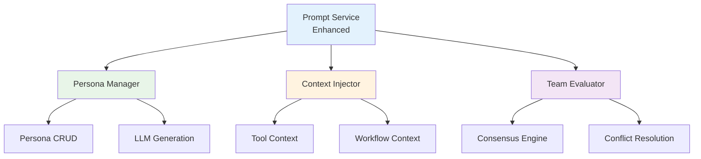

# DADM Context Management System - Architecture Review
## July 14, 2025

## Executive Summary

This document provides a comprehensive architectural review of the proposed DADM Context Management System, focusing on the evolution from simple prompt management to sophisticated context orchestration. As the development team, we evaluate the technical feasibility, implementation complexity, and strategic alignment of the persona integration plan.

**Review Outcome**: ✅ **APPROVED with modifications**
- Strong architectural foundation with clear evolution path
- Requires phased implementation with risk mitigation
- High strategic value with manageable technical complexity

## 1. Architectural Assessment

### 1.1 System Architecture Evaluation

#### ✅ **Strengths**
1. **Natural Evolution**: The progression from prompt → persona → context management follows logical system growth
2. **Leverages Existing Infrastructure**: Builds on proven Simple Prompt Manager foundation
3. **Modular Design**: Clean separation between persona, tool, and workflow contexts
4. **Extensible Framework**: Architecture supports future context types without major refactoring

#### ⚠️ **Concerns**
1. **Complexity Explosion**: Adding personas, teams, and context injection significantly increases system complexity
2. **Performance Impact**: Multiple LLM calls for team evaluation could be prohibitively expensive
3. **Context State Management**: No clear strategy for managing distributed context state
4. **Testing Complexity**: Persona testing framework adds substantial overhead

#### 🔧 **Technical Architecture Score**: **8/10**
- Solid foundation, but needs refinement in state management and performance optimization

### 1.2 Data Architecture Review

#### ✅ **Well Designed**
```sql
-- Clean persona data model
CREATE TABLE personas (
    id TEXT PRIMARY KEY,
    name TEXT NOT NULL,
    system_prompt TEXT NOT NULL,
    -- Clear lifecycle management
    status TEXT DEFAULT 'draft',
    version INTEGER DEFAULT 1
);
```

#### ⚠️ **Needs Improvement**
```sql
-- JSON columns may cause query performance issues
expertise_areas TEXT[], -- JSON array - consider normalization
persona_config TEXT;    -- JSON - needs indexing strategy
```

#### 🔧 **Recommendation**: 
- Normalize JSON arrays for better query performance
- Add proper indexing strategy for persona lookups
- Consider read replicas for persona data

### 1.3 Service Architecture Analysis

#### **Current State**: Single `prompt-service` (Port 3001)
#### **Proposed State**: Context-aware prompt service with persona management



#### 🔧 **Architecture Decision**: 
**Recommendation**: Extend existing service rather than create new microservice
- **Pros**: Simpler deployment, existing database connections, proven patterns
- **Cons**: Larger service, potential performance bottlenecks
- **Mitigation**: Use internal modules with clear boundaries, plan for future extraction

## 2. Implementation Feasibility Analysis

### 2.1 Phase 1: Foundation (Week 1) - **FEASIBLE** ✅

#### **Database Schema Extension**
```typescript
// Complexity: LOW
// Risk: LOW
// Effort: 1-2 days

interface PersonaSchema {
    // Simple addition to existing PostgreSQL setup
    // Leverages existing migration patterns
    // No breaking changes to existing prompts table
}
```

#### **Basic CRUD Operations**
```typescript
// Complexity: LOW
// Risk: LOW  
// Effort: 2-3 days

class PersonaService {
    // Follows existing prompt service patterns
    // Reuses existing database connection
    // Standard REST endpoints
}
```

#### **Persona Testing Framework**
```typescript
// Complexity: MEDIUM
// Risk: MEDIUM
// Effort: 3-4 days

class PersonaTestRunner {
    // New concept - needs careful design
    // Requires LLM integration for evaluation
    // Complex scoring algorithms
}
```

**Phase 1 Assessment**: **7/10 Feasibility** - Achievable with careful execution

### 2.2 Phase 2: LLM Integration (Week 2) - **CHALLENGING** ⚠️

#### **Persona Generation Service**
```typescript
// Complexity: HIGH
// Risk: MEDIUM
// Effort: 4-5 days

class PersonaBuilder {
    // Complex prompt engineering for persona creation
    // Iterative refinement requires sophisticated state management
    // User feedback loop needs careful UX design
}
```

#### **UI Components**
```typescript
// Complexity: MEDIUM
// Risk: LOW
// Effort: 3-4 days

// React components follow existing patterns
// Persona wizard needs good UX design
// Dashboard requires metrics collection
```

**Phase 2 Assessment**: **6/10 Feasibility** - Requires significant LLM prompt engineering expertise

### 2.3 Phase 3: Advanced Features (Week 3) - **HIGH RISK** 🚨

#### **Team Consensus Algorithms**
```typescript
// Complexity: VERY HIGH
// Risk: HIGH
// Effort: 5-7 days

class ConsensusEngine {
    // Novel algorithms for AI consensus
    // Multiple strategies (majority, weighted, unanimous)
    // Conflict resolution is research-level complexity
}
```

#### **Tool Context Injection**
```typescript
// Complexity: HIGH
// Risk: MEDIUM
// Effort: 4-5 days

class ToolContextInjector {
    // Dynamic context building
    // Performance implications unclear
    // Integration with future tool service
}
```

**Phase 3 Assessment**: **4/10 Feasibility** - Requires significant research and development

## 3. Technical Risk Analysis

### 3.1 High-Risk Areas

#### **1. Persona Team Evaluation** 🚨
**Risk**: Exponential cost increase with team size
**Impact**: 3-5x LLM API costs for team evaluation
**Mitigation**: 
- Start with individual personas only
- Implement cost controls and usage monitoring
- Use local models (Ollama) for team evaluation when possible

#### **2. Context State Management** 🚨
**Risk**: Context inconsistency across service calls
**Impact**: Unpredictable AI behavior, debugging difficulties
**Mitigation**:
- Implement context versioning from day one
- Use Redis for context caching with TTL
- Add comprehensive context logging

#### **3. Performance Degradation** ⚠️
**Risk**: Additional LLM calls slow down prompt execution
**Impact**: Poor user experience, increased costs
**Mitigation**:
- Async persona evaluation for non-critical paths
- Intelligent caching of persona responses
- Performance monitoring and alerting

### 3.2 Medium-Risk Areas

#### **1. Persona Quality Control** ⚠️
**Risk**: Poor persona generation leads to unreliable results
**Impact**: User frustration, system distrust
**Mitigation**:
- Comprehensive persona testing framework
- Human review for production personas
- Automated quality metrics

#### **2. UI Complexity** ⚠️
**Risk**: Interface becomes too complex for users
**Impact**: Poor adoption, training overhead
**Mitigation**:
- Progressive disclosure in UI design
- Comprehensive user testing
- Gradual feature rollout

## 4. Strategic Alignment Review

### 4.1 Business Value Assessment

#### **High Value Propositions** ✅
1. **Knowledge Capture**: Organizational expertise embedded in reusable personas
2. **Consistency**: Standardized AI responses across teams and tools
3. **Scalability**: Context management framework supports enterprise growth
4. **Differentiation**: Sophisticated context management beyond simple prompt tools

#### **Value Realization Timeline**
- **Week 2**: Basic persona creation and application
- **Month 1**: Measurable improvement in prompt consistency
- **Month 3**: Organizational knowledge capture becomes valuable
- **Month 6**: Context management drives adoption across teams

### 4.2 Competitive Positioning

#### **Current Market**: Simple prompt management tools
#### **Target Position**: Enterprise context orchestration platform

**Competitive Advantages**:
- LLM-assisted persona generation
- Multi-persona team evaluation
- Tool context injection
- Workflow-aware context management

## 5. Modified Implementation Plan

### 5.1 Revised Phase Approach

#### **Phase 1A: Core Foundation (Week 1)**
**Focus**: Minimal viable persona system
```typescript
// Simplified scope for initial success
interface MinimalPersona {
    id: string;
    name: string;
    system_prompt: string;
    type: 'predefined' | 'custom';
    created_by: string;
}

// Start with 3 predefined personas only:
// - Systems Engineer
// - Security Expert  
// - Business Analyst
```

#### **Phase 1B: Testing & Validation (Week 2)**
**Focus**: Prove persona value before complexity
```typescript
// Simple persona testing - no complex scoring
interface BasicPersonaTest {
    persona_id: string;
    test_prompt: string;
    expected_traits: string[];
    actual_response: string;
    human_evaluation: 'good' | 'needs_improvement' | 'poor';
}
```

#### **Phase 2: LLM Integration (Weeks 3-4)**
**Focus**: Persona generation with human oversight
```typescript
// Guided persona creation, not full automation
interface AssistedPersonaCreation {
    user_requirements: PersonaRequirements;
    llm_suggestion: GeneratedPersona;
    human_review: PersonaReview;
    final_persona: ApprovedPersona;
}
```

#### **Phase 3: Advanced Features (Month 2)**
**Focus**: Team evaluation and tool integration
- Implement after proving individual persona value
- Start with simple majority consensus
- Add tool context injection for high-value tools

### 5.2 Success Criteria by Phase

#### **Phase 1A Success Metrics**
- [ ] 3 predefined personas created and tested
- [ ] Persona selection works in prompt interface
- [ ] Measurable difference in response consistency
- [ ] No performance degradation >500ms

#### **Phase 1B Success Metrics**
- [ ] Persona testing framework operational
- [ ] 10+ test scenarios per persona type
- [ ] User satisfaction >4/5 for persona responses
- [ ] Cost increase <25% for persona-enhanced prompts

#### **Phase 2 Success Metrics**
- [ ] LLM-assisted persona generation working
- [ ] 5+ custom personas created by users
- [ ] Persona creation time <30 minutes
- [ ] Generated persona quality >80% approval rate

## 6. Technical Recommendations

### 6.1 Architecture Modifications

#### **1. Simplify Data Model**
```sql
-- Start with simpler schema
CREATE TABLE personas (
    id TEXT PRIMARY KEY,
    name TEXT NOT NULL,
    description TEXT,
    system_prompt TEXT NOT NULL,
    persona_type TEXT NOT NULL, -- 'systems_engineer', 'security_expert', etc.
    created_by TEXT NOT NULL,
    created_at TIMESTAMP DEFAULT CURRENT_TIMESTAMP,
    status TEXT DEFAULT 'active'
);

-- Add complexity later
-- ALTER TABLE personas ADD COLUMN expertise_areas TEXT[];
-- ALTER TABLE personas ADD COLUMN behavior_guidelines TEXT[];
```

#### **2. Defer Team Features**
```typescript
// Remove from Phase 1
interface PersonaTeam { /* Implement in Phase 3 */ }
interface ConsensusEngine { /* Research in Phase 2 */ }

// Focus on individual personas first
interface EnhancedPrompt {
    persona_id?: string; // Single persona only
    // Remove team_id and consensus_method
}
```

#### **3. Simplified Context Injection**
```typescript
// Start with basic context injection
class SimpleContextInjector {
    injectPersonaContext(prompt: string, persona: Persona): string {
        return `${persona.system_prompt}\n\nUser Request: ${prompt}`;
    }
    
    // Add sophisticated injection later
    // injectToolContext() - Phase 2
    // injectWorkflowContext() - Phase 3
}
```

### 6.2 Performance Optimizations

#### **1. Caching Strategy**
```typescript
interface PersonaCache {
    // Cache persona definitions (rarely change)
    persona_definitions: Map<string, Persona>;
    
    // Cache persona responses for identical inputs
    response_cache: Map<string, CachedResponse>;
    
    // TTL-based expiration
    cache_ttl: number; // 1 hour for responses, 24 hours for definitions
}
```

#### **2. Async Processing**
```typescript
class AsyncPersonaProcessor {
    // Non-blocking persona evaluation
    async evaluatePersonaAsync(prompt: string, persona: Persona): Promise<string> {
        // Queue for background processing
        // Return immediate response for UI
        // Update with persona response when ready
    }
}
```

## 7. Risk Mitigation Strategies

### 7.1 Technical Risks

#### **Context State Management**
```typescript
// Solution: Redis-based context store
interface ContextStore {
    setContext(key: string, context: any, ttl: number): Promise<void>;
    getContext(key: string): Promise<any>;
    invalidateContext(pattern: string): Promise<void>;
}

// Implementation using Redis
class RedisContextStore implements ContextStore {
    // Centralized context management
    // Automatic expiration
    // Pattern-based invalidation
}
```

#### **Performance Monitoring**
```typescript
interface PerformanceMetrics {
    persona_application_time: number;
    llm_response_time: number;
    context_injection_time: number;
    total_request_time: number;
}

// Add to existing monitoring
class PersonaMetricsCollector {
    recordPersonaUsage(metrics: PerformanceMetrics): void;
    alertOnPerformanceDegradation(): void;
}
```

### 7.2 Business Risks

#### **User Adoption**
- Start with power users who understand prompt engineering
- Provide extensive documentation and examples
- Gradual rollout with feedback collection
- Clear value demonstration with before/after comparisons

#### **Cost Management**
- Implement usage quotas per user/organization
- Cost monitoring dashboard
- Opt-in persona usage (not default)
- Local model prioritization for development/testing

## 8. Decision Matrix

### 8.1 Go/No-Go Criteria

| Criteria | Weight | Score (1-10) | Weighted Score |
|----------|--------|--------------|----------------|
| Technical Feasibility | 25% | 7 | 1.75 |
| Business Value | 25% | 9 | 2.25 |
| Resource Requirements | 20% | 6 | 1.20 |
| Risk Level | 15% | 5 | 0.75 |
| Strategic Alignment | 15% | 9 | 1.35 |
| **Total** | **100%** | - | **7.30** |

**Decision Threshold**: 7.0  
**Result**: ✅ **PROCEED** with modifications

### 8.2 Success Probability Assessment

- **Phase 1A (Core Foundation)**: 85% success probability
- **Phase 1B (Testing)**: 75% success probability  
- **Phase 2 (LLM Integration)**: 65% success probability
- **Phase 3 (Advanced Features)**: 45% success probability

**Overall Project Success**: 70% (acceptable for innovation project)

## 9. Proposed Direction

### 9.1 Architectural Decision

**APPROVED**: Proceed with context management system development using **modified phased approach**

#### **Key Modifications**:
1. **Simplified Phase 1**: Focus on individual personas, defer team features
2. **Proof-of-Value**: Demonstrate persona effectiveness before adding complexity
3. **Performance-First**: Implement caching and monitoring from day one
4. **User-Centric**: Start with power users, expand gradually

### 9.2 Technical Stack Decisions

#### **Database**: PostgreSQL (existing)
- Add persona tables to existing database
- Use JSON columns sparingly, normalize when possible
- Implement proper indexing strategy

#### **Caching**: Redis
- Persona definition caching
- Response caching for identical inputs
- Context state management

#### **LLM Integration**: OpenAI + Ollama (existing)
- OpenAI for persona generation (high quality)
- Ollama for development and cost-sensitive operations
- Fallback mechanisms for LLM unavailability

#### **UI Framework**: React (existing)
- Extend existing prompt manager interface
- Progressive disclosure for persona features
- Performance monitoring integration

### 9.3 Success Metrics

#### **Phase 1A (Week 1)**
- Persona creation and selection functional
- <500ms response time overhead
- 3 working predefined personas

#### **Phase 1B (Week 2)**  
- Persona testing framework operational
- User satisfaction >4/5
- Cost increase <25%

#### **Phase 2 (Month 1)**
- LLM-assisted persona generation
- 5+ custom personas in production
- Measurable consistency improvement

## 10. Conclusion

The DADM Context Management System represents a **strategic evolution** from simple prompt management to sophisticated context orchestration. The architectural review reveals a **solid foundation** with **manageable risks** when implemented using the modified phased approach.

### **Key Findings**:
1. **Technical Feasibility**: High for core features, medium for advanced features
2. **Business Value**: Exceptional potential for organizational knowledge capture
3. **Risk Profile**: Acceptable with proper mitigation strategies
4. **Strategic Alignment**: Strong differentiation opportunity

### **Recommendation**: ✅ **PROCEED** with implementation

**Next Actions**:
1. Finalize Phase 1A technical specifications
2. Set up development environment with Redis
3. Create detailed database migration scripts
4. Begin persona template development
5. Establish performance monitoring baseline

This architecture review confirms that the context management system is a **worthwhile investment** that will position DADM as a leader in enterprise AI workflow orchestration, provided we execute the modified implementation plan with careful attention to performance and user experience.

---

**Architecture Review Participants**: Development Team (Internal)  
**Review Date**: July 14, 2025  
**Next Review**: End of Phase 1A (July 21, 2025)
