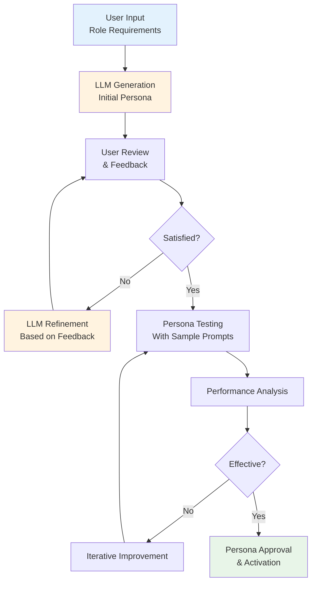

# DADM Context Management System - Persona Integration Plan
## July 14, 2025

## Executive Summary

This document outlines a comprehensive plan for integrating **Persona Management** into the DADM Simple Prompt Manager, creating a unified context management system that enables sophisticated prompt engineering with role-based AI interactions. The plan extends persona concepts to both prompt and tool management, establishing a foundation for enterprise-grade AI workflow orchestration.

## Current State Assessment

### ✅ Existing Foundation (Simple Prompt Manager)
- **CRUD Operations**: Complete prompt lifecycle management
- **LLM Integration**: OpenAI and Ollama support with real-time testing
- **Test Case Management**: Comprehensive validation framework
- **Template System**: 10 pre-built prompt templates
- **Database Architecture**: PostgreSQL with proper versioning

### 🎯 Strategic Vision: Evolution to Context Management
The prompt work has naturally evolved into **comprehensive context management** - we're not just managing prompts, but building the complete contextual framework for AI interactions. This includes:

- **Prompt Context**: The core prompt engineering and template management
- **Persona Context**: Role-based AI agents that provide consistent, expert-level responses
- **Tool Context Injection**: Dynamic integration of tool-specific knowledge and constraints
- **Workflow-Aware Context**: Contextual awareness of workflow state, dependencies, and objectives

Transform the simple prompt manager into a **unified context management system** where:
- **Personas** act as specialized AI agents for consistent role-based responses
- **Tool context injection** provides dynamic, situational knowledge
- **Workflow awareness** enables context-sensitive AI behavior
- **LLM assistance** accelerates context creation and refinement

## Persona Architecture Design

### 1. Core Persona Management

#### 1.1 Persona Data Model
```typescript
interface Persona {
    id: string;
    name: string;
    description: string;
    type: 'system_engineer' | 'data_analyst' | 'security_expert' | 'domain_expert' | 'custom';
    
    // Core persona definition
    role_description: string;
    expertise_areas: string[];
    personality_traits: string[];
    communication_style: string;
    
    // Prompt engineering components
    system_prompt: string;
    behavior_guidelines: string[];
    output_constraints: string[];
    
    // LLM configuration preferences
    preferred_models: string[];
    default_temperature: number;
    max_tokens: number;
    
    // Lifecycle management
    created_by: string;
    created_at: string;
    updated_at: string;
    version: number;
    status: 'draft' | 'approved' | 'active' | 'deprecated';
    
    // Usage tracking
    usage_count: number;
    last_used: string;
    effectiveness_score?: number;
}
```

#### 1.2 Persona Team Architecture
```typescript
interface PersonaTeam {
    id: string;
    name: string;
    description: string;
    
    // Team composition
    members: {
        persona_id: string;
        role: 'primary' | 'reviewer' | 'validator';
        weight: number; // For consensus calculation
    }[];
    
    // Team behavior
    consensus_method: 'majority' | 'weighted' | 'unanimous' | 'hierarchical';
    conflict_resolution: 'escalate' | 'primary_decision' | 'averaged';
    execution_mode: 'sequential' | 'parallel' | 'debate';
    
    // Lifecycle
    created_by: string;
    created_at: string;
    status: 'active' | 'archived';
}
```

### 2. Enhanced Prompt Model with Persona Integration

#### 2.1 Extended Prompt Interface
```typescript
interface EnhancedPrompt extends Prompt {
    // Existing fields remain unchanged
    
    // New persona integration
    persona_config?: {
        type: 'none' | 'individual' | 'team';
        persona_id?: string;
        team_id?: string;
        
        // Persona application scope
        applies_to: 'input_processing' | 'output_generation' | 'both';
        
        // Override persona settings for this prompt
        temperature_override?: number;
        style_override?: string;
        constraints_override?: string[];
    };
    
    // Enhanced context management
    context_requirements: {
        requires_previous_context: boolean;
        context_window_size: number;
        context_sources: string[]; // files, databases, APIs
    };
}
```

#### 2.2 Prompt Type Evolution
```typescript
// Extend existing prompt types
type PromptType = 
    | 'simple' 
    | 'tool-aware' 
    | 'workflow-aware' 
    | 'persona'           // NEW: Persona definition prompt
    | 'persona-enhanced'  // NEW: Regular prompt with persona applied
    | 'team-evaluated';   // NEW: Prompt evaluated by persona team
```

### 3. LLM-Assisted Persona Generation & Testing

#### 3.1 Persona Builder Service
```typescript
interface PersonaGenerationRequest {
    // Basic requirements
    role_title: string;
    domain: string;
    expertise_level: 'beginner' | 'intermediate' | 'expert' | 'specialist';
    
    // Context and constraints
    organization_context?: string;
    specific_responsibilities: string[];
    communication_preferences: string[];
    
    // Generation preferences
    base_template?: string;
    llm_provider: 'openai' | 'anthropic' | 'local';
    creativity_level: number; // 0.1 to 1.0
}

interface PersonaGenerationResponse {
    generated_persona: Persona;
    generation_reasoning: string;
    suggested_improvements: string[];
    test_scenarios: TestCase[];
}
```

#### 3.2 Persona Refinement Workflow


#### 3.3 Persona Testing Framework
**Challenge**: How do we test a persona outside of a workflow context?

**Solution**: Standalone persona validation using scenario-based testing:

```typescript
interface PersonaTestScenario {
    id: string;
    scenario_name: string;
    context_description: string;
    input_stimulus: string;
    expected_behavior_traits: string[];
    evaluation_criteria: {
        consistency: number;      // Response consistency across multiple runs
        role_adherence: number;   // How well persona stays in character
        expertise_demonstration: number; // Shows domain knowledge
        communication_style: number;     // Matches defined style
    };
}

class PersonaTestRunner {
    async testPersona(persona: Persona, scenarios: PersonaTestScenario[]): Promise<PersonaTestResults> {
        const results = [];
        
        for (const scenario of scenarios) {
            // Run scenario multiple times for consistency testing
            const runs = await this.runMultipleTests(persona, scenario, 5);
            
            // Evaluate persona behavior
            const evaluation = await this.evaluatePersonaBehavior(runs, scenario);
            
            results.push({
                scenario_id: scenario.id,
                consistency_score: evaluation.consistency,
                role_adherence_score: evaluation.role_adherence,
                expertise_score: evaluation.expertise_demonstration,
                style_score: evaluation.communication_style,
                overall_score: this.calculateOverallScore(evaluation),
                sample_responses: runs.map(r => r.response)
            });
        }
        
        return {
            persona_id: persona.id,
            test_date: new Date().toISOString(),
            scenario_results: results,
            overall_persona_score: this.calculatePersonaScore(results),
            recommendations: this.generateImprovementRecommendations(results)
        };
    }
}
```

**Persona Test Scenarios Examples**:
- **Systems Engineer Persona**: "Explain the performance implications of this database query"
- **Security Expert Persona**: "Review this API endpoint for security vulnerabilities"
- **Data Analyst Persona**: "Interpret these metrics and suggest improvements"
- **Business Analyst Persona**: "Assess the ROI of this proposed feature"

### 4. Comprehensive Context Management Architecture

#### 4.1 Context Types and Integration
```typescript
interface ContextManager {
    // Core context types
    prompt_context: PromptContext;
    persona_context: PersonaContext;
    tool_context: ToolContext;
    workflow_context: WorkflowContext;
    
    // Context integration
    buildUnifiedContext(request: ContextRequest): UnifiedContext;
    injectToolContext(toolId: string, context: any): void;
    updateWorkflowState(workflowId: string, state: WorkflowState): void;
}

interface ToolContext {
    tool_id: string;
    tool_capabilities: string[];
    current_parameters: Record<string, any>;
    execution_history: ToolExecution[];
    performance_metrics: ToolMetrics;
    associated_personas: string[]; // Persona IDs
}

interface WorkflowContext {
    workflow_id: string;
    current_step: string;
    previous_steps: WorkflowStep[];
    accumulated_data: Record<string, any>;
    decision_points: DecisionPoint[];
    context_dependencies: string[]; // Dependencies on external data
}
```

#### 4.2 Tool Context Injection
Dynamic context injection based on tool usage and workflow state:

```typescript
class ToolContextInjector {
    async injectToolContext(
        basePrompt: string, 
        toolContext: ToolContext,
        persona?: Persona
    ): Promise<string> {
        const contextElements = [
            `Tool: ${toolContext.tool_id}`,
            `Capabilities: ${toolContext.tool_capabilities.join(', ')}`,
            `Current Parameters: ${JSON.stringify(toolContext.current_parameters)}`,
        ];
        
        if (toolContext.performance_metrics) {
            contextElements.push(`Performance History: ${this.formatMetrics(toolContext.performance_metrics)}`);
        }
        
        if (persona && toolContext.associated_personas.includes(persona.id)) {
            contextElements.push(`Persona Expertise: ${persona.expertise_areas.join(', ')}`);
        }
        
        return `${basePrompt}\n\nTool Context:\n${contextElements.join('\n')}`;
    }
}
```

#### 4.3 Workflow-Aware Context (Future Exploration)
**Note**: This area needs further exploration but should include:
- **State Awareness**: Understanding current workflow position
- **Dependency Tracking**: Knowledge of completed and pending steps
- **Decision History**: Context of previous decisions and their outcomes
- **Goal Alignment**: Ensuring AI responses align with workflow objectives

### 5. Tool Integration with Persona Management

#### 5.1 Tool-Persona Binding
```typescript
interface ToolPersonaBinding {
    tool_id: string;
    persona_id: string;
    
    // Binding configuration
    binding_type: 'default' | 'required' | 'recommended';
    context: 'cost_analysis' | 'security_review' | 'performance_evaluation' | 'general';
    
    // Effectiveness tracking
    success_rate: number;
    average_response_quality: number;
    user_satisfaction_score: number;
}
```

#### 5.2 Specialized Tool Personas
- **Cost Analysis Persona**: Financial analyst focused on budget optimization
- **Security Review Persona**: Security expert for vulnerability assessment
- **Performance Evaluation Persona**: Systems engineer for performance analysis
- **Simulation Persona**: Domain expert for scenario modeling

### 6. Implementation Plan

#### Phase 1: Foundation (Week 1)
**Objective**: Establish core persona management in prompt service

**Deliverables**:
1. **Database Schema Extension**
   ```sql
   CREATE TABLE personas (
       id TEXT PRIMARY KEY,
       name TEXT NOT NULL,
       description TEXT,
       type TEXT NOT NULL,
       role_description TEXT NOT NULL,
       expertise_areas TEXT[], -- JSON array
       system_prompt TEXT NOT NULL,
       created_by TEXT NOT NULL,
       created_at TIMESTAMP DEFAULT CURRENT_TIMESTAMP,
       version INTEGER DEFAULT 1,
       status TEXT DEFAULT 'draft'
   );
   
   CREATE TABLE persona_teams (
       id TEXT PRIMARY KEY,
       name TEXT NOT NULL,
       description TEXT,
       members TEXT NOT NULL, -- JSON array
       consensus_method TEXT DEFAULT 'majority',
       created_by TEXT NOT NULL,
       created_at TIMESTAMP DEFAULT CURRENT_TIMESTAMP
   );
   
   ALTER TABLE prompts ADD COLUMN persona_config TEXT; -- JSON
   ```

2. **Persona API Endpoints**
   - `POST /personas` - Create new persona
   - `GET /personas` - List all personas with filtering
   - `GET /personas/:id` - Get persona details
   - `PUT /personas/:id` - Update persona
   - `DELETE /personas/:id` - Soft delete persona

3. **Persona Testing Framework**
   - Scenario-based persona validation
   - Standalone persona testing outside workflows
   - Multi-run consistency evaluation
   - Behavior adherence scoring

#### Phase 2: LLM Integration (Week 2)
**Objective**: Implement LLM-assisted persona generation

**Deliverables**:
1. **Persona Generation Service**
   - Integration with OpenAI/Anthropic for persona creation
   - Template-based generation with customization
   - Iterative refinement based on user feedback

2. **Persona Testing Framework**
   - Automated persona effectiveness evaluation
   - Test case generation for persona validation
   - Performance metrics collection

3. **UI Components**
   - Persona creation wizard
   - Persona selection interface for prompts
   - Persona effectiveness dashboard

4. **Basic Persona Templates**
   - Systems Engineer
   - Data Analyst  
   - Security Expert
   - Business Analyst
   - Technical Writer

#### Phase 3: Advanced Features (Week 3)
**Objective**: Implement team-based persona evaluation

**Deliverables**:
1. **Persona Team Management**
   - Team creation and configuration
   - Consensus algorithm implementation
   - Conflict resolution mechanisms

2. **Enhanced Prompt Testing**
   - Multi-persona evaluation
   - Comparative analysis between personas
   - Team-based prompt validation

3. **Tool Integration Planning**
   - Design tool-persona binding architecture
   - Identify priority tool integrations
   - Prototype cost analysis persona
   - Implement tool context injection framework

## Technical Considerations

### 1. Performance Implications
- **Persona Application**: Additional LLM call overhead when personas are used
- **Team Evaluation**: Multiple LLM calls for team-based evaluation (3-5x cost increase)
- **Caching Strategy**: Cache persona system prompts and configurations
- **Async Processing**: Background persona evaluation for non-critical workflows

### 2. Cost Management
- **Selective Application**: Personas only when value justifies cost
- **Local Model Priority**: Use Ollama for persona generation where possible
- **Batch Processing**: Group persona evaluations to reduce API calls
- **Usage Monitoring**: Track persona effectiveness vs. cost

### 3. Data Architecture
- **Persona Versioning**: Full version control for persona evolution
- **Performance Tracking**: Metrics for persona effectiveness
- **Usage Analytics**: Track which personas are most valuable
- **Context Storage**: Manage conversation context for complex interactions

### 4. Security and Governance
- **Persona Approval Workflow**: Enterprise approval for production personas
- **Access Control**: Role-based access to sensitive personas
- **Audit Trail**: Complete history of persona usage and modifications
- **Compliance**: Ensure persona behavior aligns with organizational policies

## Success Metrics

### 1. Adoption Metrics
- **Persona Usage Rate**: % of prompts using personas
- **Persona Creation Rate**: New personas per week
- **User Engagement**: Time spent in persona management interface

### 2. Effectiveness Metrics
- **Response Quality**: Improved test case pass rates with personas
- **Consistency**: Reduced variance in prompt outputs
- **User Satisfaction**: Feedback scores for persona-enhanced prompts

### 3. Business Impact
- **Development Velocity**: Faster prompt development with personas
- **Maintenance Reduction**: Less manual prompt tuning required
- **Knowledge Capture**: Organizational expertise embedded in personas

## Risk Mitigation

### 1. Technical Risks
- **LLM Dependency**: Fallback to non-persona prompts if LLM unavailable
- **Performance Impact**: Monitoring and optimization of persona application
- **Context Overflow**: Proper context window management for complex personas

### 2. User Adoption Risks
- **Complexity Barrier**: Gradual rollout with training and documentation
- **ROI Uncertainty**: Clear metrics and success stories
- **Integration Friction**: Seamless integration with existing workflows

### 3. Operational Risks
- **Cost Escalation**: Usage monitoring and budget controls
- **Quality Control**: Approval workflows for production personas
- **Maintenance Overhead**: Automated testing and validation

## Conclusion

The persona integration plan transforms DADM from a simple prompt manager into a sophisticated context management system. By enabling LLM-assisted persona creation and team-based evaluation, the system captures organizational expertise and provides consistent, role-appropriate AI interactions.

The phased implementation approach ensures stable foundation building while delivering immediate value through persona-enhanced prompts. The extension to tool management creates a unified framework for context-aware AI operations across the entire DADM ecosystem.

This architecture positions DADM as a comprehensive platform for enterprise AI workflow management, differentiating it from simple prompt engineering tools through sophisticated context management and organizational knowledge capture.

## Next Steps

1. **Architecture Review**: Validate technical approach with development team
2. **User Research**: Interview potential users to refine persona requirements
3. **Prototype Development**: Build minimal viable persona system
4. **Performance Testing**: Evaluate cost and latency implications
5. **Tool Integration Planning**: Design persona integration for tool management

The success of this initiative will establish DADM as a leading platform for contextual AI workflow management, enabling organizations to systematically capture and apply domain expertise through AI interactions.

## Gap Analysis

### 1. Technical Architecture Gaps

#### 1.1 Context State Management
**Gap**: No clear strategy for managing context state across distributed services
**Impact**: Context inconsistency, difficulty debugging context-related issues
**Recommendation**: 
- Implement centralized context state store (Redis/PostgreSQL)
- Design context versioning and rollback mechanisms
- Create context synchronization protocols between services

#### 1.2 Context Caching and Performance
**Gap**: Lack of sophisticated caching strategy for context data
**Impact**: Performance degradation, increased LLM API costs
**Recommendation**:
- Multi-tier caching (persona definitions, tool contexts, workflow states)
- Intelligent cache invalidation based on context dependencies
- Context compression for large workflow histories

#### 1.3 Context Conflict Resolution
**Gap**: No mechanism for handling conflicting context information
**Impact**: Inconsistent AI behavior, unreliable results
**Recommendation**:
- Priority-based context resolution (persona > tool > workflow)
- Conflict detection algorithms
- User-configurable resolution strategies

### 2. Persona-Specific Gaps

#### 2.1 Persona Evolution and Learning
**Gap**: Static personas that don't improve over time
**Impact**: Degrading effectiveness, missed optimization opportunities
**Recommendation**:
- Feedback-driven persona improvement
- A/B testing for persona variations
- Machine learning-based persona optimization

#### 2.2 Persona Validation at Scale
**Gap**: Manual persona testing doesn't scale for enterprise use
**Impact**: Inconsistent persona quality, deployment risks
**Recommendation**:
- Automated persona regression testing
- Continuous integration for persona changes
- Performance benchmarking suite

#### 2.3 Multi-Language and Cultural Adaptation
**Gap**: Personas designed only for English-speaking contexts
**Impact**: Limited global applicability
**Recommendation**:
- Internationalization framework for personas
- Cultural context adaptation mechanisms
- Language-specific persona variants

### 3. Tool Integration Gaps

#### 3.1 Dynamic Tool Discovery
**Gap**: Static tool-persona bindings, no runtime discovery
**Impact**: Rigid system, difficulty adding new tools
**Recommendation**:
- Tool capability registry with metadata
- Automatic persona-tool matching based on capabilities
- Runtime tool context injection

#### 3.2 Tool Performance Feedback Loop
**Gap**: No mechanism to improve tool-persona combinations
**Impact**: Suboptimal tool usage, missed efficiency gains
**Recommendation**:
- Tool effectiveness tracking per persona
- Automatic parameter optimization
- Success pattern recognition

#### 3.3 Tool Context Versioning
**Gap**: Tool context changes may break existing workflows
**Impact**: System instability, difficult maintenance
**Recommendation**:
- Tool context API versioning
- Backward compatibility guarantees
- Migration tools for context changes

### 4. Workflow Context Gaps

#### 4.1 Cross-Workflow Context Sharing
**Gap**: No mechanism for sharing context between related workflows
**Impact**: Lost context, redundant work, inconsistent decisions
**Recommendation**:
- Workflow context inheritance models
- Cross-workflow context references
- Context sharing governance policies

#### 4.2 Workflow Context Persistence
**Gap**: Unclear strategy for long-term context storage
**Impact**: Context loss, difficulty reproducing results
**Recommendation**:
- Context archiving and retrieval system
- Context compression for storage efficiency
- Context replay capabilities for debugging

#### 4.3 Real-Time Context Updates
**Gap**: No real-time context synchronization during workflow execution
**Impact**: Stale context, inconsistent behavior
**Recommendation**:
- Event-driven context updates
- WebSocket-based context streaming
- Context change notification system

### 5. Security and Governance Gaps

#### 5.1 Context Access Control
**Gap**: No fine-grained permissions for context data
**Impact**: Security risks, compliance issues
**Recommendation**:
- Role-based access control for contexts
- Context data classification and protection
- Audit logging for context access

#### 5.2 Context Data Privacy
**Gap**: No strategy for handling sensitive data in contexts
**Impact**: Privacy violations, regulatory compliance issues
**Recommendation**:
- Context data anonymization techniques
- Selective context sharing based on sensitivity
- GDPR/CCPA compliance framework

#### 5.3 Context Audit and Compliance
**Gap**: Limited audit trail for context changes and usage
**Impact**: Compliance failures, difficult debugging
**Recommendation**:
- Comprehensive context audit logging
- Compliance reporting and monitoring
- Context change approval workflows

### 6. User Experience Gaps

#### 6.1 Context Visualization
**Gap**: No visual representation of context relationships and dependencies
**Impact**: Poor user understanding, difficult troubleshooting
**Recommendation**:
- Context dependency graphs
- Visual context flow diagrams
- Interactive context exploration tools

#### 6.2 Context Debugging Tools
**Gap**: Limited tools for diagnosing context-related issues
**Impact**: Difficult problem resolution, poor user experience
**Recommendation**:
- Context trace and debug tools
- Context validation utilities
- Step-by-step context execution visualization

#### 6.3 Context Templates and Wizards
**Gap**: No guided context creation for non-technical users
**Impact**: Steep learning curve, adoption barriers
**Recommendation**:
- Context creation wizards
- Industry-specific context templates
- Context validation and suggestions

### 7. Integration and Ecosystem Gaps

#### 7.1 External System Integration
**Gap**: No framework for integrating external system contexts
**Impact**: Isolated system, limited enterprise value
**Recommendation**:
- Context API gateway for external systems
- Standard context exchange protocols
- Third-party context adapters

#### 7.2 Context Import/Export
**Gap**: No mechanism for sharing contexts between DADM instances
**Impact**: Vendor lock-in, limited portability
**Recommendation**:
- Standard context export formats
- Context migration tools
- Context marketplace for sharing

#### 7.3 Analytics and Reporting
**Gap**: Limited analytics on context usage and effectiveness
**Impact**: No optimization insights, poor ROI visibility
**Recommendation**:
- Context usage analytics dashboard
- Effectiveness metrics and reporting
- ROI calculation tools for context investments

### 8. Scalability and Performance Gaps

#### 8.1 Context Processing at Scale
**Gap**: Unknown performance characteristics at enterprise scale
**Impact**: System bottlenecks, poor user experience
**Recommendation**:
- Load testing with realistic context volumes
- Horizontal scaling architecture for context services
- Performance optimization based on usage patterns

#### 8.2 Context Storage Optimization
**Gap**: No strategy for managing large-scale context data
**Impact**: Storage costs, query performance issues
**Recommendation**:
- Context data partitioning strategies
- Automated context archiving and cleanup
- Query optimization for context lookups

### 9. Priority Gap Resolution

#### High Priority (Phase 1)
1. **Context State Management**: Critical for system reliability
2. **Persona Testing Framework**: Essential for quality assurance
3. **Context Access Control**: Required for enterprise security

#### Medium Priority (Phase 2)
1. **Tool Context Injection**: Core functionality for tool integration
2. **Context Visualization**: Important for user adoption
3. **Context Caching**: Performance optimization

#### Low Priority (Phase 3)
1. **Multi-Language Support**: Nice-to-have for global expansion
2. **Context Marketplace**: Advanced ecosystem feature
3. **Advanced Analytics**: Optimization features for mature deployments

This gap analysis provides a roadmap for addressing potential issues before they become problems, ensuring the context management system is robust, scalable, and enterprise-ready.
