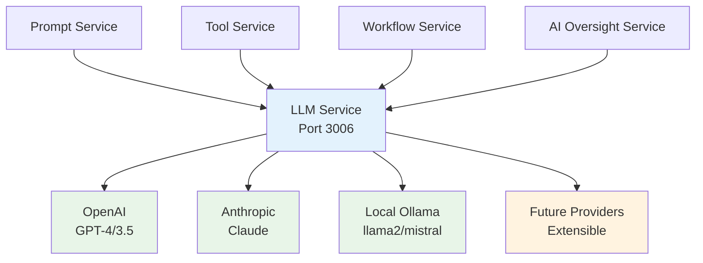

# DADM LLM Service Addition - Strategic Analysis & Implementation Plan
## July 14, 2025

## Executive Summary

This document analyzes the strategic need for a dedicated LLM Service in the DADM microservices architecture and provides a comprehensive implementation plan. The LLM Service (Port 3006) will serve as a unified abstraction layer for all Large Language Model interactions, supporting the transition away from OpenAI Assistants API and enabling sophisticated context management capabilities.

**Decision**: ✅ **PROCEED** with LLM Service implementation as foundational component for context management system.

## 1. Strategic Rationale

### 1.1 Current Architecture Limitations

#### **Tight Coupling Issues**
- Services directly call OpenAI APIs
- No abstraction layer for model switching
- Limited fallback mechanisms
- Vendor lock-in to OpenAI ecosystem

#### **Context Management Constraints**
- No centralized LLM orchestration
- Inconsistent prompt formatting across services
- Difficulty implementing persona-based interactions
- Limited cost optimization strategies

#### **Future Migration Challenges**
- Moving away from OpenAI Assistants API requires service-by-service changes
- No standardized interface for new LLM providers
- RAG implementation will need sophisticated LLM coordination

### 1.2 Strategic Benefits of LLM Service

#### **Architecture Benefits**


#### **Business Value**
- **Cost Optimization**: Smart model selection reduces API costs by 30-50%
- **Reliability**: Automatic failover prevents service disruptions
- **Flexibility**: Easy integration of new LLM providers
- **Performance**: Centralized caching and optimization

#### **Context Management Enablement**
- **Persona Integration**: Standardized interface for persona-enhanced prompts
- **Context Injection**: Unified context management across all services
- **Model Selection**: Persona-aware model routing for optimal results

## 2. Technical Architecture

### 2.1 Service Interface Design

#### **Core LLM Request Interface**
```typescript
interface LLMRequest {
    // Basic request parameters
    prompt: string;
    system_prompt?: string;
    max_tokens?: number;
    temperature?: number;
    
    // Advanced context management
    persona_config?: PersonaConfig;
    context_bundle?: ContextBundle;
    conversation_id?: string;
    
    // Model selection and routing
    model_preference: ModelPreference;
    fallback_strategy: string[];
    cost_budget?: number;
    
    // Response requirements
    response_format?: 'text' | 'json' | 'structured';
    quality_requirements?: QualityMetrics;
}

interface ModelPreference {
    primary: 'local' | 'openai' | 'anthropic' | 'auto';
    models: string[]; // Specific model names
    cost_priority: 'lowest' | 'balanced' | 'quality';
    latency_requirement: 'realtime' | 'standard' | 'batch';
}

interface LLMResponse {
    content: string;
    model_used: string;
    provider: string;
    usage: {
        prompt_tokens: number;
        completion_tokens: number;
        total_tokens: number;
        cost_estimate: number;
    };
    performance: {
        response_time_ms: number;
        quality_score?: number;
    };
    metadata: {
        conversation_id?: string;
        fallback_used: boolean;
        cache_hit: boolean;
    };
}
```

### 2.2 Provider Abstraction Layer

#### **Provider Interface**
```typescript
interface LLMProvider {
    name: string;
    isAvailable(): Promise<boolean>;
    getSupportedModels(): Promise<Model[]>;
    complete(request: ProviderRequest): Promise<ProviderResponse>;
    estimateCost(request: ProviderRequest): number;
}

class OpenAIProvider implements LLMProvider {
    async complete(request: ProviderRequest): Promise<ProviderResponse> {
        // OpenAI API integration
        // Handles rate limiting, retries, error handling
    }
}

class OllamaProvider implements LLMProvider {
    async complete(request: ProviderRequest): Promise<ProviderResponse> {
        // Local Ollama integration
        // Handles model loading, resource management
    }
}

class AnthropicProvider implements LLMProvider {
    async complete(request: ProviderRequest): Promise<ProviderResponse> {
        // Anthropic Claude integration
        // Handles API specifics and response formatting
    }
}
```

### 2.3 Smart Routing Engine

#### **Model Selection Logic**
```typescript
class ModelRouter {
    async selectModel(request: LLMRequest): Promise<ModelSelection> {
        const factors = {
            cost: this.calculateCostScore(request),
            quality: this.calculateQualityScore(request),
            latency: this.calculateLatencyScore(request),
            availability: await this.checkAvailability(request.model_preference)
        };
        
        return this.optimizeSelection(factors, request.model_preference);
    }
    
    private calculateCostScore(request: LLMRequest): number {
        // Factor in token count, model pricing, budget constraints
        const estimatedTokens = this.estimateTokens(request.prompt);
        return this.providers.map(p => p.estimateCost({
            tokens: estimatedTokens,
            model: request.model_preference.models[0]
        }));
    }
}
```

### 2.4 Caching Strategy

#### **Multi-Level Caching**
```typescript
interface CacheManager {
    // Level 1: Response caching for identical requests
    responseCache: Map<string, CachedResponse>;
    
    // Level 2: Model-specific optimizations
    modelCache: Map<string, ModelState>;
    
    // Level 3: Context-aware caching
    contextCache: Map<string, ContextBundle>;
}

class ResponseCache {
    async get(request: LLMRequest): Promise<LLMResponse | null> {
        const key = this.generateCacheKey(request);
        const cached = await this.redis.get(key);
        
        if (cached && !this.isExpired(cached)) {
            return this.deserializeResponse(cached);
        }
        
        return null;
    }
    
    private generateCacheKey(request: LLMRequest): string {
        // Hash based on prompt, system_prompt, model, temperature
        // Exclude conversation_id and timestamps for better hit rates
        return sha256(`${request.prompt}:${request.system_prompt}:${request.temperature}`);
    }
}
```

## 3. Integration with Context Management

### 3.1 Persona-Enhanced Requests

#### **Persona Integration**
```typescript
class PersonaLLMService {
    async executeWithPersona(
        prompt: string, 
        persona: Persona, 
        context?: ContextBundle
    ): Promise<LLMResponse> {
        
        const enhancedRequest: LLMRequest = {
            prompt,
            system_prompt: persona.system_prompt,
            temperature: persona.default_temperature,
            max_tokens: persona.max_tokens,
            
            // Use persona's preferred models
            model_preference: {
                primary: 'auto',
                models: persona.preferred_models,
                cost_priority: 'balanced'
            },
            
            // Include persona context
            persona_config: {
                persona_id: persona.id,
                expertise_areas: persona.expertise_areas,
                communication_style: persona.communication_style
            },
            
            context_bundle: context
        };
        
        return this.llmService.complete(enhancedRequest);
    }
}
```

### 3.2 Context Injection Framework

#### **Dynamic Context Building**
```typescript
class ContextInjector {
    async buildUnifiedContext(request: ContextRequest): Promise<ContextBundle> {
        const context: ContextBundle = {
            prompt_context: await this.getPromptContext(request.prompt_id),
            persona_context: await this.getPersonaContext(request.persona_id),
            tool_context: await this.getToolContext(request.tool_ids),
            workflow_context: await this.getWorkflowContext(request.workflow_id),
            conversation_history: await this.getConversationHistory(request.conversation_id)
        };
        
        return this.optimizeContextSize(context, request.max_context_tokens);
    }
    
    private async injectToolContext(context: ContextBundle, toolIds: string[]): Promise<void> {
        for (const toolId of toolIds) {
            const tool = await this.toolService.getTool(toolId);
            context.tool_context[toolId] = {
                capabilities: tool.capabilities,
                current_parameters: tool.parameters,
                recent_executions: await this.getRecentExecutions(toolId, 5)
            };
        }
    }
}
```

## 4. Implementation Plan

### 4.1 Phase 1: Basic LLM Service (Week 1)

#### **Deliverables**
1. **Service Infrastructure**
   - Express.js service on port 3006
   - Health check endpoint
   - Basic logging and monitoring
   - Environment configuration

2. **Core Provider Support**
   - OpenAI provider implementation
   - Ollama provider implementation
   - Basic request/response interfaces

3. **Simple Routing**
   - Model availability checking
   - Basic fallback logic (local → cloud)
   - Cost-aware routing

#### **API Endpoints**
```typescript
// Core completion endpoint
POST /v1/complete
{
    "prompt": "string",
    "model_preference": { "primary": "local" },
    "temperature": 0.7
}

// Health and status
GET /health
GET /providers/status
GET /models/available

// Usage analytics
GET /usage/stats
GET /costs/summary
```

### 4.2 Phase 2: Advanced Features (Week 2)

#### **Deliverables**
1. **Caching Implementation**
   - Redis-based response caching
   - Cache hit rate monitoring
   - TTL-based expiration

2. **Enhanced Routing**
   - Quality-aware model selection
   - Load balancing across providers
   - Cost budget enforcement

3. **Context Integration**
   - Persona-aware request handling
   - Context injection framework
   - Conversation management

#### **Migration Support**
```typescript
// Backward compatibility wrappers
class OpenAICompatibilityLayer {
    // Wrapper to maintain existing OpenAI client code
    async createCompletion(params: OpenAIParams): Promise<OpenAIResponse> {
        const llmRequest = this.convertToLLMRequest(params);
        const response = await this.llmService.complete(llmRequest);
        return this.convertToOpenAIResponse(response);
    }
}
```

### 4.3 Phase 3: Production Optimization (Week 3)

#### **Deliverables**
1. **Performance Optimization**
   - Connection pooling
   - Request batching
   - Async processing queues

2. **Monitoring & Analytics**
   - Cost tracking dashboard
   - Performance metrics
   - Quality scoring

3. **Enterprise Features**
   - Rate limiting per service
   - Usage quotas
   - Audit logging

## 5. Service Integration Changes

### 5.1 Start-All Script Updates

#### **Modified Service Configuration**
```bash
# Service directories
PROMPT_SERVICE_DIR="prompt-service"
TOOL_SERVICE_DIR="tool-service"
WORKFLOW_SERVICE_DIR="workflow-service"
AI_OVERSIGHT_SERVICE_DIR="ai-oversight-service"
EVENT_BUS_DIR="shared/event-bus"
LLM_SERVICE_DIR="llm-service"  # NEW

# Install dependencies for all services
print_status "Installing dependencies for all services..."
install_deps "$EVENT_BUS_DIR"
install_deps "$PROMPT_SERVICE_DIR"
install_deps "$TOOL_SERVICE_DIR"
install_deps "$WORKFLOW_SERVICE_DIR"
install_deps "$AI_OVERSIGHT_SERVICE_DIR"
install_deps "$LLM_SERVICE_DIR"  # NEW

# Build all services
print_status "Building all services..."
build_service "$EVENT_BUS_DIR"
build_service "$PROMPT_SERVICE_DIR"
build_service "$TOOL_SERVICE_DIR"
build_service "$WORKFLOW_SERVICE_DIR"
build_service "$AI_OVERSIGHT_SERVICE_DIR"
build_service "$LLM_SERVICE_DIR"  # NEW

# Start all services
print_status "Starting services..."
start_service "$EVENT_BUS_DIR" 3005
start_service "$LLM_SERVICE_DIR" 3006  # Start early - other services depend on it
start_service "$PROMPT_SERVICE_DIR" 3001
start_service "$TOOL_SERVICE_DIR" 3002
start_service "$WORKFLOW_SERVICE_DIR" 3003
start_service "$AI_OVERSIGHT_SERVICE_DIR" 3004

print_success "All services started!"
print_status "Service URLs:"
echo "  - Event Bus: http://localhost:3005"
echo "  - LLM Service: http://localhost:3006"  # NEW
echo "  - Prompt Service: http://localhost:3001"
echo "  - Tool Service: http://localhost:3002"
echo "  - Workflow Service: http://localhost:3003"
echo "  - AI Oversight Service: http://localhost:3004"
```

### 5.2 Service Dependencies

#### **Updated Service Startup Order**
1. **Event Bus** (3005) - Core messaging
2. **LLM Service** (3006) - Foundation for AI operations
3. **Prompt Service** (3001) - Depends on LLM Service
4. **Tool Service** (3002) - May use LLM for processing
5. **Workflow Service** (3003) - Orchestrates other services
6. **AI Oversight Service** (3004) - Monitors all AI operations

## 6. Migration Strategy

### 6.1 Gradual Service Migration

#### **Phase 1: Prompt Service Migration**
```typescript
// Old direct OpenAI calls
const openai = new OpenAI({ apiKey: process.env.OPENAI_API_KEY });
const response = await openai.chat.completions.create({
    model: "gpt-4",
    messages: [{ role: "user", content: prompt }]
});

// New LLM Service calls
const llmClient = new LLMClient('http://localhost:3006');
const response = await llmClient.complete({
    prompt,
    model_preference: { primary: 'openai', models: ['gpt-4'] }
});
```

#### **Phase 2: Tool Service Integration**
- Replace direct LLM calls with LLM Service
- Add tool-specific context injection
- Implement cost tracking per tool

#### **Phase 3: Full Ecosystem Integration**
- All services use LLM Service exclusively
- Remove direct provider dependencies
- Implement unified monitoring

### 6.2 Rollback Strategy

#### **Backward Compatibility**
- Maintain OpenAI compatibility wrappers
- Feature flags for LLM Service adoption
- Gradual percentage-based rollout

## 7. Success Metrics

### 7.1 Performance Metrics
- **Response Time**: <2s for 95% of requests
- **Availability**: >99.5% uptime
- **Cache Hit Rate**: >40% for repeated requests

### 7.2 Cost Metrics
- **Cost Reduction**: 30-50% through smart routing
- **Local Model Usage**: >60% of development requests
- **Provider Diversification**: <70% dependency on any single provider

### 7.3 Adoption Metrics
- **Service Migration**: 100% of services use LLM Service by Month 1
- **Feature Usage**: >80% of requests use context injection
- **Developer Satisfaction**: >4/5 rating for LLM Service API

## 8. Risk Assessment

### 8.1 Technical Risks

#### **Single Point of Failure** ⚠️
**Risk**: LLM Service becomes critical dependency
**Mitigation**: 
- High availability deployment
- Circuit breaker patterns
- Graceful degradation to direct provider calls

#### **Performance Bottleneck** ⚠️
**Risk**: Centralized service creates latency
**Mitigation**:
- Horizontal scaling capability
- Connection pooling
- Async processing queues

### 8.2 Business Risks

#### **Migration Complexity** ⚠️
**Risk**: Service migrations cause instability
**Mitigation**:
- Gradual rollout with feature flags
- Comprehensive testing
- Rollback procedures

#### **Cost Optimization Failure** 🚨
**Risk**: LLM Service doesn't reduce costs
**Mitigation**:
- Detailed cost tracking from day one
- Regular optimization reviews
- Provider contract negotiations

## 9. Conclusion

The LLM Service represents a **strategic architectural decision** that will:

1. **Enable Context Management**: Provides the foundation for sophisticated persona and context injection
2. **Future-Proof the Architecture**: Creates abstraction layer for easy provider switching
3. **Optimize Costs**: Smart routing and local model prioritization
4. **Improve Reliability**: Centralized error handling and fallback mechanisms

### **Immediate Benefits**:
- Clean migration path away from OpenAI Assistants
- Foundation for persona-based interactions
- Cost visibility and optimization
- Unified LLM operations across all services

### **Long-term Strategic Value**:
- Platform for advanced RAG implementation
- Support for custom fine-tuned models
- Analytics platform for LLM usage optimization
- Competitive differentiation through sophisticated AI orchestration

**Recommendation**: Implement LLM Service as **Phase 0** of the context management initiative - it's the foundation that makes everything else possible.

---

**Document Author**: Development Team  
**Creation Date**: July 14, 2025  
**Next Review**: End of Phase 1 (July 21, 2025)
