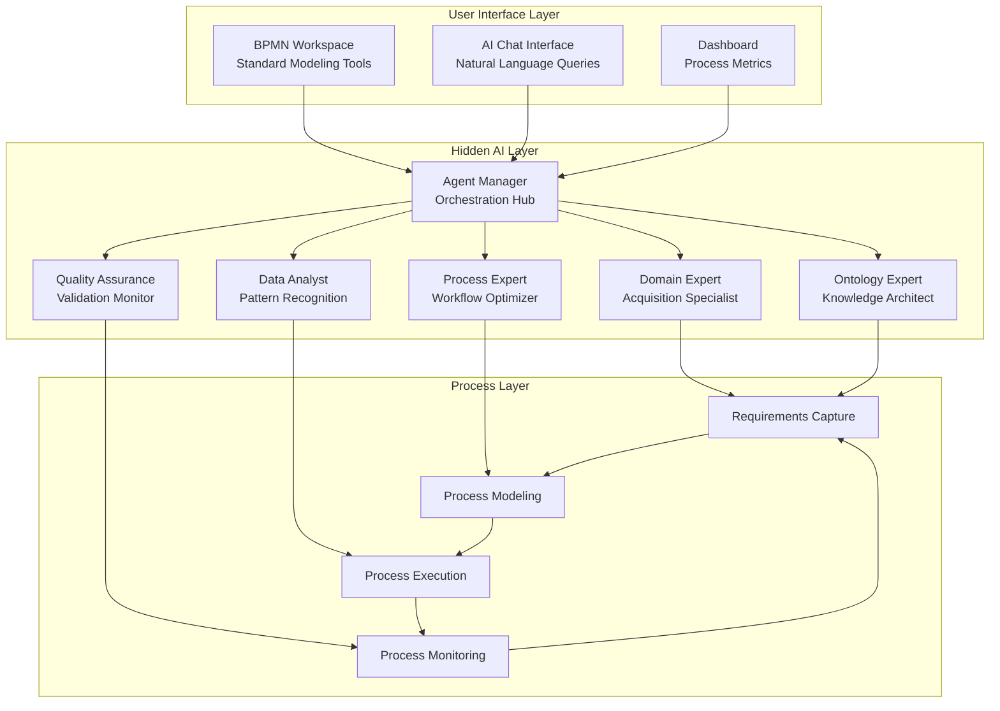
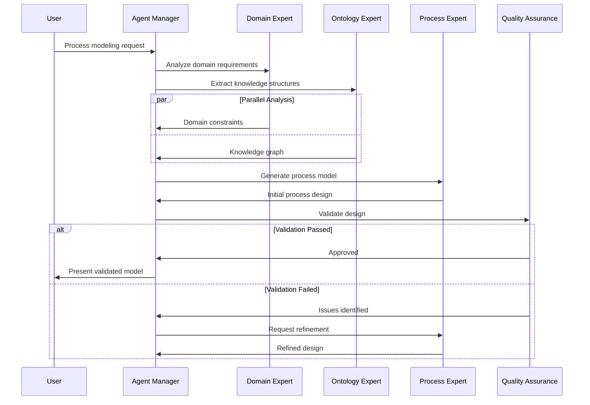
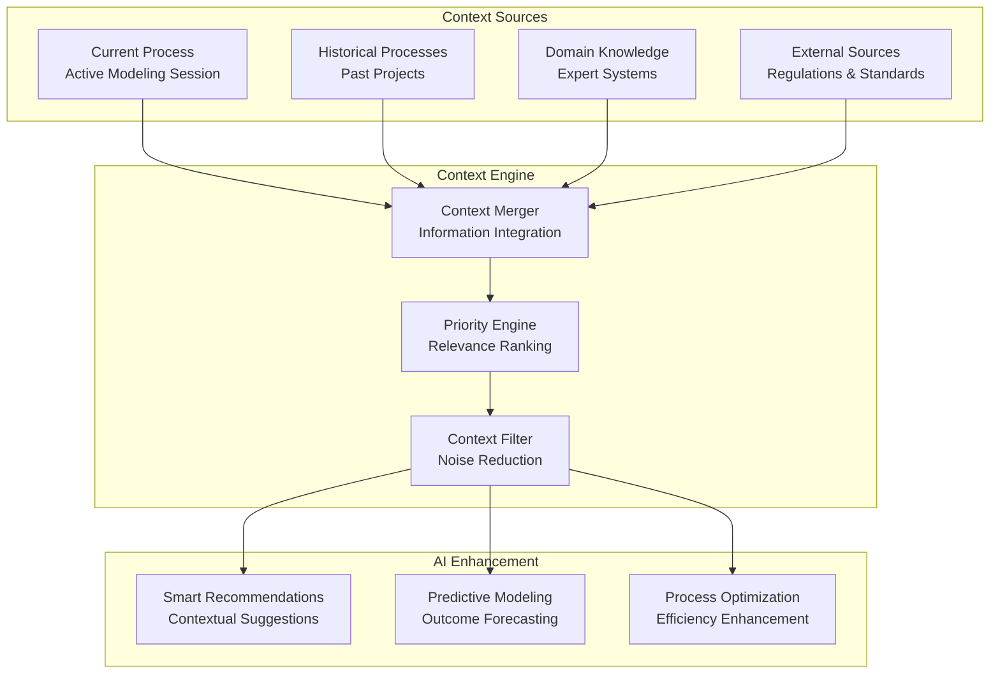
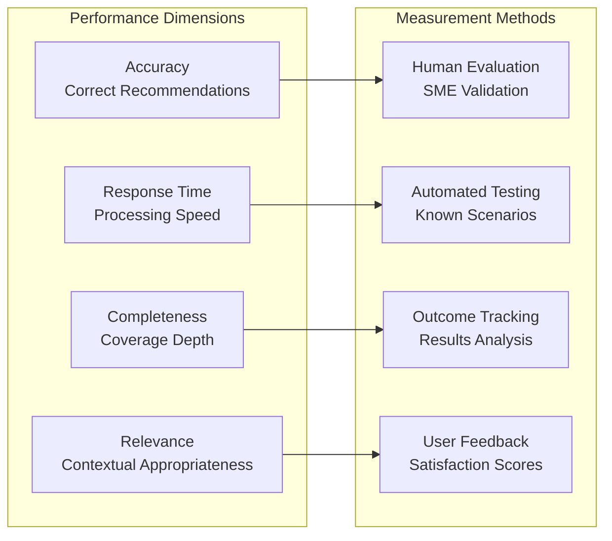

# AI Integration Strategy
**Date**: July 7, 2025  
**Project**: Decision Analysis and Decision Management (DADM) Platform

## Executive Summary

DADM's AI integration strategy centers on "hidden AI" - intelligent agents that operate transparently within standard business processes, enhancing human decision-making without disrupting established workflows. This approach ensures adoption by providing value immediately while building toward comprehensive AI-augmented process automation.

## Hidden AI Architecture

### Background Agent Framework



### Domain Expert Agents

#### Acquisition Domain Specialist
- **Purpose**: Aircraft acquisition process optimization
- **Knowledge Base**: DoD procurement regulations, industry standards, technical specifications
- **Capabilities**:
  - Requirements interpretation and validation
  - Stakeholder identification and constraint analysis
  - Risk assessment and mitigation strategies
  - Cost-benefit analysis automation

#### Technical Systems Analyst
- **Purpose**: Engineering requirements and technical integration
- **Knowledge Base**: System engineering principles, technical standards, integration patterns
- **Capabilities**:
  - Technical requirement extraction and validation
  - Interface specification and dependency analysis
  - Performance requirement modeling
  - Technical risk identification

#### Regulatory Compliance Monitor
- **Purpose**: Compliance checking and regulatory guidance
- **Knowledge Base**: FAR/DFARS regulations, industry compliance requirements
- **Capabilities**:
  - Automated compliance checking
  - Regulatory change impact analysis
  - Documentation requirement validation
  - Audit trail generation

### Prompt Service Integration

The Prompt Service provides centralized management and governance of AI interactions across all domain agents. This ensures consistent, high-quality responses while enabling controlled experimentation and continuous improvement.

#### Managed Prompt Execution
- **Template-Based Interactions**: All AI agent interactions use validated, versioned prompt templates
- **Parameter Injection**: Dynamic context and domain knowledge injected into prompts
- **Quality Assurance**: Automated testing and validation of prompt effectiveness
- **Performance Monitoring**: Real-time tracking of prompt performance and user satisfaction

#### BPMN Workflow Integration
- **Service Task Configuration**: Users select approved prompts when configuring AI-enabled service tasks
- **Dynamic Parameter Mapping**: BPMN process variables automatically map to prompt parameters
- **Response Standardization**: Consistent AI response formats across all workflow integrations
- **Error Handling**: Graceful handling of prompt execution failures within process flows

### Intelligent Process Assistance

```mermaid
flowchart LR
    subgraph "Natural Language Interface"
        NL[User Question<br/>"How do we handle<br/>vendor selection?"]
        AI[AI Interpretation<br/>Context Understanding]
        RESP[Generated Response<br/>Process Guidance]
    end
    
    subgraph "Knowledge Integration"
        KB[Knowledge Base<br/>Procedures & Policies]
        ONT[Ontology<br/>Domain Relationships]
        HIST[Historical Data<br/>Past Decisions]
    end
    
    subgraph "Process Enhancement"
        AUTO[Auto-Complete<br/>Process Steps]
        SUGGEST[Smart Suggestions<br/>Best Practices]
        VALIDATE[Real-time Validation<br/>Error Prevention]
    end
    
    NL --> AI
    AI --> KB
    AI --> ONT
    AI --> HIST
    
    KB --> AUTO
    ONT --> SUGGEST
    HIST --> VALIDATE
    
    AUTO --> RESP
    SUGGEST --> RESP
    VALIDATE --> RESP
```

## Multi-Agent Collaboration Framework

### Agent Coordination Protocol



### Convergence and Consensus Building

#### Multi-Agent Solution Generation
1. **Independent Analysis**: Each domain agent analyzes the problem independently
2. **Solution Clustering**: AI identifies common patterns across agent responses
3. **Conflict Resolution**: Automated negotiation to resolve disagreements
4. **Convergence Metrics**: Quantitative measures of solution consensus
5. **SME Validation**: Human expert review of converged solutions

#### Quality Assurance Framework
- **Consistency Checking**: Cross-agent validation of recommendations
- **Completeness Analysis**: Gap identification in solution coverage
- **Feasibility Assessment**: Real-world implementation viability
- **Performance Prediction**: Expected outcome modeling

## Context-Aware Intelligence

### Dynamic Context Building



### Adaptive Learning Mechanisms

#### Continuous Improvement Loop
1. **Performance Monitoring**: Track agent recommendation accuracy
2. **Feedback Integration**: Incorporate user corrections and preferences
3. **Model Refinement**: Update agent models based on outcomes
4. **Knowledge Base Evolution**: Expand domain knowledge from experience
5. **Cross-Project Learning**: Apply insights across different domains

#### Personalization Engine
- **User Behavior Analysis**: Learn individual modeling preferences
- **Customized Recommendations**: Tailor suggestions to user expertise level
- **Workflow Optimization**: Adapt interface and processes to user patterns
- **Learning Path Guidance**: Provide personalized skill development recommendations

## Implementation Strategy

### Phase 1: Foundation Layer (Current)
- ✅ Basic agent framework with OpenAI integration
- ✅ Domain expert agent for acquisition processes
- ✅ Natural language interface for process queries
- ✅ Thread-based conversation management

### Phase 2: Enhanced Intelligence (Q3 2025)
- 🔄 Multi-agent collaboration framework
- 🔄 Ontology-driven knowledge extraction
- 🔄 Context-aware recommendations
- ⏳ Real-time process validation

### Phase 3: Advanced Automation (Q4 2025)
- ⏳ Automated process generation from requirements
- ⏳ Predictive process optimization
- ⏳ Cross-domain knowledge transfer
- ⏳ Comprehensive performance analytics

### Phase 4: Autonomous Operation (2026)
- ⏳ Self-improving agent models
- ⏳ Autonomous process refinement
- ⏳ Intelligent resource allocation
- ⏳ Predictive problem resolution

## Agent Performance Metrics

### Individual Agent Assessment



### System-Level Intelligence Metrics

#### Convergence Quality
- **Solution Consistency**: Agreement level across agents
- **Consensus Speed**: Time to reach stable recommendations
- **Conflict Resolution**: Effectiveness of disagreement handling
- **Validation Success**: SME approval rate of converged solutions

#### User Experience Metrics
- **Adoption Rate**: User engagement with AI recommendations
- **Productivity Improvement**: Time savings in process modeling
- **Error Reduction**: Decrease in process design issues
- **Learning Acceleration**: Improvement in user domain knowledge

## Integration with Existing Systems

### Camunda BPMN Engine
- **Process Intelligence**: AI analysis of execution patterns
- **Optimization Recommendations**: Data-driven process improvements
- **Anomaly Detection**: Identification of unusual execution behaviors
- **Performance Prediction**: Forecasting of process outcomes

### Knowledge Management Systems
- **Automated Documentation**: AI-generated process documentation
- **Knowledge Graph Enhancement**: Continuous ontology refinement
- **Cross-Reference Generation**: Automatic linking of related processes
- **Version Control Intelligence**: Smart change impact analysis

### Enterprise Systems Integration
- **ERP Connectivity**: Intelligent data mapping and synchronization
- **Document Management**: AI-powered document classification and retrieval
- **Compliance Systems**: Automated regulatory compliance checking
- **Analytics Platforms**: Enhanced business intelligence with process insights

---

*This AI integration strategy ensures that artificial intelligence enhances rather than replaces human expertise, creating a symbiotic relationship that amplifies decision-making capabilities while maintaining user control and transparency.*
