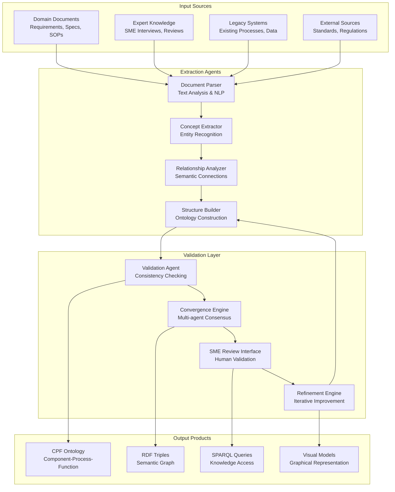
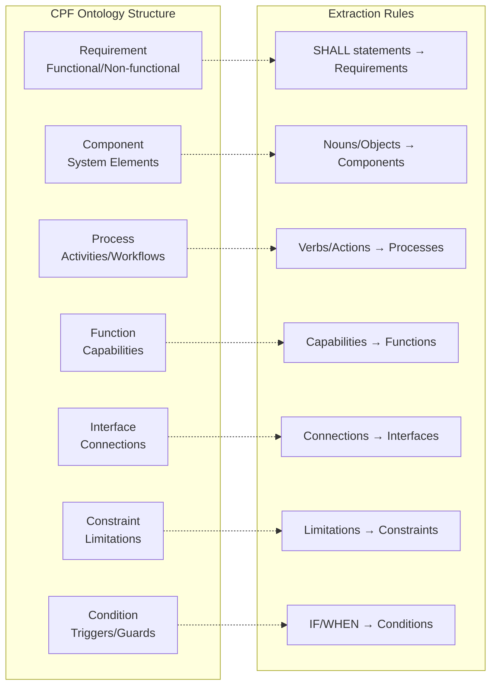
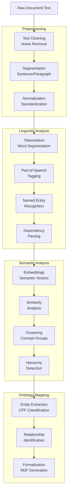
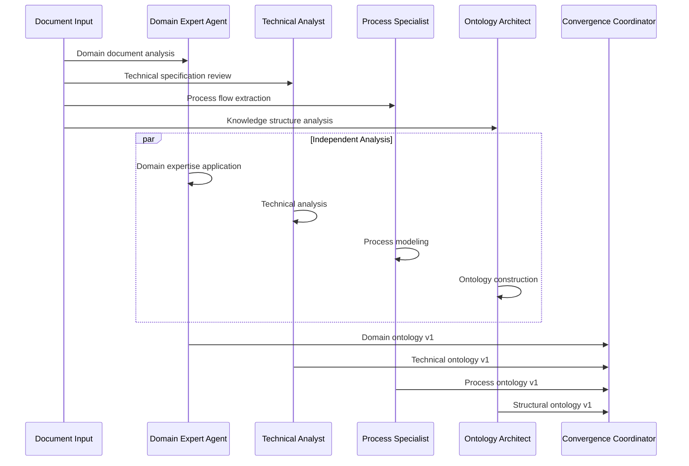
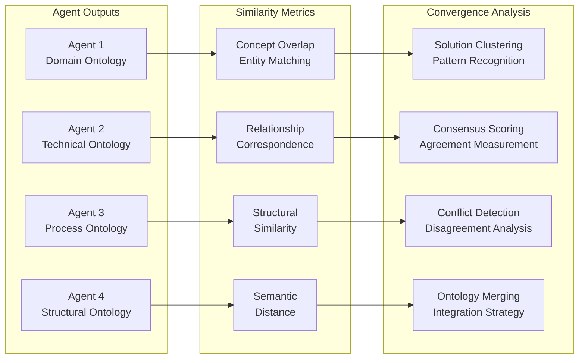
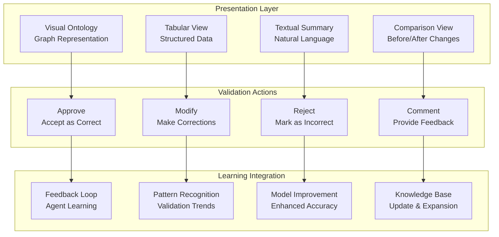
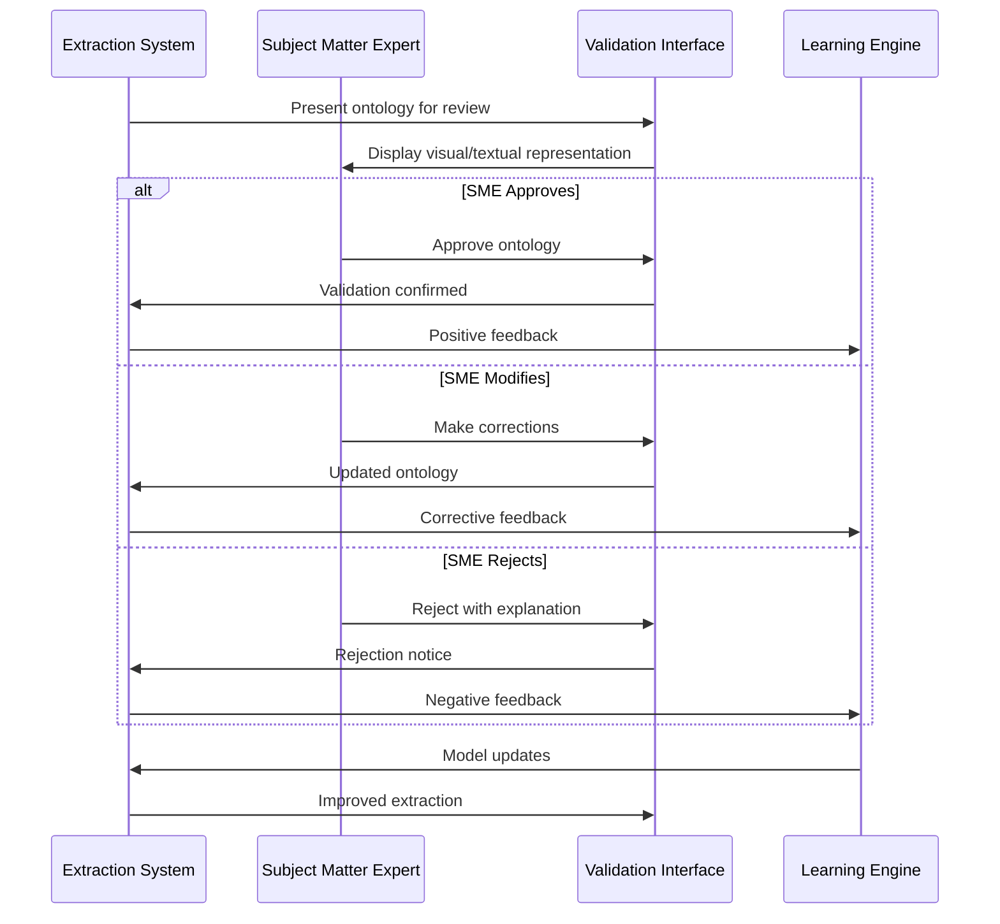
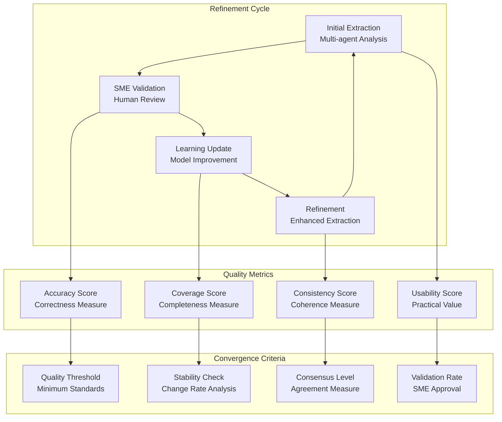
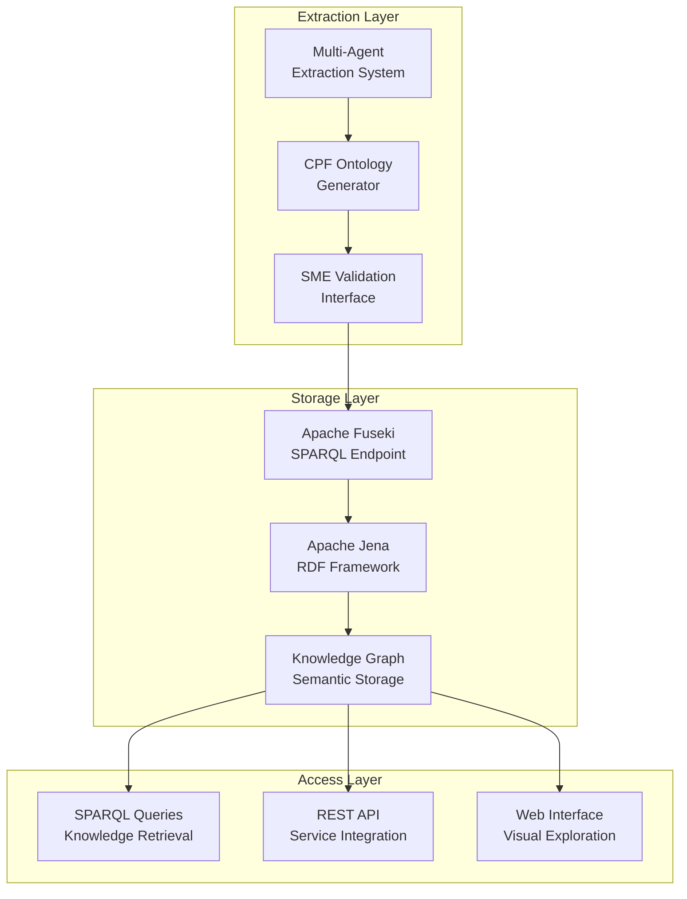

# Ontology Extraction Process
**Date**: July 7, 2025  
**Project**: Decision Analysis and Decision Management (DADM) Platform

## Executive Summary

The DADM Ontology Extraction Process transforms unstructured domain documentation into formal, machine-readable knowledge structures using AI-powered multi-agent systems. This process bridges the gap between human domain expertise and computational reasoning, enabling automated conceptual design generation and intelligent process assistance.

## Multi-Agent Extraction Architecture



## Component-Process-Function (CPF) Extraction

### CPF Framework Implementation



### Natural Language Processing Pipeline



## Multi-Agent Convergence Process

### Independent Analysis Phase



### Convergence and Consensus Building

#### Similarity Analysis


#### Conflict Resolution Framework

1. **Disagreement Classification**
   - **Terminology Conflicts**: Different terms for same concept
   - **Structural Conflicts**: Different hierarchical organization
   - **Scope Conflicts**: Different levels of abstraction
   - **Semantic Conflicts**: Different interpretations of meaning

2. **Resolution Strategies**
   - **Automated Reconciliation**: Rule-based conflict resolution
   - **Weighted Voting**: Agent expertise-based decision making
   - **Human Arbitration**: SME intervention for complex conflicts
   - **Iterative Refinement**: Gradual consensus building

3. **Quality Assurance**
   - **Consistency Checking**: Logical coherence validation
   - **Completeness Assessment**: Coverage gap identification
   - **Redundancy Detection**: Duplicate concept elimination
   - **Validation Testing**: Functional correctness verification

## SME Validation Interface

### Interactive Review System



### Validation Workflow



## Iterative Refinement Process

### Continuous Improvement Loop



### Performance Optimization

#### Learning Rate Adaptation
- **Fast Learning**: High learning rate for initial extraction phases
- **Stable Learning**: Moderate learning rate for refinement phases
- **Fine-tuning**: Low learning rate for final optimization phases
- **Adaptive Control**: Dynamic learning rate based on validation feedback

#### Model Selection and Ensemble Methods
- **Agent Specialization**: Domain-specific model optimization
- **Ensemble Integration**: Combining multiple extraction approaches
- **Performance Monitoring**: Continuous assessment of agent effectiveness
- **Dynamic Reconfiguration**: Automated model selection based on performance

## Domain-Specific Extraction Examples

### Aircraft Acquisition Domain

#### Key Extraction Patterns
```mermaid
graph LR
    subgraph "Domain Concepts"
        REQ[Requirements<br/>"Aircraft shall have..."]
        STAKE[Stakeholders<br/>"User, Operator, Maintainer"]
        PROCESS[Processes<br/>"Acquisition, Testing, Deployment"]
        CONSTRAINT[Constraints<br/>"Budget, Timeline, Performance"]
    end
    
    subgraph "Extracted Relationships"
        REQ_CONSTRAINT[Requirement → constrainedBy → Constraint]
        STAKE_REQ[Stakeholder → specifies → Requirement]
        PROCESS_REQ[Process → implements → Requirement]
        CONSTRAINT_PROCESS[Constraint → limits → Process]
    end
    
    REQ --> REQ_CONSTRAINT
    STAKE --> STAKE_REQ
    PROCESS --> PROCESS_REQ
    CONSTRAINT --> CONSTRAINT_PROCESS
```

#### Sample Extraction Results
| Document Phrase | Extracted Entity | CPF Classification | Relationships |
|-----------------|------------------|-------------------|---------------|
| "The aircraft shall achieve Mach 2.0" | Speed Requirement | Requirement | constrains → Aircraft Component |
| "Pilot operates flight controls" | Pilot-Control Interface | Interface | connects → Pilot, Flight Control |
| "Maintenance procedure checks engine" | Maintenance Process | Process | maintains → Engine Component |
| "Engine provides thrust capability" | Thrust Function | Function | realizes → Propulsion Process |

### Software Development Domain

#### Specialized Extraction Rules
- **Code Comments → Requirements**: Extract functional specifications from documentation
- **Class Definitions → Components**: Identify system building blocks
- **Method Calls → Processes**: Map execution flows and interactions
- **API Endpoints → Interfaces**: Define system boundaries and connections

### Regulatory Compliance Domain

#### Compliance-Specific Patterns
- **"Must/Shall" Statements → Mandatory Requirements**: Legal obligations
- **"Should/May" Statements → Optional Requirements**: Best practices
- **"Prohibited/Forbidden" → Constraints**: Forbidden actions or states
- **"When/If" Conditions → Conditional Logic**: Situational requirements

## Integration with DADM Architecture

### Apache Jena/Fuseki Integration



### Real-time Extraction Pipeline
- **Document Monitoring**: Automatic detection of new or updated documents
- **Incremental Processing**: Efficient handling of document changes
- **Version Control**: Tracking ontology evolution over time
- **Impact Analysis**: Assessment of changes on existing knowledge structures

---

*The Ontology Extraction Process transforms the art of domain knowledge capture into a systematic, repeatable science that enables automated reasoning and intelligent system design.*
