# DADM Ontology Framework
**Component-Process-Function (CPF) Integration & AI-Powered Knowledge Management**

## Overview

The DADM ontology framework leverages the Component-Process-Function (CPF) ontology as the foundation for conceptual system design and requirements management. This framework enables automated extraction of domain knowledge, requirements, and conceptual designs from domain documentation.

## Component-Process-Function (CPF) Ontology

### **Core CPF Relationships**
Based on your Base Ontology V1 (BOV1):


### **CPF Ontology Applications**
- **Requirements Decomposition**: Break down 'shall' statements into component-level requirements
- **Conceptual Design Generation**: Automatically create system concepts from requirements
- **Interface Definition**: Identify and specify component interfaces
- **Process Mapping**: Map functional requirements to operational processes
- **Constraint Management**: Track and validate design constraints throughout development

## Integrated Ontology Architecture

### **1. Graphical Ontology Modeler**
- **Visual Editor**: Web-based interface for ontology design and modification
- **CPF Template Library**: Pre-built patterns based on your BOV1 structure
- **Real-Time Validation**: Immediate feedback on ontological consistency
- **Collaborative Editing**: Multi-user ontology development with change tracking
- **Export Capabilities**: Generate RDF/OWL formats for system integration

**Technical Implementation:**
```python
class OntologyModeler:
    def __init__(self, cpf_base_ontology):
        self.base_ontology = cpf_base_ontology
        self.visual_editor = WebOntologyEditor()
        self.validator = CPFValidator()
    
    def create_domain_ontology(self, domain_concepts):
        """Extend CPF base with domain-specific concepts"""
        return self.base_ontology.extend(domain_concepts)
    
    def validate_cpf_compliance(self, ontology):
        """Ensure ontology follows CPF patterns"""
        return self.validator.check_cpf_patterns(ontology)
```

### **2. AI Ontology Extraction with Convergence Criteria**

#### **Multi-Agent Extraction Pipeline**

```mermaid
flowchart TD
    DD[Domain Documentation<br/>Requirements Documents<br/>Technical Specifications] --> AGE[Agent Ensemble]
    
    subgraph AGE["Multi-Agent Extraction"]
        RE[Requirement Extractor<br/>'Shall', 'Must', 'Will']
        CI[Component Identifier<br/>System Elements]
        PM[Process Mapper<br/>Operational Workflows]
        FA[Function Analyzer<br/>Capabilities & Behaviors]
        CD[Constraint Detector<br/>Limitations & Boundaries]
        
        RE --> CONV[Convergence Analysis]
        CI --> CONV
        PM --> CONV
        FA --> CONV
        CD --> CONV
    end
    
    CONV --> CS[Clustered Solutions<br/>Multiple Ontology Variants]
    CS --> SME[SME Review<br/>Expert Validation]
    SME --> FINAL[Final Ontology<br/>Approved & Published]
    
    subgraph "Convergence Criteria"
        ITER[Iterative Extraction<br/>Max 10 Iterations]
        THRESH[Similarity Threshold<br/>≥ 85% Agreement]
        CLUSTER[Solution Clustering<br/>Group Similar Results]
    end
    
    CONV -.-> ITER
    CONV -.-> THRESH
    CONV -.-> CLUSTER
```



#### **Convergence Analysis**
```python
class ConvergenceAnalyzer:
    def __init__(self, extraction_agents):
        self.agents = extraction_agents
        self.convergence_threshold = 0.85
    
    def run_extraction_iterations(self, domain_data, max_iterations=10):
        """Run multiple extraction passes until convergence"""
        results = []
        for iteration in range(max_iterations):
            iteration_results = self.extract_with_all_agents(domain_data)
            results.append(iteration_results)
            
            if self.check_convergence(results):
                break
                
        return self.consolidate_results(results)
    
    def check_convergence(self, results):
        """Measure agreement between extraction iterations"""
        if len(results) < 3:
            return False
            
        similarity_scores = self.calculate_similarity(results[-3:])
        return all(score > self.convergence_threshold for score in similarity_scores)
```

#### **Clustered Solutions**
- **Extraction Variables**: Different agent configurations, data subsets, parameter settings
- **Solution Clustering**: Group similar ontology extractions for analysis
- **Consensus Building**: Identify common elements across solution clusters
- **Variant Management**: Track and compare different ontological interpretations

### **3. Integrated Query and Reasoner (Fuseki) with AI Support**

#### **SPARQL Enhancement**
- **Natural Language Queries**: AI translation of English questions to SPARQL
- **Query Optimization**: Automatic query performance tuning
- **Result Interpretation**: AI-powered explanation of query results
- **Interactive Exploration**: Guided discovery of ontological relationships

```python
class AIEnhancedFuseki:
    def __init__(self, fuseki_endpoint, llm_service):
        self.fuseki = FusekiClient(fuseki_endpoint)
        self.llm = llm_service
        self.query_translator = NLToSPARQLTranslator(llm_service)
    
    def natural_language_query(self, question):
        """Convert natural language to SPARQL and execute"""
        sparql_query = self.query_translator.translate(question)
        results = self.fuseki.query(sparql_query)
        explanation = self.llm.explain_results(question, results)
        return {
            'results': results,
            'explanation': explanation,
            'sparql': sparql_query
        }
    
    def suggest_related_queries(self, current_query):
        """Suggest related questions based on ontology structure"""
        return self.llm.generate_related_queries(current_query, self.get_ontology_schema())
```

### **4. AI-Supported Transformation Definitions**

#### **Domain Data Integration**
- **Semantic Mapping**: Automatic identification of equivalent concepts across domains
- **Data Transformation Rules**: AI-generated rules for data format conversion
- **Validation Pipelines**: Ensure transformed data maintains semantic integrity
- **Incremental Updates**: Handle evolving data sources and schema changes

```python
class DomainDataTransformer:
    def __init__(self, source_ontology, target_ontology, llm_service):
        self.source_ont = source_ontology
        self.target_ont = target_ontology
        self.llm = llm_service
    
    def generate_transformation_rules(self):
        """AI-generated mapping between ontologies"""
        mappings = self.llm.identify_concept_mappings(
            self.source_ont, 
            self.target_ont
        )
        return self.create_transformation_rules(mappings)
    
    def transform_data(self, source_data, transformation_rules):
        """Apply semantic transformations to data"""
        return self.apply_rules(source_data, transformation_rules)
```

## Requirements Management Integration

### **Requirements Extraction from Domain Documentation**


#### **'Shall' Statement Processing**
```python
class RequirementsExtractor:
    def __init__(self, cpf_ontology, llm_service):
        self.cpf = cpf_ontology
        self.llm = llm_service
        self.patterns = [
            r'(?:shall|must|will|should)\s+(.+?)(?:\.|;|$)',
            r'(?:required|mandatory|essential)\s+(?:that|to)\s+(.+?)(?:\.|;|$)',
            r'(?:system|component|interface)\s+(?:shall|must)\s+(.+?)(?:\.|;|$)'
        ]
    
    def extract_requirements(self, document):
        """Extract and classify requirements from documentation"""
        raw_requirements = self.identify_requirement_statements(document)
        
        classified_requirements = []
        for req in raw_requirements:
            classification = self.classify_requirement(req)
            cpf_mapping = self.map_to_cpf(req, classification)
            
            classified_requirements.append({
                'text': req,
                'type': classification,
                'cpf_component': cpf_mapping.get('component'),
                'cpf_process': cpf_mapping.get('process'),
                'cpf_function': cpf_mapping.get('function'),
                'constraints': cpf_mapping.get('constraints', [])
            })
        
        return classified_requirements
    
    def map_to_cpf(self, requirement, classification):
        """Map requirement to CPF ontology elements"""
        return self.llm.map_requirement_to_cpf(
            requirement, 
            classification, 
            self.cpf.get_schema()
        )
```

### **Conceptual Design Bootstrapping**

#### **CPF-Driven System Generation**


```python
class ConceptualDesignBootstrapper:
    def __init__(self, cpf_ontology, requirements_db):
        self.cpf = cpf_ontology
        self.requirements = requirements_db
    
    def bootstrap_conceptual_design(self, requirements_set):
        """Generate conceptual system design from requirements"""
        # 1. Group requirements by CPF categories
        grouped_reqs = self.group_by_cpf_elements(requirements_set)
        
        # 2. Generate components
        components = self.generate_components(grouped_reqs['components'])
        
        # 3. Define processes
        processes = self.generate_processes(grouped_reqs['processes'])
        
        # 4. Specify functions
        functions = self.generate_functions(grouped_reqs['functions'])
        
        # 5. Create interfaces
        interfaces = self.generate_interfaces(components, processes, functions)
        
        # 6. Apply constraints
        constrained_design = self.apply_constraints(
            components, processes, functions, interfaces,
            grouped_reqs['constraints']
        )
        
        return ConceptualDesign(constrained_design)
    
    def generate_component_hierarchy(self, requirements):
        """Create hierarchical component structure"""
        # Use CPF patterns to organize components
        return self.cpf.create_component_hierarchy(requirements)
```

## Ontology Evolution and Learning

### **Continuous Improvement Pipeline**
- **Usage Analytics**: Track which ontological patterns are most effective
- **Outcome Correlation**: Link ontology quality to decision outcomes
- **Automated Refinement**: AI-suggested improvements based on system performance
- **Version Management**: Controlled evolution with rollback capabilities

### **Domain Adaptation**
- **Transfer Learning**: Apply successful patterns from one domain to another
- **Incremental Expansion**: Gradual addition of domain-specific concepts
- **Cross-Domain Validation**: Ensure consistency across multiple domains
- **Community Contributions**: Crowdsourced ontology improvements

## Integration with DADM Workflow Engine

### **Workflow Generation from Ontology**
- **Process Templates**: Auto-generate BPMN workflows from CPF process definitions
- **Decision Points**: Identify where human judgment or AI assistance is required
- **Validation Steps**: Embed ontological validation into workflow execution
- **Feedback Loops**: Update ontology based on workflow execution results

### **Real-Time Validation**
- **Constraint Checking**: Continuous validation against CPF constraints
- **Consistency Monitoring**: Detect and resolve ontological conflicts
- **Performance Tracking**: Measure ontology effectiveness in real workflows
- **Adaptive Responses**: Modify workflows based on ontological insights

This ontology framework transforms your CPF ontology from a static model into a living, executable knowledge management system that can bootstrap entire system designs from requirements documentation.
