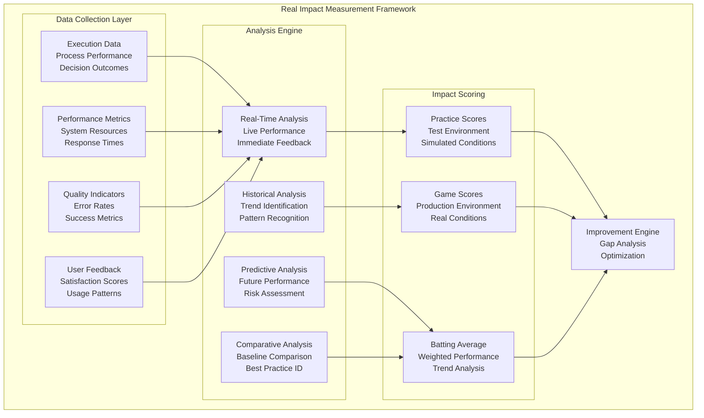
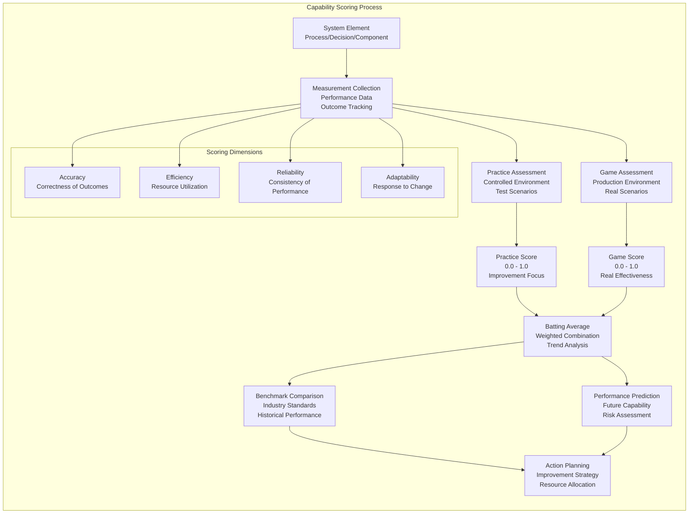
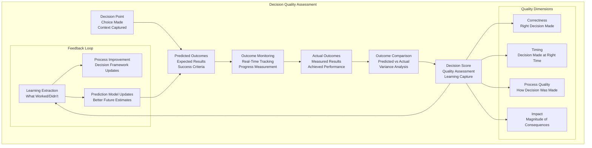
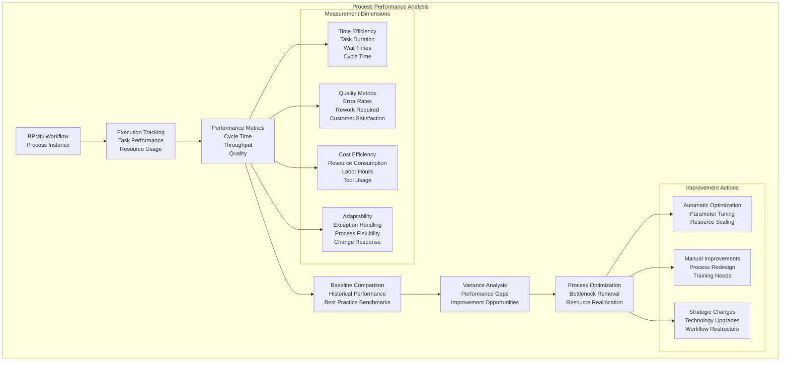
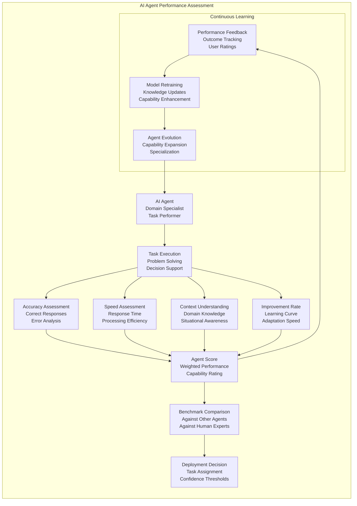

# Real Impact Analysis
**Measuring Actual System Performance and Decision Quality Outcomes**

## Overview

Real Impact Analysis in DADM goes beyond traditional metrics to measure the actual effectiveness of decisions, processes, and system components in real-world scenarios. This capability assessment framework provides "batting averages" for every element, distinguishing between practice performance and game-time effectiveness.

## Impact Analysis Architecture



## Capability Assessment Framework

### **Universal Scoring System**



### **Batting Average Calculation**

```python
class CapabilityAssessment:
    def __init__(self, element_id, element_type):
        self.element_id = element_id
        self.element_type = element_type
        self.practice_scores = []
        self.game_scores = []
        self.weights = {
            'accuracy': 0.3,
            'efficiency': 0.2,
            'reliability': 0.3,
            'adaptability': 0.2
        }
    
    def calculate_batting_average(self, time_window_days=30):
        """Calculate weighted batting average over time window"""
        recent_practice = self.get_recent_scores(self.practice_scores, time_window_days)
        recent_game = self.get_recent_scores(self.game_scores, time_window_days)
        
        if not recent_game:
            return self.calculate_practice_average(recent_practice)
        
        # Weight game performance more heavily than practice
        practice_weight = 0.3
        game_weight = 0.7
        
        practice_avg = self.calculate_practice_average(recent_practice)
        game_avg = self.calculate_game_average(recent_game)
        
        batting_average = (practice_avg * practice_weight) + (game_avg * game_weight)
        
        return {
            'batting_average': batting_average,
            'practice_average': practice_avg,
            'game_average': game_avg,
            'trend': self.calculate_trend(),
            'confidence': self.calculate_confidence(),
            'sample_size': len(recent_game),
            'time_window': time_window_days
        }
    
    def calculate_dimensional_scores(self, performance_data):
        """Calculate scores across capability dimensions"""
        dimensions = {}
        
        # Accuracy: How often does the element produce correct results?
        dimensions['accuracy'] = self.calculate_accuracy_score(performance_data)
        
        # Efficiency: How well does the element use resources?
        dimensions['efficiency'] = self.calculate_efficiency_score(performance_data)
        
        # Reliability: How consistent is the element's performance?
        dimensions['reliability'] = self.calculate_reliability_score(performance_data)
        
        # Adaptability: How well does the element handle new situations?
        dimensions['adaptability'] = self.calculate_adaptability_score(performance_data)
        
        # Calculate weighted overall score
        overall_score = sum(
            dimensions[dim] * self.weights[dim] 
            for dim in dimensions
        )
        
        return {
            'overall_score': overall_score,
            'dimensional_scores': dimensions,
            'weights': self.weights
        }
    
    def calculate_accuracy_score(self, data):
        """Calculate accuracy based on correct vs incorrect outcomes"""
        if not data.get('outcomes'):
            return 0.0
        
        correct_outcomes = sum(1 for outcome in data['outcomes'] if outcome['correct'])
        total_outcomes = len(data['outcomes'])
        
        return correct_outcomes / total_outcomes if total_outcomes > 0 else 0.0
    
    def calculate_efficiency_score(self, data):
        """Calculate efficiency based on resource utilization"""
        if not data.get('resource_usage'):
            return 0.0
        
        # Normalize efficiency metrics (lower resource usage = higher score)
        time_efficiency = 1.0 - min(data['resource_usage']['time_ratio'], 1.0)
        memory_efficiency = 1.0 - min(data['resource_usage']['memory_ratio'], 1.0)
        cpu_efficiency = 1.0 - min(data['resource_usage']['cpu_ratio'], 1.0)
        
        return (time_efficiency + memory_efficiency + cpu_efficiency) / 3.0
    
    def calculate_reliability_score(self, data):
        """Calculate reliability based on consistency of performance"""
        if not data.get('performance_history'):
            return 0.0
        
        performance_values = [p['score'] for p in data['performance_history']]
        
        if len(performance_values) < 2:
            return performance_values[0] if performance_values else 0.0
        
        # Calculate coefficient of variation (lower = more reliable)
        mean_performance = sum(performance_values) / len(performance_values)
        variance = sum((x - mean_performance) ** 2 for x in performance_values) / len(performance_values)
        std_deviation = variance ** 0.5
        
        if mean_performance == 0:
            return 0.0
        
        coefficient_of_variation = std_deviation / mean_performance
        reliability_score = max(0.0, 1.0 - coefficient_of_variation)
        
        return reliability_score
```

## Decision Quality Measurement

### **Decision Outcome Tracking**



### **Decision Quality Implementation**

```python
class DecisionQualityTracker:
    def __init__(self, decision_id, context):
        self.decision_id = decision_id
        self.context = context
        self.predictions = {}
        self.actual_outcomes = {}
        self.quality_metrics = {}
        
    def record_decision(self, decision_data, predicted_outcomes):
        """Record decision and predicted outcomes"""
        self.decision_data = {
            'timestamp': datetime.now(),
            'decision': decision_data,
            'context': self.context,
            'decision_maker': decision_data.get('decision_maker'),
            'alternatives_considered': decision_data.get('alternatives', []),
            'criteria_used': decision_data.get('criteria', []),
            'confidence_level': decision_data.get('confidence', 0.5)
        }
        
        self.predictions = predicted_outcomes
        
        # Set up monitoring for outcome tracking
        self.setup_outcome_monitoring()
    
    def track_outcome(self, outcome_data):
        """Track actual outcomes as they occur"""
        timestamp = datetime.now()
        
        self.actual_outcomes[timestamp] = {
            'metrics': outcome_data,
            'time_from_decision': timestamp - self.decision_data['timestamp']
        }
        
        # Calculate current quality score
        current_quality = self.calculate_decision_quality()
        
        # Update learning models
        self.update_learning_models(current_quality)
        
        return current_quality
    
    def calculate_decision_quality(self):
        """Calculate comprehensive decision quality score"""
        if not self.actual_outcomes:
            return None
        
        quality_scores = {}
        
        # Correctness: How well did predicted outcomes match actual?
        quality_scores['correctness'] = self.calculate_correctness_score()
        
        # Timing: Was the decision made at the right time?
        quality_scores['timing'] = self.calculate_timing_score()
        
        # Process Quality: How well was the decision process executed?
        quality_scores['process_quality'] = self.calculate_process_quality_score()
        
        # Impact: What was the magnitude and direction of impact?
        quality_scores['impact'] = self.calculate_impact_score()
        
        # Overall weighted score
        weights = {'correctness': 0.4, 'timing': 0.2, 'process_quality': 0.2, 'impact': 0.2}
        overall_quality = sum(
            quality_scores[dimension] * weights[dimension]
            for dimension in quality_scores
        )
        
        return {
            'overall_quality': overall_quality,
            'dimensional_scores': quality_scores,
            'decision_id': self.decision_id,
            'assessment_timestamp': datetime.now()
        }
    
    def calculate_correctness_score(self):
        """Calculate how well predictions matched reality"""
        if not self.predictions or not self.actual_outcomes:
            return 0.0
        
        prediction_accuracy = []
        
        for metric_name, predicted_value in self.predictions.items():
            actual_values = [
                outcome['metrics'].get(metric_name)
                for outcome in self.actual_outcomes.values()
                if metric_name in outcome['metrics']
            ]
            
            if actual_values:
                latest_actual = actual_values[-1]
                if isinstance(predicted_value, (int, float)) and isinstance(latest_actual, (int, float)):
                    # Calculate percentage error for numeric values
                    if predicted_value != 0:
                        error = abs(predicted_value - latest_actual) / abs(predicted_value)
                        accuracy = max(0.0, 1.0 - error)
                    else:
                        accuracy = 1.0 if latest_actual == 0 else 0.0
                else:
                    # Simple match for categorical values
                    accuracy = 1.0 if predicted_value == latest_actual else 0.0
                
                prediction_accuracy.append(accuracy)
        
        return sum(prediction_accuracy) / len(prediction_accuracy) if prediction_accuracy else 0.0
```

## Process Performance Analysis

### **Workflow Effectiveness Measurement**



### **Process Analytics Implementation**

```python
class ProcessPerformanceAnalyzer:
    def __init__(self, process_definition_id):
        self.process_id = process_definition_id
        self.performance_db = ProcessPerformanceDatabase()
        self.baseline_calculator = BaselineCalculator()
        self.optimizer = ProcessOptimizer()
        
    def analyze_process_performance(self, time_window_days=30):
        """Comprehensive process performance analysis"""
        # 1. Collect process execution data
        execution_data = self.performance_db.get_process_executions(
            self.process_id, 
            time_window_days
        )
        
        # 2. Calculate performance metrics
        metrics = self.calculate_process_metrics(execution_data)
        
        # 3. Compare against baseline
        baseline_comparison = self.baseline_calculator.compare_to_baseline(
            self.process_id, 
            metrics
        )
        
        # 4. Identify performance issues
        issues = self.identify_performance_issues(metrics, baseline_comparison)
        
        # 5. Generate optimization recommendations
        recommendations = self.optimizer.generate_recommendations(issues, metrics)
        
        return ProcessPerformanceReport(
            process_id=self.process_id,
            time_window=time_window_days,
            metrics=metrics,
            baseline_comparison=baseline_comparison,
            issues=issues,
            recommendations=recommendations,
            overall_score=self.calculate_overall_process_score(metrics)
        )
    
    def calculate_process_metrics(self, execution_data):
        """Calculate comprehensive process performance metrics"""
        if not execution_data:
            return {}
        
        metrics = {}
        
        # Time efficiency metrics
        cycle_times = [exec_data['end_time'] - exec_data['start_time'] for exec_data in execution_data]
        metrics['average_cycle_time'] = sum(cycle_times) / len(cycle_times)
        metrics['cycle_time_variance'] = self.calculate_variance(cycle_times)
        metrics['throughput'] = len(execution_data) / max(1, max(cycle_times).days)
        
        # Quality metrics
        successful_executions = [ex for ex in execution_data if ex['status'] == 'completed']
        metrics['success_rate'] = len(successful_executions) / len(execution_data)
        metrics['error_rate'] = 1.0 - metrics['success_rate']
        
        # Resource efficiency metrics
        total_resource_cost = sum(ex.get('resource_cost', 0) for ex in execution_data)
        metrics['average_resource_cost'] = total_resource_cost / len(execution_data)
        metrics['cost_per_success'] = total_resource_cost / max(1, len(successful_executions))
        
        # Adaptability metrics
        exception_count = sum(1 for ex in execution_data if ex.get('exceptions', 0) > 0)
        metrics['exception_rate'] = exception_count / len(execution_data)
        metrics['adaptability_score'] = self.calculate_adaptability_score(execution_data)
        
        return metrics
    
    def calculate_adaptability_score(self, execution_data):
        """Calculate how well process adapts to varying conditions"""
        # Analyze how process performance varies with different inputs/conditions
        condition_variations = {}
        
        for execution in execution_data:
            conditions = execution.get('conditions', {})
            condition_key = self.create_condition_key(conditions)
            
            if condition_key not in condition_variations:
                condition_variations[condition_key] = []
            
            condition_variations[condition_key].append(execution['cycle_time'])
        
        if len(condition_variations) < 2:
            return 0.5  # Neutral score if not enough variation to assess
        
        # Calculate performance consistency across different conditions
        condition_means = [
            sum(times) / len(times) 
            for times in condition_variations.values()
        ]
        
        overall_mean = sum(condition_means) / len(condition_means)
        variance = sum((mean - overall_mean) ** 2 for mean in condition_means) / len(condition_means)
        
        # Lower variance = higher adaptability (more consistent across conditions)
        adaptability_score = max(0.0, 1.0 - (variance / overall_mean if overall_mean > 0 else 1.0))
        
        return adaptability_score
```

## AI Agent Performance Assessment

### **Agent Capability Tracking**



This real impact analysis framework ensures that every component of the DADM system is continuously measured, evaluated, and improved based on actual performance rather than theoretical capabilities.
