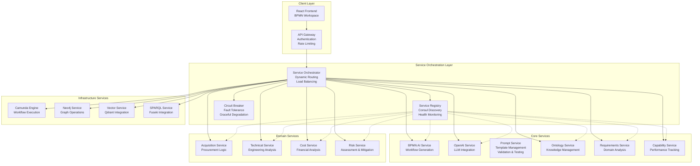
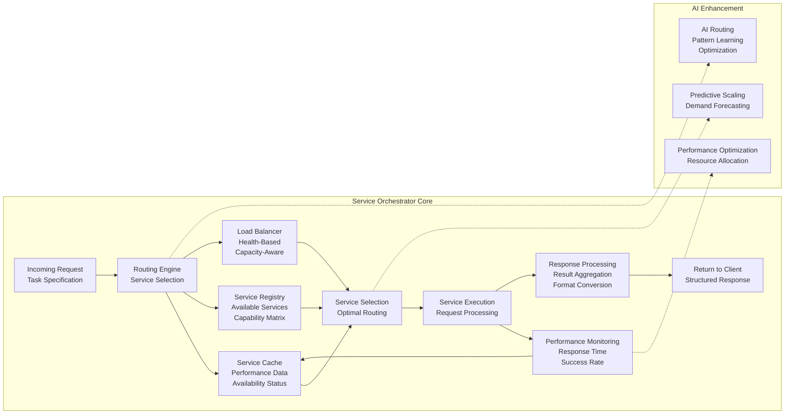
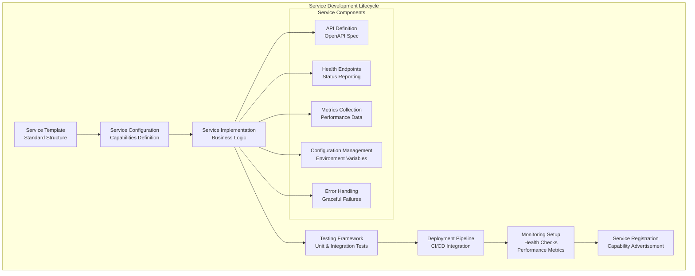
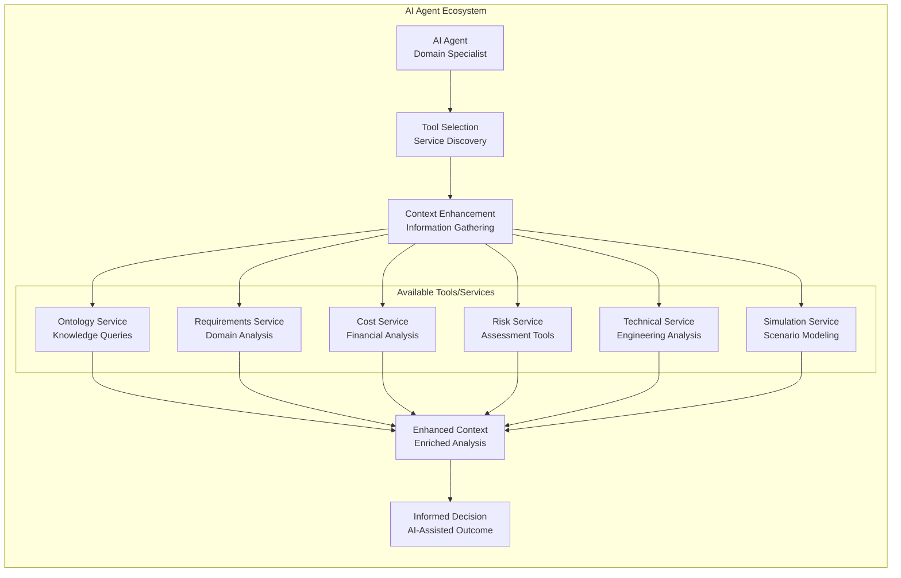
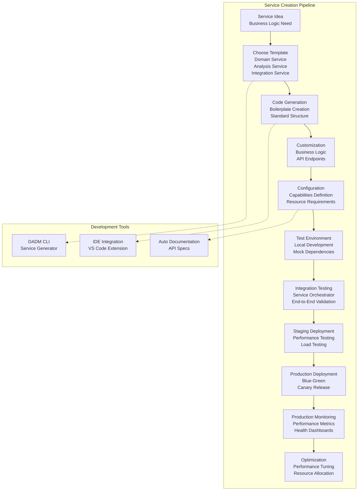
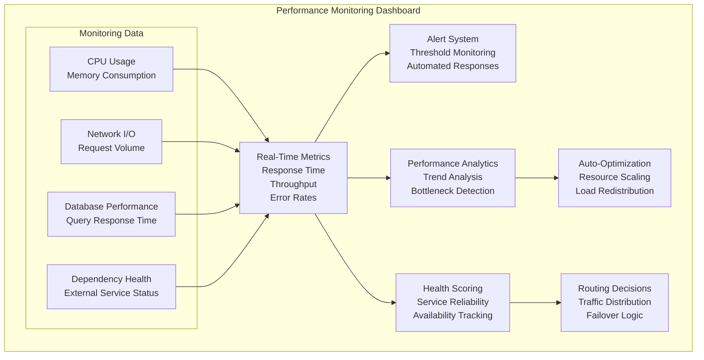

# DADM Service Architecture
**Flexible Service Layer Design & Microservice Integration**

## Overview

The DADM service architecture provides a flexible, scalable foundation for integrating existing and new microservices. Services are exposed as tools for AI context enhancement, analysis, and decision support, enabling rapid development and seamless integration across the platform.

## Service Architecture Principles

### **1. Service-Oriented Design**
- **Microservice Pattern**: Independent, deployable services with specific responsibilities
- **API-First Approach**: RESTful interfaces with OpenAPI specifications
- **Container-Native**: Docker-based deployment with Kubernetes orchestration capability
- **Health Monitoring**: Built-in health checks and performance metrics
- **Graceful Degradation**: Fault tolerance with circuit breaker patterns

### **2. Dynamic Service Discovery**
- **Service Registry**: Consul-based discovery with automatic registration
- **Load Balancing**: Intelligent routing based on service health and capacity
- **Version Management**: Multiple service versions with canary deployments
- **Dependency Tracking**: Service relationship mapping and impact analysis

## Core Service Architecture



## Flexible Service Orchestrator

### **Dynamic Routing Architecture**



### **Service Orchestrator Implementation**

```python
class FlexibleServiceOrchestrator:
    def __init__(self, service_registry, ai_optimizer=None):
        self.registry = service_registry
        self.cache = ServiceCache()
        self.load_balancer = LoadBalancer()
        self.circuit_breaker = CircuitBreaker()
        self.ai_optimizer = ai_optimizer
        self.performance_tracker = PerformanceTracker()
    
    def route_request(self, request_spec, context=None):
        """Dynamically route request to optimal service"""
        # 1. Analyze request requirements
        requirements = self.analyze_requirements(request_spec)
        
        # 2. Find capable services
        capable_services = self.registry.find_services(requirements)
        
        # 3. Apply AI-driven optimization if available
        if self.ai_optimizer:
            optimal_service = self.ai_optimizer.select_optimal_service(
                capable_services, context, self.performance_tracker.get_metrics()
            )
        else:
            optimal_service = self.load_balancer.select_service(capable_services)
        
        # 4. Execute with circuit breaker protection
        return self.circuit_breaker.execute(optimal_service, request_spec)
    
    def register_service(self, service_config):
        """Register new service with capabilities"""
        service = Service(service_config)
        self.registry.register(service)
        self.setup_health_monitoring(service)
        return service.id
    
    def scale_service(self, service_id, scaling_factor):
        """Dynamic service scaling based on demand"""
        service = self.registry.get_service(service_id)
        return service.scale(scaling_factor)
```

## Service Development Framework

### **Standard Service Template**



### **Service Template Structure**

```python
# Standard Service Template
class DADMService:
    def __init__(self, config):
        self.config = ServiceConfig(config)
        self.health_monitor = HealthMonitor()
        self.metrics_collector = MetricsCollector()
        self.logger = ServiceLogger(self.config.service_name)
        
    def start(self):
        """Start service with health monitoring"""
        self.health_monitor.start()
        self.metrics_collector.start()
        self.register_endpoints()
        self.logger.info(f"Service {self.config.service_name} started")
    
    def register_endpoints(self):
        """Register standard service endpoints"""
        self.app.route('/health')(self.health_check)
        self.app.route('/metrics')(self.get_metrics)
        self.app.route('/capabilities')(self.get_capabilities)
        self.app.route('/config')(self.get_config)
    
    def health_check(self):
        """Standard health check endpoint"""
        return {
            'status': 'healthy',
            'service': self.config.service_name,
            'version': self.config.version,
            'uptime': self.health_monitor.get_uptime(),
            'dependencies': self.check_dependencies()
        }
    
    def get_capabilities(self):
        """Return service capabilities for orchestrator"""
        return {
            'service_type': self.config.service_type,
            'capabilities': self.config.capabilities,
            'input_formats': self.config.input_formats,
            'output_formats': self.config.output_formats,
            'performance_metrics': self.metrics_collector.get_current_metrics()
        }
```

## AI Context Enhancement Services

### **Services as AI Tools**



### **Service Integration for AI Enhancement**

```python
class AIContextEnhancer:
    def __init__(self, service_orchestrator, capability_registry):
        self.orchestrator = service_orchestrator
        self.capabilities = capability_registry
        self.tool_mapper = ServiceToolMapper()
    
    def enhance_context(self, ai_request, domain_context):
        """Enhance AI context using available services"""
        # 1. Analyze what information is needed
        info_needs = self.analyze_information_needs(ai_request)
        
        # 2. Map needs to available services
        relevant_services = self.map_needs_to_services(info_needs)
        
        # 3. Gather information from services
        enhanced_context = {}
        for service_type, queries in relevant_services.items():
            service_data = self.orchestrator.route_request({
                'service_type': service_type,
                'queries': queries,
                'context': domain_context
            })
            enhanced_context[service_type] = service_data
        
        # 4. Synthesize enhanced context
        return self.synthesize_context(enhanced_context, ai_request)
    
    def register_ai_tool(self, service_config):
        """Register service as AI tool"""
        tool_definition = {
            'name': service_config.service_name,
            'description': service_config.description,
            'parameters': service_config.ai_parameters,
            'capabilities': service_config.capabilities,
            'usage_examples': service_config.examples
        }
        return self.tool_mapper.register_tool(tool_definition)
```

## Easy Service Development & Integration

### **Rapid Service Creation**



### **Service Generator CLI**

```python
class ServiceGenerator:
    def __init__(self):
        self.templates = {
            'domain_service': DomainServiceTemplate(),
            'analysis_service': AnalysisServiceTemplate(),
            'integration_service': IntegrationServiceTemplate(),
            'ai_tool_service': AIToolServiceTemplate()
        }
    
    def generate_service(self, service_name, service_type, config):
        """Generate new service from template"""
        template = self.templates[service_type]
        
        # 1. Create service structure
        service_structure = template.create_structure(service_name, config)
        
        # 2. Generate boilerplate code
        boilerplate = template.generate_boilerplate(config)
        
        # 3. Create configuration files
        configs = template.create_configs(config)
        
        # 4. Generate tests
        tests = template.generate_tests(config)
        
        # 5. Create deployment manifests
        deployment = template.create_deployment_manifests(config)
        
        return ServiceProject(
            structure=service_structure,
            code=boilerplate,
            configs=configs,
            tests=tests,
            deployment=deployment
        )
    
    def copy_existing_service(self, source_service, new_name, modifications):
        """Copy and modify existing service"""
        source_config = self.load_service_config(source_service)
        modified_config = self.apply_modifications(source_config, modifications)
        return self.generate_service(new_name, source_config.type, modified_config)
```

## Performance and Scalability

### **Service Performance Monitoring**



### **Automatic Scaling Logic**

```python
class ServiceScalingManager:
    def __init__(self, orchestrator, metrics_collector):
        self.orchestrator = orchestrator
        self.metrics = metrics_collector
        self.scaling_policies = ScalingPolicyManager()
        self.prediction_engine = DemandPredictionEngine()
    
    def monitor_and_scale(self):
        """Continuous monitoring and scaling"""
        while True:
            # 1. Collect current metrics
            current_metrics = self.metrics.get_all_service_metrics()
            
            # 2. Predict future demand
            demand_forecast = self.prediction_engine.predict_demand(current_metrics)
            
            # 3. Apply scaling policies
            for service_id, metrics in current_metrics.items():
                policy = self.scaling_policies.get_policy(service_id)
                scaling_decision = policy.evaluate(metrics, demand_forecast)
                
                if scaling_decision.should_scale:
                    self.execute_scaling(service_id, scaling_decision)
            
            time.sleep(30)  # Monitor every 30 seconds
    
    def execute_scaling(self, service_id, scaling_decision):
        """Execute scaling action"""
        if scaling_decision.action == 'scale_up':
            self.orchestrator.scale_service(service_id, scaling_decision.factor)
        elif scaling_decision.action == 'scale_down':
            self.orchestrator.scale_service(service_id, scaling_decision.factor)
        elif scaling_decision.action == 'redistribute':
            self.orchestrator.redistribute_load(service_id)
```

This service architecture provides the flexible foundation you need for easy development and integration of microservices, with built-in AI context enhancement and performance optimization capabilities.
