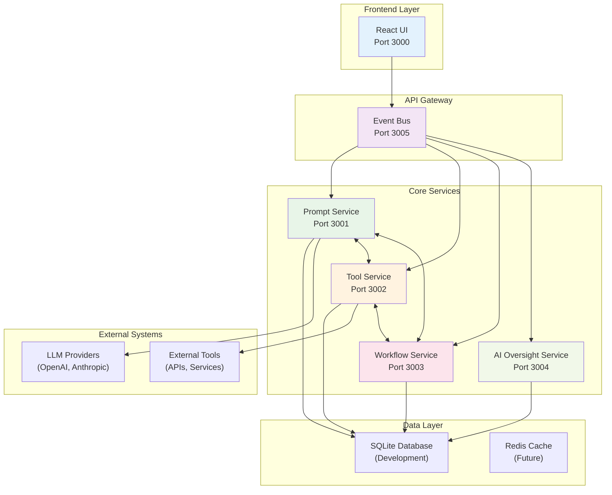
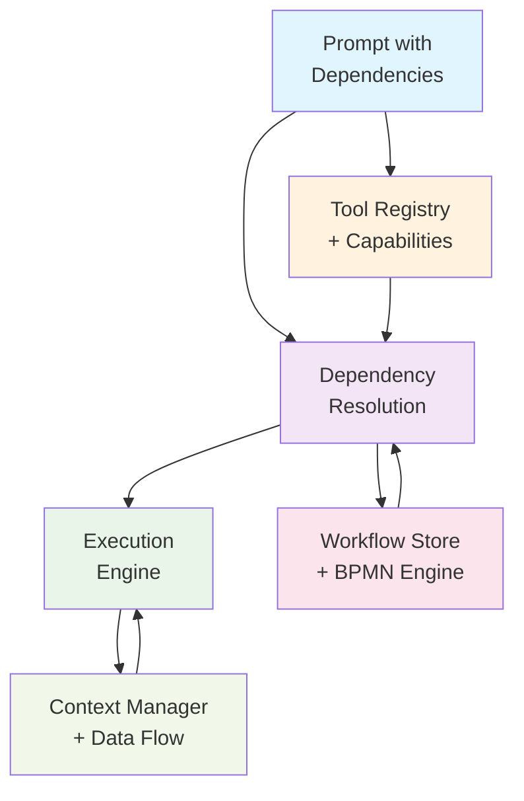
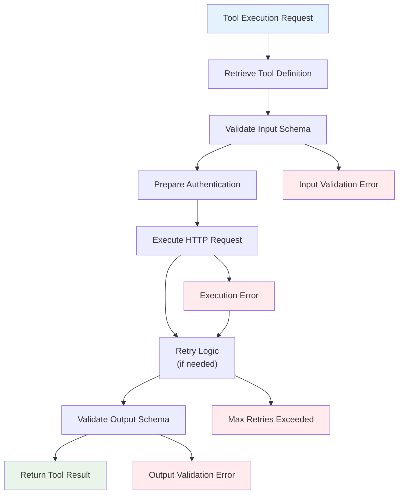
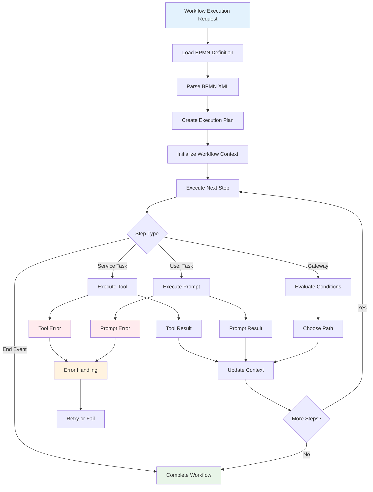
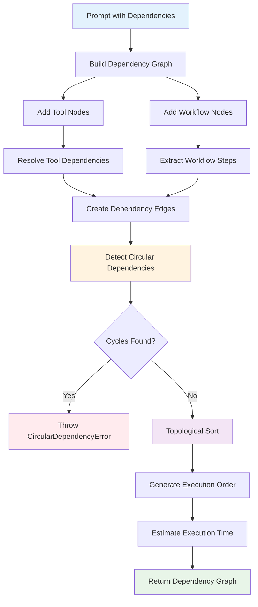
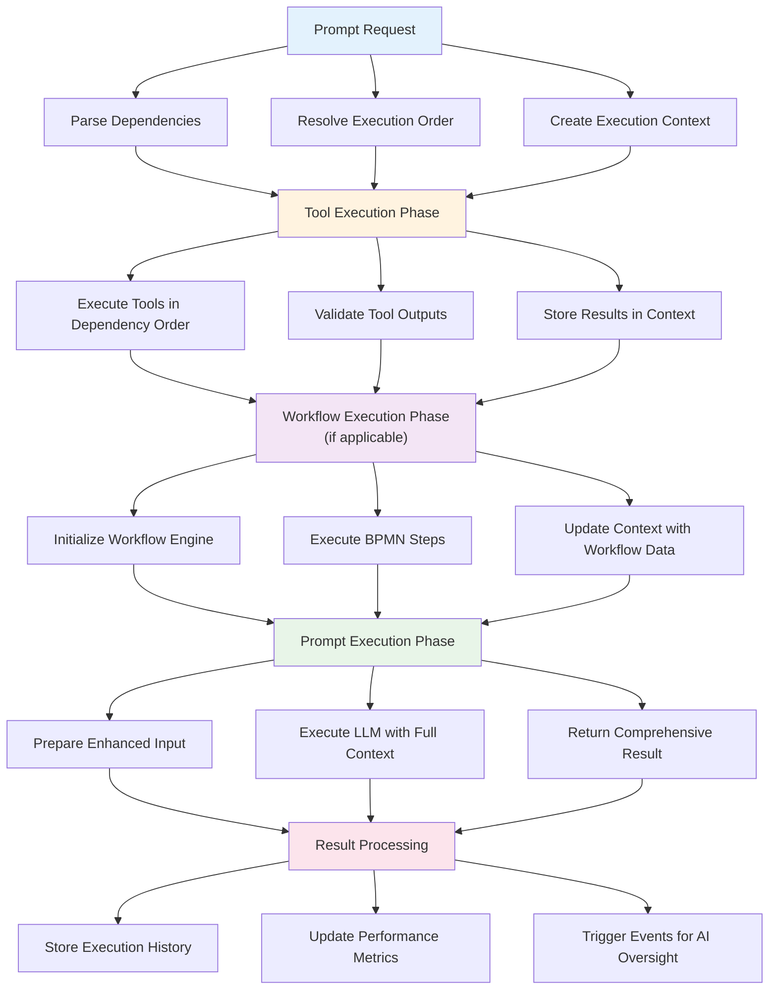

# Tool and Workflow Dependencies Implementation Plan
## DADM Project - July 9, 2025

## Overview
This document outlines the strategy for implementing tool and workflow dependencies in the DADM system, enabling sophisticated prompt orchestration and execution workflows that leverage external tools and complex process flows.

## Current State Analysis

### ✅ **What We Have**
- **Prompt Service**: Fully functional with version management and testing
- **Tool Service**: Basic tool registry with health checking capabilities
- **Workflow Service**: Basic BPMN workflow storage and retrieval
- **Data Model**: Prompts already have `tool_dependencies` and `workflow_dependencies` arrays
- **Type System**: Framework for tool-aware and workflow-aware prompt types

### 🚧 **What We Need to Build**
- **Tool Execution Engine**: Actual tool invocation capabilities
- **Workflow Execution Engine**: BPMN-driven process execution
- **Dependency Resolution**: Smart dependency management and validation
- **Context Passing**: Data flow between prompts, tools, and workflows
- **Error Handling**: Robust failure recovery and retry mechanisms

## Architecture Overview

### 🌐 **DADM System Architecture**



### 🏗️ **Dependency Management System**



## Implementation Strategy

### Phase 1: Tool Dependencies (Weeks 1-2)

#### **1.1 Enhanced Tool Service**

**Current Tool Registration**:
```json
{
  "id": "tool-001",
  "name": "Data Analyzer",
  "description": "Analyzes datasets and generates insights",
  "endpoint": "http://localhost:8080/analyze",
  "capabilities": ["analysis", "visualization"],
  "version": "1.0.0"
}
```

**Enhanced Tool Registration**:
```json
{
  "id": "tool-001",
  "name": "Data Analyzer", 
  "description": "Analyzes datasets and generates insights",
  "endpoint": "http://localhost:8080/analyze",
  "capabilities": ["analysis", "visualization"],
  "version": "1.0.0",
  "input_schema": {
    "type": "object",
    "properties": {
      "data": {"type": "string", "description": "CSV or JSON data"},
      "analysis_type": {"type": "string", "enum": ["trends", "correlations", "outliers"]}
    },
    "required": ["data"]
  },
  "output_schema": {
    "type": "object", 
    "properties": {
      "insights": {"type": "array"},
      "charts": {"type": "array"},
      "summary": {"type": "string"}
    }
  },
  "execution_config": {
    "timeout_ms": 30000,
    "retry_count": 3,
    "authentication": "api_key"
  }
}
```

#### **1.2 Tool Execution Engine**

**Tool Execution Flow**:



**Implementation Plan**:
```typescript
// services/tool-service/src/execution-engine.ts
export class ToolExecutionEngine {
  async executeTool(toolId: string, input: any, context: ExecutionContext): Promise<ToolResult> {
    const tool = await this.toolRegistry.getTool(toolId);
    
    // 1. Validate input against schema
    const validatedInput = this.validateInput(input, tool.input_schema);
    
    // 2. Prepare authentication and headers
    const requestConfig = this.prepareRequest(tool, context);
    
    // 3. Execute tool with retry logic
    const result = await this.executeWithRetry(tool, validatedInput, requestConfig);
    
    // 4. Validate output
    const validatedOutput = this.validateOutput(result, tool.output_schema);
    
    // 5. Return structured result
    return {
      tool_id: toolId,
      input: validatedInput,
      output: validatedOutput,
      execution_time_ms: Date.now() - startTime,
      status: 'success'
    };
  }
}
```

#### **1.3 Tool-Aware Prompt Testing**

**Enhanced Test Execution**:
```typescript
// Enhanced prompt testing with tool execution
async testToolAwarePrompt(prompt: Prompt, testCase: TestCase): Promise<TestResult> {
  const context = new ExecutionContext(prompt.id, testCase.id);
  
  // 1. Execute any required tools first
  const toolResults = await this.executeToolDependencies(
    prompt.tool_dependencies, 
    testCase.input,
    context
  );
  
  // 2. Prepare enhanced prompt with tool results
  const enhancedInput = {
    ...testCase.input,
    tool_results: toolResults
  };
  
  // 3. Execute LLM with tool context
  const llmResponse = await this.llmService.callLLM(
    prompt.text,
    enhancedInput,
    llmConfig
  );
  
  // 4. Return comprehensive result
  return {
    ...standardResult,
    tool_executions: toolResults,
    context: context.getSnapshot()
  };
}
```

### Phase 2: Workflow Dependencies (Weeks 3-4)

#### **2.1 BPMN Execution Engine**

**Workflow Definition Example**:
```xml
<bpmn:definitions>
  <bpmn:process id="data-analysis-workflow">
    <bpmn:startEvent id="start"/>
    <bpmn:serviceTask id="collect-data" name="Data Collection">
      <bpmn:extensionElements>
        <dadm:toolBinding tool="data-collector" input="{source_url}"/>
      </bpmn:extensionElements>
    </bpmn:serviceTask>
    <bpmn:serviceTask id="analyze-data" name="Data Analysis">
      <bpmn:extensionElements>
        <dadm:promptBinding prompt="analysis-prompt" input="{collected_data}"/>
      </bpmn:extensionElements>
    </bpmn:serviceTask>
    <bpmn:serviceTask id="generate-report" name="Report Generation">
      <bpmn:extensionElements>
        <dadm:toolBinding tool="report-generator" input="{analysis_results}"/>
      </bpmn:extensionElements>
    </bpmn:serviceTask>
    <bpmn:endEvent id="end"/>
  </bpmn:process>
</bpmn:definitions>
```

#### **2.2 Workflow Execution Engine**

**BPMN Workflow Processing**:



```typescript
// services/workflow-service/src/execution-engine.ts
export class WorkflowExecutionEngine {
  async executeWorkflow(workflowId: string, input: any): Promise<WorkflowResult> {
    const workflow = await this.getWorkflow(workflowId);
    const execution = new WorkflowExecution(workflowId, input);
    
    // Parse BPMN and create execution plan
    const executionPlan = this.bpmnParser.createExecutionPlan(workflow.bpmn_xml);
    
    // Execute each step in the workflow
    for (const step of executionPlan.steps) {
      const stepResult = await this.executeStep(step, execution.context);
      execution.addStepResult(step.id, stepResult);
      
      // Handle errors and branching logic
      if (stepResult.status === 'error') {
        return this.handleWorkflowError(execution, stepResult);
      }
    }
    
    return execution.getResult();
  }
  
  private async executeStep(step: WorkflowStep, context: ExecutionContext): Promise<StepResult> {
    switch (step.type) {
      case 'prompt':
        return await this.executePromptStep(step, context);
      case 'tool':
        return await this.executeToolStep(step, context);
      case 'decision':
        return await this.executeDecisionStep(step, context);
      default:
        throw new Error(`Unknown step type: ${step.type}`);
    }
  }
}
```

#### **2.3 Workflow-Aware Prompt Integration**

```typescript
// Enhanced prompt execution within workflows
async executePromptInWorkflow(
  promptId: string, 
  workflowContext: WorkflowContext
): Promise<PromptExecutionResult> {
  
  const prompt = await this.getPrompt(promptId);
  
  // 1. Resolve tool dependencies within workflow context
  const toolResults = await this.resolveToolDependencies(
    prompt.tool_dependencies,
    workflowContext
  );
  
  // 2. Prepare input with workflow data and tool results
  const enrichedInput = {
    ...workflowContext.getCurrentData(),
    tool_results: toolResults,
    workflow_id: workflowContext.workflowId,
    step_id: workflowContext.currentStep
  };
  
  // 3. Execute prompt with full context
  const result = await this.executePrompt(prompt, enrichedInput);
  
  // 4. Update workflow context with results
  workflowContext.addStepResult(result);
  
  return result;
}
```

### Phase 3: Advanced Dependency Management (Weeks 5-6)

#### **3.1 Dependency Resolution Algorithm**

**Dependency Resolution Process**:



```typescript
export class DependencyResolver {
  async resolveDependencies(prompt: Prompt): Promise<DependencyGraph> {
    const graph = new DependencyGraph();
    
    // 1. Add tool dependencies
    for (const toolId of prompt.tool_dependencies) {
      const tool = await this.toolService.getTool(toolId);
      graph.addNode(toolId, 'tool', tool);
      
      // Check for tool-to-tool dependencies
      const toolDeps = await this.getToolDependencies(tool);
      for (const dep of toolDeps) {
        graph.addEdge(toolId, dep.id);
      }
    }
    
    // 2. Add workflow dependencies
    for (const workflowId of prompt.workflow_dependencies) {
      const workflow = await this.workflowService.getWorkflow(workflowId);
      graph.addNode(workflowId, 'workflow', workflow);
      
      // Extract workflow steps and their dependencies
      const workflowDeps = this.extractWorkflowDependencies(workflow);
      for (const dep of workflowDeps) {
        graph.addEdge(workflowId, dep.id);
      }
    }
    
    // 3. Validate for circular dependencies
    const cycles = graph.detectCycles();
    if (cycles.length > 0) {
      throw new CircularDependencyError(cycles);
    }
    
    // 4. Create execution order
    const executionOrder = graph.topologicalSort();
    
    return {
      graph,
      executionOrder,
      estimatedExecutionTime: this.estimateExecutionTime(executionOrder)
    };
  }
}
```

#### **3.2 Context Management System**

```typescript
export class ExecutionContext {
  private data: Map<string, any> = new Map();
  private history: ExecutionStep[] = [];
  private startTime: number = Date.now();
  
  constructor(
    public readonly promptId: string,
    public readonly executionId: string,
    public readonly userId: string
  ) {}
  
  // Store results from tool executions
  setToolResult(toolId: string, result: ToolResult): void {
    this.data.set(`tool:${toolId}`, result);
    this.addHistoryStep('tool', toolId, result);
  }
  
  // Store results from workflow steps
  setWorkflowStepResult(stepId: string, result: any): void {
    this.data.set(`workflow:${stepId}`, result);
    this.addHistoryStep('workflow', stepId, result);
  }
  
  // Get available data for template substitution
  getTemplateData(): Record<string, any> {
    const templateData: Record<string, any> = {};
    
    for (const [key, value] of this.data.entries()) {
      // Convert internal keys to template-friendly names
      const templateKey = key.replace('tool:', '').replace('workflow:', '');
      templateData[templateKey] = value;
    }
    
    return templateData;
  }
  
  // Create snapshot for audit and debugging
  getSnapshot(): ExecutionSnapshot {
    return {
      promptId: this.promptId,
      executionId: this.executionId,
      data: Object.fromEntries(this.data),
      history: [...this.history],
      executionTime: Date.now() - this.startTime
    };
  }
}
```

## Data Flow Architecture

### 🔄 **Execution Flow**



### 📊 **Context Data Structure**

```json
{
  "execution_id": "exec-789",
  "prompt_id": "prompt-123",
  "context": {
    "tools": {
      "data-analyzer": {
        "input": {"data": "..."},
        "output": {"insights": [...], "summary": "..."},
        "execution_time_ms": 1500,
        "status": "success"
      }
    },
    "workflows": {
      "data-processing-wf": {
        "steps": {
          "collect": {"status": "completed", "output": "..."},
          "transform": {"status": "completed", "output": "..."}
        },
        "status": "completed"
      }
    },
    "user_input": {"query": "Analyze sales trends"},
    "metadata": {
      "started_at": "2025-07-09T...",
      "total_execution_time_ms": 3200
    }
  }
}
```

## Implementation Priorities

### 🎯 **Phase 1 Deliverables (Weeks 1-2)**
- [ ] Enhanced tool registry with input/output schemas
- [ ] Tool execution engine with retry logic
- [ ] Tool-aware prompt testing integration
- [ ] Basic dependency validation

### 🚀 **Phase 2 Deliverables (Weeks 3-4)**
- [ ] BPMN workflow execution engine
- [ ] Workflow step execution (prompt, tool, decision steps)
- [ ] Workflow-aware prompt integration
- [ ] Basic workflow testing capabilities

### 🌟 **Phase 3 Deliverables (Weeks 5-6)**
- [ ] Advanced dependency resolution algorithm
- [ ] Comprehensive context management system
- [ ] Circular dependency detection
- [ ] Performance optimization and caching

## Technical Considerations

### 🔧 **Performance**
- **Caching Strategy**: Cache tool results and workflow outputs for reusability
- **Parallel Execution**: Execute independent tools concurrently
- **Streaming**: Support streaming responses for long-running operations
- **Resource Management**: Implement execution quotas and timeout handling

### 🛡️ **Security**
- **Authentication**: Secure tool endpoints with proper authentication
- **Authorization**: Role-based access to tools and workflows
- **Data Privacy**: Ensure sensitive data doesn't leak between contexts
- **Audit Logging**: Complete audit trail of all executions

### 📈 **Monitoring**
- **Execution Metrics**: Track performance of tools and workflows
- **Error Tracking**: Comprehensive error reporting and alerting
- **Resource Usage**: Monitor compute and memory consumption
- **Success Rates**: Track reliability of dependencies

## Success Metrics

### 📊 **Key Performance Indicators**
- **Tool Integration**: Number of successfully integrated tools
- **Workflow Complexity**: Average number of steps in workflows
- **Execution Reliability**: Success rate of dependency execution
- **Performance**: Average execution time for complex prompts
- **User Adoption**: Usage of tool-aware and workflow-aware prompts

### 🎯 **Quality Gates**
- All tool executions must complete within configured timeouts
- Dependency resolution must handle circular dependencies gracefully
- Context data must be properly isolated between executions
- Error recovery must maintain system stability
- All executions must be fully auditable

---

## Conclusion

This implementation plan provides a structured approach to building sophisticated tool and workflow dependencies in the DADM system. By implementing these capabilities in phases, we can incrementally add complexity while maintaining system stability and user experience.

The end result will be a powerful prompt orchestration system that can:
- Execute complex multi-step workflows
- Integrate with external tools and services
- Maintain proper data flow and context
- Provide comprehensive monitoring and debugging
- Scale to support enterprise-level use cases

This foundation will enable advanced AI-driven automation scenarios and position DADM as a comprehensive platform for AI workflow orchestration. 