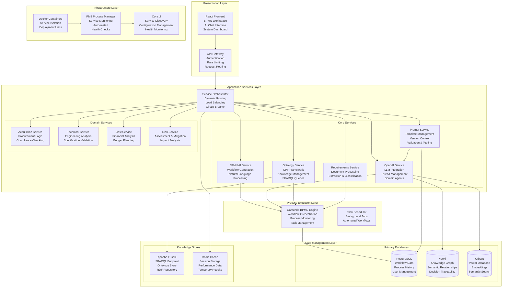
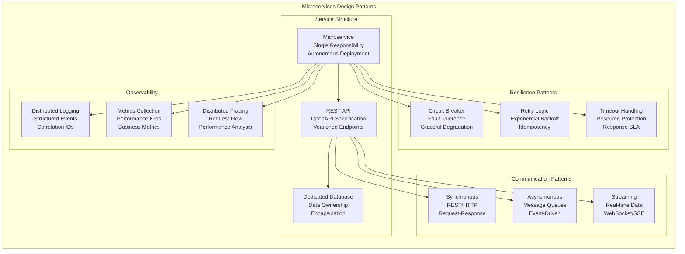
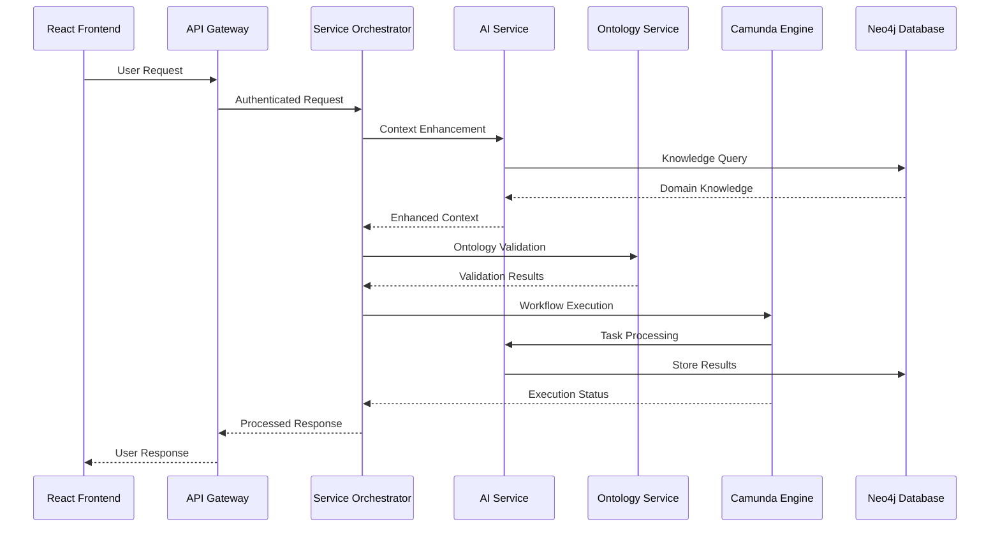
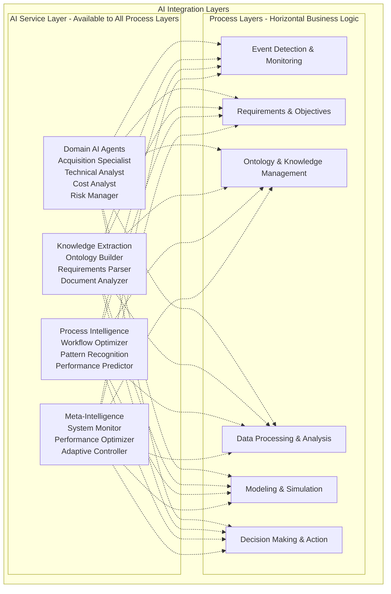
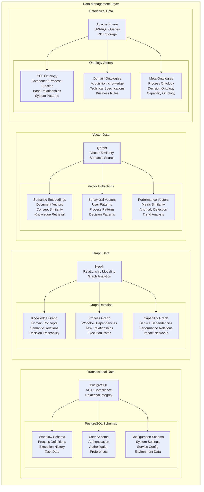
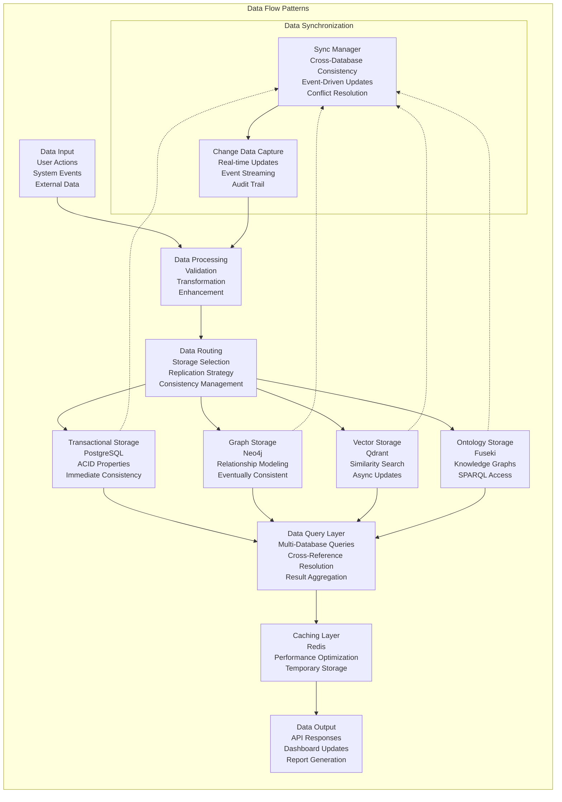

# DADM Architecture Overview
**Comprehensive Technical Architecture: Microservices, AI Integration, and Data Management**

## System Architecture Vision

The DADM platform implements a modern, cloud-native architecture that seamlessly integrates AI capabilities, process execution, and knowledge management. The architecture prioritizes flexibility, scalability, and maintainability while enabling rapid development and deployment of domain-specific capabilities.

## High-Level System Architecture



## Microservices Architecture Patterns

### **Service Design Principles**



### **Service Communication Architecture**



## AI Integration Architecture

### **Vertical AI Services Model**



### **AI Agent Architecture**

```python
class DADMAIAgent:
    def __init__(self, agent_config, domain_knowledge, ontology_service):
        self.config = agent_config
        self.domain_knowledge = domain_knowledge
        self.ontology = ontology_service
        self.llm_service = LLMService(agent_config.model_config)
        self.context_manager = ContextManager()
        self.performance_tracker = AgentPerformanceTracker()
        
    def process_request(self, request, context=None):
        """Process request with domain-specific intelligence"""
        # 1. Enhance context with domain knowledge
        enhanced_context = self.enhance_context(request, context)
        
        # 2. Query ontology for relevant knowledge
        ontology_context = self.ontology.query_relevant_concepts(request)
        
        # 3. Process with LLM using enhanced context
        response = self.llm_service.process(
            request=request,
            context=enhanced_context,
            ontology_context=ontology_context,
            agent_persona=self.config.persona
        )
        
        # 4. Validate response against domain knowledge
        validated_response = self.validate_response(response, request)
        
        # 5. Track performance for continuous improvement
        self.performance_tracker.record_interaction(request, validated_response)
        
        return validated_response
    
    def enhance_context(self, request, base_context):
        """Enhance context with agent-specific domain knowledge"""
        context_enhancement = {
            'domain_expertise': self.domain_knowledge.get_relevant_expertise(request),
            'historical_patterns': self.get_historical_patterns(request),
            'current_constraints': self.get_current_constraints(),
            'performance_context': self.performance_tracker.get_context()
        }
        
        return self.context_manager.merge_contexts(base_context, context_enhancement)
```

## Data Management Architecture

### **Multi-Database Strategy**



### **Data Flow Architecture**



## Infrastructure Architecture

### **Container Orchestration**

```mermaid
graph TB
    subgraph "Infrastructure Layer"
        subgraph "Container Management"
            DOCKER[Docker<br/>Container Runtime<br/>Image Management<br/>Network Isolation]
            COMPOSE[Docker Compose<br/>Multi-Container Apps<br/>Development Environment<br/>Service Definition]
            K8S[Kubernetes (Optional)<br/>Production Orchestration<br/>Auto-scaling<br/>Service Mesh]
        end
        
        subgraph "Process Management"
            PM2[PM2<br/>Process Manager<br/>Auto-restart<br/>Load Balancing<br/>Monitoring]
            HEALTH[Health Checks<br/>Service Status<br/>Dependency Monitoring<br/>Alerting]
            SCALE[Auto-scaling<br/>Resource Monitoring<br/>Demand-based Scaling<br/>Performance Optimization]
        end
        
        subgraph "Service Discovery"
            CONSUL[Consul<br/>Service Registry<br/>Configuration Management<br/>Health Monitoring]
            DNS[DNS Resolution<br/>Service Names<br/>Load Distribution<br/>Failover]
            LB[Load Balancer<br/>Traffic Distribution<br/>Health-based Routing<br/>Session Affinity]
        end
        
        subgraph "Monitoring & Observability"
            LOGS[Centralized Logging<br/>Log Aggregation<br/>Search & Analysis<br/>Alerting]
            METRICS[Metrics Collection<br/>Performance Monitoring<br/>Business KPIs<br/>Dashboards]
            TRACE[Distributed Tracing<br/>Request Flow<br/>Performance Bottlenecks<br/>Error Analysis]
        end
        
        DOCKER --> PM2
        COMPOSE --> PM2
        K8S --> PM2
        
        PM2 --> HEALTH
        PM2 --> SCALE
        
        CONSUL --> DNS
        CONSUL --> LB
        
        HEALTH --> LOGS
        SCALE --> METRICS
        LB --> TRACE
    end
```

### **Deployment Architecture**

```python
class DADMDeploymentManager:
    def __init__(self, environment='development'):
        self.environment = environment
        self.docker_manager = DockerManager()
        self.pm2_manager = PM2Manager()
        self.consul_client = ConsulClient()
        self.health_monitor = HealthMonitor()
        
    def deploy_service(self, service_config):
        """Deploy a service with full orchestration"""
        # 1. Build and validate container
        container = self.docker_manager.build_container(service_config)
        
        # 2. Register service with discovery
        service_registration = self.consul_client.register_service(
            name=service_config.name,
            port=service_config.port,
            health_check=service_config.health_check_url,
            tags=service_config.tags
        )
        
        # 3. Deploy with PM2 management
        pm2_config = self.create_pm2_config(service_config, container)
        process_id = self.pm2_manager.start_process(pm2_config)
        
        # 4. Setup health monitoring
        self.health_monitor.monitor_service(
            service_id=process_id,
            health_checks=service_config.health_checks,
            restart_policy=service_config.restart_policy
        )
        
        # 5. Configure load balancing
        self.configure_load_balancing(service_config, service_registration)
        
        return DeploymentResult(
            service_id=process_id,
            registration_id=service_registration.id,
            status='deployed',
            health_status='healthy'
        )
    
    def scale_service(self, service_name, instances):
        """Scale service instances based on demand"""
        current_instances = self.pm2_manager.get_service_instances(service_name)
        
        if instances > len(current_instances):
            # Scale up
            for i in range(instances - len(current_instances)):
                self.deploy_additional_instance(service_name)
        elif instances < len(current_instances):
            # Scale down
            instances_to_remove = len(current_instances) - instances
            self.remove_instances(service_name, instances_to_remove)
        
        return self.pm2_manager.get_service_instances(service_name)
```

This architecture provides the foundation for a scalable, maintainable, and intelligent process management platform that can evolve with changing requirements while maintaining high performance and reliability.
