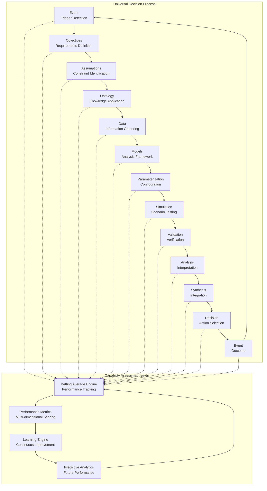
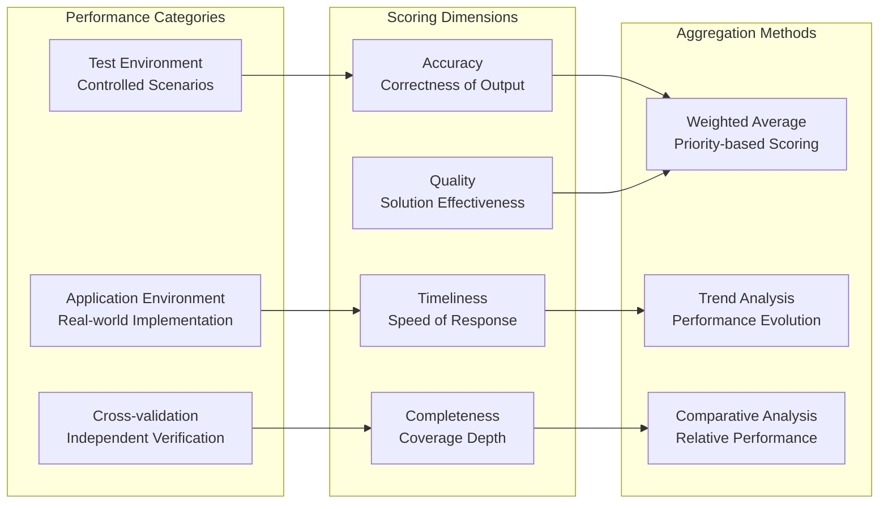
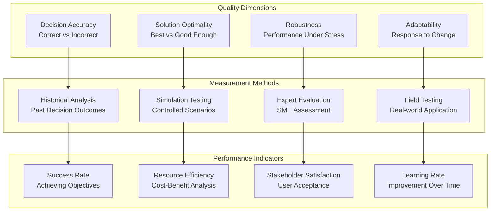
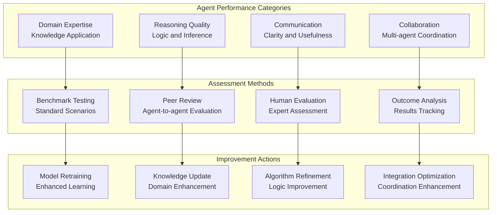
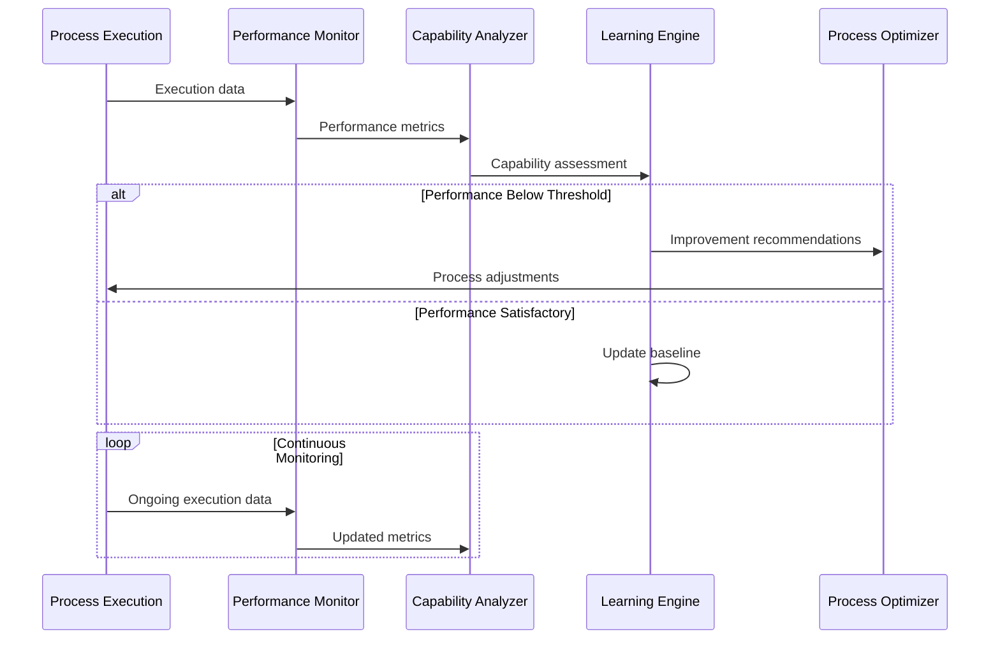
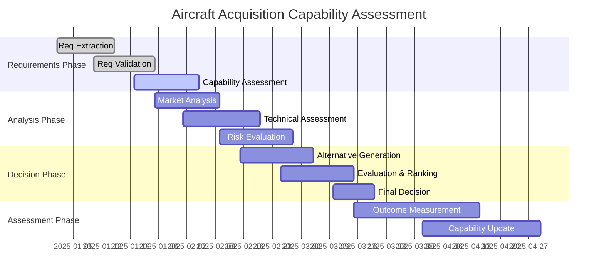
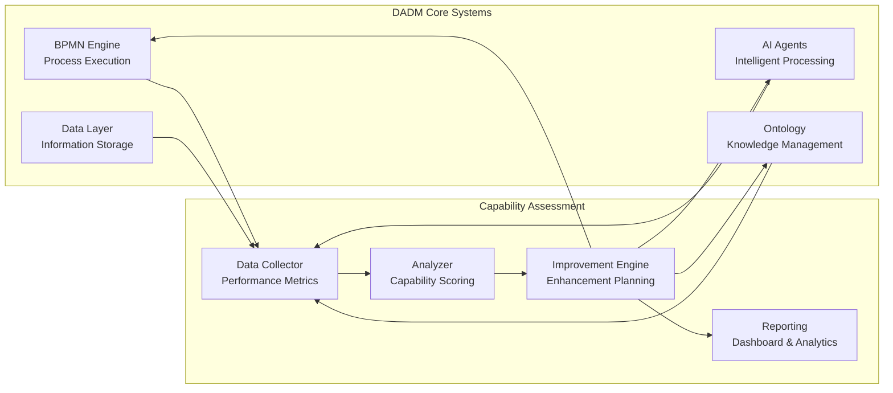

# Capability Assessment Framework
**Date**: July 7, 2025  
**Project**: Decision Analysis and Decision Management (DADM) Platform

## Executive Summary

The DADM Capability Assessment Framework provides a comprehensive methodology for measuring, tracking, and improving decision-making performance across all system components. Using a "batting average" approach, the framework continuously evaluates the effectiveness of processes, AI agents, and human decision-makers to drive systematic improvement.

## Universal Process Model with Assessment Integration

## Batting Average Methodology

### Core Concept

The "batting average" approach borrows from baseball statistics to create an intuitive, comparable metric for decision-making performance. Unlike complex multi-factor scoring systems, batting averages provide clear, actionable insights into capability effectiveness.

### Measurement Framework

### Capability Scoring Matrix

#### Individual Component Assessment
| Component | Test Score | Application Score | Cross-validation Score | Composite Batting Average |
|-----------|------------|-------------------|------------------------|---------------------------|
| Event Detection | 0.850 | 0.780 | 0.820 | 0.817 |
| Requirements Analysis | 0.920 | 0.850 | 0.880 | 0.883 |
| Ontology Application | 0.750 | 0.690 | 0.720 | 0.720 |
| Data Analysis | 0.880 | 0.840 | 0.860 | 0.860 |
| Model Execution | 0.950 | 0.890 | 0.920 | 0.920 |
| Decision Generation | 0.800 | 0.750 | 0.775 | 0.775 |

#### Performance Categories
- **Excellent (0.900+)**: Consistently high performance, minimal intervention needed
- **Good (0.800-0.899)**: Reliable performance with occasional refinement
- **Fair (0.700-0.799)**: Adequate performance requiring regular monitoring
- **Poor (0.600-0.699)**: Inconsistent performance needing significant improvement
- **Failing (<0.600)**: Unreliable performance requiring redesign or replacement

## Multi-Dimensional Performance Assessment

### Decision Quality Metrics

### Process Performance Tracking

#### Execution Metrics
1. **Cycle Time**: Time from trigger to decision
2. **Resource Utilization**: Computational and human resources consumed
3. **Error Rate**: Frequency of process failures or incorrect outputs
4. **Throughput**: Volume of decisions processed per time period

#### Quality Metrics
1. **Consistency**: Variance in decision quality across similar scenarios
2. **Predictability**: Ability to forecast process outcomes
3. **Stakeholder Satisfaction**: User acceptance and confidence levels
4. **Continuous Improvement**: Rate of performance enhancement over time

### AI Agent Assessment Framework

## Continuous Improvement Engine

### Learning Loop Architecture

### Adaptive Capability Enhancement

#### Pattern Recognition and Optimization
1. **Performance Pattern Analysis**: Identify recurring performance issues
2. **Root Cause Analysis**: Determine underlying causes of capability gaps
3. **Solution Synthesis**: Generate targeted improvement strategies
4. **Implementation Planning**: Develop systematic enhancement roadmaps
5. **Impact Assessment**: Measure effectiveness of improvements

#### Knowledge Transfer Mechanisms
- **Cross-Domain Learning**: Apply successful patterns from one domain to another
- **Best Practice Propagation**: Disseminate high-performing approaches
- **Failure Analysis**: Learn from poor performance to prevent recurrence
- **Collaborative Improvement**: Share insights across agent networks

## Real-World Application Scenarios

### Aircraft Acquisition Case Study

#### Capability Assessment Timeline

#### Performance Metrics Dashboard
| Process Stage | Accuracy | Timeliness | Completeness | Overall Score |
|--------------|----------|------------|--------------|---------------|
| Requirements Extraction | 0.890 | 0.750 | 0.850 | 0.830 |
| Market Analysis | 0.920 | 0.880 | 0.900 | 0.900 |
| Technical Assessment | 0.780 | 0.650 | 0.720 | 0.717 |
| Risk Evaluation | 0.850 | 0.800 | 0.830 | 0.827 |
| Decision Generation | 0.800 | 0.750 | 0.775 | 0.775 |

### Cross-Domain Capability Transfer

#### Knowledge Portability Assessment
1. **Domain Similarity Analysis**: Measure conceptual overlap between domains
2. **Capability Mapping**: Identify transferable skills and knowledge
3. **Adaptation Requirements**: Determine necessary modifications for new domains
4. **Transfer Effectiveness**: Measure success of capability portability
5. **Learning Acceleration**: Assess speed of capability development in new domains

## Implementation Roadmap

### Phase 1: Foundation (Current - Q3 2025)
- ✅ Basic performance monitoring for core processes
- ✅ Simple batting average calculations for key decisions
- 🔄 Manual outcome tracking and assessment
- ⏳ Initial capability baseline establishment

### Phase 2: Automation (Q4 2025 - Q1 2026)
- ⏳ Automated performance data collection
- ⏳ Real-time capability scoring
- ⏳ Predictive performance modeling
- ⏳ Automated improvement recommendations

### Phase 3: Intelligence (Q2 2026 - Q3 2026)
- ⏳ AI-driven capability assessment
- ⏳ Cross-domain performance correlation
- ⏳ Autonomous capability optimization
- ⏳ Predictive capability degradation detection

### Phase 4: Mastery (Q4 2026+)
- ⏳ Self-evolving capability frameworks
- ⏳ Autonomous performance enhancement
- ⏳ Cross-organizational capability benchmarking
- ⏳ Capability-driven resource allocation

## Integration with DADM Architecture

### Data Flow Integration

### Performance Dashboard Integration
- **Real-time Monitoring**: Live capability scoring and trend analysis
- **Predictive Analytics**: Forecasting performance degradation or improvement
- **Comparative Analysis**: Benchmarking against historical performance and industry standards
- **Actionable Insights**: Specific recommendations for capability enhancement

---

*The Capability Assessment Framework transforms abstract performance concepts into measurable, actionable intelligence that drives continuous improvement across all aspects of the DADM platform.*
