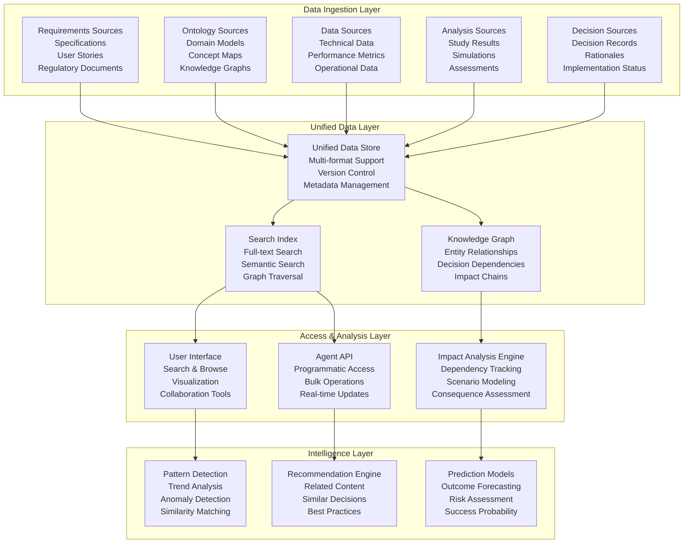
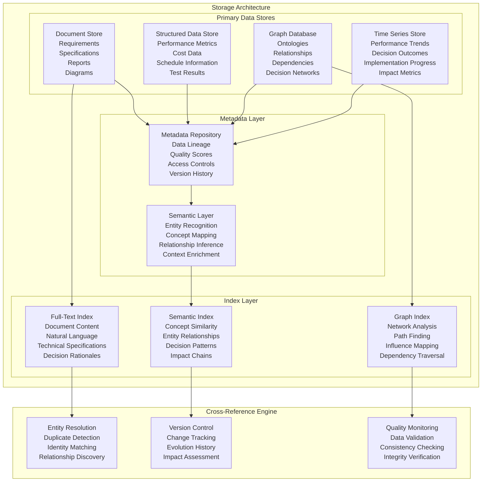
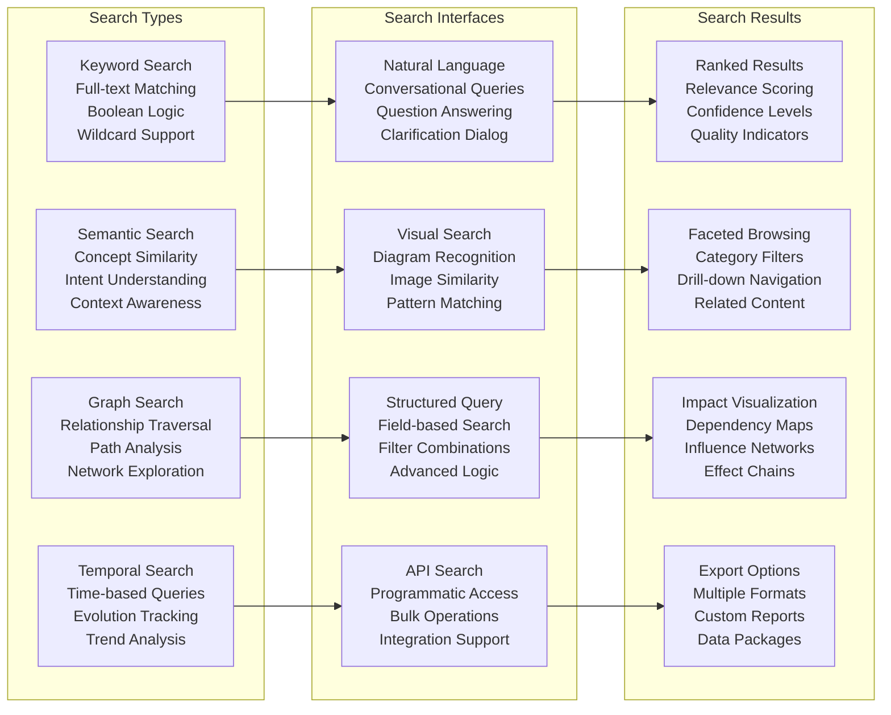
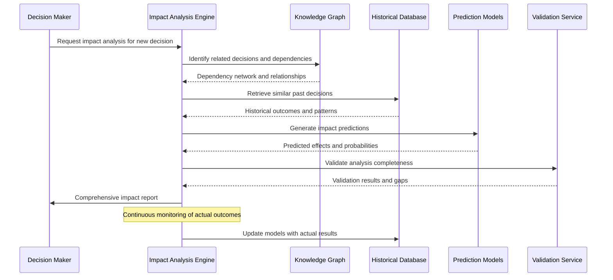
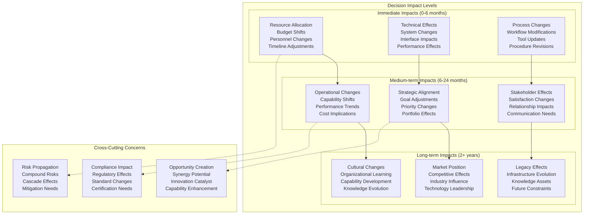
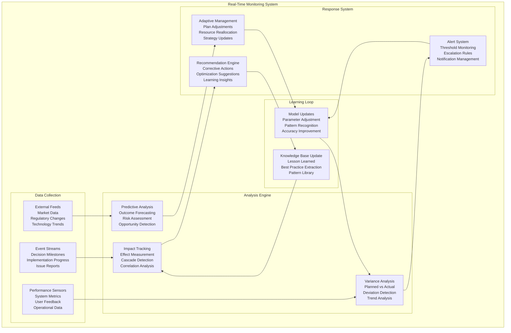
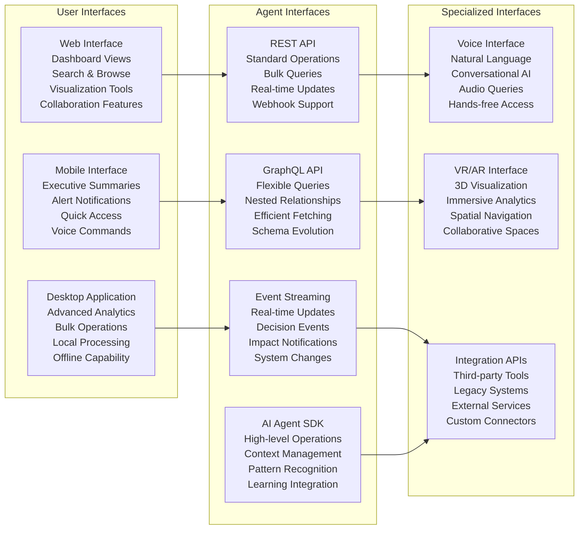

# Comprehensive Data Access Framework
**Date**: July 7, 2025  
**Project**: Decision Analysis & Decision Management (DADM) Platform

## Executive Summary

The DADM Comprehensive Data Access Framework provides a unified, searchable repository for all organizational knowledge assets including requirements, ontologies, data models, analysis results, and decision artifacts. This framework enables agents and users to perform comprehensive impact analysis on existing and in-process decisions, ensuring that new decisions are informed by historical context and potential unintended consequences are identified before implementation.

## Framework Overview

The Comprehensive Data Access Framework serves as the central nervous system for organizational decision intelligence, connecting all data sources, analysis results, and decision artifacts into a unified, searchable, and analytically rich environment that supports complex decision interdependency analysis.

### Architecture Overview



**Framework Architecture Components:**

1. **Data Ingestion Layer**: Automated ingestion from diverse sources including requirements repositories, ontology stores, data lakes, analysis systems, and decision management platforms.

2. **Unified Data Layer**: A consolidated storage system that maintains data integrity, version control, and rich metadata while supporting multiple data formats and relationship types.

3. **Access & Analysis Layer**: Multiple interfaces for human users and AI agents to access, search, and analyze the unified data repository with comprehensive impact analysis capabilities.

4. **Intelligence Layer**: Advanced AI capabilities that detect patterns, provide recommendations, and predict outcomes based on the comprehensive data context.

This architecture ensures that all organizational knowledge is accessible, searchable, and analytically connected to support sophisticated decision impact analysis.

## Unified Data Storage Architecture

### Multi-Modal Data Repository

The framework implements a sophisticated storage architecture that accommodates diverse data types while maintaining semantic relationships and enabling comprehensive search capabilities:



**Storage Architecture Benefits:**

- **Multi-Modal Support**: Accommodates documents, structured data, graphs, and time series within a unified framework
- **Rich Metadata**: Comprehensive metadata enables sophisticated search, quality assessment, and impact analysis
- **Semantic Understanding**: AI-powered semantic layer enriches raw data with contextual understanding
- **Cross-Reference Capability**: Automatic detection and resolution of relationships across different data types
- **Version Control**: Complete change tracking enables temporal analysis and impact assessment over time

### Data Model for Decision Interdependencies

```json
{
  "decisionRecord": {
    "id": "DECISION_2025_07_001",
    "title": "F-35 Engine Upgrade Program",
    "decisionDate": "2025-07-01",
    "status": "in_process",
    "decisionMaker": "Program Executive Officer",
    "impactLevel": "strategic",
    
    "context": {
      "problem": "Current F-35 engine performance below requirements",
      "constraints": ["budget_limit", "schedule_pressure", "technical_risk"],
      "stakeholders": ["air_force", "navy", "marines", "contractor"],
      "requirements": ["REQ_2025_001", "REQ_2025_017", "REQ_2025_023"]
    },
    
    "alternatives": [
      {
        "id": "ALT_001",
        "description": "Upgrade existing engines",
        "cost": 2.5e9,
        "risk": "medium",
        "timeline": "36_months"
      },
      {
        "id": "ALT_002", 
        "description": "Replace with new engine design",
        "cost": 8.2e9,
        "risk": "high",
        "timeline": "72_months"
      }
    ],
    
    "selectedAlternative": "ALT_001",
    "rationale": "Balances performance improvement with acceptable risk and cost",
    
    "dependencies": {
      "upstream": [
        {
          "decisionId": "DECISION_2024_12_003",
          "relationship": "enables",
          "description": "Budget allocation decision enables funding"
        }
      ],
      "downstream": [
        {
          "decisionId": "DECISION_2025_09_TBD",
          "relationship": "constrains",
          "description": "Engine choice constrains aircraft modifications"
        }
      ],
      "parallel": [
        {
          "decisionId": "DECISION_2025_06_008",
          "relationship": "conflicts",
          "description": "Avionics upgrade competes for same resources"
        }
      ]
    },
    
    "implementationPlan": {
      "phases": [
        {
          "phase": "design",
          "startDate": "2025-08-01",
          "endDate": "2025-12-31",
          "deliverables": ["detailed_design", "prototype_testing"]
        }
      ],
      "resources": {
        "budget": 2.5e9,
        "personnel": 450,
        "facilities": ["test_facility_A", "manufacturing_site_B"]
      }
    },
    
    "monitoringMetrics": [
      {
        "metric": "cost_variance",
        "target": 0.05,
        "current": 0.02,
        "trend": "stable"
      },
      {
        "metric": "schedule_variance", 
        "target": 0.1,
        "current": -0.03,
        "trend": "improving"
      }
    ],
    
    "impactAssessment": {
      "directImpacts": [
        {
          "area": "performance",
          "metric": "thrust_increase",
          "expectedValue": 0.15,
          "confidence": 0.8
        }
      ],
      "indirectImpacts": [
        {
          "area": "maintenance",
          "metric": "cost_reduction",
          "expectedValue": 0.12,
          "confidence": 0.6,
          "timeHorizon": "5_years"
        }
      ],
      "risks": [
        {
          "risk": "technical_failure",
          "probability": 0.15,
          "impact": "program_delay",
          "mitigation": "parallel_development_path"
        }
      ]
    }
  }
}
```

## Advanced Search and Discovery

### Multi-Dimensional Search Capabilities

The framework provides sophisticated search capabilities that go beyond simple keyword matching to enable semantic discovery and relationship exploration:



**Advanced Search Features:**

1. **Multi-Modal Query Processing**: Users can combine text, visual, and structured queries to find relevant information across different data types.

2. **Semantic Understanding**: AI-powered interpretation of search intent, including synonyms, related concepts, and contextual meaning.

3. **Relationship-Aware Results**: Search results include not just direct matches but also related items through various relationship types.

4. **Confidence and Quality Scoring**: All results include confidence levels and quality indicators to help users assess information reliability.

### Intelligent Query Expansion

```python
class IntelligentQueryProcessor:
    def __init__(self, ontology_service, knowledge_graph, historical_queries):
        self.ontology = ontology_service
        self.knowledge_graph = knowledge_graph
        self.query_history = historical_queries
        self.semantic_analyzer = SemanticAnalyzer()
        self.context_enhancer = ContextEnhancer()
        
    def process_query(self, query, user_context, search_intent):
        """Process and expand user queries for comprehensive search"""
        
        # 1. Understand query intent and extract entities
        query_analysis = self.semantic_analyzer.analyze(query)
        entities = query_analysis.entities
        intent = query_analysis.intent
        
        # 2. Expand query with related concepts
        expanded_concepts = self.expand_concepts(entities, user_context)
        
        # 3. Add temporal and contextual filters
        contextual_filters = self.context_enhancer.generate_filters(
            user_context, search_intent
        )
        
        # 4. Include decision impact chains
        impact_chains = self.find_impact_chains(entities, expanded_concepts)
        
        # 5. Generate comprehensive search strategy
        search_strategy = SearchStrategy(
            primary_query=query,
            expanded_concepts=expanded_concepts,
            contextual_filters=contextual_filters,
            impact_chains=impact_chains,
            search_depth=self.determine_search_depth(intent),
            result_prioritization=self.get_prioritization_rules(user_context)
        )
        
        return search_strategy
    
    def expand_concepts(self, entities, context):
        """Expand search concepts using ontological relationships"""
        expanded = set(entities)
        
        for entity in entities:
            # Add ontological relatives
            relatives = self.ontology.get_related_concepts(
                entity, 
                relations=['subclass_of', 'part_of', 'influences', 'depends_on']
            )
            expanded.update(relatives)
            
            # Add historically co-occurring concepts
            co_occurring = self.query_history.get_co_occurring_concepts(
                entity, context, confidence_threshold=0.7
            )
            expanded.update(co_occurring)
            
            # Add decision-relevant concepts
            decision_related = self.knowledge_graph.get_decision_related_concepts(
                entity, max_hops=2
            )
            expanded.update(decision_related)
            
        return list(expanded)
    
    def find_impact_chains(self, entities, expanded_concepts):
        """Identify potential impact chains for comprehensive analysis"""
        impact_chains = []
        
        all_concepts = entities + expanded_concepts
        
        for concept in all_concepts:
            # Find upstream influences (what affects this concept)
            upstream = self.knowledge_graph.traverse_upstream(
                concept, max_depth=3, relationship_types=['influences', 'enables', 'constrains']
            )
            
            # Find downstream effects (what this concept affects)
            downstream = self.knowledge_graph.traverse_downstream(
                concept, max_depth=3, relationship_types=['influences', 'enables', 'constrains']
            )
            
            if upstream or downstream:
                impact_chains.append(ImpactChain(
                    focus_concept=concept,
                    upstream_influences=upstream,
                    downstream_effects=downstream,
                    confidence=self.calculate_chain_confidence(upstream + downstream)
                ))
                
        return impact_chains
```

## Decision Impact Analysis Engine

### Comprehensive Impact Assessment

The Decision Impact Analysis Engine provides sophisticated capabilities for understanding how decisions affect each other across time, organizational boundaries, and implementation phases:



**Impact Analysis Process:**

1. **Dependency Discovery**: Automatically identifies all decisions that could be affected by or could affect the proposed decision.

2. **Historical Pattern Analysis**: Analyzes similar past decisions to understand typical impact patterns and outcomes.

3. **Predictive Modeling**: Uses machine learning models to predict likely effects and their probabilities.

4. **Validation and Gap Analysis**: Ensures comprehensive coverage and identifies areas requiring additional analysis.

5. **Continuous Learning**: Updates models based on actual outcomes to improve future predictions.

### Multi-Level Impact Assessment



**Multi-Level Assessment Framework:**

- **Temporal Scope**: Analyzes impacts across different time horizons to understand both immediate and long-term consequences.

- **Organizational Levels**: Assesses effects at operational, tactical, and strategic levels to ensure comprehensive coverage.

- **Stakeholder Perspectives**: Considers impacts from multiple stakeholder viewpoints including technical teams, management, and end users.

- **Cross-Cutting Analysis**: Identifies risks, opportunities, and compliance implications that span multiple areas.

### Impact Quantification and Modeling

```python
class ImpactQuantificationEngine:
    def __init__(self, historical_data, decision_models, uncertainty_engine):
        self.historical_data = historical_data
        self.decision_models = decision_models
        self.uncertainty_engine = uncertainty_engine
        self.impact_calculators = self.initialize_calculators()
        
    def quantify_decision_impact(self, proposed_decision, context):
        """Quantify the potential impact of a proposed decision"""
        
        # 1. Identify impact dimensions
        impact_dimensions = self.identify_impact_dimensions(proposed_decision)
        
        # 2. Calculate quantitative impacts
        quantitative_impacts = {}
        for dimension in impact_dimensions:
            calculator = self.impact_calculators[dimension.type]
            impact_value = calculator.calculate_impact(
                proposed_decision, dimension, context
            )
            quantitative_impacts[dimension.name] = impact_value
            
        # 3. Assess qualitative impacts
        qualitative_impacts = self.assess_qualitative_impacts(
            proposed_decision, context
        )
        
        # 4. Model uncertainty and confidence
        uncertainty_analysis = self.uncertainty_engine.analyze_uncertainty(
            quantitative_impacts, qualitative_impacts, context
        )
        
        # 5. Generate impact scenarios
        scenarios = self.generate_impact_scenarios(
            quantitative_impacts, qualitative_impacts, uncertainty_analysis
        )
        
        return ImpactAssessment(
            quantitative_impacts=quantitative_impacts,
            qualitative_impacts=qualitative_impacts,
            uncertainty_analysis=uncertainty_analysis,
            scenarios=scenarios,
            confidence_level=uncertainty_analysis.overall_confidence,
            recommendations=self.generate_recommendations(scenarios)
        )
    
    def calculate_compound_effects(self, decision_chain):
        """Calculate compound effects across multiple related decisions"""
        compound_effects = {}
        
        for i, decision in enumerate(decision_chain):
            # Calculate direct effects
            direct_effects = self.quantify_decision_impact(decision, {})
            
            # Calculate interaction effects with previous decisions
            interaction_effects = {}
            for j in range(i):
                previous_decision = decision_chain[j]
                interaction = self.calculate_decision_interaction(
                    previous_decision, decision
                )
                interaction_effects[f"interaction_{j}_{i}"] = interaction
                
            # Combine effects considering non-linear interactions
            combined_effects = self.combine_effects(
                direct_effects, interaction_effects
            )
            
            compound_effects[decision.id] = combined_effects
            
        return CompoundEffectAnalysis(
            individual_effects=compound_effects,
            total_compound_effect=self.calculate_total_effect(compound_effects),
            critical_interactions=self.identify_critical_interactions(compound_effects),
            mitigation_strategies=self.suggest_mitigation_strategies(compound_effects)
        )
    
    def generate_impact_scenarios(self, quantitative, qualitative, uncertainty):
        """Generate multiple scenarios based on impact analysis"""
        scenarios = []
        
        # Best case scenario
        best_case = self.create_scenario(
            "best_case",
            quantitative, qualitative,
            uncertainty.optimistic_bounds
        )
        scenarios.append(best_case)
        
        # Most likely scenario
        most_likely = self.create_scenario(
            "most_likely",
            quantitative, qualitative,
            uncertainty.expected_values
        )
        scenarios.append(most_likely)
        
        # Worst case scenario
        worst_case = self.create_scenario(
            "worst_case",
            quantitative, qualitative,
            uncertainty.pessimistic_bounds
        )
        scenarios.append(worst_case)
        
        # Alternative scenarios based on key uncertainties
        key_uncertainties = uncertainty.identify_key_uncertainties()
        for uncertainty_factor in key_uncertainties:
            alt_scenario = self.create_alternative_scenario(
                uncertainty_factor, quantitative, qualitative
            )
            scenarios.append(alt_scenario)
            
        return scenarios
```

## Real-Time Decision Monitoring

### Continuous Impact Tracking

The framework provides real-time monitoring of decision implementation and its actual impacts, enabling continuous learning and adaptive management:



**Real-Time Monitoring Capabilities:**

1. **Continuous Data Collection**: Automated collection from multiple sources including system sensors, event streams, and external feeds.

2. **Dynamic Analysis**: Real-time analysis of variance from plans, impact tracking, and predictive assessment of future outcomes.

3. **Intelligent Response**: Automated alert generation, recommendation provision, and adaptive management suggestions.

4. **Continuous Learning**: Model updates and knowledge base enhancement based on observed outcomes and patterns.

### Decision Outcome Validation

```python
class DecisionOutcomeValidator:
    def __init__(self, monitoring_service, prediction_models, impact_assessor):
        self.monitoring = monitoring_service
        self.predictions = prediction_models
        self.impact_assessor = impact_assessor
        self.validation_rules = ValidationRuleSet()
        
    def validate_decision_outcomes(self, decision_id, validation_period):
        """Validate actual outcomes against predicted impacts"""
        
        # 1. Retrieve original predictions
        original_predictions = self.get_original_predictions(decision_id)
        
        # 2. Collect actual outcomes
        actual_outcomes = self.monitoring.collect_outcomes(
            decision_id, validation_period
        )
        
        # 3. Calculate prediction accuracy
        accuracy_analysis = self.calculate_prediction_accuracy(
            original_predictions, actual_outcomes
        )
        
        # 4. Identify unexpected outcomes
        unexpected_outcomes = self.identify_unexpected_outcomes(
            original_predictions, actual_outcomes
        )
        
        # 5. Analyze root causes of deviations
        deviation_analysis = self.analyze_deviations(
            original_predictions, actual_outcomes, unexpected_outcomes
        )
        
        # 6. Update prediction models
        model_updates = self.generate_model_updates(
            accuracy_analysis, deviation_analysis
        )
        
        # 7. Extract lessons learned
        lessons_learned = self.extract_lessons_learned(
            decision_id, deviation_analysis, model_updates
        )
        
        return ValidationReport(
            decision_id=decision_id,
            validation_period=validation_period,
            accuracy_analysis=accuracy_analysis,
            unexpected_outcomes=unexpected_outcomes,
            deviation_analysis=deviation_analysis,
            model_updates=model_updates,
            lessons_learned=lessons_learned,
            recommendations=self.generate_recommendations(lessons_learned)
        )
    
    def track_compound_impacts(self, decision_network):
        """Track compound impacts across related decisions"""
        compound_tracking = {}
        
        for decision_id in decision_network.decisions:
            # Track individual decision outcomes
            individual_outcomes = self.validate_decision_outcomes(
                decision_id, decision_network.monitoring_period
            )
            
            # Analyze interaction effects
            interaction_effects = self.analyze_interaction_effects(
                decision_id, decision_network
            )
            
            # Assess network-level impacts
            network_impacts = self.assess_network_impacts(
                decision_id, decision_network, interaction_effects
            )
            
            compound_tracking[decision_id] = CompoundImpactTracking(
                individual_outcomes=individual_outcomes,
                interaction_effects=interaction_effects,
                network_impacts=network_impacts,
                system_level_effects=self.assess_system_effects(
                    decision_id, decision_network
                )
            )
            
        return compound_tracking
```

## Agent and User Interface Design

### Multi-Modal Access Interfaces

The framework provides sophisticated interfaces that accommodate both human users and AI agents, ensuring comprehensive access to organizational knowledge:



**Interface Design Principles:**

1. **User-Centric Design**: Interfaces tailored to different user roles, contexts, and capabilities.

2. **Agent-Friendly APIs**: Programmatic interfaces optimized for AI agent consumption and bulk operations.

3. **Real-Time Capability**: Live updates and streaming interfaces for time-sensitive decision support.

4. **Multi-Modal Support**: Voice, visual, and traditional interfaces to accommodate different interaction preferences.

### Intelligent Assistance Framework

```python
class IntelligentAssistant:
    def __init__(self, knowledge_graph, impact_engine, recommendation_service):
        self.knowledge_graph = knowledge_graph
        self.impact_engine = impact_engine
        self.recommendations = recommendation_service
        self.conversation_manager = ConversationManager()
        self.context_tracker = ContextTracker()
        
    def assist_decision_analysis(self, user_query, user_context):
        """Provide intelligent assistance for decision analysis"""
        
        # 1. Understand user intent and context
        intent_analysis = self.analyze_user_intent(user_query, user_context)
        
        # 2. Gather relevant information
        relevant_data = self.gather_relevant_information(
            intent_analysis, user_context
        )
        
        # 3. Perform impact analysis
        impact_analysis = self.impact_engine.analyze_potential_impacts(
            intent_analysis.decision_context, relevant_data
        )
        
        # 4. Generate insights and recommendations
        insights = self.generate_insights(
            relevant_data, impact_analysis, user_context
        )
        
        # 5. Prepare interactive response
        response = self.prepare_interactive_response(
            insights, impact_analysis, user_context
        )
        
        # 6. Update conversation context
        self.conversation_manager.update_context(
            user_query, response, intent_analysis
        )
        
        return response
    
    def proactive_impact_monitoring(self, user_context):
        """Proactively monitor for relevant impacts and opportunities"""
        
        # Monitor user's active decisions
        active_decisions = self.get_user_active_decisions(user_context)
        
        alerts = []
        for decision in active_decisions:
            # Check for new relevant information
            new_info = self.check_for_new_information(decision)
            if new_info:
                alerts.append(NewInformationAlert(decision, new_info))
                
            # Monitor implementation progress
            progress_issues = self.check_implementation_progress(decision)
            if progress_issues:
                alerts.append(ProgressAlert(decision, progress_issues))
                
            # Detect potential conflicts
            conflicts = self.detect_decision_conflicts(decision, active_decisions)
            if conflicts:
                alerts.append(ConflictAlert(decision, conflicts))
                
            # Identify new opportunities
            opportunities = self.identify_opportunities(decision)
            if opportunities:
                alerts.append(OpportunityAlert(decision, opportunities))
                
        return ProactiveReport(
            alerts=alerts,
            recommendations=self.generate_proactive_recommendations(alerts),
            priority_actions=self.identify_priority_actions(alerts, user_context)
        )
```

## Implementation Strategy

### Phase 1: Foundation (Q3-Q4 2025)
- ✅ Unified data ingestion framework
- ✅ Basic search and retrieval capabilities
- 🔄 Simple impact analysis for direct dependencies
- ⏳ User interface for basic search and browsing
- ⏳ API framework for agent access

**Phase 1 Deliverables**: Core data repository with basic search capabilities and simple impact analysis, establishing the foundation for more advanced features.

### Phase 2: Intelligence Enhancement (Q1-Q2 2026)
- ⏳ Advanced semantic search and query expansion
- ⏳ Comprehensive impact analysis engine
- ⏳ Real-time monitoring and alert system
- ⏳ Intelligent assistant capabilities
- ⏳ Multi-modal user interfaces

**Phase 2 Deliverables**: Full-featured intelligent access system with advanced analytics, real-time monitoring, and sophisticated user assistance.

### Phase 3: Advanced Analytics (Q3-Q4 2026)
- ⏳ Predictive impact modeling
- ⏳ Automated pattern detection and learning
- ⏳ Cross-organizational knowledge sharing
- ⏳ Advanced visualization and VR/AR interfaces
- ⏳ Autonomous decision support recommendations

**Phase 3 Deliverables**: Cutting-edge analytics and prediction capabilities with autonomous learning and advanced visualization.

### Phase 4: Ecosystem Integration (2027)
- ⏳ Industry-wide knowledge sharing platforms
- ⏳ Standards-based interoperability
- ⏳ Collaborative decision networks
- ⏳ Continuous learning and adaptation
- ⏳ Fully autonomous impact assessment

**Phase 4 Deliverables**: Complete ecosystem integration enabling industry-wide collaboration and autonomous decision support.

---

*The Comprehensive Data Access Framework transforms DADM into a true organizational intelligence platform, ensuring that all knowledge assets are accessible, searchable, and analytically connected to support sophisticated decision-making while preventing unintended consequences through comprehensive impact analysis.*
