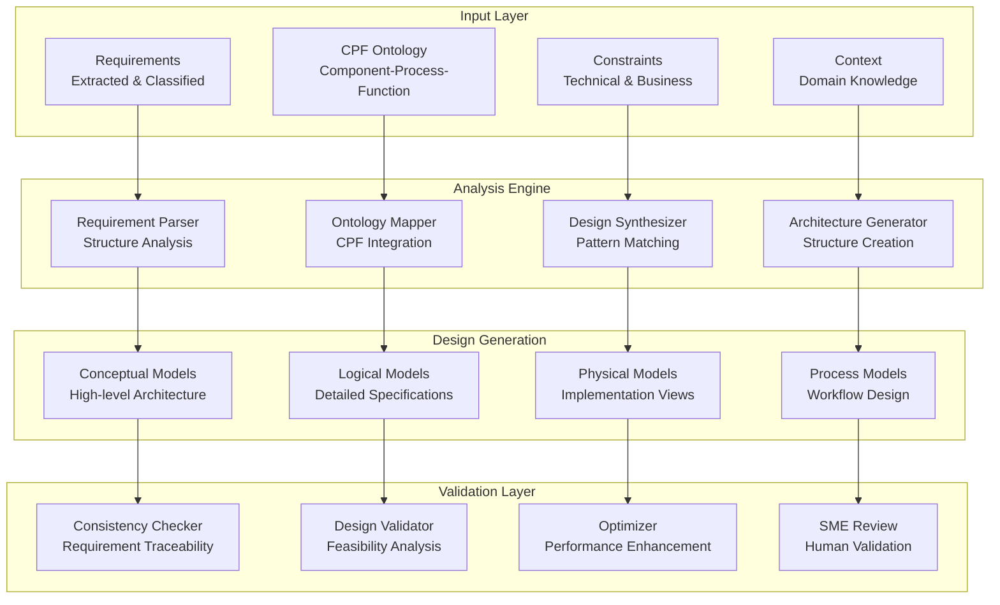
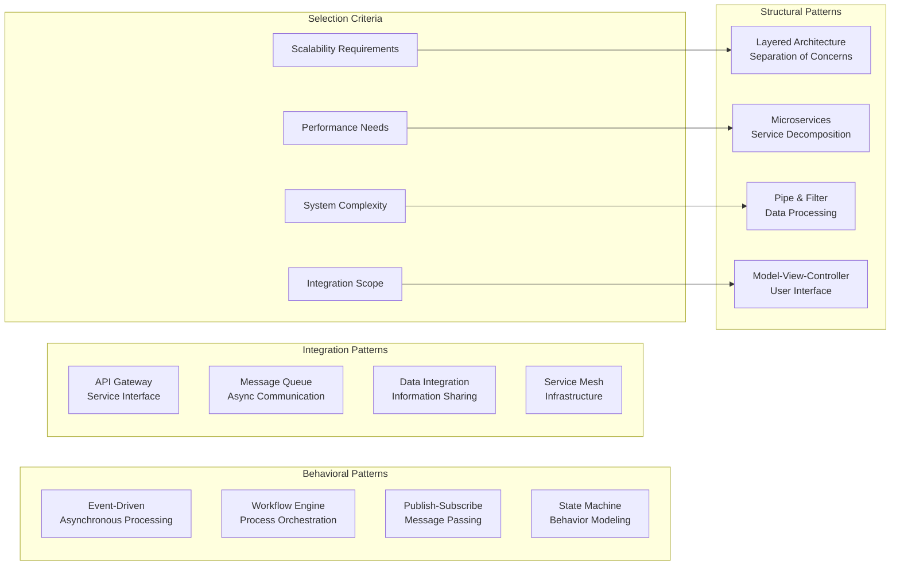
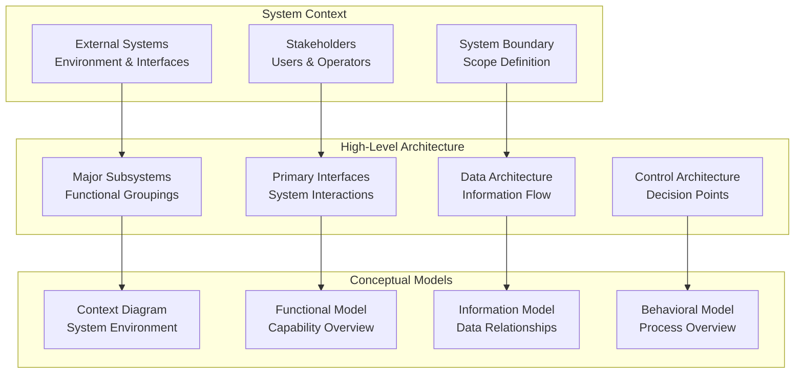
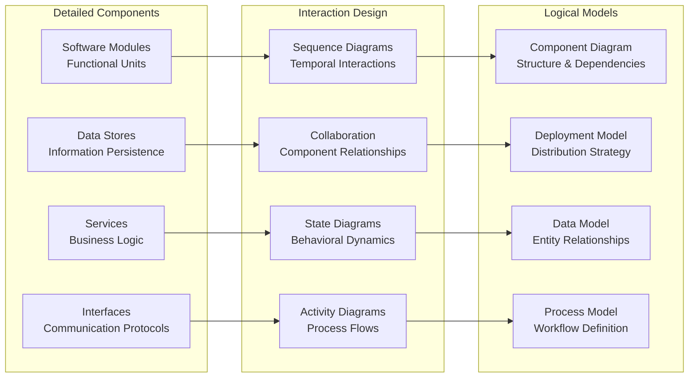
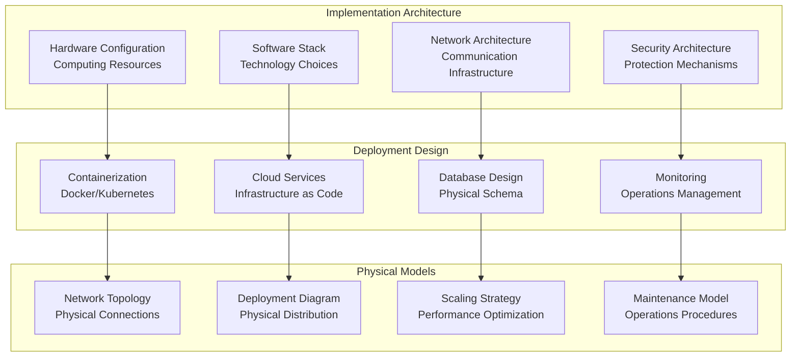
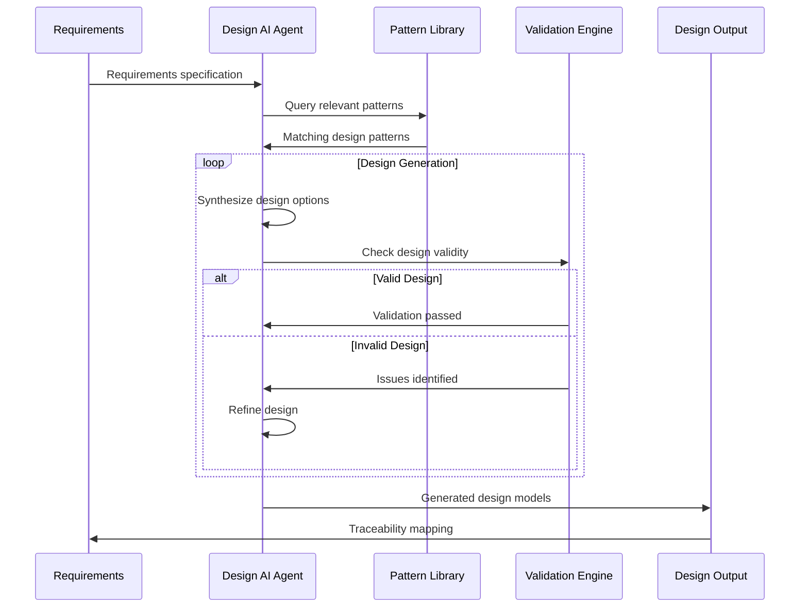
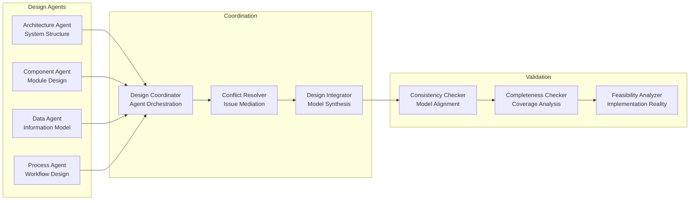
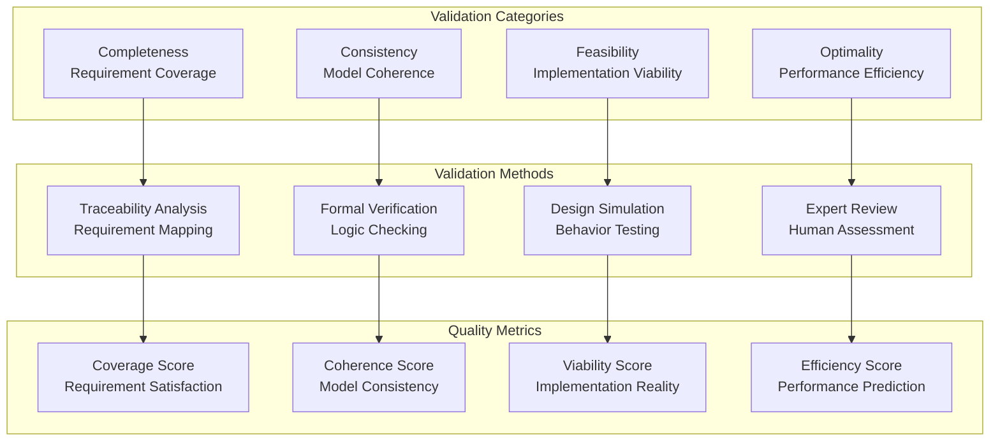
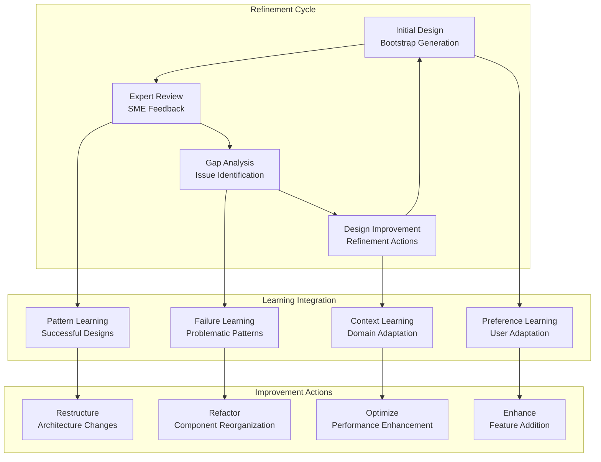

# Conceptual Design Bootstrapping
**Date**: July 7, 2025  
**Project**: Decision Analysis & Decision Management (DADM) Platform

## Executive Summary

DADM's Conceptual Design Bootstrapping capability transforms extracted requirements and CPF ontologies into initial system designs automatically. This process bridges the critical gap between requirements analysis and detailed system design, providing a structured foundation that accelerates development while ensuring traceability and consistency.

## Bootstrap Architecture Overview



## Requirements-to-Design Transformation

### Systematic Decomposition Process

```mermaid
flowchart TD
    subgraph "Requirement Analysis"
        FUNC[Functional Requirements<br/>"System shall..."]
        NONFUNC[Non-functional Requirements<br/>"Performance, Security..."]
        INTERFACE[Interface Requirements<br/>"System boundaries..."]
        CONSTRAINT[Constraint Requirements<br/>"Limitations..."]
    end
    
    subgraph "CPF Mapping"
        COMP[Component Identification<br/>System Elements]
        PROC[Process Definition<br/>Workflows & Activities]
        FUNCTION[Function Allocation<br/>Capability Assignment]
        RELATION[Relationship Mapping<br/>Dependencies & Interfaces]
    end
    
    subgraph "Design Synthesis"
        HIERARCHY[Component Hierarchy<br/>System Decomposition]
        FLOW[Process Flow<br/>Sequence & Timing]
        INTERFACE_DEF[Interface Definition<br/>Data & Control Flow]
        ALLOCATION[Function Allocation<br/>Component Assignment]
    end
    
    FUNC --> COMP
    NONFUNC --> FUNCTION
    INTERFACE --> RELATION
    CONSTRAINT --> PROC
    
    COMP --> HIERARCHY
    PROC --> FLOW
    FUNCTION --> INTERFACE_DEF
    RELATION --> ALLOCATION
```

### Pattern-Based Design Generation

#### Architectural Pattern Library


### Automated Component Generation

#### Component Derivation Rules
1. **From Functional Requirements**
   - Each major function becomes a component
   - Related functions are grouped into subsystems
   - External interfaces define system boundaries

2. **From Data Requirements**
   - Data entities become information components
   - Data flows define interface requirements
   - Data transformations suggest processing components

3. **From Performance Requirements**
   - High-performance needs suggest specialized components
   - Scalability requirements drive architecture patterns
   - Reliability needs influence redundancy design

4. **From Integration Requirements**
   - External systems define interface components
   - Protocol requirements shape communication design
   - Security needs influence access control architecture

## Multi-Level Design Bootstrap

### Conceptual Level Bootstrap



### Logical Level Bootstrap



### Physical Level Bootstrap



## AI-Assisted Design Generation

### Intelligent Design Synthesis



### Multi-Agent Design Collaboration

#### Specialist Agent Roles
1. **Architecture Agent**: Overall system structure and patterns
2. **Component Agent**: Detailed component design and interfaces
3. **Data Agent**: Information architecture and data flow
4. **Process Agent**: Workflow and business process design
5. **Integration Agent**: System integration and interface design
6. **Quality Agent**: Non-functional requirement satisfaction

#### Collaborative Design Process


## Design Quality Assurance

### Automated Validation Framework



### Design Traceability Matrix

| Requirement ID | Design Component | Implementation Element | Validation Method | Status |
|----------------|------------------|----------------------|-------------------|---------|
| REQ-001 | User Interface Module | React Components | UI Testing | ✅ Complete |
| REQ-002 | Authentication Service | OAuth2 Integration | Security Review | 🔄 In Progress |
| REQ-003 | Data Processing Engine | Stream Processing | Performance Testing | ⏳ Planned |
| REQ-004 | API Gateway | Kong Configuration | Integration Testing | ✅ Complete |

## Iterative Design Refinement

### Feedback-Driven Improvement



### Continuous Learning Mechanisms

#### Pattern Recognition and Reuse
- **Successful Design Patterns**: Capture and generalize effective solutions
- **Anti-Pattern Detection**: Identify and avoid problematic design choices
- **Context-Specific Adaptation**: Tailor patterns to domain characteristics
- **Performance Correlation**: Link design choices to performance outcomes

#### User Preference Learning
- **Design Style Preferences**: Learn architect/designer preferences
- **Technology Preferences**: Adapt to preferred technology stacks
- **Complexity Preferences**: Match design complexity to user expertise
- **Process Preferences**: Align with organizational development processes

## Aircraft Acquisition Case Study

### Bootstrap Application Example

```mermaid
graph TB
    subgraph "Requirements Input"
        MISSION[Mission Requirements<br/>"Transport 100 passengers"]
        PERFORMANCE[Performance Requirements<br/>"Range 3000nm, Mach 0.8"]
        OPERATIONAL[Operational Requirements<br/>"25-year lifecycle"]
        REGULATORY[Regulatory Requirements<br/>"FAA certification"]
    end
    
    subgraph "Generated Architecture"
        AIRCRAFT[Aircraft System<br/>Primary Platform]
        PROPULSION[Propulsion Subsystem<br/>Engine & Fuel System]
        AVIONICS[Avionics Subsystem<br/>Navigation & Control]
        STRUCTURE[Structure Subsystem<br/>Airframe & Landing Gear]
    end
    
    subgraph "Process Architecture"
        ACQUISITION[Acquisition Process<br/>Procurement Workflow]
        TESTING[Testing Process<br/>Validation & Verification]
        OPERATIONS[Operations Process<br/>Flight Operations]
        MAINTENANCE[Maintenance Process<br/>Lifecycle Support]
    end
    
    MISSION --> AIRCRAFT
    PERFORMANCE --> PROPULSION
    OPERATIONAL --> AVIONICS
    REGULATORY --> STRUCTURE
    
    AIRCRAFT --> ACQUISITION
    PROPULSION --> TESTING
    AVIONICS --> OPERATIONS
    STRUCTURE --> MAINTENANCE
```

### Generated Design Elements

#### Conceptual System Architecture
- **Primary Mission System**: Passenger transport capability
- **Support Systems**: Ground operations, maintenance, training
- **External Interfaces**: Air traffic control, ground services, regulatory bodies
- **Lifecycle Processes**: Acquisition, operations, maintenance, disposal

#### Logical Component Design
- **Flight Management System**: Navigation and flight planning
- **Passenger Service System**: Cabin management and passenger comfort
- **Maintenance Management System**: Predictive maintenance and logistics
- **Regulatory Compliance System**: Certification and documentation management

## Implementation Roadmap

### Phase 1: Basic Bootstrap (Current - Q3 2025)
- ✅ Simple requirement-to-component mapping
- ✅ Pattern-based architecture generation
- 🔄 Basic validation and consistency checking
- ⏳ Initial SME review integration

### Phase 2: Intelligent Bootstrap (Q4 2025 - Q1 2026)
- ⏳ AI-assisted design synthesis
- ⏳ Multi-agent collaborative design
- ⏳ Automated quality assurance
- ⏳ Learning-based pattern recognition

### Phase 3: Adaptive Bootstrap (Q2 2026 - Q3 2026)
- ⏳ Context-aware design generation
- ⏳ Preference learning and adaptation
- ⏳ Real-time design optimization
- ⏳ Continuous improvement integration

### Phase 4: Autonomous Bootstrap (Q4 2026+)
- ⏳ Fully automated design generation
- ⏳ Self-improving design patterns
- ⏳ Cross-domain design transfer
- ⏳ Predictive design evolution

---

*Conceptual Design Bootstrapping transforms the traditional gap between requirements and design into an automated bridge, ensuring that every system design starts with a solid, traceable foundation that can evolve intelligently throughout the development lifecycle.*
