# DADM Universal Process Model
**The Punch Example: A Complete Decision-Making Framework**

## Executive Summary

The DADM (Decision Analysis and Decision Management) platform implements a universal process model that transforms any decision scenario into a structured, repeatable, and continuously improving framework. This document illustrates how DADM's comprehensive architecture supports each phase of decision-making using the simple yet powerful example of avoiding a punch - demonstrating how the same process scales from immediate physical responses to complex organizational decisions.

## The Universal Process Model

DADM's universal process model represents a complete decision-making cycle that applies to any scenario, from immediate physical responses to complex enterprise decisions. The model consists of interconnected phases that build upon each other, with continuous feedback loops for learning and improvement.

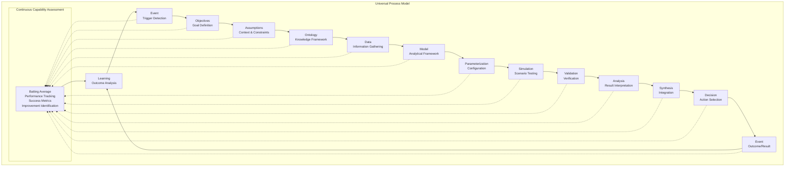

**Key Process Characteristics:**
- **Universal Application**: The same process applies to all decision scenarios
- **Continuous Learning**: Each cycle improves the next through outcome analysis
- **Capability Assessment**: "Batting average" tracking at every step
- **Scalable Complexity**: Handles both immediate and complex decisions
- **Traceable Decisions**: Complete audit trail from trigger to outcome

## The Punch Example: Process Walkthrough

### **Phase 1: Event Detection**
**The Punch Scenario**: *An incoming fist approaches your face*

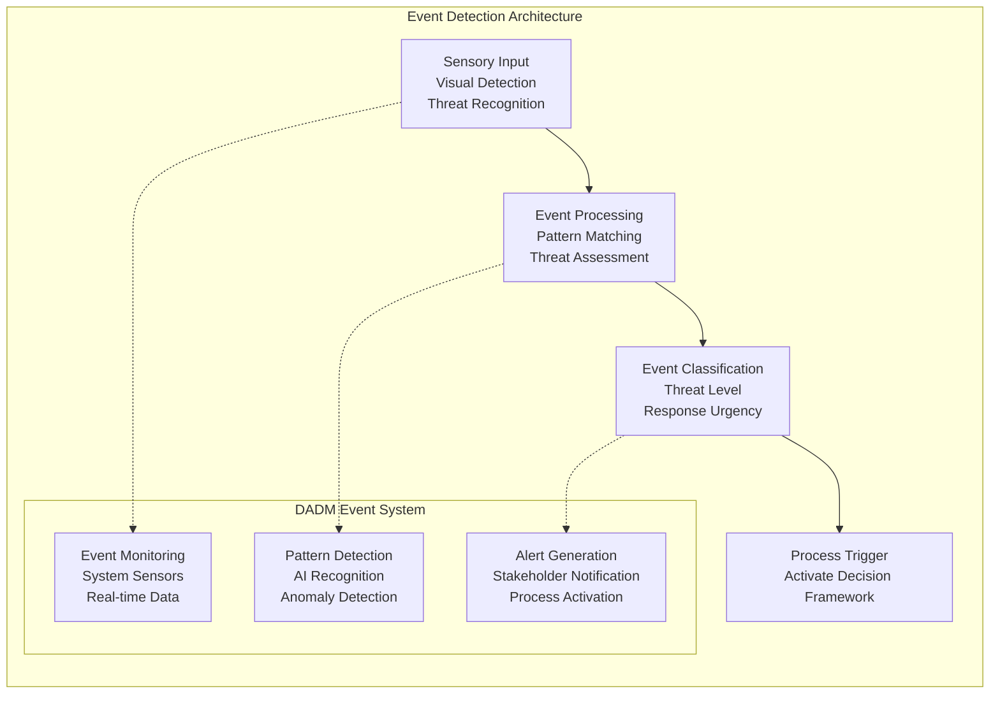

**DADM Implementation:**
- **Event Monitoring Service**: Continuously monitors for trigger conditions
- **Pattern Recognition AI**: Identifies significant events requiring decisions
- **Real-time Processing**: Immediate response to time-critical situations
- **Event Classification**: Categorizes events by urgency and complexity

**In the Punch Example**: Visual system detects incoming fist, recognizes threat pattern, classifies as immediate physical danger, triggers emergency response protocol.

### **Phase 2: Objectives Definition**
**The Punch Scenario**: *Primary objective: Avoid injury*

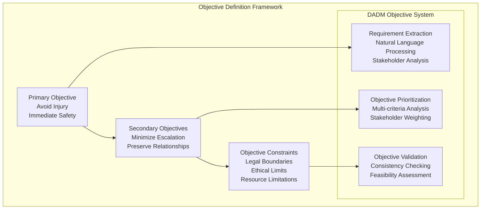

**DADM Implementation:**
- **Requirements Service**: Extracts and structures objectives from various sources
- **Multi-criteria Decision Analysis**: Prioritizes competing objectives
- **Stakeholder Management**: Incorporates different perspectives and constraints
- **Objective Traceability**: Maintains clear linkage between objectives and outcomes

**In the Punch Example**: Primary objective is injury avoidance, secondary objectives might include de-escalation, maintaining dignity, and avoiding legal consequences.

### **Phase 3: Assumptions & Context**
**The Punch Scenario**: *Opponent is right-handed, punch trajectory predictable, reaction time sufficient*

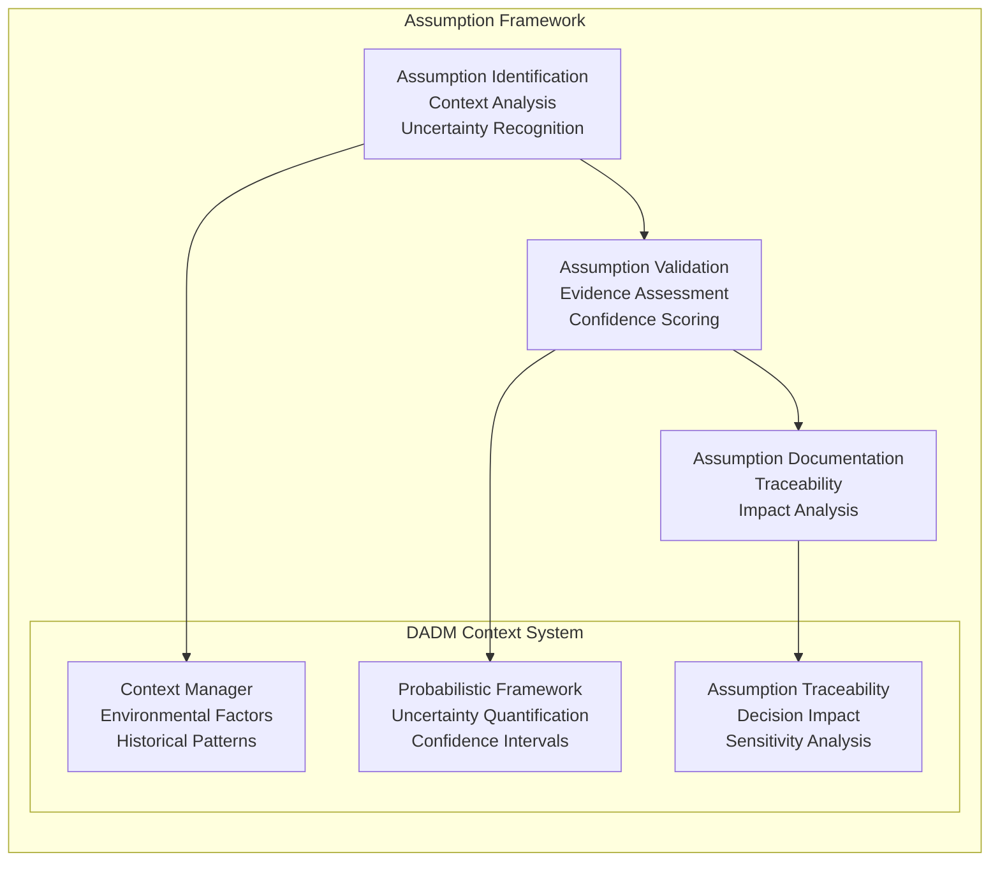

**DADM Implementation:**
- **Context Enhancement Service**: Gathers environmental and situational factors
- **Probabilistic Ontology**: Manages uncertainty and confidence levels
- **Assumption Tracking**: Maintains audit trail of assumptions and their impacts
- **Sensitivity Analysis**: Identifies critical assumptions that affect outcomes

**In the Punch Example**: Assumptions include attacker's dominant hand, punch speed, trajectory predictability, your reaction time, available escape routes, and potential weapons.

### **Phase 4: Ontology & Knowledge Framework**
**The Punch Scenario**: *Define what constitutes a "punch" and "avoidance" in this context*

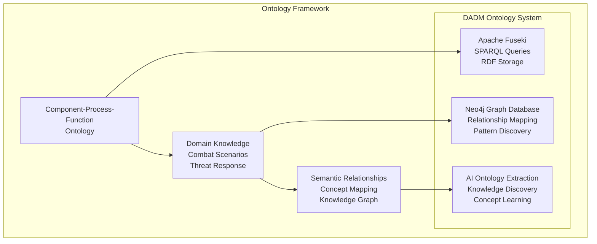

**DADM Implementation:**
- **CPF Ontology**: Component-Process-Function framework for knowledge organization
- **Domain Ontologies**: Specialized knowledge for specific contexts (combat, business, etc.)
- **Knowledge Graph**: Semantic relationships between concepts and entities
- **AI-Powered Extraction**: Continuous learning and ontology improvement

**In the Punch Example**: 
- **Components**: Fist, body, defense mechanisms, environment
- **Processes**: Punching motion, evasion, blocking, counterattack
- **Functions**: Threat delivery, threat avoidance, damage mitigation

### **Phase 5: Data Collection & Processing**
**The Punch Scenario**: *Speed and direction of fist, your position, environmental factors, prior martial arts knowledge*

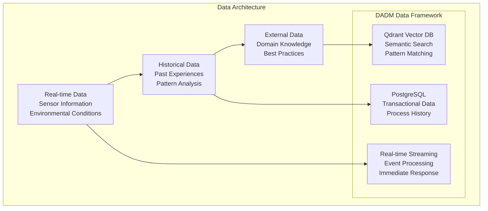

**DADM Implementation:**
- **Multi-Database Architecture**: Different data types optimized for their use cases
- **Real-time Processing**: Immediate data processing for time-critical decisions
- **Vector Search**: Semantic similarity for finding relevant historical patterns
- **Comprehensive Data Integration**: Combines internal and external data sources

**In the Punch Example**: Real-time data includes fist speed/direction, your position, environmental constraints; historical data includes past fight experiences, training; external data includes combat techniques, physics of motion.

### **Phase 6: Model Development**
**The Punch Scenario**: *Kinematics of bodies in motion, possible defensive moves, physics of impact*

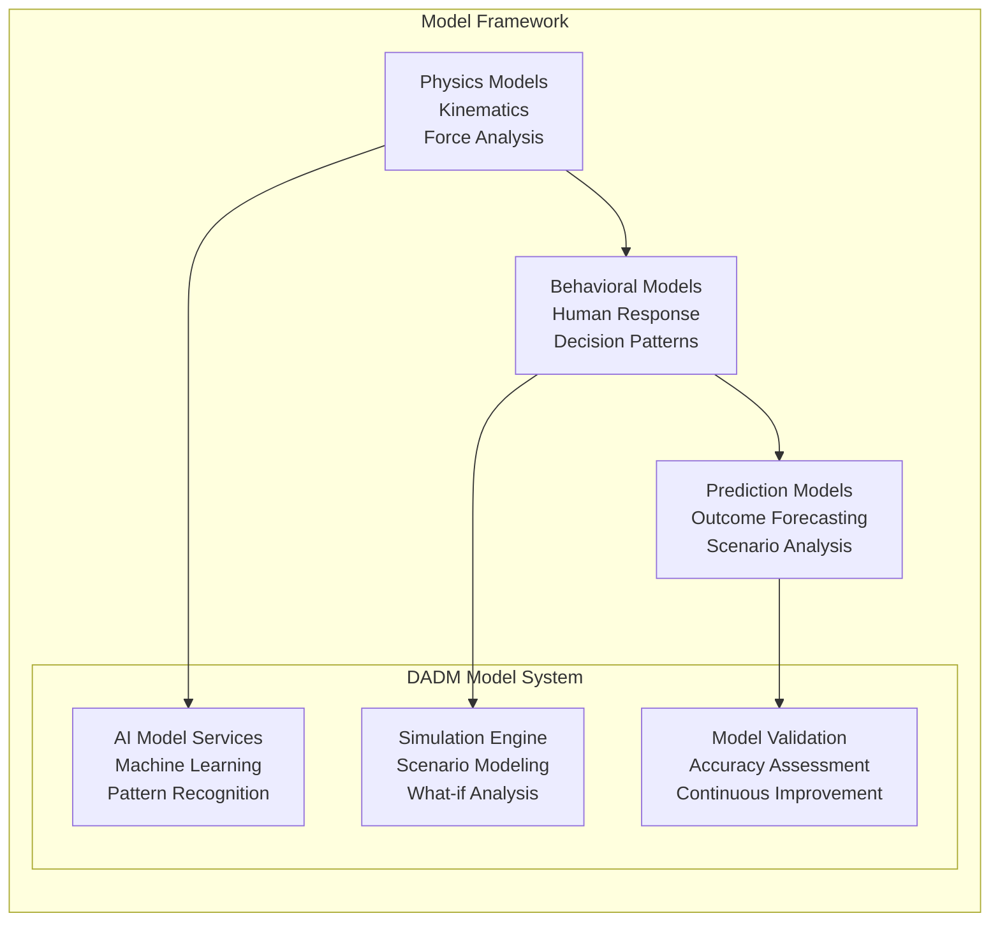

**DADM Implementation:**
- **Flexible Model Architecture**: Supports various model types and complexity levels
- **AI Integration**: Machine learning models for pattern recognition and prediction
- **Simulation Capabilities**: Scenario modeling and what-if analysis
- **Model Validation**: Continuous assessment and improvement of model accuracy

**In the Punch Example**: Physics models calculate trajectories and impact forces; behavioral models predict human responses; combined models evaluate defensive options.

### **Phase 7: Parameterization**
**The Punch Scenario**: *Your reflex speed, distance measurements, force calculations*

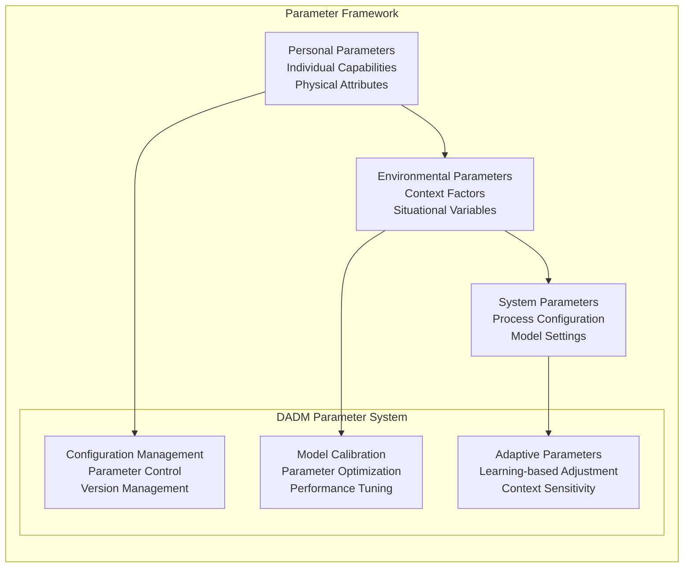

**DADM Implementation:**
- **Dynamic Configuration**: Real-time parameter adjustment based on context
- **Automatic Calibration**: Model parameters optimized for specific scenarios
- **Learning-based Adaptation**: Parameters improve based on historical performance
- **Context Awareness**: Parameters adapt to changing situations

**In the Punch Example**: Parameters include your reaction time (measured from past responses), reach distance, movement speed, strength levels, and environmental constraints.

### **Phase 8: Simulation & Scenario Testing**
**The Punch Scenario**: *Predict outcomes of ducking, dodging, blocking, or counterattacking*

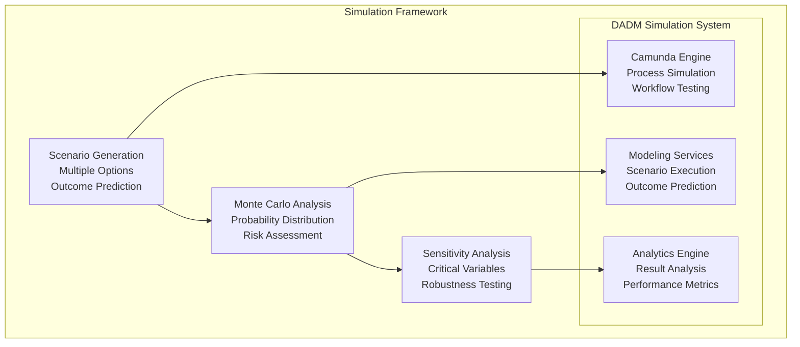

**DADM Implementation:**
- **Process Simulation**: BPMN-based workflow execution and testing
- **Scenario Modeling**: Multiple alternative pathways and outcomes
- **Statistical Analysis**: Probability distributions and risk assessment
- **Performance Analytics**: Quantitative evaluation of simulation results

**In the Punch Example**: Simulate ducking (90% success, low injury risk), dodging left (75% success, moderate energy cost), blocking (60% success, potential arm injury), counterattacking (40% success, high escalation risk).

### **Phase 9: Validation & Verification**
**The Punch Scenario**: *Do these defensive moves actually work? Historical validation and testing*

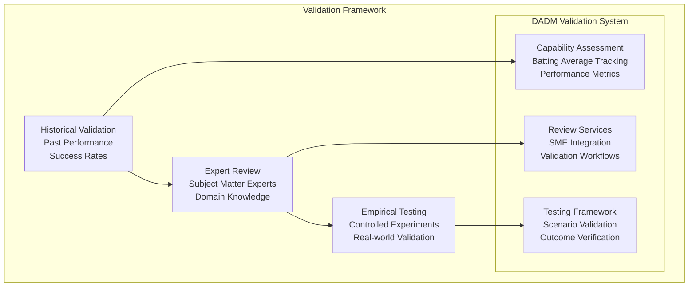

**DADM Implementation:**
- **Capability Assessment**: Continuous tracking of decision-making performance
- **Expert Integration**: SME review and validation of decision frameworks
- **Empirical Validation**: Real-world testing and outcome verification
- **Continuous Learning**: Feedback loops for framework improvement

**In the Punch Example**: Historical data shows ducking works 90% of the time, expert martial artists confirm effectiveness, empirical testing validates reaction time assumptions.

### **Phase 10: Analysis & Synthesis**
**The Punch Scenario**: *Analyze all factors to determine the best defensive option*


**DADM Implementation:**
- **Multi-criteria Decision Analysis**: Weighs multiple factors and trade-offs
- **AI-Powered Analysis**: Pattern recognition and decision support
- **Risk Assessment**: Comprehensive evaluation of potential outcomes
- **Holistic Synthesis**: Integration of all analysis components

**In the Punch Example**: Analysis weighs success probability (90% for ducking), injury risk (low), energy cost (minimal), escalation potential (none), and time requirements (0.2 seconds).

### **Phase 11: Decision & Action Selection**
**The Punch Scenario**: *Decision: Duck left and move away*

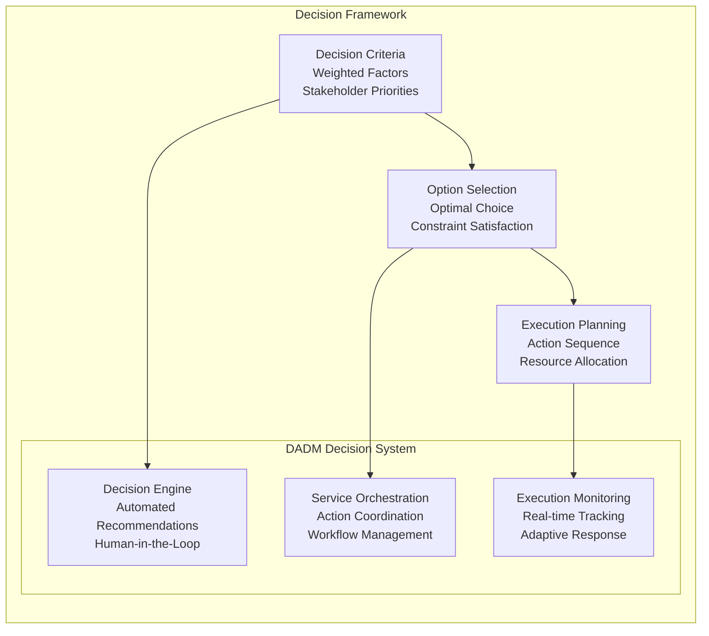

**DADM Implementation:**
- **Decision Engine**: Automated recommendations with human oversight
- **Service Orchestration**: Coordinates actions across multiple systems
- **Execution Monitoring**: Real-time tracking of decision implementation
- **Adaptive Response**: Ability to modify actions based on changing conditions

**In the Punch Example**: Decision engine recommends ducking left based on highest success probability and lowest risk; execution involves immediate muscle activation and movement.

### **Phase 12: Outcome & Learning**
**The Punch Scenario**: *You successfully duck - the outcome triggers learning for future scenarios*

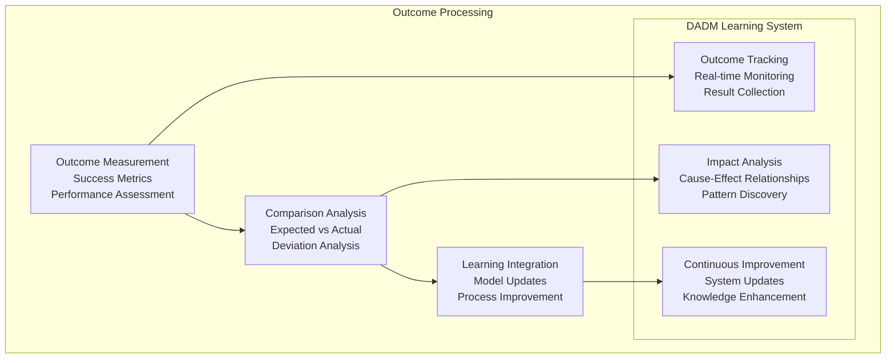

**DADM Implementation:**
- **Outcome Tracking**: Comprehensive measurement of results and impacts
- **Impact Analysis**: Understanding cause-effect relationships
- **Continuous Learning**: Automatic updates to models and processes
- **Knowledge Enhancement**: Enrichment of organizational knowledge base

**In the Punch Example**: Successful ducking validates the model, improves confidence in similar future scenarios, and updates parameters for reaction time and defensive effectiveness.

## DADM Architectural Support

### **Service Architecture Integration**

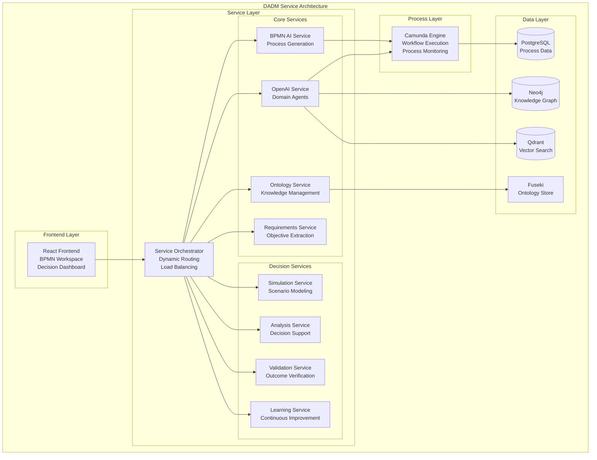

### **AI Integration Matrix**

```mermaid
graph TB
    subgraph "Vertical AI Services - Available at Every Process Phase"
        AI1[Domain Expertise<br/>Threat Assessment<br/>Combat Analysis]
        AI2[Knowledge Extraction<br/>Pattern Recognition<br/>Learning Integration]
        AI3[Process Intelligence<br/>Workflow Optimization<br/>Decision Support]
        AI4[Decision Support<br/>Recommendation Engine<br/>Risk Assessment]
        AI5[Meta-Intelligence<br/>System Monitoring<br/>Performance Optimization]
    end
    
    subgraph "Horizontal Process Layers"
        L1[Event Detection & Monitoring]
        L2[Objectives & Requirements]
        L3[Assumptions & Context]
        L4[Ontology & Knowledge]
        L5[Data & Analysis]
        L6[Modeling & Simulation]
        L7[Validation & Verification]
        L8[Decision & Action]
        L9[Outcome & Learning]
    end
    
    AI1 -.-> L1
    AI1 -.-> L2
    AI1 -.-> L3
    AI1 -.-> L4
    AI1 -.-> L5
    AI1 -.-> L6
    AI1 -.-> L7
    AI1 -.-> L8
    AI1 -.-> L9
    
    AI2 -.-> L1
    AI2 -.-> L2
    AI2 -.-> L3
    AI2 -.-> L4
    AI2 -.-> L5
    AI2 -.-> L6
    AI2 -.-> L7
    AI2 -.-> L8
    AI2 -.-> L9
    
    AI3 -.-> L1
    AI3 -.-> L2
    AI3 -.-> L3
    AI3 -.-> L4
    AI3 -.-> L5
    AI3 -.-> L6
    AI3 -.-> L7
    AI3 -.-> L8
    AI3 -.-> L9
    
    AI4 -.-> L1
    AI4 -.-> L2
    AI4 -.-> L3
    AI4 -.-> L4
    AI4 -.-> L5
    AI4 -.-> L6
    AI4 -.-> L7
    AI4 -.-> L8
    AI4 -.-> L9
    
    AI5 -.-> L1
    AI5 -.-> L2
    AI5 -.-> L3
    AI5 -.-> L4
    AI5 -.-> L5
    AI5 -.-> L6
    AI5 -.-> L7
    AI5 -.-> L8
    AI5 -.-> L9
```

## Scaling from Punch to Enterprise

### **Complexity Scaling**

| Aspect | Punch Example | Enterprise Decision |
|--------|---------------|-------------------|
| **Time Scale** | 0.2 seconds | Months to years |
| **Stakeholders** | Individual | Multiple organizations |
| **Data Volume** | Sensory input | Terabytes of data |
| **Model Complexity** | Physics + behavior | Multi-domain models |
| **Validation** | Historical + expert | Statistical + empirical |
| **Impact** | Personal safety | Organizational strategy |
| **Learning** | Personal experience | Enterprise knowledge |

### **Universal Process Benefits**

1. **Consistency**: Same decision framework regardless of complexity
2. **Traceability**: Complete audit trail from trigger to outcome
3. **Scalability**: Handles simple and complex decisions equally well
4. **Learning**: Continuous improvement through outcome analysis
5. **Transparency**: Clear understanding of decision rationale
6. **Repeatability**: Consistent process for similar scenarios
7. **Quality**: Built-in validation and verification steps
8. **Adaptability**: Framework adjusts to different domains and contexts

## Capability Assessment & Batting Average

### **Why "Batting Average"? Moving Beyond Rhetoric to Results**

DADM uses the term "batting average" deliberately to establish a culture of **measurable performance over theoretical perfection**. Just as a baseball player's batting average represents actual hits divided by actual at-bats, DADM's batting averages measure **real outcomes against real attempts** - not promises, projections, or perfectly crafted models.

#### **The Problem with Traditional Modeling**
Traditional approaches like SysML often suffer from "rhetoric over results":
- **Beautiful Documentation, Unknown Performance**: Models look comprehensive but lack performance validation
- **Process Compliance Over Outcome Achievement**: Focus on following procedures rather than achieving results
- **Theoretical Perfection Over Practical Effectiveness**: Emphasis on model completeness rather than decision quality
- **Activity Metrics Over Impact Metrics**: Measuring effort rather than outcomes

#### **The Baseball Analogy: Why It Works**
In baseball, a .300 batting average (30% success rate) makes you an All-Star because:
- **Everyone understands the metric**: Simple, transparent, comparable
- **It measures what matters**: Actual performance under real conditions
- **It drives improvement**: Players focus on getting better results, not better explanations
- **It enables fair comparison**: Compare players across teams, leagues, and eras
- **It accepts imperfection**: Excellence doesn't require 100% success

#### **DADM's Batting Average Philosophy**
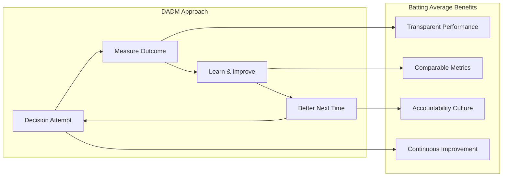

```mermaid
flowchart TB
    subgraph "Traditional Approach (SysML)"
        DOC[Perfect Documentation] --> COMPLY[Process Compliance]
        COMPLY --> HOPE[Hope for Success]
        HOPE --> UNKNOWN[Unknown Outcomes]
    end
````

**Key Principles:**
- **"Show, Don't Tell"**: Demonstrate effectiveness through results, not documentation
- **"Good Enough, Getting Better"**: Accept imperfection while pursuing improvement
- **"Outcomes Over Outputs"**: Measure impact, not activity
- **"Learning Over Perfection"**: Value continuous improvement over initial perfection

### **Continuous Performance Tracking**

```mermaid
graph LR
    subgraph "Performance Metrics"
        ACCURACY[Decision Accuracy<br/>Correct Predictions<br/>Success Rate]
        TIMING[Response Time<br/>Decision Speed<br/>Efficiency]
        QUALITY[Decision Quality<br/>Outcome Optimization<br/>Stakeholder Satisfaction]
        LEARNING[Learning Rate<br/>Improvement Velocity<br/>Knowledge Accumulation]
    end
    
    subgraph "Batting Average Calculation"
        COLLECT[Data Collection<br/>Outcome Tracking<br/>Performance Measurement]
        ANALYZE[Performance Analysis<br/>Pattern Recognition<br/>Trend Identification]
        SCORE[Scoring System<br/>Weighted Metrics<br/>Confidence Intervals]
        IMPROVE[Improvement Actions<br/>Process Optimization<br/>Capability Enhancement]
    end
    
    ACCURACY --> COLLECT
    TIMING --> ANALYZE
    QUALITY --> SCORE
    LEARNING --> IMPROVE
    
    COLLECT --> ANALYZE
    ANALYZE --> SCORE
    SCORE --> IMPROVE
    IMPROVE --> COLLECT
```

### **Batting Average Examples: What Good Looks Like**

#### **Process Phase Performance Standards**
| Phase | Rookie (.200) | Professional (.300) | All-Star (.400) | Hall of Fame (.500+) |
|-------|---------------|-------------------|----------------|---------------------|
| **Event Detection** | 20% of critical events detected | 30% accuracy with minimal false positives | 40% detection with context | 50%+ predictive detection |
| **Objective Setting** | Basic goals identified | Clear, measurable objectives | Stakeholder-aligned priorities | Adaptive objective optimization |
| **Data Collection** | Some relevant data gathered | 30% data quality/completeness | 40% relevant, validated data | 50%+ predictive data sets |
| **Model Performance** | Models sometimes work | 30% prediction accuracy | 40% robust predictions | 50%+ adaptive learning models |
| **Decision Outcomes** | Decisions made on time | 30% achieve stated objectives | 40% exceed expectations | 50%+ create unexpected value |

#### **Real-World Batting Average Scenarios**

**Aircraft Acquisition Example:**
```
Event Detection: 0.350 (35% of program risks identified before they become critical)
Objective Setting: 0.420 (42% of objectives met or exceeded within budget/schedule)
Data Collection: 0.290 (29% of collected data directly influenced decision quality)
Model Performance: 0.380 (38% of cost/schedule predictions within 10% of actual)
Decision Outcomes: 0.440 (44% of major decisions resulted in better-than-expected outcomes)
Overall Program Batting Average: 0.376 (Strong Professional Performance)
```

**System Integration Project:**
```
Event Detection: 0.280 (28% of integration issues caught before system test)
Objective Setting: 0.310 (31% of requirements clearly traced to business value)
Data Collection: 0.250 (25% of technical data supported architecture decisions)
Model Performance: 0.340 (34% of interface models predicted actual behavior)
Decision Outcomes: 0.360 (36% of technical decisions improved system performance)
Overall Project Batting Average: 0.308 (Solid Professional Performance)
```

### **Phase-Specific Batting Averages**

Each phase of the universal process maintains its own performance metrics with specific success criteria:

- **Event Detection (Target: 0.300+)**: Accuracy of trigger identification, false positive/negative rates, early warning effectiveness
- **Objective Setting (Target: 0.350+)**: Clarity and completeness of goal definition, stakeholder alignment, measurability 
- **Assumption Management (Target: 0.280+)**: Validity of assumptions, impact of incorrect assumptions, assumption tracking accuracy
- **Ontology Utilization (Target: 0.320+)**: Effectiveness of knowledge framework application, concept reuse, semantic consistency
- **Data Quality (Target: 0.300+)**: Relevance, accuracy, and completeness of data collection, data-to-insight conversion
- **Model Performance (Target: 0.350+)**: Prediction accuracy, calibration quality, model generalizability
- **Simulation Reliability (Target: 0.340+)**: Scenario accuracy, outcome prediction quality, simulation-to-reality correlation
- **Validation Effectiveness (Target: 0.380+)**: Verification accuracy, error detection rate, validation completeness
- **Analysis Quality (Target: 0.330+)**: Insight generation, decision support effectiveness, analysis-to-action conversion
- **Decision Outcomes (Target: 0.400+)**: Success rate, stakeholder satisfaction, goal achievement, unintended consequences
- **Learning Integration (Target: 0.250+)**: Knowledge retention, process improvement rate, adaptation speed

### **Building a Results-Driven Culture**

#### **Accountability Through Transparency**
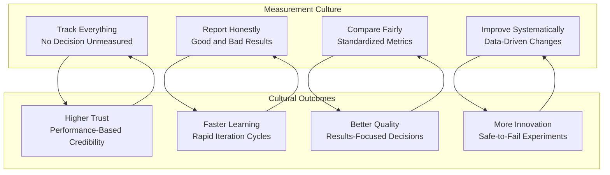

**Key Cultural Shifts:**
- **From "Perfect Plans" to "Perfect Learning"**: Embrace iteration over perfection
- **From "Best Practices" to "Better Practices"**: Continuous improvement over static procedures
- **From "Expert Opinion" to "Evidence-Based"**: Data-driven decisions over authority-based decisions
- **From "Risk Avoidance" to "Risk Management"**: Intelligent risk-taking over risk paralysis

#### **Making Batting Averages Meaningful**
1. **Context Matters**: A .200 batting average in extremely challenging conditions may represent excellent performance
2. **Trend Trumps Snapshot**: Improvement trajectory is more important than current performance
3. **System Performance**: Individual phase performance contributes to overall system effectiveness
4. **Competitive Benchmarking**: Compare against industry standards and best-in-class performance
5. **Mission Criticality**: Higher standards for life-safety and mission-critical decisions

This batting average approach transforms DADM from another modeling tool into a **performance management system** that continuously proves its value through measurable results rather than theoretical promises.

## Implementation Roadmap

### **Phase 1: Foundation (Current - Q3 2025)**
- ✅ Basic universal process framework
- ✅ Core service architecture
- ✅ Simple decision scenarios (punch-level complexity)
- 🔄 Capability assessment tracking
- ⏳ Learning integration mechanisms

### **Phase 2: Intelligence Enhancement (Q4 2025 - Q1 2026)**
- ⏳ Advanced AI integration at all process phases
- ⏳ Complex scenario handling (enterprise-level decisions)
- ⏳ Multi-stakeholder decision support
- ⏳ Real-time performance optimization

### **Phase 3: Enterprise Integration (Q2 2026 - Q4 2026)**
- ⏳ Full organizational decision support
- ⏳ Cross-domain knowledge sharing
- ⏳ Industry-specific process optimization
- ⏳ Autonomous decision recommendations

### **Phase 4: Ecosystem Expansion (2027+)**
- ⏳ Inter-organizational decision networks
- ⏳ Industry-wide knowledge sharing
- ⏳ Continuous learning and adaptation
- ⏳ Fully autonomous decision systems

## Conclusion

The DADM Universal Process Model transforms decision-making from an ad-hoc activity into a systematic, repeatable, and continuously improving capability. Whether responding to an immediate physical threat or making complex enterprise decisions, the same fundamental process applies, supported by a comprehensive architectural framework that scales from individual responses to organizational strategy.

The punch example demonstrates that even in a split-second scenario, the universal process occurs - we simply execute it so quickly that the phases blend together. DADM makes this process explicit, traceable, and improvable, ensuring that organizations can make better decisions faster while learning from every outcome.

Through continuous capability assessment and batting average tracking, DADM enables organizations to quantify and improve their decision-making capabilities, transforming abstract concepts like "good judgment" into measurable, manageable, and teachable skills.

---

*The Universal Process Model represents DADM's core innovation: making decision-making itself into a systematic, learnable, and continuously improving organizational capability.* 