# Data Transformation and Ontology Mapping
**Date**: July 7, 2025  
**Project**: Decision Analysis & Decision Management (DADM) Platform

## Executive Summary

DADM's Data Transformation and Ontology Mapping capability enables the systematic establishment of hierarchical knowledge structures and seamless data flow between different abstraction levels and domains. This framework supports probabilistic ontology bootstrapping, domain-specific knowledge modeling, and intelligent transformation of lower-level technical data into higher-level decision-relevant information.

## Probabilistic Ontology Establishment

The probabilistic ontology establishment process is a foundational capability of DADM that enables the platform to create knowledge structures with associated confidence levels. Unlike traditional deterministic ontologies, DADM's probabilistic approach acknowledges uncertainty in knowledge representation, allowing for more robust handling of real-world ambiguity and incomplete information.

### Initial Ontology Bootstrap Process

The following diagram illustrates the comprehensive process DADM uses to bootstrap a new domain ontology from available sources while maintaining confidence tracking throughout:


**Key Process Elements:**

1. **Seed Document Analysis**: The process begins with ingestion of domain-specific content including technical documentation, academic papers, expert interviews, and historical project data.

2. **AI-Powered Entity Extraction**: Advanced NLP algorithms identify domain-relevant entities, concepts, and relationship patterns within the seed content.

3. **Probabilistic Analysis**: Statistical techniques assess the confidence level for each extracted concept and relationship based on frequency, consensus, and contextual evidence.

4. **Bootstrap Ontology Creation**: An initial ontology structure is established with confidence intervals representing the system's certainty about each element.

5. **Expert Validation**: Subject Matter Experts (SMEs) review the bootstrap ontology, providing corrections and additional context that adjusts confidence scores.

6. **Iterative Refinement**: The system continuously improves the ontology as new evidence emerges, gradually increasing confidence in well-supported concepts while flagging areas requiring additional validation.

The parallel "Confidence Mechanisms" track shows the analytical approaches used to establish and maintain probabilistic confidence levels throughout the ontology lifecycle, ensuring that decision-makers understand the reliability of different knowledge elements.

### Aircraft Acquisition Ontology Example

The following diagrams demonstrate how DADM applies the probabilistic ontology approach to the specific domain of aircraft acquisition, illustrating both the conceptual structure and the evidence accumulation methodology:

#### Probabilistic Concept Establishment

This diagram shows a subset of concepts from an aircraft acquisition ontology, categorized by confidence levels and showing key relationships with their associated probabilities:

```mermaid
graph TB
    subgraph "Acquisition Domain Bootstrap"
        subgraph "High Confidence Concepts (>90%)"
            REQ[Requirements<br/>P=0.95<br/>Sources: 247]
            VENDOR[Vendor<br/>P=0.93<br/>Sources: 189]
            CONTRACT[Contract<br/>P=0.97<br/>Sources: 301]
            TESTING[Testing<br/>P=0.92<br/>Sources: 156]
        end
        
        subgraph "Medium Confidence Concepts (70-90%)"
            LIFECYCLE[Lifecycle<br/>P=0.87<br/>Sources: 89]
            COMPLIANCE[Compliance<br/>P=0.82<br/>Sources: 134]
            INTEGRATION[Integration<br/>P=0.76<br/>Sources: 67]
            RISK[Risk Assessment<br/>P=0.84<br/>Sources: 112]
        end
        
        subgraph "Low Confidence Concepts (50-70%)"
            INNOVATION[Innovation<br/>P=0.68<br/>Sources: 34]
            SUSTAINABILITY[Sustainability<br/>P=0.62<br/>Sources: 28]
            INTEROP[Interoperability<br/>P=0.71<br/>Sources: 45]
        end
        
        subgraph "Relationship Probabilities"
            REQ_VENDOR[Requirements → Vendor<br/>P=0.89<br/>Co-occurrence: 78%]
            VENDOR_CONTRACT[Vendor → Contract<br/>P=0.94<br/>Co-occurrence: 85%]
            TESTING_COMPLIANCE[Testing → Compliance<br/>P=0.77<br/>Co-occurrence: 62%]
        end
        
        REQ --> REQ_VENDOR
        REQ_VENDOR --> VENDOR
        VENDOR --> VENDOR_CONTRACT
        VENDOR_CONTRACT --> CONTRACT
        TESTING --> TESTING_COMPLIANCE
        TESTING_COMPLIANCE --> COMPLIANCE
    end
```



**Understanding Confidence Levels:**

- **High Confidence Concepts (>90%)**: Core domain concepts like "Requirements" and "Contract" appear with high frequency across source materials and have strong SME consensus, giving the system high certainty about their centrality to the acquisition process.

- **Medium Confidence Concepts (70-90%)**: Important but less universal concepts like "Risk Assessment" and "Lifecycle" that may vary more in their implementation across different acquisition scenarios.

- **Low Confidence Concepts (50-70%)**: Emerging or context-dependent concepts such as "Innovation" and "Sustainability" where evidence is still accumulating or where significance varies greatly across different aircraft programs.

- **Relationship Probabilities**: Connections between concepts carry their own confidence scores based on co-occurrence patterns and logical consistency, helping decision-makers understand both the concepts and how they relate to each other.

The numerical values and source counts provide transparency into the evidential basis for confidence levels, allowing users to understand why certain concepts are considered more reliable than others.

#### Evidence Accumulation Framework

The JSON structure below illustrates DADM's detailed approach to tracking evidence for ontology concepts, demonstrating how confidence scores are calculated from multiple evidence sources:

```json
{
  "conceptEvidence": {
    "concept": "Requirements",
    "confidenceScore": 0.95,
    "evidenceSources": [
      {
        "type": "document_frequency",
        "value": 0.92,
        "weight": 0.3,
        "sources": 247,
        "description": "Appears in 92% of acquisition documents"
      },
      {
        "type": "expert_consensus",
        "value": 0.98,
        "weight": 0.4,
        "experts": 23,
        "description": "98% of experts identify as core concept"
      },
      {
        "type": "empirical_validation",
        "value": 0.94,
        "weight": 0.3,
        "cases": 45,
        "description": "Successfully used in 94% of test cases"
      }
    ],
    "relationships": [
      {
        "target": "Vendor",
        "type": "influences",
        "confidence": 0.89,
        "evidence": "Vendor selection depends on requirement satisfaction"
      },
      {
        "target": "Testing",
        "type": "validates",
        "confidence": 0.85,
        "evidence": "Testing validates requirement compliance"
      }
    ],
    "temporalStability": {
      "lastMonth": 0.94,
      "trend": "stable",
      "volatility": 0.03
    }
  }
}
```

**Evidence Framework Components:**

- **Multiple Evidence Types**: DADM combines different types of evidence (document frequency, expert consensus, empirical validation) to create a robust, multi-dimensional confidence score.

- **Weighted Evidence**: Different evidence types are weighted according to their reliability and relevance, with expert consensus given higher weight (0.4) in this example.

- **Relationship Evidence**: Confidence scores are also maintained for relationships between concepts, recognizing that connections have their own evidence basis separate from the concepts themselves.

- **Temporal Stability**: The system tracks how confidence scores change over time, allowing stakeholders to see whether a concept's certainty is increasing, decreasing, or remaining stable as new evidence accumulates.

This structured approach to evidence accumulation enables DADM to maintain a "living" ontology that evolves based on continuous learning rather than remaining static after initial creation.

## Domain-Specific Ontology Development

DADM implements specialized ontology structures tailored to specific domains, enabling precise knowledge representation while maintaining cross-domain interoperability. This section demonstrates how domain-specific ontologies are organized and how they support the transformation of data across abstraction levels.

### Hierarchical Domain Architecture

The diagram below illustrates the multi-level hierarchical structure used to organize domain knowledge in an aircraft acquisition program, showing how concepts are arranged from strategic to detailed component levels:


**Hierarchical Domain Organization:**

- **Strategic Level (L4)**: The highest abstraction level focuses on program-wide decisions, resource allocation, and strategic objectives that guide the entire acquisition process.

- **Program Level (L3)**: This level bridges strategic concerns with system implementation, managing integrated requirements and lifecycle planning across the complete aircraft program and its supporting systems.

- **System Level (L2)**: At this level, the ontology captures major system components like airframe, propulsion, and avionics, with their respective engineering disciplines and performance characteristics.

- **Component Level (L1)**: The most detailed level represents specific physical components, their manufacturing specifications, and detailed technical properties.

This hierarchical structure enables DADM to support decision-making at multiple levels of abstraction while maintaining traceability between high-level strategic decisions and detailed technical implementations. The ontology at each level is designed to represent concepts at the appropriate granularity for stakeholders working at that level, while the connections between levels enable cross-level analysis and impact assessment.

## Domain-Specific Transform Tools

To bridge the gaps between different abstraction levels, DADM provides specialized transformation tools that convert data between ontology levels while preserving meaning, context, and confidence information.

#### Transform Tool Architecture

The following diagram illustrates the comprehensive architecture of DADM's transformation engine, showing the key components that enable intelligent data transformation across domain levels:


**Transform Framework Components:**

- **Input Processing**: The framework ingests domain-specific data along with its schema and contextual information, preparing it for intelligent transformation:
  - **Domain Data**: Raw technical information from various sources that needs to be transformed
  - **Source Schema**: Structural definition of the input data format and relationships
  - **Domain Context**: Business rules and constraints that provide meaning to the raw data

- **Transformation Engine**: The core processing components that execute the transformation:
  - **Schema Mapper**: Handles structural transformation of data fields, including type conversions and format adjustments
  - **Semantic Transformer**: Applies ontology-based mapping to translate concepts across different domain vocabularies
  - **Data Aggregator**: Combines and summarizes detailed information into higher-level metrics through statistical analysis
  - **Validation Engine**: Ensures transformed data meets quality standards and business rules

- **Output Generation**: The system produces not just transformed data but also enrichment and metadata:
  - **Target Schema**: The restructured data conforming to the target domain's format requirements
  - **Enriched Data**: The original information enhanced with context and derived insights
  - **Transformation Metadata**: Critical tracking information including confidence scores and data lineage

This architecture enables DADM to perform intelligent transformations that go beyond simple field mapping, incorporating domain knowledge, business rules, and quality validation to ensure that information retains its meaning and utility as it moves across abstraction levels.

#### Mapping Configuration Framework

The YAML example below demonstrates how DADM implements detailed mapping configurations to transform data between different ontology domains, showing the declarative approach to mapping specification:

```yaml
transformConfiguration:
  name: "Propulsion-to-Acquisition Mapping"
  version: "2.1.0"
  sourceOntology: "propulsion_system_v1.3"
  targetOntology: "aircraft_acquisition_v2.0"
  
  fieldMappings:
    - source: "engine.thrust_rating_lbf"
      target: "performance.thrust_capability"
      transform: "standardize_units"
      confidence: 0.95
      validation: "range_check(0, 100000)"
      
    - source: "engine.fuel_consumption_rate"
      target: "operational_cost.fuel_efficiency"
      transform: "calculate_efficiency_ratio"
      confidence: 0.88
      dependencies: ["flight_profile", "mission_duration"]
      
    - source: "engine.maintenance_schedule"
      target: "lifecycle_cost.maintenance_requirements"
      transform: "aggregate_maintenance_cost"
      confidence: 0.83
      business_rules: ["regulatory_compliance", "safety_margins"]
  
  semanticMappings:
    - sourceClass: "TurbofanEngine"
      targetClass: "PropulsionCapability"
      relationship: "provides"
      confidence: 0.92
      
    - sourceClass: "MaintenanceEvent"
      targetClass: "OperationalRisk"
      relationship: "contributes_to"
      confidence: 0.79
      context: "downtime_impact"
  
  aggregationRules:
    - rule: "total_lifecycle_cost"
      inputs: ["acquisition_cost", "operational_cost", "maintenance_cost", "disposal_cost"]
      function: "net_present_value"
      parameters: {"discount_rate": 0.05, "lifecycle_years": 25}
      
    - rule: "mission_capability_score"
      inputs: ["performance_metrics", "reliability_metrics", "availability_metrics"]
      function: "weighted_average"
      weights: [0.4, 0.35, 0.25]
```

**Mapping Configuration Elements:**

- **Metadata**: The configuration begins with identifying information including version control and the specific source and target ontologies, enabling proper governance and traceability.

- **Field Mappings**: Detailed specifications for transforming individual data fields:
  - **Source/Target Paths**: Precise paths to source and target fields in their respective ontologies
  - **Transform Functions**: Named functions that implement specific transformation logic
  - **Confidence Scores**: Explicit declaration of confidence in each mapping relationship
  - **Validation Rules**: Constraints that ensure transformed values remain valid
  - **Dependencies**: Additional contextual data needed for accurate transformation
  - **Business Rules**: Domain-specific logic that must be applied during transformation

- **Semantic Mappings**: Higher-level concept mappings that translate between domain ontologies:
  - **Class Mappings**: Relationships between conceptual classes across domains
  - **Relationship Types**: Specification of how concepts relate to each other
  - **Contextual Qualifiers**: Additional information that scopes or qualifies the relationship

- **Aggregation Rules**: Specifications for combining multiple input values:
  - **Calculation Logic**: Named functions that implement specific aggregation algorithms
  - **Multiple Inputs**: Lists of fields that contribute to aggregated metrics
  - **Parameterization**: Configuration parameters that control calculation behavior
  - **Weighting Schemes**: Relative importance of different factors in combined metrics

This declarative configuration approach allows domain experts to define transformation logic without writing code, while maintaining comprehensive traceability, validation, and confidence assessment throughout the transformation process.

## Hierarchical Data Mapping

DADM's hierarchical data mapping capability enables information to flow seamlessly across multiple levels of abstraction, ensuring that decision-makers at all levels have access to appropriately transformed data that maintains traceability to its source.

### Multi-Level Transformation Process

The sequence diagram below illustrates how data flows between different hierarchical levels through DADM's transformation engine, showing both upward aggregation and downward decomposition:


**Multi-Level Transformation Process:**

1. **Bottom-Up Aggregation Flow**:
   - The process begins with detailed component-level data containing technical specifications and performance metrics
   - At each transformation step, the Transform Engine consults the Ontology Service to retrieve the appropriate mapping rules
   - Data is progressively aggregated, summarized, and enriched as it moves up the hierarchy
   - Lower-level technical details are transformed into higher-level metrics relevant to decision-makers at each level
   - By the time data reaches the Strategic Level (L4), it has been converted into decision factors that directly support executive decision-making

2. **Top-Down Drill-Down Analysis**:
   - Decision-makers at the Strategic Level can request drill-down analysis to understand the basis for high-level metrics
   - The Transform Engine retrieves decomposition rules (reverse mappings) from the Ontology Service
   - Detailed information is provided at progressively more granular levels, maintaining context and relevance
   - This bidirectional flow enables executives to trace strategic concerns down to specific technical factors

3. **Ontology Service Integration**:
   - The Ontology Service acts as the knowledge repository that provides transformation rules appropriate to each level transition
   - Different rule sets are applied based on the specific levels being connected and the domain context
   - This separation of transformation logic from the engine itself enables domain experts to maintain and evolve mapping rules independently

This orchestrated transformation process ensures that information retains its meaning and utility as it crosses organizational boundaries, supporting both strategic decision-making based on technical realities and technical implementation guided by strategic priorities.

### Bidirectional Mapping Support

The flowchart below illustrates DADM's bidirectional transformation capabilities, showing how data flows not only upward through aggregation but also downward through decomposition:


**Bidirectional Transformation Capabilities:**

1. **Upward Transformation (Aggregation)**:
   - The primary flow converts detailed technical data into progressively more abstract representations
   - Component-level specifications are transformed into system-level capabilities
   - System capabilities are integrated into program-level status and performance metrics
   - Program metrics are further summarized into strategic decision factors for executive consideration
   - Each level presents information at the appropriate abstraction level for its stakeholders

2. **Downward Transformation (Decomposition)**:
   - Strategic decisions and priorities flow downward through decomposition transformations
   - High-level investment decisions are translated into program-level resource allocations
   - Program priorities inform system-level requirements and technical focus areas
   - System requirements drive component-level specifications and implementation details
   - This enables strategic guidance to influence technical implementation while maintaining context

3. **Cross-Level Analysis**:
   - The bidirectional flow enables sophisticated cross-level analysis capabilities
   - Correlation analysis identifies relationships between high-level outcomes and low-level factors
   - Impact assessment evaluates how changes at one level affect other levels
   - Sensitivity analysis determines which low-level factors most influence high-level metrics
   - What-if scenarios enable exploration of alternative approaches across multiple levels

4. **Comprehensive Traceability**:
   - The framework maintains full traceability in both directions
   - Requirements can be traced from strategic objectives down to component specifications
   - Decision lineage tracks how strategic decisions were formed from technical inputs
   - Change impact analysis evaluates the ripple effects of modifications across levels
   - Root cause analysis helps identify the technical sources of program-level or strategic issues

This bidirectional capability distinguishes DADM from simple data rollup tools, enabling true vertical integration of decision-making throughout the organization while maintaining contextual relevance at each level.

## Practical Implementation Examples

DADM's transformation capabilities are demonstrated through practical examples that show how real-world data is transformed across domains and abstraction levels while maintaining meaning, context, and confidence.

### Cross-Domain Integration Example

The diagram below illustrates how DADM integrates data from multiple technical, business, and regulatory domains to support comprehensive acquisition decision-making:


**Cross-Domain Integration Approach:**

1. **Multi-Domain Data Sources**:
   - **Technical Domains**: Engineering data from specialized disciplines including aerodynamics, structures, and propulsion systems provides the foundation for aircraft performance assessment.
   - **Business Domains**: Financial, schedule, and risk data from business and program management sources contributes critical viability factors.
   - **Regulatory Domains**: Compliance information related to safety, environmental impact, and quality standards ensures the acquisition meets all regulatory requirements.

2. **Transformation Challenges**:
   - Each domain uses different terminology, metrics, and abstraction levels
   - Data formats vary widely across engineering tools, business systems, and regulatory frameworks
   - Confidence levels and validation methods differ between domains
   - The time horizons and update frequencies are inconsistent across sources

3. **DADM Integration Approach**:
   - Domain-specific ontologies capture the unique vocabulary and relationships within each area
   - Cross-domain mappings establish semantic equivalence between related concepts
   - Confidence propagation rules ensure that uncertainty is appropriately represented in the integrated view
   - Temporal alignment techniques account for different data freshness and update cycles

4. **Integrated Acquisition View**:
   - The central decision node represents the comprehensive acquisition perspective that synthesizes inputs from all domains
   - Go/No-Go analysis incorporates technical feasibility, business viability, and regulatory compliance
   - Alternative comparison evaluates multiple options across all relevant dimensions
   - Investment recommendations are backed by traceable evidence from all contributing domains

This cross-domain integration capability allows DADM to provide decision-makers with a complete picture that transcends organizational silos, ensuring that acquisition decisions are based on comprehensive information rather than partial perspectives.

## Conclusion

DADM's comprehensive approach to data transformation and ontology mapping provides a robust framework for managing the complexity and uncertainty inherent in modern decision-making environments. By leveraging probabilistic ontologies, hierarchical domain models, and intelligent transformation tools, DADM enables organizations to create a unified, evidence-based view of their operations that supports effective decision analysis and management. The bidirectional mapping capabilities further enhance this by ensuring that data and insights flow seamlessly between strategic and operational levels, maintaining alignment and traceability across the organization.

## Quality Assurance and Validation

DADM implements comprehensive quality assurance mechanisms to ensure that transformed data maintains its integrity, accuracy, and utility across abstraction levels and domains.

### Transformation Quality Metrics

The diagram below illustrates DADM's multi-dimensional approach to quality assessment in data transformation processes:


**Quality Framework Components:**

1. **Quality Dimensions**:
   - **Accuracy**: Ensures that transformed data correctly represents the source information without distortion or misinterpretation. This includes verifying that transformations maintain the meaning and implications of the original data.
   
   - **Completeness**: Validates that all required information is present in the transformed output and that no critical data elements have been lost during the transformation process.
   
   - **Consistency**: Checks that transformed data maintains logical coherence within itself and in relation to other data elements, adhering to business rules and semantic constraints.
   
   - **Timeliness**: Assesses whether data is sufficiently current for its intended use and whether transformation processes meet required performance standards for time-sensitive decisions.

2. **Validation Methods**:
   - **Automated Checks**: Programmatic validation routines that can be executed at scale to verify transformation correctness, including rule-based validation, statistical analysis, and anomaly detection.
   
   - **Expert Review**: Subject Matter Expert assessment of transformed data to validate that it maintains its meaning and utility from a domain perspective, particularly for high-stakes or complex transformations.
   
   - **Empirical Testing**: Real-world validation through comparison of transformation outcomes with known results or through application in actual decision scenarios.
   
   - **Continuous Monitoring**: Ongoing quality assessment throughout the data lifecycle to identify trends, detect degradation, and provide feedback for improvement.

3. **Integration of Dimensions and Methods**:
   - Each quality dimension is assessed through multiple validation methods
   - The connections in the diagram show primary validation paths, but all methods contribute to all dimensions
   - The comprehensive approach ensures robust quality assessment from multiple perspectives

DADM's quality framework ensures that decision-makers can trust the transformed information they receive, with clear indicators of quality along multiple dimensions and validation through complementary methods that provide redundant verification.

### Confidence Propagation Framework

The Python code below demonstrates DADM's implementation of confidence tracking and propagation through transformation chains:

```python
class ConfidencePropagation:
    def __init__(self):
        self.propagation_rules = {
            'linear_combination': self.linear_confidence,
            'weighted_average': self.weighted_confidence,
            'min_max': self.min_max_confidence,
            'bayesian_update': self.bayesian_confidence
        }
    
    def propagate_confidence(self, transformation_step):
        """Propagate confidence through transformation steps"""
        input_confidence = transformation_step.input_confidence
        mapping_confidence = transformation_step.mapping_confidence
        validation_confidence = transformation_step.validation_confidence
        
        # Apply propagation rule based on transformation type
        rule = transformation_step.confidence_rule
        propagation_func = self.propagation_rules[rule]
        
        output_confidence = propagation_func(
            input_confidence, mapping_confidence, validation_confidence
        )
        
        # Apply confidence decay for long transformation chains
        decay_factor = self.calculate_decay_factor(transformation_step.chain_length)
        final_confidence = output_confidence * decay_factor
        
        return ConfidenceResult(
            value=final_confidence,
            contributors={
                'input': input_confidence,
                'mapping': mapping_confidence,
                'validation': validation_confidence,
                'decay': decay_factor
            },
            explanation=self.generate_confidence_explanation(transformation_step)
        )
    
    def weighted_confidence(self, input_conf, mapping_conf, validation_conf):
        """Weighted combination of confidence factors"""
        weights = {'input': 0.4, 'mapping': 0.35, 'validation': 0.25}
        
        weighted_sum = (
            input_conf * weights['input'] +
            mapping_conf * weights['mapping'] +
            validation_conf * weights['validation']
        )
        
        return min(weighted_sum, min(input_conf, mapping_conf, validation_conf) * 1.2)
```

**Confidence Propagation Mechanisms:**

1. **Multi-Factor Confidence Model**:
   - DADM tracks multiple confidence factors that contribute to overall transformation reliability:
     - **Input Confidence**: The assessed quality and reliability of the source data
     - **Mapping Confidence**: The established reliability of the transformation mapping itself
     - **Validation Confidence**: The degree to which the transformed output passed validation checks
   - These factors are combined according to domain-appropriate rules to produce an overall confidence score

2. **Configurable Propagation Rules**:
   - Different transformation types may require different approaches to confidence calculation:
     - **Linear Combination**: Simple weighted average of confidence factors
     - **Weighted Average**: More sophisticated weighting based on transformation characteristics
     - **Min-Max**: Conservative approach using minimum or maximum of contributing factors
     - **Bayesian Update**: Probabilistic approach treating confidence as Bayesian priors and posteriors
   - The framework allows domain experts to select the appropriate propagation rule for each transformation type

3. **Confidence Decay**:
   - Long transformation chains (e.g., component → system → program → strategic) naturally introduce additional uncertainty
   - The framework applies a calculated decay factor based on chain length to account for this cumulative uncertainty
   - This ensures that multi-step transformations appropriately reflect the compounding effect of multiple transformations

4. **Transparent Confidence Reporting**:
   - The `ConfidenceResult` includes not just the final confidence value but also the contributing factors
   - This transparency enables decision-makers to understand the sources of uncertainty
   - The included explanation provides a human-readable interpretation of the confidence assessment

5. **Pragmatic Approach to Bounded Confidence**:
   - The weighted confidence implementation includes a practical constraint that prevents artificially high confidence
   - By limiting the weighted sum to no more than 20% higher than the minimum contributing factor, the system ensures conservative confidence estimation

This confidence propagation framework ensures that DADM provides decision-makers with accurate assessments of information reliability, allowing them to appropriately weight transformed data in their decision processes based on its demonstrated confidence level.

## Implementation Roadmap

DADM's Data Transformation and Ontology Mapping capabilities are being implemented through a phased approach that builds foundational capabilities first and progressively adds more sophisticated features.

### Phase 1: Foundation (Q3 2025)
- ✅ Basic transformation engine with simple field mappings
- ✅ Probabilistic ontology bootstrap for acquisition domain
- 🔄 Single-level transformations (component → system)
- ⏳ Basic confidence tracking and validation

**Phase 1 Focus**: Establishing the core technical foundation with reliable one-step transformations between adjacent levels and initial probabilistic ontology implementation. This phase demonstrates the basic value proposition while building the platform for more advanced capabilities.

### Phase 2: Hierarchical Mapping (Q4 2025)
- ⏳ Multi-level transformation support (component → acquisition)
- ⏳ Bidirectional mapping capabilities
- ⏳ Cross-domain integration framework
- ⏳ Advanced confidence propagation

**Phase 2 Focus**: Extending the transformation capabilities to handle multi-level transformations and bidirectional flows, enabling complete vertical integration from detailed technical data to strategic decision factors and back. This phase also introduces cross-domain integration to bridge organizational silos.

### Phase 3: Intelligence Enhancement (Q1 2026)
- ⏳ AI-powered mapping discovery and refinement
- ⏳ Automatic mapping generation from examples
- ⏳ Dynamic confidence adjustment based on outcomes
- ⏳ Real-time quality monitoring and alerting

**Phase 3 Focus**: Applying artificial intelligence to enhance the system's capabilities for automatic discovery of transformation patterns, learning from examples, and continuous improvement based on observed outcomes. This phase significantly reduces the manual effort required to establish and maintain transformation mappings.

### Phase 4: Autonomous Operation (Q2 2026)
- ⏳ Self-improving transformation rules
- ⏳ Automatic ontology evolution and alignment
- ⏳ Predictive quality assessment
- ⏳ Cross-organization mapping sharing and reuse

**Phase 4 Focus**: Moving toward autonomous operation where the system can self-improve based on observed results, automatically evolve ontologies as domains change, predict quality issues before they occur, and enable sharing of transformation knowledge across organizational boundaries.

---

*The Data Transformation and Ontology Mapping framework enables DADM to seamlessly bridge the gap between detailed technical data and strategic decision-making, ensuring that information flows intelligently across all levels of organizational abstraction while maintaining traceability, quality, and confidence in the transformation process.*
