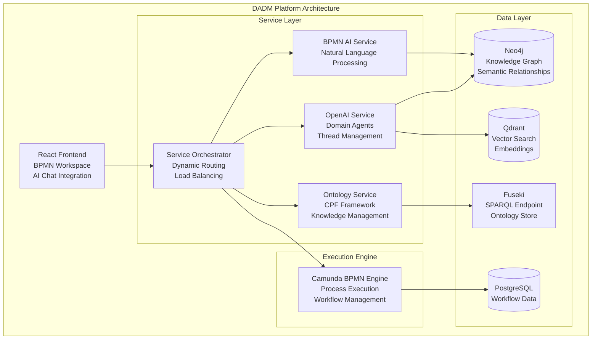
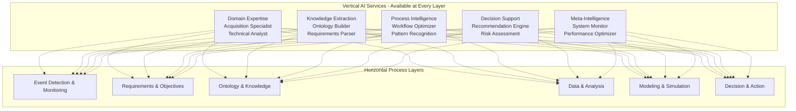
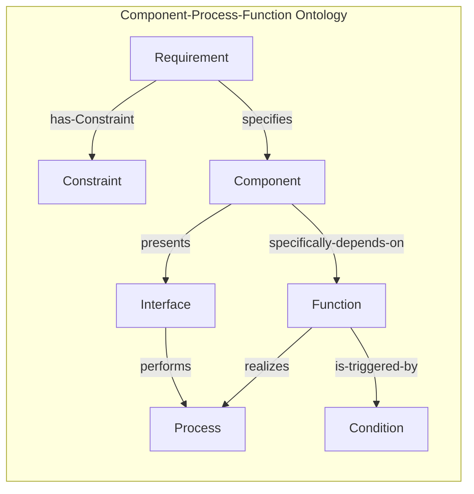
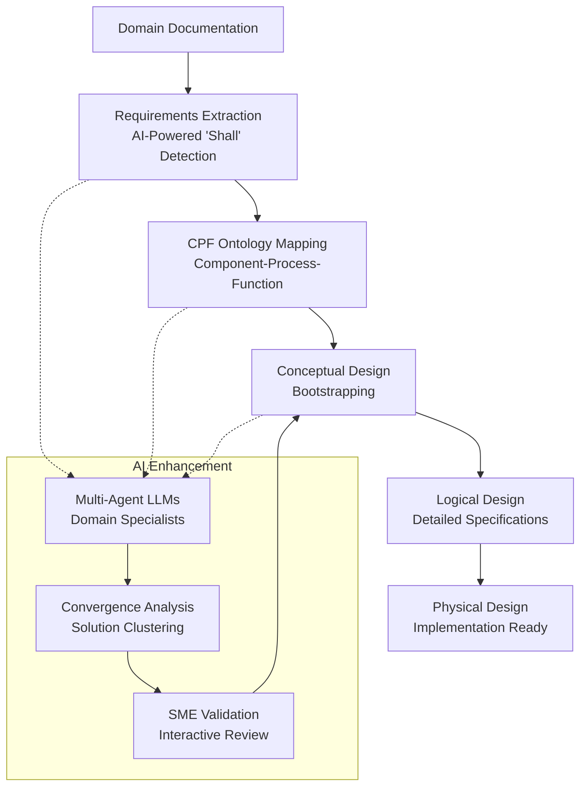
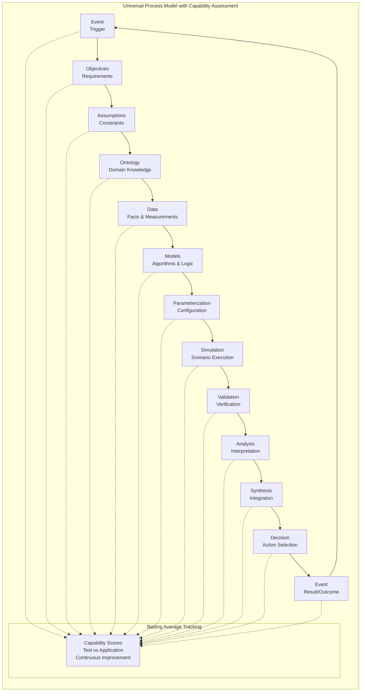

# DADM System Documentation Index
**Date**: July 7, 2025  
**Project**: Decision Analysis & Decision Management (DADM) Platform

## Introduction

This documentation suite represents the comprehensive vision and implementation plan for the Decision Analysis & Decision Management (DADM) Platform - a revolutionary approach that transforms traditional static process modeling into intelligent, executable knowledge management systems. 

DADM bridges the critical gap between requirements documentation and operational implementation by leveraging AI-powered automation, semantic ontologies, and real-time process execution. The platform enables organizations to move beyond static documentation toward living, learning systems that continuously improve decision-making capabilities.

The following documents provide detailed coverage of DADM's architecture, implementation strategies, competitive positioning, and real-world applications, with particular focus on complex domains such as defense acquisition, systems engineering, and enterprise process optimization.

## System Architecture and Core Concepts

DADM's architecture is built on four foundational pillars: intelligent AI services, semantic knowledge management, executable process engines, and comprehensive data integration. The following diagram illustrates how these components work together to create a unified platform for decision analysis and management.

The architecture enables seamless integration between human expertise and AI capabilities, ensuring that domain knowledge is captured, structured, and made actionable through executable processes.

## Overview Documents

### [System Status and MVP Overview](Status_MVP_and_Nextsteps_7_7_25.md)
Executive summary of current capabilities, competitive advantages, and development roadmap.

### [Architecture Overview](architecture_overview.md)
Comprehensive technical architecture including microservices, AI integration, and data management layers.

### [Ontology Framework](ontology_framework.md)
Component-Process-Function (CPF) ontology integration, AI-powered extraction, and knowledge management.

### [Requirements Management System](requirements_management.md)
Requirements extraction, evaluation, capture, and management from domain documentation.

### [Service Architecture](service_architecture.md)
Flexible service layer design, orchestration capabilities, and microservice integration patterns.

### [Prompt Service Management](prompt_service_management.md)
Centralized prompt management, validation framework, and governance controls for AI interactions.

### [AI Integration Strategy](ai_integration_strategy.md)
Hidden AI architecture, domain agents, and intelligent process assistance.

DADM's AI integration strategy employs a unique "hidden AI" approach where intelligent agents operate transparently within standard business processes. The architecture provides vertical AI services that enhance every horizontal process layer:

This matrix approach ensures that AI capabilities are available wherever they add value, while maintaining the familiar workflows that users expect.

### [Capability Assessment Framework](capability_assessment.md)
Performance measurement, "batting average" tracking, and continuous improvement mechanisms.

## Technical Implementation Guides

The technical implementation of DADM relies on sophisticated knowledge representation and AI-powered automation. Central to this approach is the Component-Process-Function (CPF) ontology framework, which provides the semantic foundation for all system operations.

### Core Ontology Framework

The CPF ontology establishes the fundamental relationships between system elements, enabling automated reasoning and intelligent process generation:

This ontological foundation enables DADM to understand domain relationships and automatically generate coherent, traceable system designs.

### Implementation Documents

### [Ontology Extraction Process](ontology_extraction_process.md)
Detailed workflow for AI-powered ontology development with convergence criteria and SME validation.

### [Conceptual Design Bootstrapping](conceptual_design_bootstrapping.md)
Using CPF ontology and extracted requirements to automatically generate conceptual system designs.

The design bootstrapping process represents DADM's core innovation: the ability to automatically transform domain requirements into executable system designs. This transformation follows a systematic flow from documentation analysis through AI-enhanced design generation:

This automated pipeline ensures that human domain expertise is captured, validated, and transformed into actionable system designs with full traceability.

### [Real Impact Analysis](real_impact_analysis.md)
Methodologies for measuring actual system performance and decision quality outcomes.

DADM's capability assessment framework provides continuous measurement and improvement of decision-making processes. The universal process model integrates "batting average" tracking at every stage, enabling organizations to quantify and improve their decision-making capabilities:

This continuous assessment approach transforms abstract performance metrics into actionable intelligence that drives systematic improvement across all organizational processes.

## Competitive Analysis

### [SysML vs DADM Comparison](sysml_vs_dadm.md)
Detailed comparison highlighting executable vs. static modeling approaches.

### [Market Positioning](market_positioning.md)
Target markets, unique value propositions, and competitive advantages.

## Development Roadmap

### [Phase 1: Ontology Foundation](phase1_ontology_foundation.md)
Apache Jena/Fuseki integration, domain knowledge services, multi-agent extraction pipeline.

### [Phase 2: Hidden AI Enhancement](phase2_ai_enhancement.md)
Background agent framework, intelligent assistance, automatic data object generation.

### [Phase 3: Advanced Integration](phase3_advanced_integration.md)
Cross-domain integration, program bootstrapping, comprehensive capability assessment.

## Use Cases and Examples

### [Aircraft Acquisition MVP](aircraft_acquisition_mvp.md)
Detailed MVP scenario using aircraft acquisition as the primary use case.

### [Process Modeling Examples](process_modeling_examples.md)
Sample workflows, templates, and best practices for executable process design.

---

*This documentation suite represents the comprehensive vision and implementation plan for transforming process modeling from static documentation to executable knowledge management.*
