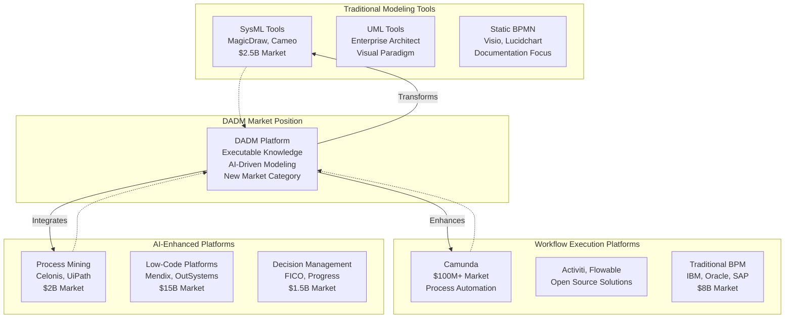
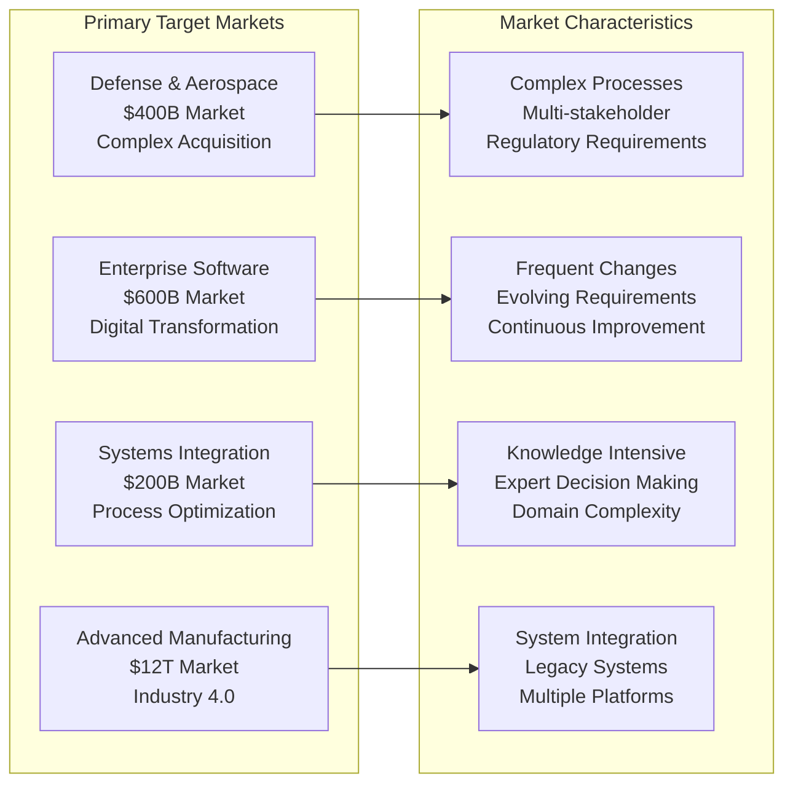
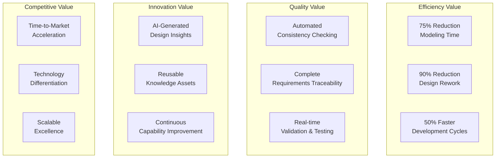
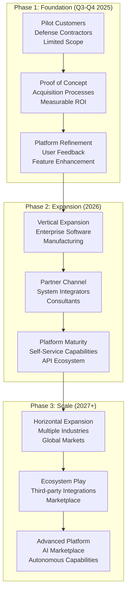
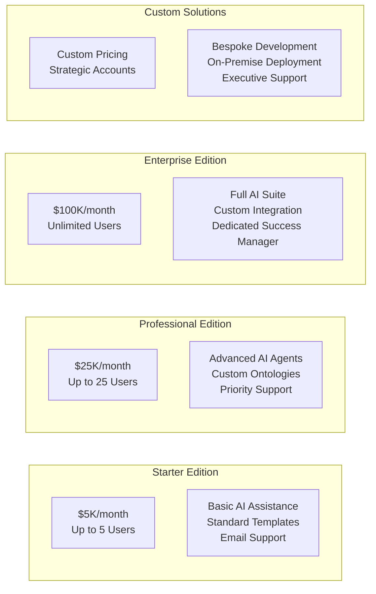
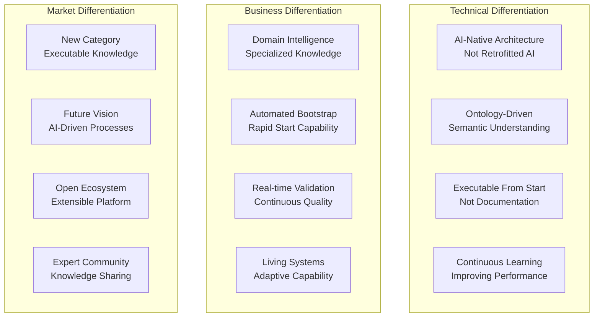

# Market Positioning
**Date**: July 7, 2025  
**Project**: Decision Analysis and Decision Management (DADM) Platform

## Executive Summary

DADM positions itself as the next-generation platform that transforms traditional static process modeling into intelligent, executable knowledge management. By combining AI-powered automation with proven workflow execution, DADM creates a new market category that bridges the gap between documentation-focused modeling tools and operational business systems.

## Market Landscape Analysis

## Competitive Analysis Matrix

### Direct Competitors Comparison

| Feature | DADM | Camunda | SysML Tools | Low-Code Platforms | Process Mining |
|---------|------|---------|-------------|-------------------|----------------|
| **AI-Powered Modeling** | ✅ Core Feature | ❌ Not Available | ❌ Not Available | 🔶 Limited | 🔶 Analysis Only |
| **Executable Processes** | ✅ Native | ✅ Core Feature | ❌ Static Only | ✅ Generated Apps | ❌ Analysis Only |
| **Requirements Integration** | ✅ Automated | 🔶 Manual | ✅ Manual | 🔶 Basic | ❌ Not Available |
| **Ontology Management** | ✅ Core Feature | ❌ Not Available | 🔶 Limited | ❌ Not Available | ❌ Not Available |
| **Domain Intelligence** | ✅ Multi-Agent AI | ❌ Not Available | ❌ Not Available | 🔶 Templates | 🔶 Pattern Recognition |
| **Continuous Learning** | ✅ Built-in | ❌ Not Available | ❌ Not Available | ❌ Not Available | 🔶 Process Discovery |
| **Knowledge Extraction** | ✅ Automated | 🔶 Manual | 🔶 Manual | ❌ Not Available | 🔶 Data Mining |
| **Real-time Validation** | ✅ Continuous | 🔶 Testing | ❌ Post-hoc | 🔶 Runtime | ✅ Monitoring |

### Positioning Against Key Competitors

#### vs. Traditional BPM (Camunda, IBM, Oracle)
**DADM Advantages:**
- AI-powered process generation vs. manual modeling
- Automatic requirements integration vs. separate documentation
- Intelligent domain assistance vs. generic workflow tools
- Continuous learning and optimization vs. static configurations

**Market Message:** "Transform manual process modeling into intelligent automation"

#### vs. SysML Tools (MagicDraw, Enterprise Architect)
**DADM Advantages:**
- Executable models vs. static documentation
- AI-enhanced modeling vs. manual diagram creation
- Real-time validation vs. post-design verification
- Living knowledge graphs vs. static model repositories

**Market Message:** "Evolve from documentation to execution"

#### vs. Low-Code Platforms (Mendix, OutSystems)
**DADM Advantages:**
- Domain-specific intelligence vs. generic application generation
- Requirements-driven development vs. template-based construction
- Ontology-powered reasoning vs. simple data modeling
- Process-centric vs. application-centric approach

**Market Message:** "Build intelligent processes, not just applications"

#### vs. Process Mining (Celonis, UiPath)
**DADM Advantages:**
- Proactive process design vs. reactive process analysis
- Forward-looking optimization vs. historical pattern recognition
- Executable improvement vs. analytical insights
- End-to-end lifecycle vs. analysis-only focus

**Market Message:** "Design intelligent processes, don't just analyze existing ones"

## Target Market Segmentation

### Primary Markets

### Market Size and Opportunity

#### Serviceable Addressable Market (SAM)
| Market Segment | Size | DADM Applicability | Opportunity |
|----------------|------|-------------------|-------------|
| **Process Automation** | $12B | 60% (AI-enhanced processes) | $7.2B |
| **Systems Engineering** | $25B | 40% (executable modeling) | $10B |
| **Decision Management** | $1.5B | 80% (ontology-driven) | $1.2B |
| **Low-Code Development** | $15B | 30% (process-centric) | $4.5B |
| **Digital Transformation** | $500B | 5% (knowledge management) | $25B |
| **Total SAM** | | | **$48B** |

#### Total Addressable Market (TAM)
- **Knowledge Workers**: 1.25 billion globally
- **Process-Intensive Organizations**: 500,000+ enterprises
- **Average Process Complexity**: 50+ interconnected processes per organization
- **Market Penetration Potential**: 10-15% in 10 years
- **Estimated TAM**: $150B+ by 2035

### Customer Personas

#### Primary Persona: Enterprise Process Architect
**Profile:**
- **Role**: Senior Systems Engineer, Process Architect, Digital Transformation Lead
- **Experience**: 10+ years in process modeling and system design
- **Pain Points**: Manual modeling overhead, requirement-design gaps, static documentation
- **Goals**: Accelerate development, improve quality, reduce rework
- **Value Proposition**: AI-powered automation that preserves control and expertise

#### Secondary Persona: Domain Expert/SME
**Profile:**
- **Role**: Subject Matter Expert, Business Analyst, Requirements Engineer
- **Experience**: 15+ years domain expertise, limited technical modeling experience
- **Pain Points**: Knowledge capture difficulty, communication gaps with technical teams
- **Goals**: Effective knowledge transfer, reduced documentation burden
- **Value Proposition**: Natural language interaction with intelligent knowledge capture

#### Tertiary Persona: IT Executive/CTO
**Profile:**
- **Role**: Chief Technology Officer, VP Engineering, IT Director
- **Experience**: Strategic technology leadership, budget authority
- **Pain Points**: ROI on modeling tools, scalability of manual processes, competitive advantage
- **Goals**: Technology differentiation, operational efficiency, future-ready architecture
- **Value Proposition**: Strategic competitive advantage through AI-enhanced capabilities

## Value Proposition Framework

### Core Value Propositions

### Industry-Specific Value Messages

#### Defense & Aerospace
**Primary Message:** "Accelerate complex acquisition programs with AI-powered process intelligence"
- Reduce acquisition timeline by 30-40%
- Ensure regulatory compliance through automated validation
- Capture and reuse expert knowledge across programs
- Enable rapid adaptation to changing requirements

#### Enterprise Software
**Primary Message:** "Transform digital transformation with executable knowledge management"
- Accelerate software delivery through automated requirements processing
- Improve quality through continuous validation and testing
- Scale best practices across development teams
- Enable AI-driven process optimization

#### Consulting & Systems Integration
**Primary Message:** "Deliver superior client outcomes with intelligent process automation"
- Differentiate through advanced AI capabilities
- Accelerate project delivery with automated modeling
- Capture and reuse methodology knowledge
- Provide measurable ROI through process intelligence

#### Manufacturing & Industrial
**Primary Message:** "Enable Industry 4.0 with intelligent process orchestration"
- Integrate operational technology with AI-driven processes
- Optimize manufacturing workflows through continuous learning
- Enable predictive process management
- Scale operational excellence across facilities

## Go-to-Market Strategy

### Market Entry Approach

### Pricing Strategy

#### Tiered Pricing Model

#### Value-Based Pricing Justification
- **Starter**: Replaces $50K+ annual modeling tool costs with 10x productivity
- **Professional**: Saves $500K+ annually in development time and rework
- **Enterprise**: Enables $2M+ annual value through process optimization
- **Custom**: Strategic transformation value measured in tens of millions

### Sales Strategy

#### Direct Sales Approach
- **Target Accounts**: Fortune 1000 companies with complex processes
- **Sales Cycle**: 6-12 months for initial deployment
- **Proof of Concept**: 30-90 day pilot projects with measurable outcomes
- **Success Metrics**: Time savings, quality improvements, ROI demonstration

#### Partner Channel Strategy
- **Systems Integrators**: Accenture, Deloitte, IBM, Capgemini
- **Technology Partners**: Camunda, Microsoft, Amazon, Google
- **Industry Partners**: Defense contractors, software vendors, manufacturing OEMs
- **Value Proposition**: Enhanced service offerings with AI capabilities

## Competitive Differentiation

### Unique Competitive Advantages

### Barrier to Entry Creation

#### Technology Moats
- **AI Model Training**: Domain-specific AI models trained on years of expert knowledge
- **Ontology Library**: Comprehensive, validated domain ontologies
- **Integration Ecosystem**: Deep integrations with enterprise systems
- **Learning Network**: Continuous improvement through user feedback

#### Business Moats
- **Customer Success**: Proven ROI and transformation outcomes
- **Expert Network**: Community of domain experts and practitioners
- **Partner Ecosystem**: Strong relationships with key technology and service partners
- **Brand Recognition**: Thought leadership in executable knowledge management

### Defensive Strategy

#### Against Large Platform Players
- **Focus**: Maintain specialized domain expertise advantage
- **Partnerships**: Strategic alliances with complementary platforms
- **Innovation Speed**: Rapid feature development and deployment
- **Community**: Build strong user and expert communities

#### Against Open Source Alternatives
- **Value-Added Services**: Professional services and support
- **Enterprise Features**: Security, scalability, compliance capabilities
- **Domain Expertise**: Specialized knowledge that's difficult to replicate
- **Ecosystem**: Commercial-grade integrations and partnerships

## Success Metrics and KPIs

### Market Penetration Metrics
- **Market Share**: Target 5% of process automation market by 2030
- **Customer Acquisition**: 100+ enterprise customers by end of 2026
- **Revenue Growth**: $50M ARR by 2027, $200M ARR by 2030
- **Geographic Expansion**: North America (2025), Europe (2026), Asia-Pacific (2027)

### Competitive Position Metrics
- **Win Rate**: >70% in competitive evaluations by 2026
- **Customer Retention**: >95% annual retention rate
- **Net Promoter Score**: >50 (industry leading)
- **Market Recognition**: Top 3 in analyst reports by 2027

### Technology Leadership Metrics
- **AI Capability**: Measurable superiority in modeling automation
- **Platform Adoption**: >10,000 processes deployed by 2027
- **Innovation Rate**: Monthly feature releases with customer-driven enhancements
- **Ecosystem Growth**: >50 third-party integrations by 2028

---

*DADM's market positioning leverages the convergence of AI maturity, process automation needs, and digital transformation demands to create a new category of executable knowledge management that transforms how organizations approach complex process modeling and execution.*
