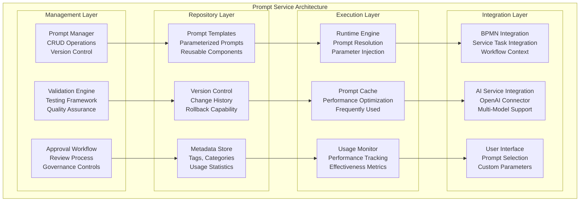
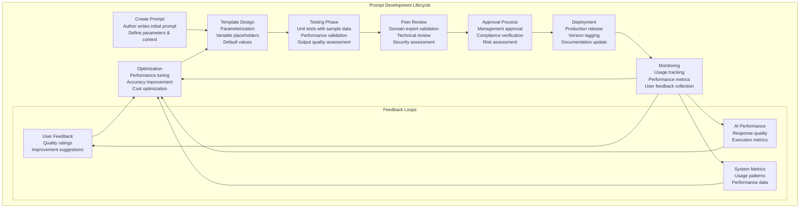
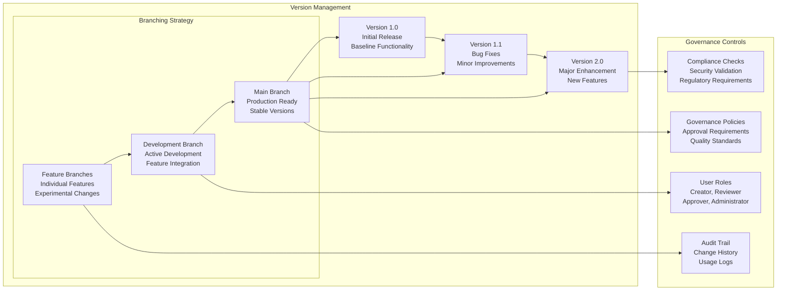
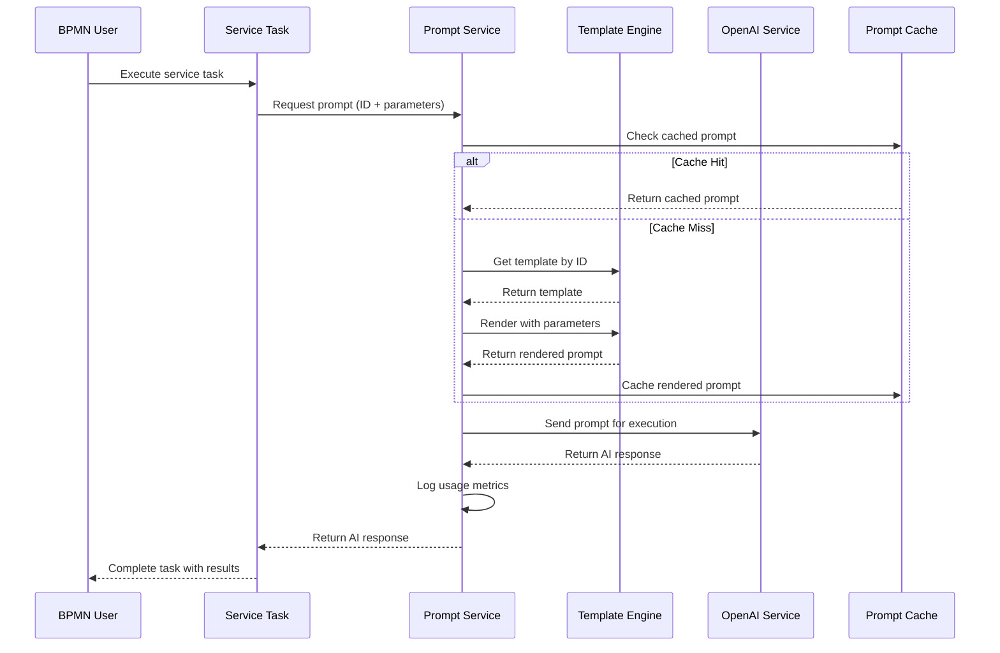
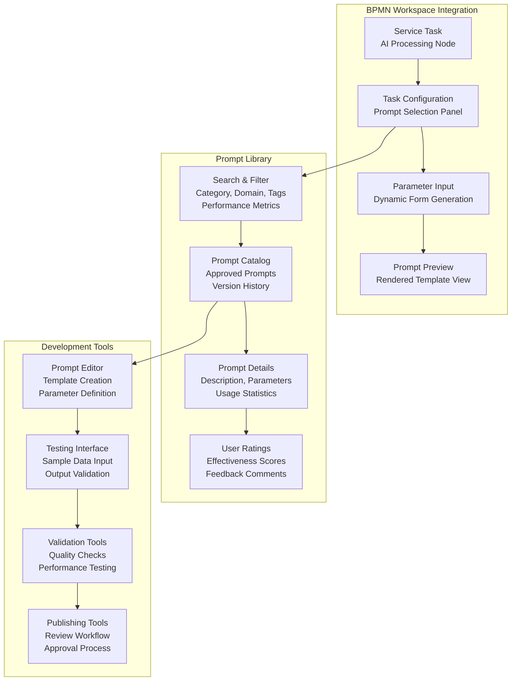
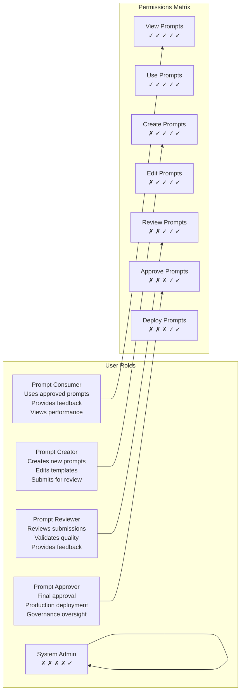
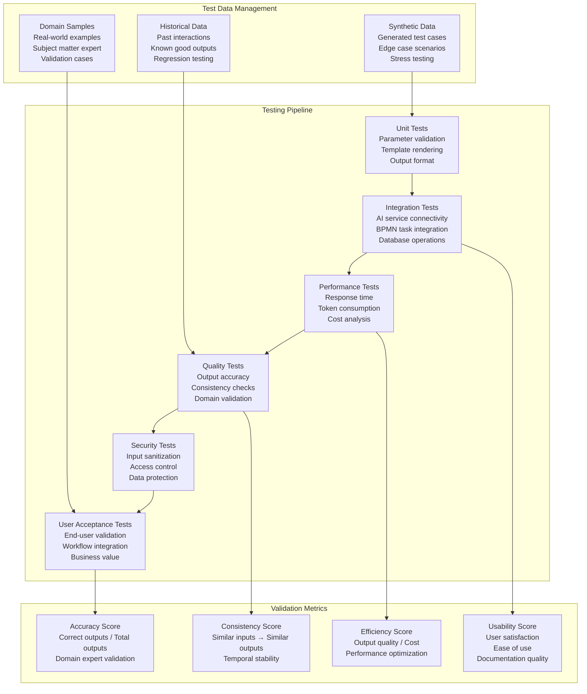
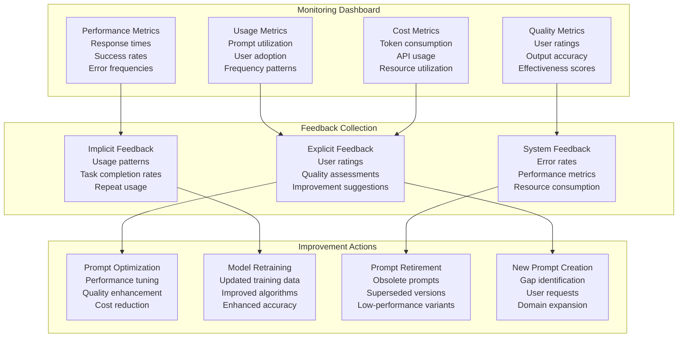

# DADM Prompt Service Management
**Date**: July 7, 2025  
**Project**: Decision Analysis & Decision Management (DADM) Platform

## Executive Summary

The DADM Prompt Service provides centralized management, validation, and governance of AI prompts across the platform. This service ensures consistent, high-quality AI interactions while enabling controlled experimentation and continuous improvement of prompt effectiveness. The service bridges user requirements with validated, tested prompts that integrate seamlessly with BPMN workflows and AI agents.

## Prompt Service Architecture



## Prompt Lifecycle Management

### Creation and Development Process



### Version Control and Governance



## Prompt Template System

### Template Structure and Parameterization

```json
{
  "promptTemplate": {
    "id": "aircraft-requirement-analysis-v2.1",
    "name": "Aircraft Requirement Analysis",
    "category": "requirements",
    "domain": "acquisition",
    "version": "2.1.0",
    "status": "approved",
    "description": "Analyzes aircraft requirements for completeness and consistency",
    
    "template": {
      "systemPrompt": "You are an expert aircraft acquisition specialist with deep knowledge of FAR Part 25 regulations, DoD procurement processes, and commercial aviation requirements. Your role is to analyze aircraft requirements for completeness, consistency, and feasibility.",
      
      "userPrompt": "Analyze the following {{requirementType}} requirements for {{aircraftType}} acquisition:\n\n{{requirementText}}\n\nFocus areas:\n{{#each focusAreas}}- {{this}}\n{{/each}}\n\nProvide analysis in the following format:\n1. Completeness Assessment\n2. Consistency Check\n3. Feasibility Analysis\n4. Risk Identification\n5. Recommendations\n\nContext: {{projectContext}}",
      
      "parameters": {
        "requirementType": {
          "type": "enum",
          "values": ["functional", "performance", "operational", "regulatory"],
          "required": true,
          "description": "Type of requirements being analyzed"
        },
        "aircraftType": {
          "type": "string",
          "required": true,
          "description": "Type of aircraft (e.g., commercial transport, military fighter)"
        },
        "requirementText": {
          "type": "text",
          "required": true,
          "maxLength": 10000,
          "description": "The requirement text to be analyzed"
        },
        "focusAreas": {
          "type": "array",
          "items": "string",
          "required": false,
          "default": ["safety", "performance", "cost", "schedule"],
          "description": "Specific areas to focus the analysis on"
        },
        "projectContext": {
          "type": "string",
          "required": false,
          "description": "Additional project context and constraints"
        }
      }
    },
    
    "validation": {
      "testCases": [
        {
          "name": "Commercial Transport Requirements",
          "parameters": {
            "requirementType": "performance",
            "aircraftType": "commercial transport",
            "requirementText": "The aircraft shall transport 150 passengers over 3000nm range at Mach 0.8 cruise speed.",
            "focusAreas": ["performance", "fuel efficiency", "certification"],
            "projectContext": "New generation narrow-body aircraft for medium-haul routes"
          },
          "expectedOutputContains": ["range analysis", "passenger capacity", "certification requirements"]
        }
      ],
      "qualityMetrics": {
        "responseTime": "< 10 seconds",
        "accuracy": "> 90%",
        "completeness": "> 95%",
        "userSatisfaction": "> 4.0/5.0"
      }
    },
    
    "metadata": {
      "author": "Sarah Johnson",
      "reviewer": "Mike Chen",
      "approver": "Dr. Amanda Smith",
      "created": "2025-06-15",
      "lastModified": "2025-07-07",
      "tags": ["aircraft", "requirements", "analysis", "acquisition"],
      "usageCount": 247,
      "averageRating": 4.3,
      "cost": {
        "averageTokens": 1250,
        "estimatedCost": "$0.025"
      }
    }
  }
}
```

### Dynamic Prompt Assembly



## User Interface and Controls

### Prompt Selection Interface



### User Permission and Role Management



## Testing and Validation Framework

### Automated Testing Pipeline



### Continuous Monitoring and Improvement



## Implementation Architecture

### Service Implementation

```python
class PromptService:
    def __init__(self, config):
        self.db = PromptDatabase(config.database_url)
        self.template_engine = TemplateEngine()
        self.validator = PromptValidator()
        self.cache = PromptCache(config.redis_url)
        self.metrics = MetricsCollector()
        self.approval_workflow = ApprovalWorkflow()
        
    async def get_prompt(self, prompt_id: str, parameters: dict, context: dict = None):
        """Get and render a prompt with parameters"""
        try:
            # 1. Check cache first
            cache_key = f"{prompt_id}:{hash(str(parameters))}"
            cached_prompt = await self.cache.get(cache_key)
            if cached_prompt:
                self.metrics.record_cache_hit(prompt_id)
                return cached_prompt
            
            # 2. Get prompt template
            template = await self.db.get_prompt_template(prompt_id)
            if not template:
                raise PromptNotFoundError(f"Prompt {prompt_id} not found")
            
            # 3. Validate parameters
            validated_params = self.validator.validate_parameters(
                template.parameters, parameters
            )
            
            # 4. Render template
            rendered_prompt = self.template_engine.render(
                template.template, validated_params, context
            )
            
            # 5. Cache rendered prompt
            await self.cache.set(cache_key, rendered_prompt, ttl=3600)
            
            # 6. Record usage metrics
            self.metrics.record_prompt_usage(prompt_id, parameters, context)
            
            return rendered_prompt
            
        except Exception as e:
            self.metrics.record_error(prompt_id, str(e))
            raise
    
    async def create_prompt(self, prompt_data: dict, author: str):
        """Create a new prompt template"""
        # 1. Validate prompt structure
        validated_prompt = self.validator.validate_prompt_structure(prompt_data)
        
        # 2. Run initial tests
        test_results = await self.run_prompt_tests(validated_prompt)
        
        # 3. Create draft version
        prompt_id = await self.db.create_prompt_draft(
            validated_prompt, author, test_results
        )
        
        # 4. Start approval workflow
        await self.approval_workflow.start_review(prompt_id, author)
        
        return {
            "prompt_id": prompt_id,
            "status": "draft",
            "test_results": test_results
        }
    
    async def approve_prompt(self, prompt_id: str, approver: str, version: str = None):
        """Approve a prompt for production use"""
        # 1. Get prompt and validate approval permissions
        prompt = await self.db.get_prompt_draft(prompt_id)
        await self.approval_workflow.validate_approver(prompt_id, approver)
        
        # 2. Run comprehensive validation
        validation_results = await self.comprehensive_validation(prompt)
        
        if not validation_results.passed:
            raise ValidationError("Prompt failed validation", validation_results.errors)
        
        # 3. Deploy to production
        production_id = await self.db.deploy_prompt_to_production(
            prompt_id, approver, version, validation_results
        )
        
        # 4. Clear related caches
        await self.cache.clear_pattern(f"{prompt_id}:*")
        
        # 5. Send notifications
        await self.approval_workflow.notify_deployment(production_id, approver)
        
        return {
            "production_id": production_id,
            "status": "approved",
            "validation_results": validation_results
        }
```

### Database Schema

```sql
-- Prompt Templates Table
CREATE TABLE prompt_templates (
    id UUID PRIMARY KEY DEFAULT gen_random_uuid(),
    name VARCHAR(255) NOT NULL,
    category VARCHAR(100) NOT NULL,
    domain VARCHAR(100),
    version VARCHAR(20) NOT NULL,
    status VARCHAR(50) NOT NULL DEFAULT 'draft', -- draft, review, approved, deprecated
    description TEXT,
    system_prompt TEXT,
    user_prompt TEXT NOT NULL,
    parameters JSONB NOT NULL DEFAULT '{}',
    validation_config JSONB NOT NULL DEFAULT '{}',
    metadata JSONB NOT NULL DEFAULT '{}',
    author_id UUID NOT NULL,
    reviewer_id UUID,
    approver_id UUID,
    created_at TIMESTAMP DEFAULT CURRENT_TIMESTAMP,
    updated_at TIMESTAMP DEFAULT CURRENT_TIMESTAMP,
    approved_at TIMESTAMP,
    UNIQUE(name, version)
);

-- Prompt Usage Logs Table
CREATE TABLE prompt_usage_logs (
    id UUID PRIMARY KEY DEFAULT gen_random_uuid(),
    prompt_id UUID NOT NULL REFERENCES prompt_templates(id),
    user_id UUID NOT NULL,
    session_id VARCHAR(255),
    parameters JSONB NOT NULL DEFAULT '{}',
    context JSONB,
    execution_time_ms INTEGER,
    token_count INTEGER,
    cost_usd DECIMAL(10, 6),
    success BOOLEAN NOT NULL DEFAULT true,
    error_message TEXT,
    created_at TIMESTAMP DEFAULT CURRENT_TIMESTAMP
);

-- User Feedback Table
CREATE TABLE prompt_feedback (
    id UUID PRIMARY KEY DEFAULT gen_random_uuid(),
    prompt_id UUID NOT NULL REFERENCES prompt_templates(id),
    user_id UUID NOT NULL,
    usage_log_id UUID REFERENCES prompt_usage_logs(id),
    rating INTEGER CHECK (rating >= 1 AND rating <= 5),
    feedback_text TEXT,
    improvement_suggestions TEXT,
    created_at TIMESTAMP DEFAULT CURRENT_TIMESTAMP
);

-- Prompt Test Results Table
CREATE TABLE prompt_test_results (
    id UUID PRIMARY KEY DEFAULT gen_random_uuid(),
    prompt_id UUID NOT NULL REFERENCES prompt_templates(id),
    test_type VARCHAR(50) NOT NULL, -- unit, integration, performance, quality
    test_name VARCHAR(255) NOT NULL,
    passed BOOLEAN NOT NULL,
    score DECIMAL(5, 4),
    execution_time_ms INTEGER,
    details JSONB,
    run_at TIMESTAMP DEFAULT CURRENT_TIMESTAMP
);
```

## Integration Points

### BPMN Service Task Integration

The Prompt Service integrates seamlessly with BPMN service tasks, allowing users to select and configure prompts directly within their workflow designs:

1. **Task Configuration**: Service tasks can be configured to use specific prompts
2. **Parameter Mapping**: BPMN variables map to prompt parameters
3. **Response Handling**: AI responses are captured as process variables
4. **Error Handling**: Prompt execution errors are handled within the BPMN flow

### OpenAI Service Integration

The Prompt Service works closely with the OpenAI Service to ensure optimal AI interactions:

1. **Prompt Delivery**: Validated prompts are delivered to the OpenAI Service
2. **Model Selection**: Prompts can specify preferred AI models
3. **Cost Tracking**: Token usage and costs are tracked per prompt
4. **Performance Monitoring**: Response times and quality are measured

### Knowledge Base Integration

Prompts can leverage the DADM knowledge base for enhanced context:

1. **Ontology Integration**: Prompts can reference CPF ontology concepts
2. **Domain Knowledge**: Prompts access relevant domain expertise
3. **Historical Context**: Previous decisions and outcomes inform prompt context
4. **Dynamic Enhancement**: Real-time knowledge updates enhance prompt effectiveness

---

*The DADM Prompt Service transforms ad-hoc AI interactions into a governed, optimized, and continuously improving capability that ensures consistent, high-quality results across all platform operations.*
