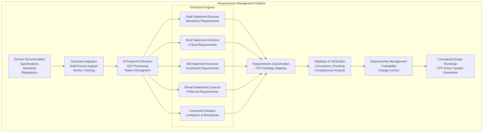
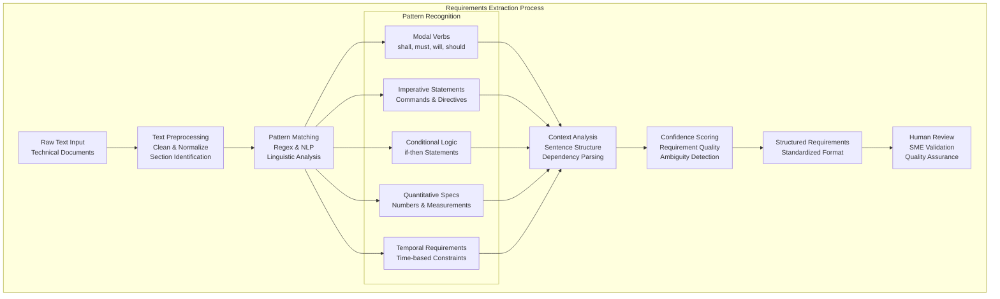
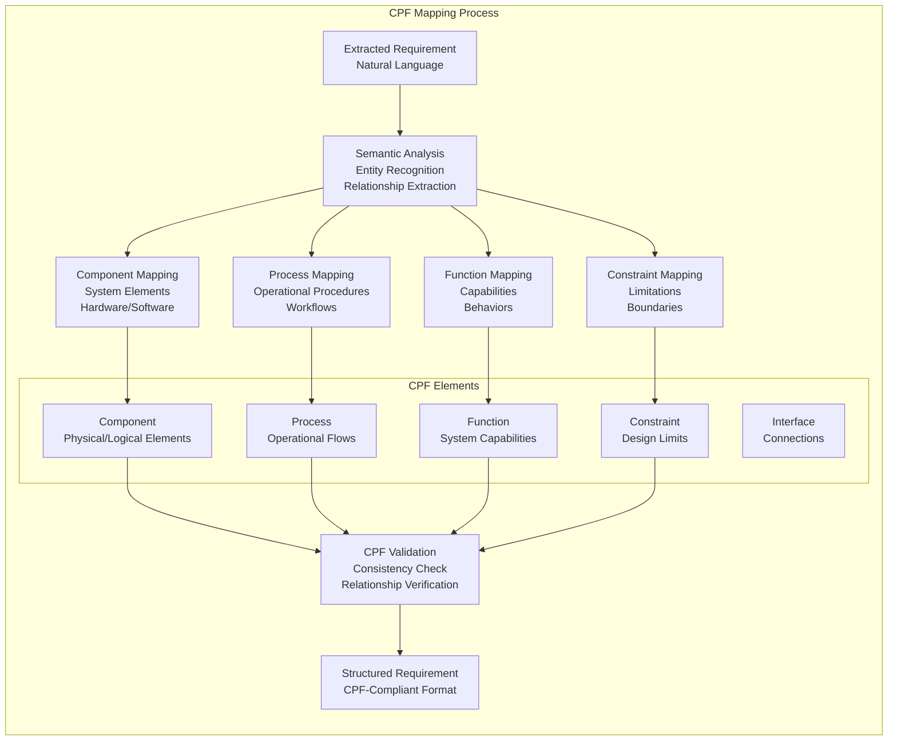
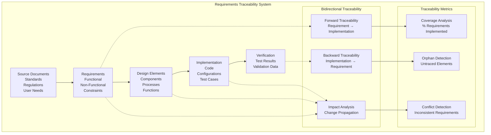
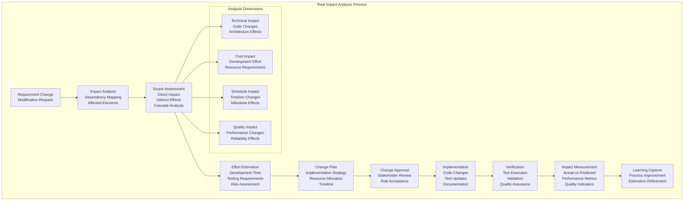
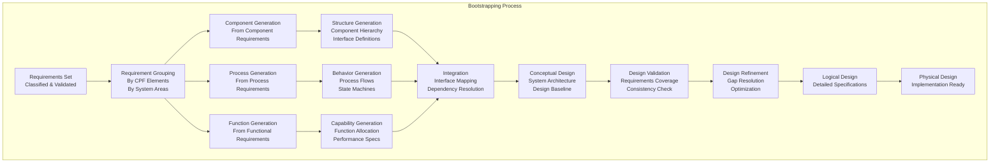

# DADM Requirements Management System
**Requirements Extraction, Evaluation, Capture, and Management from Domain Documentation**

## Overview

The DADM Requirements Management System transforms traditional document-based requirements into executable, traceable, and manageable system specifications. By leveraging AI-powered extraction and CPF ontology mapping, the system automatically identifies, classifies, and structures requirements from domain documentation.

## Requirements Management Architecture



## AI-Powered Requirements Extraction

### **Multi-Pattern Extraction Engine**



### **Advanced Extraction Implementation**

```python
class RequirementsExtractor:
    def __init__(self, cpf_ontology, llm_service):
        self.cpf = cpf_ontology
        self.llm = llm_service
        self.patterns = RequirementPatterns()
        self.classifier = RequirementClassifier(cpf_ontology)
        
    def extract_requirements(self, document):
        """Extract and classify requirements from document"""
        # 1. Preprocess document
        preprocessed = self.preprocess_document(document)
        
        # 2. Apply pattern matching
        raw_requirements = self.apply_patterns(preprocessed)
        
        # 3. Use LLM for context understanding
        contextualized = self.llm.analyze_requirements_context(raw_requirements)
        
        # 4. Classify using CPF ontology
        classified = self.classifier.classify_requirements(contextualized)
        
        # 5. Calculate confidence scores
        scored = self.calculate_confidence_scores(classified)
        
        return scored
    
    def apply_patterns(self, text):
        """Apply multiple extraction patterns"""
        requirements = []
        
        # Modal verb patterns
        modal_patterns = [
            r'(?:system|component|interface|user|operator)\s+(?:shall|must|will)\s+(.+?)(?:\.|;|$)',
            r'(?:shall|must|will)\s+(?:be\s+)?(?:able\s+to\s+)?(.+?)(?:\.|;|$)',
            r'(?:requirement|specification):\s*(?:system|component)?\s*(?:shall|must|will)\s+(.+?)(?:\.|;|$)'
        ]
        
        for pattern in modal_patterns:
            matches = re.findall(pattern, text, re.IGNORECASE | re.MULTILINE)
            for match in matches:
                requirements.append({
                    'text': match.strip(),
                    'type': 'modal_requirement',
                    'pattern': pattern,
                    'confidence': 0.8
                })
        
        # Quantitative requirements
        quantitative_patterns = [
            r'(?:shall|must|will)\s+.*?(\d+(?:\.\d+)?\s*(?:kg|m|s|Hz|V|A|W|°C|dB|%))',
            r'(?:minimum|maximum|at\s+least|no\s+more\s+than)\s+(\d+(?:\.\d+)?)',
            r'(?:between)\s+(\d+(?:\.\d+)?)\s+(?:and)\s+(\d+(?:\.\d+)?)'
        ]
        
        for pattern in quantitative_patterns:
            matches = re.findall(pattern, text, re.IGNORECASE)
            for match in matches:
                requirements.append({
                    'text': match if isinstance(match, str) else ' '.join(match),
                    'type': 'quantitative_requirement',
                    'pattern': pattern,
                    'confidence': 0.9
                })
        
        return requirements
    
    def calculate_confidence_scores(self, requirements):
        """Calculate confidence scores for extracted requirements"""
        for req in requirements:
            confidence_factors = {
                'pattern_strength': self.assess_pattern_strength(req),
                'context_clarity': self.assess_context_clarity(req),
                'linguistic_quality': self.assess_linguistic_quality(req),
                'domain_relevance': self.assess_domain_relevance(req)
            }
            
            req['confidence'] = sum(confidence_factors.values()) / len(confidence_factors)
            req['confidence_factors'] = confidence_factors
        
        return requirements
```

## CPF Ontology Integration

### **Requirements to CPF Mapping**



### **CPF Requirement Classification**

```python
class CPFRequirementClassifier:
    def __init__(self, cpf_ontology, llm_service):
        self.cpf = cpf_ontology
        self.llm = llm_service
        self.classification_rules = self.load_classification_rules()
    
    def classify_requirement(self, requirement):
        """Classify requirement according to CPF ontology"""
        # 1. Extract entities and relationships
        entities = self.extract_entities(requirement['text'])
        relationships = self.extract_relationships(requirement['text'])
        
        # 2. Map to CPF elements
        cpf_mapping = {
            'components': self.identify_components(entities, relationships),
            'processes': self.identify_processes(entities, relationships),
            'functions': self.identify_functions(entities, relationships),
            'interfaces': self.identify_interfaces(entities, relationships),
            'constraints': self.identify_constraints(entities, relationships)
        }
        
        # 3. Validate against CPF ontology
        validated_mapping = self.validate_cpf_mapping(cpf_mapping)
        
        # 4. Enhance with LLM understanding
        enhanced_mapping = self.llm.enhance_cpf_mapping(
            requirement['text'], 
            validated_mapping,
            self.cpf.get_schema()
        )
        
        return {
            **requirement,
            'cpf_mapping': enhanced_mapping,
            'classification_confidence': self.calculate_classification_confidence(enhanced_mapping)
        }
    
    def identify_components(self, entities, relationships):
        """Identify component-related elements"""
        component_indicators = [
            'system', 'subsystem', 'component', 'module', 'unit',
            'hardware', 'software', 'device', 'equipment', 'interface'
        ]
        
        components = []
        for entity in entities:
            if any(indicator in entity.lower() for indicator in component_indicators):
                components.append({
                    'name': entity,
                    'type': self.determine_component_type(entity),
                    'relationships': self.find_component_relationships(entity, relationships)
                })
        
        return components
    
    def identify_processes(self, entities, relationships):
        """Identify process-related elements"""
        process_indicators = [
            'process', 'procedure', 'workflow', 'operation', 'task',
            'activity', 'function', 'method', 'algorithm', 'protocol'
        ]
        
        processes = []
        for entity in entities:
            if any(indicator in entity.lower() for indicator in process_indicators):
                processes.append({
                    'name': entity,
                    'type': self.determine_process_type(entity),
                    'inputs': self.identify_process_inputs(entity, relationships),
                    'outputs': self.identify_process_outputs(entity, relationships)
                })
        
        return processes
```

## Requirements Traceability & Management

### **Traceability Matrix**



### **Change Impact Analysis**



### **Impact Analysis Implementation**

```python
class RequirementsImpactAnalyzer:
    def __init__(self, traceability_db, cpf_ontology, performance_tracker):
        self.traceability = traceability_db
        self.cpf = cpf_ontology
        self.performance = performance_tracker
        self.impact_calculator = ImpactCalculator()
        
    def analyze_change_impact(self, requirement_id, proposed_changes):
        """Perform comprehensive impact analysis for requirement changes"""
        # 1. Get current requirement and its dependencies
        current_req = self.traceability.get_requirement(requirement_id)
        dependencies = self.traceability.get_all_dependencies(requirement_id)
        
        # 2. Analyze direct impacts
        direct_impacts = self.analyze_direct_impacts(current_req, proposed_changes)
        
        # 3. Analyze cascade effects
        cascade_impacts = self.analyze_cascade_impacts(dependencies, proposed_changes)
        
        # 4. Calculate effort and cost estimates
        effort_estimates = self.calculate_effort_estimates(direct_impacts, cascade_impacts)
        
        # 5. Assess risks
        risk_assessment = self.assess_change_risks(direct_impacts, cascade_impacts)
        
        # 6. Generate impact report
        return ImpactAnalysisReport(
            requirement_id=requirement_id,
            proposed_changes=proposed_changes,
            direct_impacts=direct_impacts,
            cascade_impacts=cascade_impacts,
            effort_estimates=effort_estimates,
            risk_assessment=risk_assessment,
            recommendations=self.generate_recommendations(direct_impacts, cascade_impacts)
        )
    
    def analyze_direct_impacts(self, requirement, changes):
        """Analyze immediate impacts of requirement changes"""
        impacts = {
            'design_elements': [],
            'implementation_artifacts': [],
            'test_cases': [],
            'documentation': []
        }
        
        # Check design elements
        for design_element in self.traceability.get_traced_design_elements(requirement.id):
            element_impact = self.assess_design_element_impact(design_element, changes)
            if element_impact.severity > 0:
                impacts['design_elements'].append(element_impact)
        
        # Check implementation artifacts
        for artifact in self.traceability.get_traced_artifacts(requirement.id):
            artifact_impact = self.assess_artifact_impact(artifact, changes)
            if artifact_impact.severity > 0:
                impacts['implementation_artifacts'].append(artifact_impact)
        
        return impacts
    
    def measure_actual_impact(self, change_id, predicted_impact):
        """Measure actual impact vs. predicted impact"""
        actual_metrics = self.performance.get_change_metrics(change_id)
        predicted_metrics = predicted_impact.estimated_metrics
        
        accuracy_analysis = {
            'effort_accuracy': self.calculate_accuracy(
                predicted_metrics.effort, 
                actual_metrics.effort
            ),
            'timeline_accuracy': self.calculate_accuracy(
                predicted_metrics.timeline, 
                actual_metrics.timeline
            ),
            'quality_impact_accuracy': self.calculate_accuracy(
                predicted_metrics.quality_impact, 
                actual_metrics.quality_impact
            )
        }
        
        # Update prediction models based on actual results
        self.impact_calculator.update_models(predicted_impact, actual_metrics)
        
        return accuracy_analysis
```

## Conceptual Design Bootstrapping

### **Requirements-Driven Design Generation**



### **Bootstrap Implementation**

```python
class ConceptualDesignBootstrapper:
    def __init__(self, cpf_ontology, requirements_db, design_generator):
        self.cpf = cpf_ontology
        self.requirements = requirements_db
        self.generator = design_generator
        self.validator = DesignValidator(cpf_ontology)
    
    def bootstrap_from_requirements(self, requirements_set):
        """Generate conceptual design from requirements set"""
        # 1. Group requirements by CPF elements
        grouped_requirements = self.group_requirements_by_cpf(requirements_set)
        
        # 2. Generate system architecture
        architecture = self.generate_system_architecture(grouped_requirements)
        
        # 3. Validate against requirements
        validation_results = self.validate_design_coverage(architecture, requirements_set)
        
        # 4. Refine design based on validation
        refined_design = self.refine_design(architecture, validation_results)
        
        return ConceptualDesign(
            architecture=refined_design,
            requirements_coverage=validation_results,
            traceability_matrix=self.generate_traceability_matrix(refined_design, requirements_set)
        )
    
    def generate_system_architecture(self, grouped_requirements):
        """Generate system architecture from grouped requirements"""
        architecture = SystemArchitecture()
        
        # Generate components
        for comp_req in grouped_requirements['components']:
            component = self.generator.generate_component(comp_req)
            architecture.add_component(component)
        
        # Generate processes
        for proc_req in grouped_requirements['processes']:
            process = self.generator.generate_process(proc_req)
            architecture.add_process(process)
        
        # Generate functions
        for func_req in grouped_requirements['functions']:
            function = self.generator.generate_function(func_req)
            architecture.add_function(function)
        
        # Generate interfaces
        interfaces = self.generator.generate_interfaces(
            architecture.components,
            architecture.processes,
            architecture.functions
        )
        architecture.add_interfaces(interfaces)
        
        return architecture
```

This requirements management system provides the foundation for transforming domain documentation into executable system designs through AI-powered extraction and CPF ontology integration.
