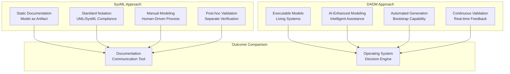
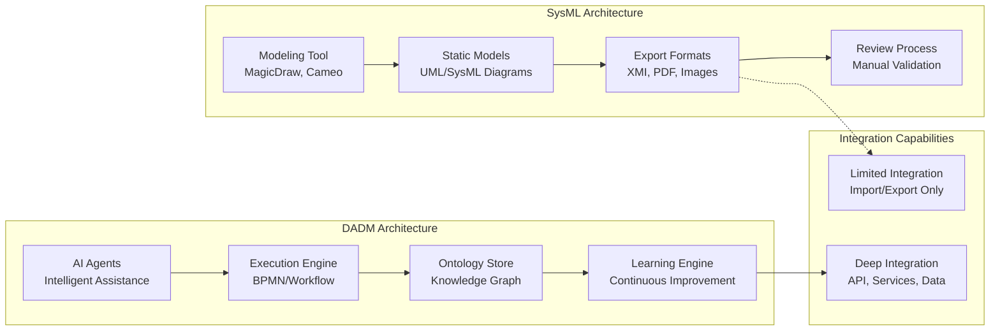
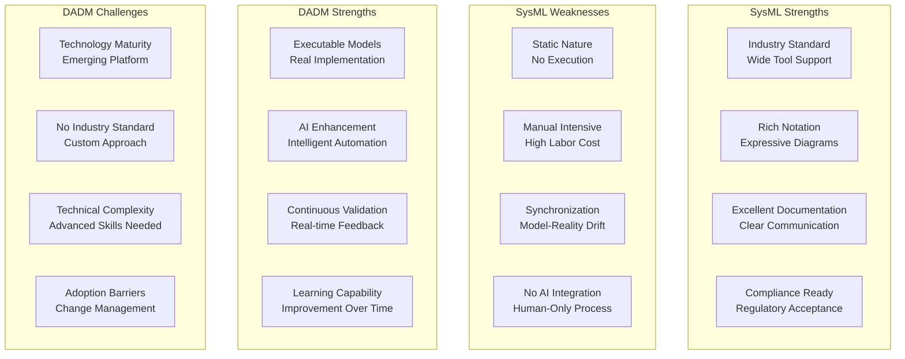
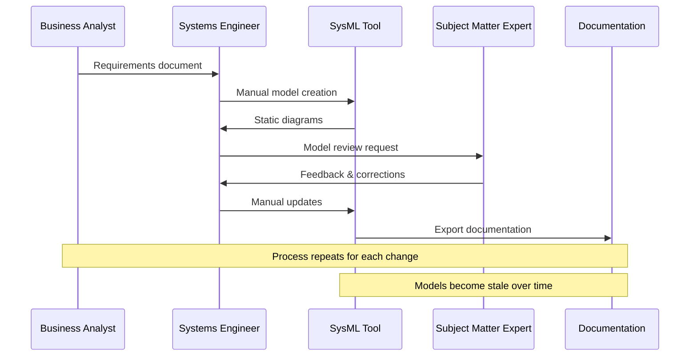
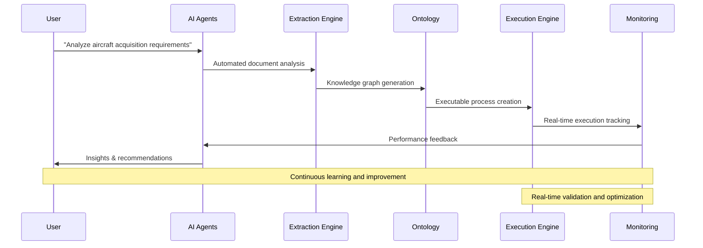
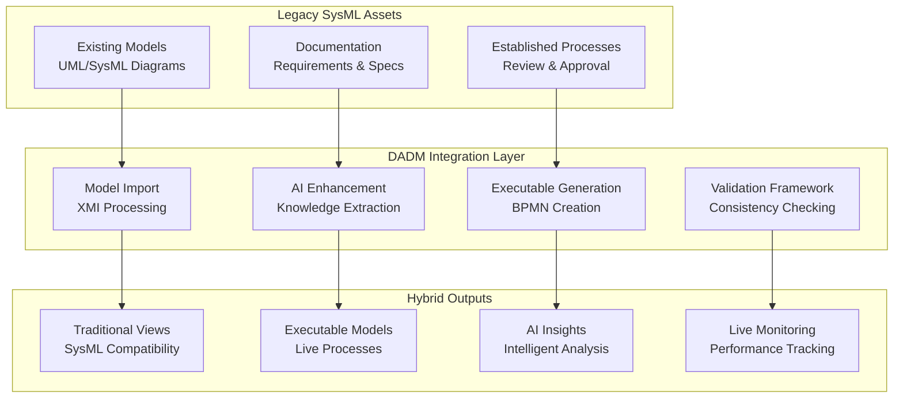
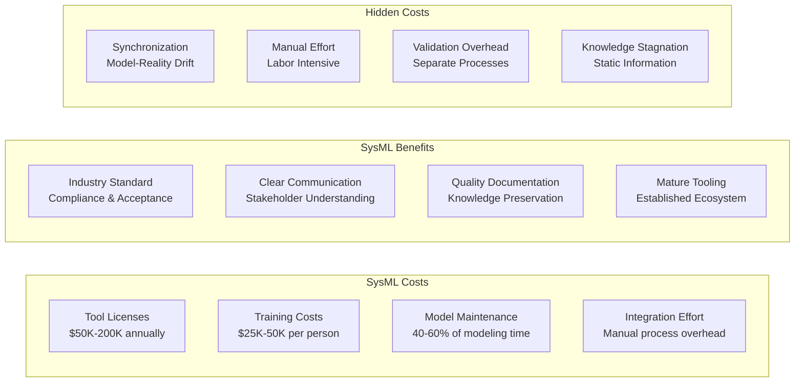
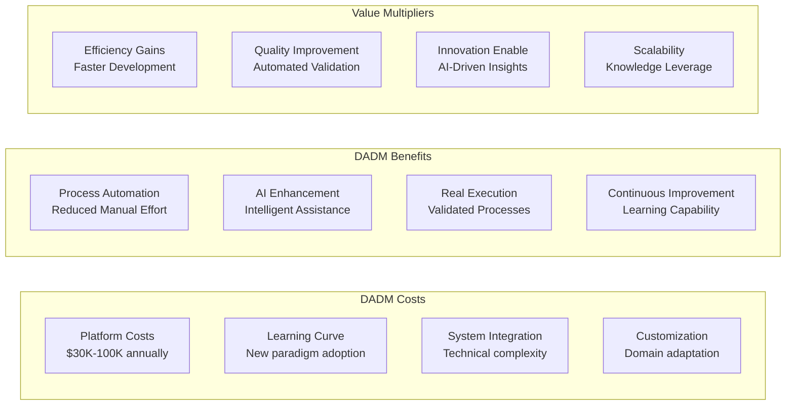

# SysML vs DADM Comparison
**Date**: July 7, 2025  
**Project**: Decision Analysis & Decision Management (DADM) Platform

## Executive Summary

This comprehensive comparison highlights the fundamental differences between traditional SysML-based system modeling and DADM's executable knowledge management approach. While SysML excels at static documentation and standardized notation, DADM transforms modeling into an active, intelligent process that drives real-world execution and continuous improvement.

## Fundamental Philosophy Comparison

## Detailed Feature Comparison

### Modeling Paradigms

| Aspect | SysML | DADM | Advantage |
|--------|-------|------|-----------|
| **Model Purpose** | Documentation & Communication | Execution & Decision Making | DADM |
| **Model Lifecycle** | Create → Document → Archive | Create → Execute → Evolve | DADM |
| **Validation Approach** | Manual Review & Verification | Automated Validation & Learning | DADM |
| **Change Management** | Version Control & Diff | Living Evolution & Adaptation | DADM |
| **Knowledge Integration** | Manual Research & Input | AI-Powered Extraction & Synthesis | DADM |
| **User Interaction** | Static Viewing & Editing | Interactive Querying & Guidance | DADM |

### Technical Architecture Comparison

### Capability Assessment Matrix

## Use Case Comparison: Aircraft Acquisition

### SysML Approach to Aircraft Acquisition

#### SysML Deliverables
1. **Requirement Diagrams**: Static requirement hierarchies and relationships
2. **Block Definition Diagrams**: System structure and composition
3. **Activity Diagrams**: Process flows and decision points
4. **Sequence Diagrams**: Interaction timelines and message flows
5. **Parametric Diagrams**: Constraint relationships and equations

#### SysML Limitations in Aircraft Acquisition
- **Manual Effort**: Every requirement change requires manual model updates
- **Synchronization Issues**: Models drift from actual implementation
- **Limited Validation**: No automatic checking of requirement consistency
- **No Execution**: Models cannot be tested or validated in operation
- **Knowledge Silos**: Domain expertise not captured in the modeling process

### DADM Approach to Aircraft Acquisition

#### DADM Deliverables
1. **Executable Processes**: BPMN workflows that actually run acquisition processes
2. **Knowledge Graphs**: Semantic relationships between requirements, components, and processes
3. **AI-Generated Insights**: Automated analysis and recommendations
4. **Real-time Dashboards**: Live monitoring of acquisition progress and performance
5. **Continuous Learning**: System improvement based on actual outcomes

#### DADM Advantages in Aircraft Acquisition
- **Automated Extraction**: AI extracts requirements from domain documents
- **Executable Validation**: Processes can be tested and refined before implementation
- **Real-time Monitoring**: Continuous tracking of acquisition progress and issues
- **Intelligent Guidance**: AI provides contextual assistance and recommendations
- **Continuous Improvement**: System learns from each acquisition project

## Domain-Specific Comparison

### Software Development Projects

| Capability | SysML | DADM |
|------------|-------|------|
| **Requirements Traceability** | Manual linking | Automated ontology mapping |
| **Architecture Documentation** | Static UML diagrams | Executable architecture models |
| **Process Modeling** | Activity diagrams | BPMN workflows with execution |
| **Integration Testing** | Separate test documentation | Embedded validation processes |
| **Change Impact Analysis** | Manual analysis | AI-powered impact assessment |

### Systems Engineering Projects

| Capability | SysML | DADM |
|------------|-------|------|
| **System Decomposition** | Block definition diagrams | CPF ontology with relationships |
| **Interface Management** | Interface block diagrams | Executable interface specifications |
| **Verification & Validation** | Separate V&V plans | Continuous validation framework |
| **Configuration Management** | Version control of models | Living system evolution |
| **Stakeholder Communication** | Static documentation | Interactive AI-assisted exploration |

### Business Process Improvement

| Capability | SysML | DADM |
|------------|-------|------|
| **Process Documentation** | Activity diagrams | Executable BPMN processes |
| **Performance Analysis** | Manual metrics collection | Real-time performance monitoring |
| **Process Optimization** | Manual redesign | AI-driven optimization recommendations |
| **Compliance Checking** | Manual audit processes | Automated compliance validation |
| **Knowledge Capture** | Static documentation | Dynamic knowledge graphs |

## Migration Strategy: SysML to DADM

### Hybrid Approach Framework

### Phased Migration Plan

#### Phase 1: Parallel Operation (Months 1-6)
- **Maintain Existing SysML**: Continue current modeling practices
- **Introduce DADM**: Start with pilot projects using DADM
- **Capability Building**: Train teams on DADM concepts and tools
- **Proof of Concept**: Demonstrate DADM value on limited scope

#### Phase 2: Selective Integration (Months 7-12)
- **Import SysML Models**: Convert existing models to DADM format
- **Enhanced Documentation**: Add AI-generated insights to existing models
- **Executable Pilots**: Create executable versions of critical processes
- **Performance Comparison**: Measure DADM vs SysML effectiveness

#### Phase 3: Hybrid Operation (Months 13-18)
- **Selective DADM**: Use DADM for new projects, maintain SysML for legacy
- **Knowledge Integration**: Merge SysML knowledge into DADM ontologies
- **Process Evolution**: Gradually replace static models with executable ones
- **Training Expansion**: Broaden DADM skills across organization

#### Phase 4: DADM Primary (Months 19-24)
- **DADM Default**: Use DADM for all new modeling efforts
- **Legacy Maintenance**: Maintain SysML models only as needed
- **Full Integration**: Complete integration of knowledge and processes
- **Performance Optimization**: Continuous improvement of DADM capabilities

## Cost-Benefit Analysis

### SysML Total Cost of Ownership

### DADM Total Cost of Ownership

### ROI Comparison Timeline

| Year | SysML ROI | DADM ROI | DADM Advantage |
|------|-----------|----------|----------------|
| **Year 1** | -$150K (Initial investment) | -$200K (Platform + learning) | SysML better |
| **Year 2** | -$50K (Ongoing costs) | $100K (Efficiency gains) | DADM $150K better |
| **Year 3** | $50K (Documentation value) | $300K (Automation benefits) | DADM $250K better |
| **Year 4** | $100K (Accumulated benefits) | $500K (AI-driven insights) | DADM $400K better |
| **Year 5** | $150K (Mature documentation) | $750K (Continuous improvement) | DADM $600K better |

## Strategic Recommendations

### When to Choose SysML
1. **Regulatory Compliance Focus**: When industry standards require SysML
2. **Documentation-Heavy Projects**: When primary goal is static documentation
3. **Low Change Frequency**: When requirements and designs are stable
4. **Traditional Organizations**: When culture favors proven, established methods
5. **Limited Resources**: When technical sophistication is not available

### When to Choose DADM
1. **Dynamic Environments**: When requirements and processes change frequently
2. **Execution Focus**: When models need to drive real-world operations
3. **AI Readiness**: When organization embraces AI and automation
4. **Innovation Priority**: When competitive advantage through technology is key
5. **Long-term Vision**: When building for future scalability and capability

### Hybrid Strategy Benefits
1. **Risk Mitigation**: Maintain proven approaches while exploring new capabilities
2. **Gradual Transition**: Allow organizational learning and adaptation
3. **Best of Both**: Leverage SysML strengths while gaining DADM advantages
4. **Investment Protection**: Preserve value of existing SysML assets
5. **Competitive Edge**: Early adoption of transformative technology

---

*The choice between SysML and DADM represents a fundamental decision about whether modeling serves primarily as documentation or as the foundation for intelligent, executable systems. While SysML remains valuable for traditional documentation needs, DADM represents the future of modeling as a driver of operational excellence and competitive advantage.*
