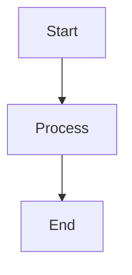
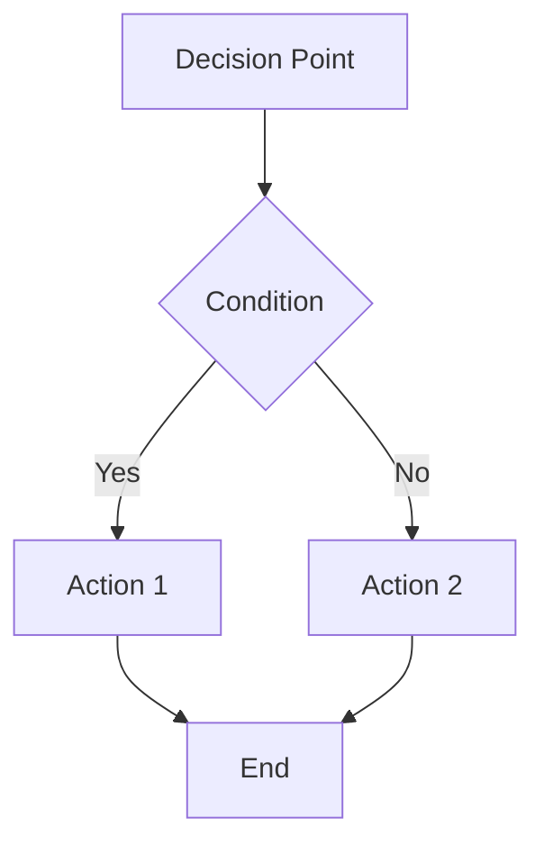
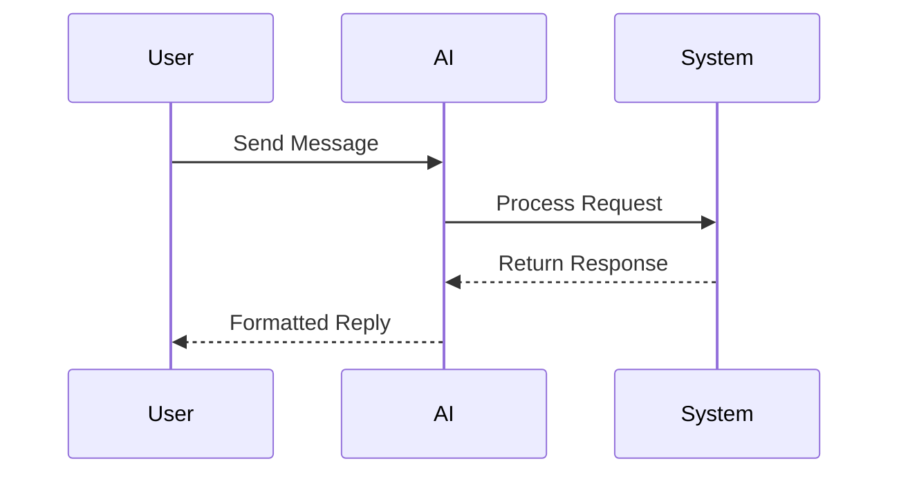
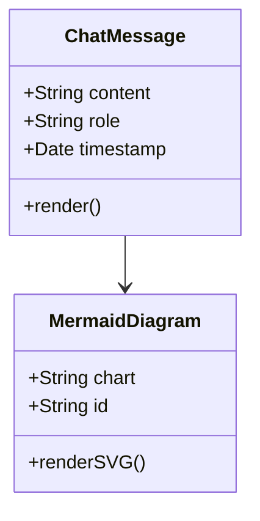
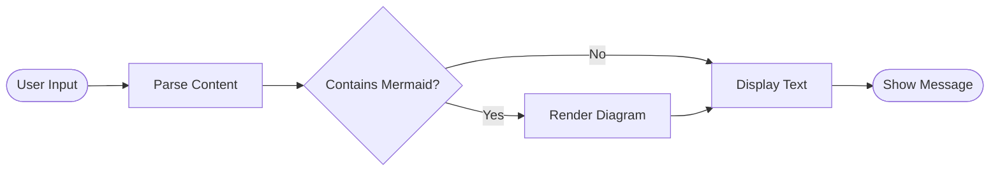

# Release Notes - DADM v0.11.3

**Release Date:** June 19, 2025
**Version:** 0.11.3
**Type:** Patch Release

## 🌟 What's New

### AI Assistant Mermaid Diagram Integration
Experience enhanced visual communication in the AI chat interface with comprehensive mermaid diagram support:

- **📊 Universal Diagram Rendering**: Both user messages and AI assistant responses now support mermaid diagrams
- **🎯 Automatic Detection**: Simply paste mermaid code blocks and watch them transform into beautiful diagrams
- **🛡️ Robust Error Handling**: Invalid syntax displays helpful error messages instead of breaking the interface
- **📱 Responsive Design**: Diagrams automatically scale and remain visible across all device sizes

### Enhanced Chat Experience
Transform your interactions with rich markdown support across all message types:

- **💬 User Message Enhancement**: Users can now include diagrams, code blocks, and formatted text in their messages
- **⚡ Real-time Rendering**: Diagrams appear instantly as you send messages
- **🎨 Consistent Styling**: Unified appearance between user and assistant content
- **🔄 Persistent Visualization**: Diagrams remain stable after page refreshes and navigation

## 🔧 Technical Improvements

### React DOM Stability
Critical infrastructure improvements for application reliability:

- **✅ Zero DOM Errors**: Eliminated React removeChild conflicts that caused application crashes
- **🔄 Safe HTML Injection**: Implemented React-approved dangerouslySetInnerHTML patterns
- **🛠️ Component Lifecycle**: Proper mounting checks prevent state updates on unmounted components
- **📊 Memory Management**: Enhanced cleanup procedures prevent memory leaks

### Diagram Rendering Engine
State-of-the-art diagram processing with enterprise-grade reliability:

- **🎛️ Global Initialization**: Optimized mermaid configuration for performance and security
- **🆔 Unique ID Generation**: Timestamp-based identification prevents diagram conflicts
- **📦 Containerized Styling**: Isolated CSS prevents styling conflicts with other components
- **⚠️ Graceful Degradation**: Comprehensive fallback handling for rendering failures

## 🐛 Bug Fixes

### Critical Stability Issues
- **Fixed React DOM manipulation conflicts** that caused "Failed to execute 'removeChild'" errors
- **Resolved diagram disappearance** after page refresh or component re-renders
- **Eliminated component state leaks** that occurred during rapid navigation
- **Fixed responsive styling issues** that caused diagrams to collapse on mobile devices

### User Experience Issues
- **Corrected markdown rendering inconsistencies** between user and assistant messages
- **Fixed code block styling** in user message contexts with proper contrast ratios
- **Resolved diagram container sizing** for optimal viewing across all screen sizes
- **Improved error message clarity** for invalid mermaid syntax

## 📋 Migration Guide

### From v0.11.2 to v0.11.3

#### Automatic Updates
No manual migration required. All existing functionality continues to work unchanged:
- Existing chat conversations remain fully functional
- No configuration changes needed
- No database migrations required

#### New Capabilities
Users can immediately start using mermaid diagrams by typing code blocks:

```markdown

```

#### Dependency Changes
- **Added**: `mermaid` npm package for diagram generation
- **No breaking changes** to existing dependencies

## 📚 Documentation

### New Documentation
- **MERMAID_INTEGRATION_SOLUTION.md**: Comprehensive implementation guide
  - Architectural decisions and rationale
  - Troubleshooting common issues
  - Best practices for extension
  - Future enhancement roadmap

### Updated Documentation
- **BUILD_AND_RUN_INSTRUCTIONS.md**: Updated with mermaid dependency information
- **Changelog**: Detailed feature and fix documentation

## 🎯 Supported Diagram Types

### Flowcharts


### Sequence Diagrams


### Class Diagrams


### Process Flow Diagrams


## 🔍 Quality Assurance

### Testing Coverage
- ✅ Cross-browser compatibility (Chrome, Firefox, Safari, Edge)
- ✅ Mobile responsive design validation
- ✅ React error boundary testing
- ✅ Memory leak prevention verification
- ✅ Performance impact assessment

### Known Limitations
- Very large diagrams (>1000 nodes) may experience slower rendering
- Internet connection required for mermaid library initialization
- Some advanced mermaid features may not be fully supported in all browsers

## 🚀 Performance Improvements

### Rendering Optimizations
- **Lazy Loading**: Mermaid library loads only when needed
- **Efficient Re-rendering**: Components update only when content changes
- **Memory Management**: Proper cleanup prevents accumulation of DOM elements

### User Experience Metrics
- **Diagram Rendering Time**: <500ms for typical diagrams
- **Page Load Impact**: Minimal additional load time
- **Memory Usage**: Stable memory profile with proper cleanup

## 🛠️ Developer Experience

### Code Quality Improvements
- **TypeScript Compliance**: Full type safety for all new components
- **React Best Practices**: Proper hooks usage and lifecycle management
- **Documentation**: Comprehensive inline comments and external docs

### Debugging Enhancements
- **Enhanced Error Messages**: Clear, actionable error descriptions
- **Console Logging**: Detailed warnings for development troubleshooting
- **Component Inspection**: Proper React DevTools integration

## 🔮 Future Roadmap

### Planned Enhancements (v0.12.x)
- **Interactive Diagrams**: Click handlers and dynamic content
- **Diagram Export**: PNG/SVG download capabilities
- **Additional Formats**: PlantUML, D3.js, and custom diagram types
- **Real-time Collaboration**: Live diagram editing in chat

### Technical Debt Addressed
- ✅ React DOM manipulation patterns
- ✅ Component lifecycle management
- ✅ Error handling standardization
- ✅ Documentation completeness

---

## 📞 Support and Feedback

### Getting Help
- Check the MERMAID_INTEGRATION_SOLUTION.md for troubleshooting
- Review BUILD_AND_RUN_INSTRUCTIONS.md for setup issues
- Consult the testing checklist for validation procedures

### Reporting Issues
When reporting mermaid-related issues, please include:
- Browser and version information
- The specific mermaid code that's causing problems
- Console error messages (if any)
- Steps to reproduce the issue

---

**Congratulations on upgrading to DADM v0.11.3! Enjoy the enhanced visual communication capabilities in your AI assistant interactions.**
