# DADM Services Integration Architecture

## 🏗️ **Service Relationship: Analysis Service + Prompt Service**

The Analysis Service **EXTENDS** (not replaces) your Prompt Service with structured analysis capabilities.

```mermaid
graph TD
    A[🔄 BPMN Workflow] --> B[📊 Analysis Service :8002<br/>NEW]
    B --> C[📝 Prompt Service :5300<br/>EXISTING]
    
    subgraph "Analysis Service Processing"
        B1[1. Receive Request<br/>prompt_reference + analysis_reference]
        B2[2. Call Prompt Service<br/>Get base prompt]
        B3[3. Inject Analysis Instructions<br/>Add structured schema]
        B4[4. Send to LLM<br/>Enhanced prompt]
        B5[5. Validate Response<br/>Against analysis schema]
        B6[6. Extract Insights<br/>Compute metrics]
        B7[7. Return Structured Analysis<br/>To BPMN workflow]
        
        B1 --> B2 --> B3 --> B4 --> B5 --> B6 --> B7
    end
    
    subgraph "Prompt Service Functions"
        C1[Fetch prompt template by ID]
        C2[Compile with variables and RAG]
        C3[Return compiled base prompt]
        
        C1 --> C2 --> C3
    end
    
    B --> B1
    B2 -.-> C
    C --> C1
    
    style A fill:#e1f5fe
    style B fill:#f3e5f5
    style C fill:#e8f5e8
    style B1 fill:#fff3e0
    style B7 fill:#fff3e0
```



## 📊 **Data Flow Example**

```mermaid
sequenceDiagram
    participant BPMN as 🔄 BPMN Workflow
    participant AS as 📊 Analysis Service :8002
    participant PS as 📝 Prompt Service :5300
    participant LLM as 🤖 LLM Provider
    
    BPMN->>AS: POST /analyze<br/>{prompt_id, analysis_template_id, variables}
    
    Note over AS: 1. Validate request & load analysis template
    
    AS->>PS: GET /prompt/{id}/compile<br/>{variables, inject_rag: true}
    PS->>PS: Fetch template & compile with variables
    PS-->>AS: {compiled_prompt, rag_content, tokens}
    
    Note over AS: 2. Inject analysis instructions into base prompt
    
    AS->>LLM: Send enhanced prompt<br/>(base prompt + analysis schema)
    LLM-->>AS: Structured JSON response
    
    Note over AS: 3. Validate response against schema
    Note over AS: 4. Extract insights & compute metrics
    
    AS-->>BPMN: {analysis_results, confidence_score, execution_time}
    
    rect rgb(245, 245, 245)
        Note over BPMN,LLM: The Analysis Service extends Prompt Service capabilities<br/>without replacing existing functionality
    end
```



### Step 1: BPMN Request
```json
{
  "workflow_id": "market_expansion_process",
  "prompt_reference": "strategic_analysis_prompt",
  "analysis_reference": "decision_analysis",
  "process_variables": {
    "company": "TechCorp",
    "target_market": "Europe", 
    "budget": 500000
  }
}
```

### Step 2: Analysis Service → Prompt Service
```http
GET http://localhost:5300/prompt/strategic_analysis_prompt/compile
{
  "variables": {
    "company": "TechCorp",
    "target_market": "Europe",
    "budget": 500000
  },
  "inject_rag": true
}
```

### Step 3: Prompt Service Response
```json
{
  "compiled_prompt": "Analyze the strategic opportunity for TechCorp to expand into Europe with a budget of $500,000...",
  "rag_content": {
    "market_data": "European market analysis...",
    "competitive_landscape": "Key competitors in Europe..."
  },
  "estimated_tokens": 1200
}
```

### Step 4: Analysis Service Injects Analysis Instructions
```text
Analyze the strategic opportunity for TechCorp to expand into Europe...

=== ANALYSIS INSTRUCTIONS ===
You must respond with a valid JSON object matching this schema:
{
  "decision_context": {...},
  "stakeholders": [...],
  "alternatives": [...],
  "evaluation_criteria": [...],
  "analysis": {...},
  "recommendations": {...}
}

Guidelines:
- Analyze all stakeholders with influence/interest levels
- Generate 3-5 realistic alternatives
- Use quantitative scoring where possible
- Provide clear implementation steps
=== END ANALYSIS INSTRUCTIONS ===
```

### Step 5: Structured Analysis Response
```json
{
  "execution_id": "exec_123",
  "status": "completed",
  "execution": {
    "analysis": {
      "decision_context": {
        "problem_statement": "TechCorp European market expansion",
        "scope": "Direct market entry with $500K budget",
        "timeline": "Q3-Q4 2024"
      },
      "alternatives": [
        {
          "id": "direct_sales",
          "name": "Direct Sales Team",
          "cost": 400000,
          "feasibility": "high"
        }
      ],
      "recommendations": {
        "primary_recommendation": "Direct Sales Team approach",
        "rationale": "Fastest market entry with best ROI"
      }
    },
    "confidence_score": 0.87,
    "execution_time": 3.2
  }
}
```

## 🔗 **Service Configuration**

```mermaid
graph LR
    subgraph "DADM Ecosystem"
        subgraph "BPMN Engine"
            A[Camunda Workflows]
        end
        
        subgraph "Service Layer"
            B[📊 Analysis Service<br/>:8002<br/>NEW]
            C[📝 Prompt Service<br/>:5300<br/>EXISTING]
            D[Other Services...]
        end
        
        subgraph "External Systems"
            E[🤖 LLM Providers<br/>OpenAI, etc.]
            F[📚 RAG Storage<br/>Vector DB, etc.]
        end
    end
    
    A --> B
    A --> C
    A --> D
    B --> C
    B --> E
    C --> F
    C --> E
    
    style B fill:#f3e5f5
    style C fill:#e8f5e8
    style A fill:#e1f5fe
    style E fill:#fff3e0
    style F fill:#fff3e0
```



### Analysis Service Configuration
```bash
# Environment variables for service integration
export PROMPT_SERVICE_URL="http://localhost:5300"  # Your existing prompt service
export ANALYSIS_SERVICE_PORT="8002"                # New analysis service port
```

### Both Services Running
```bash
# Terminal 1: Start your existing prompt service
cd /home/jdehart/dadm/services/prompt_service
python main.py  # Runs on :5300

# Terminal 2: Start new analysis service  
cd /home/jdehart/dadm/services/analysis_service
python -m uvicorn service:app --port 8002  # Runs on :8002
```

## ✅ **What Each Service Does**

```mermaid
graph LR
    subgraph "📝 Prompt Service (EXISTING) - Port 5300"
        P1[Manages prompt templates]
        P2[Variable injection & compilation]
        P3[RAG content integration]
        P4[File-based prompt storage]
        P5[Template versioning]
    end
    
    subgraph "📊 Analysis Service (NEW) - Port 8002"
        A1[Analysis template management]
        A2[Structured LLM response schemas]
        A3[Response validation & parsing]
        A4[Insight extraction & metrics]
        A5[BPMN workflow integration]
        A6[Calls Prompt Service for base prompts]
    end
    
    A6 -.->|"Uses API calls"| P1
    A6 -.->|"Leverages capabilities"| P2
    A6 -.->|"Benefits from"| P3
    
    style P1 fill:#e8f5e8
    style P2 fill:#e8f5e8
    style P3 fill:#e8f5e8
    style P4 fill:#e8f5e8
    style P5 fill:#e8f5e8
    
    style A1 fill:#f3e5f5
    style A2 fill:#f3e5f5
    style A3 fill:#f3e5f5
    style A4 fill:#f3e5f5
    style A5 fill:#f3e5f5
    style A6 fill:#fff9c4
```



## 🎯 **Key Benefits of Integration**

1. **Reuses Existing Prompts**: Your existing prompt templates work as-is
2. **Adds Structure**: Analysis templates provide schemas for LLM responses
3. **Better BPMN Integration**: Structured analysis data flows cleanly into workflows
4. **Separation of Concerns**: Prompt management vs Analysis processing
5. **Backwards Compatible**: Existing prompt service clients continue to work

## 🚀 **Ready to Test Integration**

Start both services and test the integration:

```bash
# Test that analysis service can call prompt service
curl -X POST http://localhost:8002/analyze \
  -H "Content-Type: application/json" \
  -d '{
    "prompt_reference": "business_strategy",
    "analysis_reference": "decision_analysis",
    "context_variables": {"company": "TestCorp"}
  }'
```

The analysis service will automatically call your prompt service to get the base prompt, then enhance it with analysis instructions!
